# Konsep & Fitur Platform Simulasi Interaktif

> **"YouTube for Interactive Simulations"**
>
> Platform ini bukan sekadar Learning Management System (LMS) atau perpustakaan digital konvensional. Ia adalah **produk kategori baru** — sebuah ekosistem distribusi simulasi interaktif dengan pola interaksi sefamiliar YouTube.

---

## 1. Ekosistem Produk

Platform ini terdiri dari beberapa produk yang saling terhubung dalam satu ekosistem utuh:

```
Simulation Platform
|
+-- Simulation              (untuk belajar)
+-- Simulation Studio       (untuk membuat & upload simulasi)
+-- Creator Profile         (profil kreator)
+-- Collections             (playlist belajar)
+-- Explore & Trending      (penemuan konten)
+-- Notification            (sistem notifikasi)
+-- Analytics               (analitik detail)
```

Ketika berkembang lebih jauh, ekosistem ini dapat diperluas dengan layanan tambahan:

| Layanan Tambahan | Deskripsi |
|:---|:---|
| **Simulation API** | Sekolah atau LMS lain dapat menampilkan simulasi melalui API |
| **Simulation Embed** | Simulasi dapat disematkan di website sekolah melalui `<iframe>` atau script |
| **Simulation Marketplace** | Kreator dapat menjual simulasi premium |
| **Simulation Challenge** | Kompetisi membuat simulasi terbaik |
| **Simulation Certification** | Lencana atau verifikasi untuk kreator berkualitas |

---

## 2. Konsep Utama & Analogi

| Fitur YouTube | Analogi di Platform Simulasi |
|:---|:---|
| **Video** | Simulasi Interaktif |
| **Channel** | Creator / Guru |
| **Subscribe** | Follow |
| **Like** | Favorite / Like |
| **Playlist** | Learning Collection |
| **Comment** | Diskusi |
| **Trending** | Trending Simulation |
| **Search** | Search |
| **Notification** | New Simulation Notification |

### Terminologi Penting (Wording)
Hindari istilah akademis yang kaku agar pengguna merasa sedang menjelajahi platform simulasi interaktif, bukan membaca buku digital:
*   **Hindari:** Artikel, Materi, Course.
*   **Gunakan:** *Simulation, Explore, Trending, Collections, Creator, Follow, Discover, Interactive, Featured, Recently Added*.

---

## 3. Arsitektur Produk

Secara garis besar, platform dibagi menjadi dua sisi utama:
1.  **Simulation (User Interface)**: Tempat pembelajar mencari, memainkan, dan berdiskusi seputar simulasi.
2.  **Simulation Studio (Creator Interface)**: Portal khusus bagi kreator (guru, dosen, komunitas STEM, dsb.) untuk mengunggah, memperbarui, dan memantau performa simulasi mereka.

```mermaid
graph TD
    Platform[Platform Simulasi] --> User[Simulation - User]
    Platform --> Creator[Simulation Studio - Creator]

    User --> Beranda[Beranda & Feed]
    User --> Explore[Explore & Kategori]
    User --> Detail[Detail Simulasi]
    User --> Coll[Collections]
    User --> UserProfile[Profil Pengguna]
    User --> History[Riwayat / History]
    User --> Notif[Notifikasi]

    Creator --> Dash[Dashboard & Analitik]
    Creator --> Upload[Upload Simulation Package]
    Creator --> Content[Draft & Published]
    Creator --> Version[Version Control]
    Creator --> CreatorProfile[Profil Kreator Publik]
    Creator --> StudioComments[Komentar & Moderasi]
    Creator --> StudioFollowers[Pengikut]
    Creator --> StudioNotif[Manajemen Notifikasi]
    Creator --> Settings[Pengaturan Studio]

    Platform --> API[Simulation API]
    Platform --> Embed[Simulation Embed]
    Platform --> Marketplace[Simulation Marketplace]
    Platform --> Challenge[Simulation Challenge]
    Platform --> Cert[Simulation Certification]
```



---

## 4. Fitur Utama (User Side)

### A. Beranda & Feed
Beranda didesain dinamis menyerupai feed YouTube, bukan sekadar daftar kategori statis:
*   **Trending Simulations**: Simulasi yang sedang populer dalam jangka waktu tertentu.
*   **Simulasi Terbaru**: Konten gres yang baru diunggah oleh kreator.
*   **Paling Banyak Dibuka**: Simulasi terpopuler sepanjang masa.
*   **Subjek Sains & Umum**: Feed kategori berbasis bidang ilmu (Kimia, Fisika, Matematika, Geografi, Sejarah, Biologi, dll.).
*   **Discovered for You**: Rekomendasi personal berdasarkan riwayat bermain dan minat pengguna.

Setiap simulasi ditampilkan dalam bentuk **Kartu Simulasi (Simulation Card)** yang memuat:
*   Gambar Mini (Thumbnail)
*   Judul & Kategori Simulasi
*   Rating (1-5 bintang)
*   Play Count (e.g., "20.000 dimainkan") — jumlah kali simulasi benar-benar **dijalankan/dimainkan** oleh pengguna.
*   View Count (e.g., "35.000 dilihat") — jumlah kali halaman detail simulasi **dibuka/dilihat**, termasuk yang tidak menekan tombol play.
*   Waktu rilis (e.g., "2 hari lalu")
*   Nama Creator (klik -> menuju Profil Creator)

> **Perbedaan Views vs Plays:**
> *   **Views** tercatat setiap kali pengguna membuka halaman detail simulasi.
> *   **Plays** tercatat setiap kali pengguna menekan tombol play/interaksi aktif pada simulasi.
> *   Rasio Plays/Views mengindikasikan seberapa menarik simulasi tersebut setelah dilihat.

### B. Halaman Detail Simulasi
Menampilkan simulator interaktif beserta informasi pendukung:
*   **Player Utama**: Wadah pemutar Simulasi HTML (dijalankan dari paket zip yang diunggah).
*   **Informasi Konten**: Judul, Kategori, Jumlah Dimainkan, Jumlah Dilihat, Tombol Bookmark & Share.
*   **Metadata**: Deskripsi detail simulasi dan Referensi/Sumber materi terkait.
*   **Interaksi Sosial**:
    *   Tombol **Suka/Favorite**
    *   Tombol **Bookmark**
    *   Tombol **Share** + **Salin Tautan** (Copy Link)
    *   Tombol **Download** (opsional, untuk simulasi offline)
*   **Interaksi**: Kolom diskusi/komentar untuk bertanya atau berdiskusi.
*   **Simulasi Terkait**: Daftar simulasi relevan yang ditampilkan di bawah player, diurutkan berdasarkan:
    1.  **Kategori yang sama** (prioritas utama).
    2.  **Tag/label yang sesuai** (misal: "mekanika fluida" cocok dengan "prinsip archimedes").
    3.  **Rating tertinggi** dari simulasi dalam kategori/tag yang sama.
    4.  **Play count tertinggi** sebagai faktor penyeimbang (*tie-breaker*).
*   **Simulasi Berikutnya**: Dalam konteks Collections, tombol "Next" untuk melanjutkan ke simulasi berikutnya dalam urutan playlist.

### C. Profil Creator (Halaman Publik)
Setiap kreator memiliki halaman profil publik yang dapat diakses oleh semua pengunjung, mirip dengan halaman channel di YouTube.

**Header Profil:**
*   Foto Profil / Avatar
*   Nama Creator / Username
*   Bio singkat / Deskripsi
*   Jumlah total Simulasi yang diunggah
*   Jumlah total Followers
*   Tanggal bergabung (*Member Since*)

**Tombol Aksi:**
*   **Follow** — Mengikuti kreator untuk mendapatkan notifikasi saat ada simulasi baru.
*   **Share** — Membagikan profil kreator ke pengguna lain.

**Daftar Konten:**
*   Tab **Semua Simulasi** — Grid daftar semua simulasi milik kreator, diurutkan berdasarkan waktu unggah terbaru.
*   Tab **Populer** — Diurutkan berdasarkan play count tertinggi.
*   Tab **Collections** — Learning Collections yang dibuat oleh kreator (jika tersedia).

### D. Profil Pengguna (My Profile)
Halaman profil personal bagi pengguna/pembelajar yang menampilkan ringkasan aktivitas dan pencapaian mereka.

**Header Profil:**
*   Foto Profil / Avatar
*   Nama Pengguna / Username
*   Tanggal bergabung (*Member Since*)
*   Level & Total Poin (jika gamifikasi aktif)

**Ringkasan Aktivitas:**
*   Streak belajar saat ini
*   Total poin & Level
*   Badge yang dimiliki

**Tab Konten:**
*   Tab **Bookmark** — Daftar simulasi yang telah di-bookmark.
*   Tab **Collections** — Learning Collections milik pengguna (daftar personal maupun dari kreator yang di-follow).
*   Tab **Riwayat (History)** — Daftar simulasi yang pernah dimainkan, diurutkan berdasarkan waktu terakhir dimainkan.
*   Tab **Mengikuti (Following)** — Daftar kreator yang di-follow.

### E. Learning Collection (Playlist)
Kumpulan simulasi terstruktur untuk mempelajari suatu topik secara runut.
*   *Contoh:* **Belajar Kimia Dasar** berisi rangkaian simulasi terurut: *Atom -> Proton -> Neutron -> Elektron -> Ikatan Ion -> Ikatan Kovalen*.
*   Setiap Collection memiliki **Judul, Deskripsi, Jumlah Simulasi, Creator, dan Total Views**.
*   Pengguna dapat **menyimpan Collection** milik kreator ke profil mereka (*Save to My Collections*).
*   Pengguna dapat **membuat Collection personal** dari bookmark atau simulasi favorit mereka.
*   Dalam halaman Collection, simulasi ditampilkan dalam urutan runut dengan tombol **Next** dan **Previous** untuk navigasi.

### F. Explore & Pencarian
*   **Pencarian**: Fitur pencarian cepat untuk menemukan simulasi berdasarkan judul, kata kunci, nama creator, atau tag.
*   **Navigasi Explore**: Penjelajahan berbasis struktur kategori hierarkis:
    ```
    Kategori (Fisika)
      +-- Subkategori (Mekanika)
            +-- Topik (Hukum Newton)
                  +-- Daftar Simulasi
    ```
*   **Filter Trending**: Penyaringan tren berdasarkan periode waktu:
    *   Hari Ini — Play count dalam 24 jam terakhir.
    *   Minggu Ini — Play count dalam 7 hari terakhir.
    *   Bulan Ini — Play count dalam 30 hari terakhir.
    *   Tahun Ini — Play count dalam 365 hari terakhir.
    *   Semua — Play count kumulatif sepanjang waktu.

### G. Notifikasi
Sistem notifikasi untuk menjaga pengguna tetap terhubung dengan konten terbaru.

**Jenis Notifikasi:**
*   **Simulasi Baru** — Kreator yang di-follow mengunggah simulasi baru. Klik -> **langsung membuka halaman detail simulasi** (deep link).
*   **Balasan Komentar** — Seseorang membalas komentar pengguna. Klik -> membuka posisi komentar di halaman simulasi.
*   **Mention (@nama)** — Seseorang menyebut pengguna dalam komentar. Klik -> membuka posisi komentar tersebut.
*   **Pencapaian** — Pengguna mendapatkan badge baru atau naik level.
*   **Collection Update** — Collection yang disimpan mendapat simulasi baru.

**UX Flow Notifikasi:**
1.  Ikon lonceng di navigasi atas menampilkan **jumlah notifikasi belum dibaca**.
2.  Klik ikon lonceng -> dropdown panel notifikasi.
3.  Klik salah satu notifikasi -> **langsung membuka konten terkait** (deep link ke simulasi, komentar, atau profil).
4.  Notifikasi yang sudah dibaca ditandai dengan warna abu-abu.
5.  Semua notifikasi tersimpan di halaman **Notifikasi** (riwayat lengkap).

---

## 5. Simulation Studio (Creator Side)

Meskipun pada fase awal (MVP) tim internal bertindak sebagai satu-satunya kreator, **Simulation Studio** harus dirancang sejak awal agar siap menampung kreator eksternal (guru, dosen, mahasiswa, peneliti, komunitas STEM) tanpa perlu mengubah arsitektur dasar.

### A. Dashboard Kreator
Halaman ringkasan statistik performa kreator dengan tampilan visual:

**Metrik Utama (Kartu Statistik):**
*   Total Simulasi (dipublish + draft)
*   Total Views — jumlah total halaman detail simulasi yang dibuka.
*   Total Plays — jumlah total simulasi yang benar-benar dimainkan.
*   Total Followers — jumlah pengguna yang mengikuti kreator.
*   Total Likes — jumlah total tombol "Suka" dari semua simulasi.
*   Total Bookmarks — jumlah total bookmark dari semua simulasi.
*   Total Shares — jumlah total pembagian simulasi.
*   Total Komentar — jumlah total komentar yang diterima.

**Grafik Tren:**
*   **Grafik Harian (7 hari terakhir)** — Sumbu X: tanggal (Sen-Min), Sumbu Y: jumlah Views/Plays. Bisa beralih antara metrik Views, Plays, Likes, Bookmarks.
*   **Grafik Bulanan (12 bulan terakhir)** — Sumbu X: bulan, Sumbu Y: jumlah kumulatif.
*   **Grafik Perbandingan Simulasi** — Bar chart horizontal yang menunjukkan simulasi mana yang paling banyak dimainkan/dilihat.

**Performa Terkini:**
*   Simulasi dengan performa terbaik minggu ini.
*   Komentar terbaru yang belum dibalas (unread).

### B. Upload Simulation Package
Proses unggah mandiri menggunakan file `.zip` (bukan sekadar upload HTML tunggal):
1.  **Upload** file `simulation.zip`.
2.  **Validasi Otomatis**: Sistem memeriksa kelengkapan file.
3.  **Read Manifest**: Membaca file konfigurasi/manifest di dalam zip untuk otomatis mengisi judul, kategori, dan deskripsi dasar.
4.  **Preview**: Kreator dapat mencoba simulasi di lingkungan *sandbox* sebelum dipublikasikan.
5.  **Publish / Draft**: Pilihan untuk langsung merilis ke publik atau menyimpannya sebagai draf terlebih dahulu.

**Struktur Simulation Package:**
```
simulation.zip
+-- manifest.json          # Metadata simulasi (judul, kategori, versi, dll.)
+-- index.html             # File entry point simulasi
+-- assets/
|   +-- css/
|   +-- js/
|   +-- images/
+-- README.md              # Dokumentasi teknis (opsional)
```

**Format manifest.json:**
```json
{
  "name": "Hukum Newton",
  "slug": "hukum-newton",
  "version": "1.0.0",
  "category": "Fisika",
  "subcategory": "Mekanika",
  "tags": ["newton", "gaya", "akselerasi"],
  "description": "Simulasi interaktif Hukum Newton Gerak",
  "thumbnail": "assets/images/thumbnail.png",
  "author": "Creator Name",
  "minResolution": "1024x768",
  "entryPoint": "index.html"
}
```

### C. Manajemen Konten
*   **Draft**: Daftar simulasi yang masih dalam tahap penyusunan atau pengujian.
*   **Published**: Daftar simulasi yang sudah online dan dapat dimainkan oleh pengguna.
*   **Version Control**: Riwayat pembaruan simulasi (v1.0 -> v1.1 -> v1.2) ketika kreator mengunggah versi baru untuk perbaikan *bug* atau peningkatan fitur.

**Alur Versioning:**
1.  Kreator mengunggah versi baru dari simulasi yang sudah dipublish.
2.  Sistem membandingkan dengan versi saat ini.
3.  Versi lama disimpan dalam riwayat (tidak dihapus).
4.  Pengguna melihat versi terbaru secara default.
5.  Kreator dapat melihat **changelog** antar versi.

### D. Komentar & Moderasi
*   **Semua Komentar**: Daftar semua komentar dari pengguna di semua simulasi kreator.
*   **Filter**: Belum dibalas, Sudah dibalas, Dilaporkan.
*   **Balas Komentar**: Kreator dapat membalas komentar pengguna langsung dari Studio.
*   **Sematkan Komentar (Pin)**: Menyematkan komentar informatif di bagian atas kolom komentar.
*   **Hapus Komentar**: Menghapus komentar yang tidak pantas atau spam.

### E. Followers
*   Daftar pengguna yang mengikuti kreator.
*   Informasi: Nama, Foto Profil, Tanggal Follow, Jumlah Collection yang disimpan.
*   Kreator dapat mengirim **pesan broadcast** (notifikasi massal) ke semua followers saat ada simulasi baru.

### F. Pengaturan Studio (Settings)
*   **Profil Kreator**: Mengubah foto, nama, bio, dan tautan media sosial.
*   **Notifikasi Email**: Konfigurasi notifikasi email (komentar baru, follower baru, statistik mingguan).
*   **Privasi**: Pengaturan siapa yang dapat mengomentari simulasi.
*   **Integrasi**: Menghubungkan akun dengan platform lain (GitHub, Google Scholar, dll.).

---

## 6. Fitur Pendukung & Gamifikasi

### A. Reaksi Edukatif (Ciri Khas)
Alih-alih tombol "Like" generik, tambahkan reaksi interaktif yang memberikan umpan balik lebih bermakna bagi proses belajar:
*   **Mudah Dipahami**
*   **Membuka Wawasan**
*   **Sangat Membantu**
*   **Interaktif**
*   **Favorit**

**Cara Kerja:**
*   Pengguna dapat memilih **satu atau lebih** reaksi pada setiap simulasi.
*   Hasil reaksi ditampilkan sebagai **pie chart** atau **ring counter** di bawah tombol reaksi.
*   Kreator dapat melihat **reaksi terpopuler** di Dashboard Analytics untuk mengetahui kekuatan simulasi mereka.

Reaksi seperti ini memberikan informasi yang lebih berguna dibanding hanya tombol "Like".

### B. Fitur Sosial & Kolaborasi
*   Balas komentar, sematkan komentar (*pin*), dan laporkan komentar (*report*).
*   Fitur Mention menggunakan format `@nama`.
*   Kemudahan berbagi: tombol Share dan salin tautan (*copy link*).

**Format Share:**
*   URL standar: `https://domain.tld/simulasi/{slug}`
*   Tombol share ke WhatsApp, Telegram, Twitter/X, Facebook.
*   Kode embed: `<iframe src="..." />` untuk menyematkan simulasi di website/blog.

### C. Gamifikasi
*   **Badge**: Penghargaan atas pencapaian tertentu (misal: "Master Mekanika", "Pencinta Kimia", "Eksplorator Geografi").
*   **Streak**: Konsistensi belajar harian. Semakin lama streak, semakin banyak bonus poin.
*   **Poin & Level**: Sistem poin berdasarkan durasi bermain simulasi, keaktifan berdiskusi, dan pencapaian lainnya.
*   **Top Learner**: Papan peringkat (*leaderboard*) mingguan/bulanan.

**Sistem Level:**
| Level | Poin Dibutuhkan | Title |
|:---:|:---:|:---|
| 1 | 0 | Pemula |
| 2 | 100 | Penjelajah |
| 3 | 500 | Investigator |
| 4 | 1.500 | Peneliti |
| 5 | 5.000 | Ahli |
| 6 | 15.000 | Master |
| 7 | 50.000 | Legenda |

### D. Analitik Detail (Per Simulasi)
Membantu kreator mengetahui seberapa efektif simulasi mereka:
*   Jumlah dimainkan (*Plays*) & Jumlah dilihat (*Views*) — dengan grafik tren harian.
*   Rasio Plays/Views — mengukur konversi dari "dilihat" ke "dimainkan".
*   Rata-rata durasi bermain (*Average Session Duration*).
*   Tingkat penyelesaian (*Completion Rate*) — persentase pengguna yang menyelesaikan simulasi hingga akhir.
*   Rasio interaksi: Bookmark, Share, Like, Reaksi, Komentar.
*   **Sumber Lalu Lintas** — Dari mana pengguna datang (direct, search, share link, collection).

---

## 7. Layanan Tambahan (Ekspansi Ekosistem)

### A. Simulation API
Menyediakan akses programatik agar sekolah, LMS, atau platform edukasi lain dapat mengintegrasikan dan menampilkan simulasi dari platform ini.

**Use Cases:**
*   Sekolah mengintegrasikan simulasi ke dalam portal LMS mereka (Moodle, Canvas, Google Classroom).
*   Pengembang aplikasi pendidikan menampilkan simulasi melalui API REST.
*   Peneliti mengambil data analitik untuk studi pendidikan.

**Endpoint Utama:**
```
GET    /api/v1/simulations              # Daftar simulasi
GET    /api/v1/simulations/{slug}       # Detail simulasi
GET    /api/v1/simulations/{id}/play    # URL player untuk embed
GET    /api/v1/categories               # Daftar kategori
GET    /api/v1/trending                 # Simulasi trending
```

**Autentikasi:**
*   API Key per aplikasi (rate-limited berdasarkan paket).
*   OAuth 2.0 untuk integrasi mendalam.

### B. Simulation Embed
Memungkinkan simulasi disematkan di website manapun melalui iframe atau JavaScript widget.

**Embed Code:**
```html
<!-- Basic Embed -->
<iframe
  src="https://domain.tld/embed/{simulation-slug}"
  width="800"
  height="600"
  frameborder="0"
  allowfullscreen>
</iframe>

<!-- Responsive Embed -->
<div style="position:relative;padding-bottom:75%;height:0;overflow:hidden;">
  <iframe
    src="https://domain.tld/embed/{simulation-slug}"
    style="position:absolute;top:0;left:0;width:100%;height:100%;"
    frameborder="0"
    allowfullscreen>
  </iframe>
</div>
```

**Fitur Embed:**
*   Responsive (menyesuaikan lebar container).
*   Customizable toolbar (show/hide controls).
*   Callback events untuk komunikasi antara embed dan parent page.
*   watermark branding (opsional, untuk paket gratis).

### C. Simulation Marketplace
Platform transaksi bagi kreator untuk menjual simulasi premium kepada pengguna atau institusi.

**Model Monetisasi:**
*   **Freemium**: Simulasi dasar gratis, fitur lanjutan berbayar.
*   **Pay-per-Download**: Kreator menetapkan harga per simulasi.
*   **Subscription**: Akses unlimited ke semua simulasi premium.
*   **Institutional License**: Lisensi untuk sekolah/institusi (bulk pricing).

**Fitur Marketplace:**
*   Kreator memasang harga (Rp atau USD).
*   Sistem pembayaran terintegrasi (Midtrans, Stripe).
*   Review dan rating dari pembeli.
*   Demo gratis sebelum beli (limited trial).
*   Revenue sharing: 70% kreator / 30% platform (standar industri).

### D. Simulation Challenge
Kompetisi periodik yang mendorong kreator untuk membuat simulasi terbaik.

**Format Kompetisi:**
*   **Challenge Mingguan**: Topik spesifik (misal: "Simulasikan Hukum Kepler").
*   **Challenge Bulanan**: Tema bebas dengan kriteria penilaian ketat.
*   **Annual Grand Challenge**: Kompetisi tahunal dengan hadiah besar.

**Kriteria Penilaian:**
*   Akurasi Ilmiah (30%)
*   Interaktivitas & UX (25%)
*   Visual & Desain (20%)
*   Kreativitas (15%)
*   Popularitas (10% — berdasarkan plays & rating komunitas)

**Hadiah:**
*   Badge eksklusif untuk pemenang.
*   Fitur highlight di halaman utama (featured).
*   Hadiah finansial (untuk challenge bersponsor).
*   Kesempatan menjadi "Verified Creator".

### E. Simulation Certification
Sistem verifikasi dan sertifikasi untuk kreator yang menunjukkan kualitas konsisten.

**Tingkatan Sertifikasi:**
| Level | Badge | Persyaratan |
|:---|:---|:---|
| **Verified Creator** | Centang biru | Min. 10 simulasi published, rating >= 4.0, 1000+ total plays |
| **Expert Creator** | Mahkota | Min. 50 simulasi, rating >= 4.5, 10.000+ plays, aktif 6 bulan |
| **Platinum Creator** | Bintang platinum | Min. 100 simulasi, rating >= 4.7, 100.000+ plays, 12 bulan aktif |

**Manfaat Sertifikasi:**
*   Badge profil yang meningkatkan kepercayaan.
*   Prioritas di hasil pencarian (SEO boost).
*   Akses ke fitur Studio eksklusif (analytics advanced, API access).
*   Kesempatan berpartisipasi dalam Simulation Challenge khusus.
*   Revenue share lebih baik (80/20 untuk Platinum Creator).

---

## 8. Skala Prioritas Pengembangan (Roadmap)

### Fase 1 — MVP (Minimum Viable Product)
Fitur dasar untuk membuat platform terasa hidup dan fungsional:
*   Fitur Pencarian (Search)
*   Sistem Bookmark & Favorite (Like)
*   Kolom Diskusi/Komentar dasar
*   Notifikasi simulasi baru (deep link langsung ke simulasi)
*   Pencatatan statistik (Play Count & View Count terpisah)
*   Fitur Share (Salin Tautan + Share ke Media Sosial)
*   Halaman Profil Creator (publik)
*   Fitur Follow Creator
*   Simulation Card dengan Thumbnail, Judul, Rating, Play Count, View Count
*   Simulation Studio (Upload ZIP, CRUD dasar)
*   Deployment pipeline (deploy.sh untuk VPS)
*   Superadmin & role-based access control

### Fase 2 — Peningkatan Interaksi
Peningkatan interaksi sosial dan personalisasi:
*   Rating Bintang (1-5) & Tagging Kategori
*   Fitur Learning Collections (Playlist)
*   Halaman Feed (Trending & Terbaru dengan filter periode)
*   Rekomendasi "Simulasi Terkait" (berdasarkan kategori + tag + rating)
*   Halaman Profil Pengguna (Bookmark, Collections, Riwayat, Following)
*   Notifikasi Balasan Komentar & Mention (@nama)
*   Fitur Share ke WhatsApp, Telegram, Twitter/X, Facebook

### Fase 3 — Studio & Gamifikasi
Ekspansi untuk ekosistem kreator eksternal:
*   Dashboard Simulation Studio (Upload ZIP, Versioning, Analitik Kreator)
*   Gamifikasi (Streak, Poin, Badge, Level, Leaderboard)
*   Reaksi Edukatif Khusus (Mudah Dipahami, Membuka Wawasan, Sangat Membantu, Interaktif, Favorit) dengan pie chart distribusi
*   Moderasi Komentar (Pin, Report, Delete) dari Studio
*   Pengaturan Studio (Profil Kreator, Notifikasi Email, Integrasi)
*   Kode Embed simulasi untuk website eksternal
*   Analitik Per-Simulasi Lanjutan (Completion Rate, Session Duration, Sumber Lalu Lintas)

### Fase 4 — Ekspansi Ekosistem
Layanan lanjutan untuk ekosistem yang lebih luas:
*   Simulation API (REST API untuk integrasi LMS/sekolah)
*   Simulation Embed (widget untuk website eksternal)
*   Simulation Marketplace (jual beli simulasi premium)
*   Simulation Challenge (kompetisi periodik)
*   Simulation Certification (Verified, Expert, Platinum Creator)
*   Multi-language support (internasionalisasi)
*   Mobile app (Android & iOS)

---

## 9. Visi Jangka Panjang

Dalam 5-10 tahun ke depan, platform ini diharapkan menjadi:
*   **YouTube** bagi konten edukasi interaktif.
*   **GitHub** bagi para pendidik untuk membagikan dan memperbarui modul eksperimen mereka.
*   **Figma Community** bagi desainer instruksional STEM untuk saling berbagi *template* dan simulasi.

| Platform | Fungsi |
|:---|:---|
| **YouTube** | Tempat orang mengunggah video |
| **GitHub** | Tempat developer mengunggah kode |
| **Figma Community** | Tempat desainer berbagi desain |
| **Platform ini** | Tempat guru, dosen, dan kreator mengunggah simulasi edukasi interaktif |

### Identitas Brand
Platform ini bukan sekadar "website edukasi" — ia adalah **produk kategori baru**. Nama brand harus:
*   Pendek, unik, dan mudah diucapkan.
*   Domain `.com` masih berpeluang tersedia.
*   Cocok untuk brand global (bukan hanya pasar lokal).
*   Mudah diingat dan memiliki makna yang relevan dengan konsep simulasi/interaktif.

---

## 10. Spesifikasi Teknis

### Tech Stack
*   **Backend**: Laravel 13 (PHP 8.4)
*   **Frontend**: Tailwind CSS 4 + Alpine.js
*   **Database**: SQLite (development) / MySQL/PostgreSQL (production)
*   **Build Tool**: Vite 8
*   **Auth**: Laravel Breeze
*   **Testing**: Pest 4
*   **Deployment**: VPS dengan deploy.sh

### Struktur Database (MVP)
*   `users` — id, name, email, password, role (superadmin/admin/creator/user), avatar, bio
*   `simulations` — id, user_id, title, slug, description, category, subcategory, tags, thumbnail, version, zip_path, entry_point, is_published, is_featured, play_count, view_count, like_count, bookmark_count, share_count, average_rating, rating_count, published_at
*   `cache` — Laravel cache table
*   `jobs` — Laravel queue jobs table

### Deployment
*   Script `deploy.sh` untuk VPS deployment
*   Git-based workflow: push -> pull -> migrate -> build -> cache
*   Zero-downtime deployment strategy
