# Konsep & Fitur Platform Simulasi Interaktif

> **"YouTube for Interactive Simulations"**
>
> Platform ini bukan sekadar Learning Management System (LMS) atau perpustakaan digital konvensional. Ia adalah **produk kategori baru** — sebuah ekosistem distribusi simulasi interaktif dengan pola interaksi sefamiliar YouTube.

---

## 1. Ekosistem Produk

Platform ini terdiri dari beberapa produk yang saling terhubung dalam satu ekosistem utuh:

```
Simulation Platform
|
+-- Simulation              (untuk belajar)
+-- Simulation Studio       (untuk membuat & upload simulasi)
+-- Creator Profile         (profil kreator)
+-- Collections             (playlist belajar)
+-- Explore & Trending      (penemuan konten)
+-- Notification            (sistem notifikasi)
+-- Analytics               (analitik detail)
```

Ketika berkembang lebih jauh, ekosistem ini dapat diperluas dengan layanan tambahan:

| Layanan Tambahan | Deskripsi |
|:---|:---|
| **Simulation API** | Sekolah atau LMS lain dapat menampilkan simulasi melalui API |
| **Simulation Embed** | Simulasi dapat disematkan di website sekolah melalui `<iframe>` atau script |
| **Simulation Marketplace** | Kreator dapat menjual simulasi premium |
| **Simulation Challenge** | Kompetisi membuat simulasi terbaik |
| **Simulation Certification** | Lencana atau verifikasi untuk kreator berkualitas |

---

## 2. Konsep Utama & Analogi

| Fitur YouTube | Analogi di Platform Simulasi |
|:---|:---|
| **Video** | Simulasi Interaktif |
| **Channel** | Creator / Guru |
| **Subscribe** | Follow |
| **Like** | Favorite / Like |
| **Playlist** | Learning Collection |
| **Comment** | Diskusi |
| **Trending** | Trending Simulation |
| **Search** | Search |
| **Notification** | New Simulation Notification |

### Terminologi Penting (Wording)
Hindari istilah akademis yang kaku agar pengguna merasa sedang menjelajahi platform simulasi interaktif, bukan membaca buku digital:
*   **Hindari:** Artikel, Materi, Course.
*   **Gunakan:** *Simulation, Explore, Trending, Collections, Creator, Follow, Discover, Interactive, Featured, Recently Added*.

---

## 3. Arsitektur Produk

Secara garis besar, platform dibagi menjadi dua sisi utama:
1.  **Simulation (User Interface)**: Tempat pembelajar mencari, memainkan, dan berdiskusi seputar simulasi.
2.  **Simulation Studio (Creator Interface)**: Portal khusus bagi kreator (guru, dosen, komunitas STEM, dsb.) untuk mengunggah, memperbarui, dan memantau performa simulasi mereka.

```mermaid
graph TD
    Platform[Platform Simulasi] --> User[Simulation - User]
    Platform --> Creator[Simulation Studio - Creator]

    User --> Beranda[Beranda & Feed]
    User --> Explore[Explore & Kategori]
    User --> Detail[Detail Simulasi]
    User --> Coll[Collections]
    User --> UserProfile[Profil Pengguna]
    User --> History[Riwayat / History]
    User --> Notif[Notifikasi]

    Creator --> Dash[Dashboard & Analitik]
    Creator --> Upload[Upload Simulation Package]
    Creator --> Content[Draft & Published]
    Creator --> Version[Version Control]
    Creator --> CreatorProfile[Profil Kreator Publik]
    Creator --> StudioComments[Komentar & Moderasi]
    Creator --> StudioFollowers[Pengikut]
    Creator --> StudioNotif[Manajemen Notifikasi]
    Creator --> Settings[Pengaturan Studio]

    Platform --> API[Simulation API]
    Platform --> Embed[Simulation Embed]
    Platform --> Marketplace[Simulation Marketplace]
    Platform --> Challenge[Simulation Challenge]
    Platform --> Cert[Simulation Certification]
```



---

## 4. Fitur Utama (User Side)

### A. Beranda & Feed
Beranda didesain dinamis menyerupai feed YouTube, bukan sekadar daftar kategori statis:
*   **Trending Simulations**: Simulasi yang sedang populer dalam jangka waktu tertentu.
*   **Simulasi Terbaru**: Konten gres yang baru diunggah oleh kreator.
*   **Paling Banyak Dibuka**: Simulasi terpopuler sepanjang masa.
*   **Subjek Sains & Umum**: Feed kategori berbasis bidang ilmu (Kimia, Fisika, Matematika, Geografi, Sejarah, Biologi, dll.).
*   **Discovered for You**: Rekomendasi personal berdasarkan riwayat bermain dan minat pengguna.

Setiap simulasi ditampilkan dalam bentuk **Kartu Simulasi (Simulation Card)** yang memuat:
*   Gambar Mini (Thumbnail)
*   Judul & Kategori Simulasi
*   Rating (1-5 bintang)
*   Play Count (e.g., "20.000 dimainkan") — jumlah kali simulasi benar-benar **dijalankan/dimainkan** oleh pengguna.
*   View Count (e.g., "35.000 dilihat") — jumlah kali halaman detail simulasi **dibuka/dilihat**, termasuk yang tidak menekan tombol play.
*   Waktu rilis (e.g., "2 hari lalu")
*   Nama Creator (klik -> menuju Profil Creator)

> **Perbedaan Views vs Plays:**
> *   **Views** tercatat setiap kali pengguna membuka halaman detail simulasi.
> *   **Plays** tercatat setiap kali pengguna menekan tombol play/interaksi aktif pada simulasi.
> *   Rasio Plays/Views mengindikasikan seberapa menarik simulasi tersebut setelah dilihat.

### B. Halaman Detail Simulasi
Menampilkan simulator interaktif beserta informasi pendukung:
*   **Player Utama**: Wadah pemutar Simulasi HTML (dijalankan dari paket zip yang diunggah).
*   **Informasi Konten**: Judul, Kategori, Jumlah Dimainkan, Jumlah Dilihat, Tombol Bookmark & Share.
*   **Metadata**: Deskripsi detail simulasi dan Referensi/Sumber materi terkait.
*   **Interaksi Sosial**:
    *   Tombol **Suka/Favorite**
    *   Tombol **Bookmark**
    *   Tombol **Share** + **Salin Tautan** (Copy Link)
    *   Tombol **Download** (opsional, untuk simulasi offline)
*   **Interaksi**: Kolom diskusi/komentar untuk bertanya atau berdiskusi.
*   **Simulasi Terkait**: Daftar simulasi relevan yang ditampilkan di bawah player, diurutkan berdasarkan:
    1.  **Kategori yang sama** (prioritas utama).
    2.  **Tag/label yang sesuai** (misal: "mekanika fluida" cocok dengan "prinsip archimedes").
    3.  **Rating tertinggi** dari simulasi dalam kategori/tag yang sama.
    4.  **Play count tertinggi** sebagai faktor penyeimbang (*tie-breaker*).
*   **Simulasi Berikutnya**: Dalam konteks Collections, tombol "Next" untuk melanjutkan ke simulasi berikutnya dalam urutan playlist.

### C. Profil Creator (Halaman Publik)
Setiap kreator memiliki halaman profil publik yang dapat diakses oleh semua pengunjung, mirip dengan halaman channel di YouTube.

**Header Profil:**
*   Foto Profil / Avatar
*   Nama Creator / Username
*   Bio singkat / Deskripsi
*   Jumlah total Simulasi yang diunggah
*   Jumlah total Followers
*   Tanggal bergabung (*Member Since*)

**Tombol Aksi:**
*   **Follow** — Mengikuti kreator untuk mendapatkan notifikasi saat ada simulasi baru.
*   **Share** — Membagikan profil kreator ke pengguna lain.

**Daftar Konten:**
*   Tab **Semua Simulasi** — Grid daftar semua simulasi milik kreator, diurutkan berdasarkan waktu unggah terbaru.
*   Tab **Populer** — Diurutkan berdasarkan play count tertinggi.
*   Tab **Collections** — Learning Collections yang dibuat oleh kreator (jika tersedia).

### D. Profil Pengguna (My Profile)
Halaman profil personal bagi pengguna/pembelajar yang menampilkan ringkasan aktivitas dan pencapaian mereka.

**Header Profil:**
*   Foto Profil / Avatar
*   Nama Pengguna / Username
*   Tanggal bergabung (*Member Since*)
*   Level & Total Poin (jika gamifikasi aktif)

**Ringkasan Aktivitas:**
*   Streak belajar saat ini
*   Total poin & Level
*   Badge yang dimiliki

**Tab Konten:**
*   Tab **Bookmark** — Daftar simulasi yang telah di-bookmark.
*   Tab **Collections** — Learning Collections milik pengguna (daftar personal maupun dari kreator yang di-follow).
*   Tab **Riwayat (History)** — Daftar simulasi yang pernah dimainkan, diurutkan berdasarkan waktu terakhir dimainkan.
*   Tab **Mengikuti (Following)** — Daftar kreator yang di-follow.

### E. Learning Collection (Playlist)
Kumpulan simulasi terstruktur untuk mempelajari suatu topik secara runut.
*   *Contoh:* **Belajar Kimia Dasar** berisi rangkaian simulasi terurut: *Atom -> Proton -> Neutron -> Elektron -> Ikatan Ion -> Ikatan Kovalen*.
*   Setiap Collection memiliki **Judul, Deskripsi, Jumlah Simulasi, Creator, dan Total Views**.
*   Pengguna dapat **menyimpan Collection** milik kreator ke profil mereka (*Save to My Collections*).
*   Pengguna dapat **membuat Collection personal** dari bookmark atau simulasi favorit mereka.
*   Dalam halaman Collection, simulasi ditampilkan dalam urutan runut dengan tombol **Next** dan **Previous** untuk navigasi.

### F. Explore & Pencarian
*   **Pencarian**: Fitur pencarian cepat untuk menemukan simulasi berdasarkan judul, kata kunci, nama creator, atau tag.
*   **Navigasi Explore**: Penjelajahan berbasis struktur kategori hierarkis:
    ```
    Kategori (Fisika)
      +-- Subkategori (Mekanika)
            +-- Topik (Hukum Newton)
                  +-- Daftar Simulasi
    ```
*   **Filter Trending**: Penyaringan tren berdasarkan periode waktu:
    *   Hari Ini — Play count dalam 24 jam terakhir.
    *   Minggu Ini — Play count dalam 7 hari terakhir.
    *   Bulan Ini — Play count dalam 30 hari terakhir.
    *   Tahun Ini — Play count dalam 365 hari terakhir.
    *   Semua — Play count kumulatif sepanjang waktu.

### G. Notifikasi
Sistem notifikasi untuk menjaga pengguna tetap terhubung dengan konten terbaru.

**Jenis Notifikasi:**
*   **Simulasi Baru** — Kreator yang di-follow mengunggah simulasi baru. Klik -> **langsung membuka halaman detail simulasi** (deep link).
*   **Balasan Komentar** — Seseorang membalas komentar pengguna. Klik -> membuka posisi komentar di halaman simulasi.
*   **Mention (@nama)** — Seseorang menyebut pengguna dalam komentar. Klik -> membuka posisi komentar tersebut.
*   **Pencapaian** — Pengguna mendapatkan badge baru atau naik level.
*   **Collection Update** — Collection yang disimpan mendapat simulasi baru.

**UX Flow Notifikasi:**
1.  Ikon lonceng di navigasi atas menampilkan **jumlah notifikasi belum dibaca**.
2.  Klik ikon lonceng -> dropdown panel notifikasi.
3.  Klik salah satu notifikasi -> **langsung membuka konten terkait** (deep link ke simulasi, komentar, atau profil).
4.  Notifikasi yang sudah dibaca ditandai dengan warna abu-abu.
5.  Semua notifikasi tersimpan di halaman **Notifikasi** (riwayat lengkap).

---

## 5. Simulation Studio (Creator Side)

Meskipun pada fase awal (MVP) tim internal bertindak sebagai satu-satunya kreator, **Simulation Studio** harus dirancang sejak awal agar siap menampung kreator eksternal (guru, dosen, mahasiswa, peneliti, komunitas STEM) tanpa perlu mengubah arsitektur dasar.

### A. Dashboard Kreator
Halaman ringkasan statistik performa kreator dengan tampilan visual:

**Metrik Utama (Kartu Statistik):**
*   Total Simulasi (dipublish + draft)
*   Total Views — jumlah total halaman detail simulasi yang dibuka.
*   Total Plays — jumlah total simulasi yang benar-benar dimainkan.
*   Total Followers — jumlah pengguna yang mengikuti kreator.
*   Total Likes — jumlah total tombol "Suka" dari semua simulasi.
*   Total Bookmarks — jumlah total bookmark dari semua simulasi.
*   Total Shares — jumlah total pembagian simulasi.
*   Total Komentar — jumlah total komentar yang diterima.

**Grafik Tren:**
*   **Grafik Harian (7 hari terakhir)** — Sumbu X: tanggal (Sen-Min), Sumbu Y: jumlah Views/Plays. Bisa beralih antara metrik Views, Plays, Likes, Bookmarks.
*   **Grafik Bulanan (12 bulan terakhir)** — Sumbu X: bulan, Sumbu Y: jumlah kumulatif.
*   **Grafik Perbandingan Simulasi** — Bar chart horizontal yang menunjukkan simulasi mana yang paling banyak dimainkan/dilihat.

**Performa Terkini:**
*   Simulasi dengan performa terbaik minggu ini.
*   Komentar terbaru yang belum dibalas (unread).

### B. Upload Simulation Package
Proses unggah mandiri menggunakan file `.zip` (bukan sekadar upload HTML tunggal):
1.  **Upload** file `simulation.zip`.
2.  **Validasi Otomatis**: Sistem memeriksa kelengkapan file.
3.  **Read Manifest**: Membaca file konfigurasi/manifest di dalam zip untuk otomatis mengisi judul, kategori, dan deskripsi dasar.
4.  **Preview**: Kreator dapat mencoba simulasi di lingkungan *sandbox* sebelum dipublikasikan.
5.  **Publish / Draft**: Pilihan untuk langsung merilis ke publik atau menyimpannya sebagai draf terlebih dahulu.

**Struktur Simulation Package:**
```
simulation.zip
+-- manifest.json          # Metadata simulasi (judul, kategori, versi, dll.)
+-- index.html             # File entry point simulasi
+-- assets/
|   +-- css/
|   +-- js/
|   +-- images/
+-- README.md              # Dokumentasi teknis (opsional)
```

**Format manifest.json:**
```json
{
  "name": "Hukum Newton",
  "slug": "hukum-newton",
  "version": "1.0.0",
  "category": "Fisika",
  "subcategory": "Mekanika",
  "tags": ["newton", "gaya", "akselerasi"],
  "description": "Simulasi interaktif Hukum Newton Gerak",
  "thumbnail": "assets/images/thumbnail.png",
  "author": "Creator Name",
  "minResolution": "1024x768",
  "entryPoint": "index.html"
}
```

### C. Manajemen Konten
*   **Draft**: Daftar simulasi yang masih dalam tahap penyusunan atau pengujian.
*   **Published**: Daftar simulasi yang sudah online dan dapat dimainkan oleh pengguna.
*   **Version Control**: Riwayat pembaruan simulasi (v1.0 -> v1.1 -> v1.2) ketika kreator mengunggah versi baru untuk perbaikan *bug* atau peningkatan fitur.

**Alur Versioning:**
1.  Kreator mengunggah versi baru dari simulasi yang sudah dipublish.
2.  Sistem membandingkan dengan versi saat ini.
3.  Versi lama disimpan dalam riwayat (tidak dihapus).
4.  Pengguna melihat versi terbaru secara default.
5.  Kreator dapat melihat **changelog** antar versi.

### D. Komentar & Moderasi
*   **Semua Komentar**: Daftar semua komentar dari pengguna di semua simulasi kreator.
*   **Filter**: Belum dibalas, Sudah dibalas, Dilaporkan.
*   **Balas Komentar**: Kreator dapat membalas komentar pengguna langsung dari Studio.
*   **Sematkan Komentar (Pin)**: Menyematkan komentar informatif di bagian atas kolom komentar.
*   **Hapus Komentar**: Menghapus komentar yang tidak pantas atau spam.

### E. Followers
*   Daftar pengguna yang mengikuti kreator.
*   Informasi: Nama, Foto Profil, Tanggal Follow, Jumlah Collection yang disimpan.
*   Kreator dapat mengirim **pesan broadcast** (notifikasi massal) ke semua followers saat ada simulasi baru.

### F. Pengaturan Studio (Settings)
*   **Profil Kreator**: Mengubah foto, nama, bio, dan tautan media sosial.
*   **Notifikasi Email**: Konfigurasi notifikasi email (komentar baru, follower baru, statistik mingguan).
*   **Privasi**: Pengaturan siapa yang dapat mengomentari simulasi.
*   **Integrasi**: Menghubungkan akun dengan platform lain (GitHub, Google Scholar, dll.).

---

## 6. Fitur Pendukung & Gamifikasi

### A. Reaksi Edukatif (Ciri Khas)
Alih-alih tombol "Like" generik, tambahkan reaksi interaktif yang memberikan umpan balik lebih bermakna bagi proses belajar:
*   **Mudah Dipahami**
*   **Membuka Wawasan**
*   **Sangat Membantu**
*   **Interaktif**
*   **Favorit**

**Cara Kerja:**
*   Pengguna dapat memilih **satu atau lebih** reaksi pada setiap simulasi.
*   Hasil reaksi ditampilkan sebagai **pie chart** atau **ring counter** di bawah tombol reaksi.
*   Kreator dapat melihat **reaksi terpopuler** di Dashboard Analytics untuk mengetahui kekuatan simulasi mereka.

Reaksi seperti ini memberikan informasi yang lebih berguna dibanding hanya tombol "Like".

### B. Fitur Sosial & Kolaborasi
*   Balas komentar, sematkan komentar (*pin*), dan laporkan komentar (*report*).
*   Fitur Mention menggunakan format `@nama`.
*   Kemudahan berbagi: tombol Share dan salin tautan (*copy link*).

**Format Share:**
*   URL standar: `https://domain.tld/simulasi/{slug}`
*   Tombol share ke WhatsApp, Telegram, Twitter/X, Facebook.
*   Kode embed: `<iframe src="..." />` untuk menyematkan simulasi di website/blog.

### C. Gamifikasi
*   **Badge**: Penghargaan atas pencapaian tertentu (misal: "Master Mekanika", "Pencinta Kimia", "Eksplorator Geografi").
*   **Streak**: Konsistensi belajar harian. Semakin lama streak, semakin banyak bonus poin.
*   **Poin & Level**: Sistem poin berdasarkan durasi bermain simulasi, keaktifan berdiskusi, dan pencapaian lainnya.
*   **Top Learner**: Papan peringkat (*leaderboard*) mingguan/bulanan.

**Sistem Level:**
| Level | Poin Dibutuhkan | Title |
|:---:|:---:|:---|
| 1 | 0 | Pemula |
| 2 | 100 | Penjelajah |
| 3 | 500 | Investigator |
| 4 | 1.500 | Peneliti |
| 5 | 5.000 | Ahli |
| 6 | 15.000 | Master |
| 7 | 50.000 | Legenda |

### D. Analitik Detail (Per Simulasi)
Membantu kreator mengetahui seberapa efektif simulasi mereka:
*   Jumlah dimainkan (*Plays*) & Jumlah dilihat (*Views*) — dengan grafik tren harian.
*   Rasio Plays/Views — mengukur konversi dari "dilihat" ke "dimainkan".
*   Rata-rata durasi bermain (*Average Session Duration*).
*   Tingkat penyelesaian (*Completion Rate*) — persentase pengguna yang menyelesaikan simulasi hingga akhir.
*   Rasio interaksi: Bookmark, Share, Like, Reaksi, Komentar.
*   **Sumber Lalu Lintas** — Dari mana pengguna datang (direct, search, share link, collection).

---

## 7. Layanan Tambahan (Ekspansi Ekosistem)

### A. Simulation API
Menyediakan akses programatik agar sekolah, LMS, atau platform edukasi lain dapat mengintegrasikan dan menampilkan simulasi dari platform ini.

**Use Cases:**
*   Sekolah mengintegrasikan simulasi ke dalam portal LMS mereka (Moodle, Canvas, Google Classroom).
*   Pengembang aplikasi pendidikan menampilkan simulasi melalui API REST.
*   Peneliti mengambil data analitik untuk studi pendidikan.

**Endpoint Utama:**
```
GET    /api/v1/simulations              # Daftar simulasi
GET    /api/v1/simulations/{slug}       # Detail simulasi
GET    /api/v1/simulations/{id}/play    # URL player untuk embed
GET    /api/v1/categories               # Daftar kategori
GET    /api/v1/trending                 # Simulasi trending
```

**Autentikasi:**
*   API Key per aplikasi (rate-limited berdasarkan paket).
*   OAuth 2.0 untuk integrasi mendalam.

### B. Simulation Embed
Memungkinkan simulasi disematkan di website manapun melalui iframe atau JavaScript widget.

**Embed Code:**
```html
<!-- Basic Embed -->
<iframe
  src="https://domain.tld/embed/{simulation-slug}"
  width="800"
  height="600"
  frameborder="0"
  allowfullscreen>
</iframe>

<!-- Responsive Embed -->
<div style="position:relative;padding-bottom:75%;height:0;overflow:hidden;">
  <iframe
    src="https://domain.tld/embed/{simulation-slug}"
    style="position:absolute;top:0;left:0;width:100%;height:100%;"
    frameborder="0"
    allowfullscreen>
  </iframe>
</div>
```

**Fitur Embed:**
*   Responsive (menyesuaikan lebar container).
*   Customizable toolbar (show/hide controls).
*   Callback events untuk komunikasi antara embed dan parent page.
*   watermark branding (opsional, untuk paket gratis).

### C. Simulation Marketplace
Platform transaksi bagi kreator untuk menjual simulasi premium kepada pengguna atau institusi.

**Model Monetisasi:**
*   **Freemium**: Simulasi dasar gratis, fitur lanjutan berbayar.
*   **Pay-per-Download**: Kreator menetapkan harga per simulasi.
*   **Subscription**: Akses unlimited ke semua simulasi premium.
*   **Institutional License**: Lisensi untuk sekolah/institusi (bulk pricing).

**Fitur Marketplace:**
*   Kreator memasang harga (Rp atau USD).
*   Sistem pembayaran terintegrasi (Midtrans, Stripe).
*   Review dan rating dari pembeli.
*   Demo gratis sebelum beli (limited trial).
*   Revenue sharing: 70% kreator / 30% platform (standar industri).

### D. Simulation Challenge
Kompetisi periodik yang mendorong kreator untuk membuat simulasi terbaik.

**Format Kompetisi:**
*   **Challenge Mingguan**: Topik spesifik (misal: "Simulasikan Hukum Kepler").
*   **Challenge Bulanan**: Tema bebas dengan kriteria penilaian ketat.
*   **Annual Grand Challenge**: Kompetisi tahunal dengan hadiah besar.

**Kriteria Penilaian:**
*   Akurasi Ilmiah (30%)
*   Interaktivitas & UX (25%)
*   Visual & Desain (20%)
*   Kreativitas (15%)
*   Popularitas (10% — berdasarkan plays & rating komunitas)

**Hadiah:**
*   Badge eksklusif untuk pemenang.
*   Fitur highlight di halaman utama (featured).
*   Hadiah finansial (untuk challenge bersponsor).
*   Kesempatan menjadi "Verified Creator".

### E. Simulation Certification
Sistem verifikasi dan sertifikasi untuk kreator yang menunjukkan kualitas konsisten.

**Tingkatan Sertifikasi:**
| Level | Badge | Persyaratan |
|:---|:---|:---|
| **Verified Creator** | Centang biru | Min. 10 simulasi published, rating >= 4.0, 1000+ total plays |
| **Expert Creator** | Mahkota | Min. 50 simulasi, rating >= 4.5, 10.000+ plays, aktif 6 bulan |
| **Platinum Creator** | Bintang platinum | Min. 100 simulasi, rating >= 4.7, 100.000+ plays, 12 bulan aktif |

**Manfaat Sertifikasi:**
*   Badge profil yang meningkatkan kepercayaan.
*   Prioritas di hasil pencarian (SEO boost).
*   Akses ke fitur Studio eksklusif (analytics advanced, API access).
*   Kesempatan berpartisipasi dalam Simulation Challenge khusus.
*   Revenue share lebih baik (80/20 untuk Platinum Creator).

---

## 8. Skala Prioritas Pengembangan (Roadmap)

### Fase 1 — MVP (Minimum Viable Product)
Fitur dasar untuk membuat platform terasa hidup dan fungsional:
*   Fitur Pencarian (Search)
*   Sistem Bookmark & Favorite (Like)
*   Kolom Diskusi/Komentar dasar
*   Notifikasi simulasi baru (deep link langsung ke simulasi)
*   Pencatatan statistik (Play Count & View Count terpisah)
*   Fitur Share (Salin Tautan + Share ke Media Sosial)
*   Halaman Profil Creator (publik)
*   Fitur Follow Creator
*   Simulation Card dengan Thumbnail, Judul, Rating, Play Count, View Count
*   Simulation Studio (Upload ZIP, CRUD dasar)
*   Deployment pipeline (deploy.sh untuk VPS)
*   Superadmin & role-based access control

### Fase 2 — Peningkatan Interaksi
Peningkatan interaksi sosial dan personalisasi:
*   Rating Bintang (1-5) & Tagging Kategori
*   Fitur Learning Collections (Playlist)
*   Halaman Feed (Trending & Terbaru dengan filter periode)
*   Rekomendasi "Simulasi Terkait" (berdasarkan kategori + tag + rating)
*   Halaman Profil Pengguna (Bookmark, Collections, Riwayat, Following)
*   Notifikasi Balasan Komentar & Mention (@nama)
*   Fitur Share ke WhatsApp, Telegram, Twitter/X, Facebook

### Fase 3 — Studio & Gamifikasi
Ekspansi untuk ekosistem kreator eksternal:
*   Dashboard Simulation Studio (Upload ZIP, Versioning, Analitik Kreator)
*   Gamifikasi (Streak, Poin, Badge, Level, Leaderboard)
*   Reaksi Edukatif Khusus (Mudah Dipahami, Membuka Wawasan, Sangat Membantu, Interaktif, Favorit) dengan pie chart distribusi
*   Moderasi Komentar (Pin, Report, Delete) dari Studio
*   Pengaturan Studio (Profil Kreator, Notifikasi Email, Integrasi)
*   Kode Embed simulasi untuk website eksternal
*   Analitik Per-Simulasi Lanjutan (Completion Rate, Session Duration, Sumber Lalu Lintas)

### Fase 4 — Ekspansi Ekosistem
Layanan lanjutan untuk ekosistem yang lebih luas:
*   Simulation API (REST API untuk integrasi LMS/sekolah)
*   Simulation Embed (widget untuk website eksternal)
*   Simulation Marketplace (jual beli simulasi premium)
*   Simulation Challenge (kompetisi periodik)
*   Simulation Certification (Verified, Expert, Platinum Creator)
*   Multi-language support (internasionalisasi)
*   Mobile app (Android & iOS)

---

## 9. Visi Jangka Panjang

Dalam 5-10 tahun ke depan, platform ini diharapkan menjadi:
*   **YouTube** bagi konten edukasi interaktif.
*   **GitHub** bagi para pendidik untuk membagikan dan memperbarui modul eksperimen mereka.
*   **Figma Community** bagi desainer instruksional STEM untuk saling berbagi *template* dan simulasi.

| Platform | Fungsi |
|:---|:---|
| **YouTube** | Tempat orang mengunggah video |
| **GitHub** | Tempat developer mengunggah kode |
| **Figma Community** | Tempat desainer berbagi desain |
| **Platform ini** | Tempat guru, dosen, dan kreator mengunggah simulasi edukasi interaktif |

### Identitas Brand
Platform ini bukan sekadar "website edukasi" — ia adalah **produk kategori baru**. Nama brand harus:
*   Pendek, unik, dan mudah diucapkan.
*   Domain `.com` masih berpeluang tersedia.
*   Cocok untuk brand global (bukan hanya pasar lokal).
*   Mudah diingat dan memiliki makna yang relevan dengan konsep simulasi/interaktif.

---

## 10. Spesifikasi Teknis

### Tech Stack
*   **Backend**: Laravel 13 (PHP 8.4)
*   **Frontend**: Tailwind CSS 4 + Alpine.js
*   **Database**: SQLite (development) / MySQL/PostgreSQL (production)
*   **Build Tool**: Vite 8
*   **Auth**: Laravel Breeze
*   **Testing**: Pest 4
*   **Deployment**: VPS dengan deploy.sh

### Struktur Database Ringkas (MVP)
*   `users` — id, name, email, password, role (superadmin/admin/creator/user), avatar, bio
*   `simulations` — id, user_id, title, slug, description, category, subcategory, tags, thumbnail, version, zip_path, entry_point, is_published, is_featured, play_count, view_count, like_count, bookmark_count, share_count, average_rating, rating_count, published_at
*   `cache` — Laravel cache table
*   `jobs` — Laravel queue jobs table

### Deployment
*   Script `deploy.sh` untuk VPS deployment
*   Git-based workflow: push -> pull -> migrate -> build -> cache
*   Zero-downtime deployment strategy

---

## 11. Struktur Database Lengkap (MVP)

Berikut adalah struktur tabel lengkap yang dibutuhkan untuk mendukung semua fitur yang dijelaskan pada bagian 4–6.

### A. Tabel Inti

#### `users`
| Kolom | Tipe | Keterangan |
|:---|:---|:---|
| `id` | `bigint` PK | Auto-increment |
| `name` | `string(255)` | Nama tampilan |
| `email` | `string(255)` UNIQUE | Email untuk login |
| `password` | `string(255)` | Hashed password |
| `role` | `enum('superadmin','admin','creator','user')` | Peran pengguna |
| `avatar` | `string(255)` nullable | Path foto profil |
| `bio` | `text` nullable | Deskripsi singkat |
| `slug` | `string(255)` UNIQUE | URL-friendly identifier |
| `level` | `tinyint` default 1 | Level gamifikasi |
| `points` | `bigint` default 0 | Total poin |
| `current_streak` | `int` default 0 | Streak belajar saat ini |
| `longest_streak` | `int` default 0 | Streak terpanjang sepanjang masa |
| `email_verified_at` | `timestamp` nullable | Waktu verifikasi email |
| `remember_token` | `string(100)` nullable | Token "remember me" |
| `created_at` | `timestamp` | Waktu registrasi |
| `updated_at` | `timestamp` | Waktu update terakhir |

#### `simulations`
| Kolom | Tipe | Keterangan |
|:---|:---|:---|
| `id` | `bigint` PK | Auto-increment |
| `user_id` | `bigint` FK → users | Kreator pemilik |
| `title` | `string(255)` | Judul simulasi |
| `slug` | `string(255)` UNIQUE | URL-friendly identifier |
| `description` | `text` nullable | Deskripsi panjang |
| `category` | `string(100)` | Kategori utama (Fisika, Kimia, dll.) |
| `subcategory` | `string(100)` nullable | Subkategori |
| `thumbnail` | `string(255)` nullable | Path thumbnail |
| `version` | `string(20)` default '1.0.0' | Versi saat ini |
| `zip_path` | `string(500)` | Path file ZIP simulasi |
| `extracted_path` | `string(500)` | Path folder hasil ekstrak |
| `entry_point` | `string(255)` default 'index.html' | File HTML utama |
| `min_resolution` | `string(20)` nullable | Resolusi minimum (misal: "1024x768") |
| `is_published` | `boolean` default false | Status publikasi |
| `is_featured` | `boolean` default false | Ditampilkan di halaman utama |
| `is_premium` | `boolean` default false | Simulasi berbayar |
| `price` | `decimal(10,2)` nullable | Harga (untuk marketplace) |
| `play_count` | `bigint` default 0 | Jumlah kali dimainkan |
| `view_count` | `bigint` default 0 | Jumlah kali dilihat |
| `like_count` | `bigint` default 0 | Jumlah total like/reaksi |
| `bookmark_count` | `bigint` default 0 | Jumlah total bookmark |
| `share_count` | `bigint` default 0 | Jumlah total share |
| `comment_count` | `bigint` default 0 | Jumlah total komentar |
| `average_rating` | `decimal(3,2)` default 0 | Rata-rata rating |
| `rating_count` | `bigint` default 0 | Jumlah total rating |
| `published_at` | `timestamp` nullable | Waktu publikasi |
| `created_at` | `timestamp` | Waktu pembuatan |
| `updated_at` | `timestamp` | Waktu update terakhir |

### B. Tabel Interaksi Pengguna

#### `comments`
| Kolom | Tipe | Keterangan |
|:---|:---|:---|
| `id` | `bigint` PK | Auto-increment |
| `user_id` | `bigint` FK → users | Penulis komentar |
| `simulation_id` | `bigint` FK → simulations | Simulasi terkait |
| `parent_id` | `bigint` FK → comments nullable | ID komentar induk (untuk balasan) |
| `body` | `text` | Isi komentar |
| `is_pinned` | `boolean` default false | Disematkan oleh kreator |
| `is_reported` | `boolean` default false | Dilaporkan oleh pengguna |
| `reported_by` | `bigint` FK → users nullable | Siapa yang melaporkan |
| `created_at` | `timestamp` | Waktu komentar |
| `updated_at` | `timestamp` | Waktu edit komentar |

#### `ratings`
| Kolom | Tipe | Keterangan |
|:---|:---|:---|
| `id` | `bigint` PK | Auto-increment |
| `user_id` | `bigint` FK → users | Pemberi rating |
| `simulation_id` | `bigint` FK → simulations | Simulasi dinilai |
| `rating` | `tinyint` (1–5) | Nilai rating bintang |
| `created_at` | `timestamp` | Waktu rating |
| `updated_at` | `timestamp` | Waktu update rating |

> **Unique constraint:** (`user_id`, `simulation_id`) — satu pengguna hanya bisa memberikan satu rating per simulasi.

#### `reactions`
| Kolom | Tipe | Keterangan |
|:---|:---|:---|
| `id` | `bigint` PK | Auto-increment |
| `user_id` | `bigint` FK → users | Pemberi reaksi |
| `simulation_id` | `bigint` FK → simulations | Simulasi direaksikan |
| `type` | `enum('mudah_dipahami','membuka_wawasan','sangat_membantu','interaktif','favorit')` | Jenis reaksi |
| `created_at` | `timestamp` | Waktu reaksi |

> **Unique constraint:** (`user_id`, `simulation_id`, `type`) — satu pengguna hanya bisa memberikan satu jenis reaksi tertentu per simulasi, tetapi boleh memilih **lebih dari satu jenis**.

#### `bookmarks`
| Kolom | Tipe | Keterangan |
|:---|:---|:---|
| `id` | `bigint` PK | Auto-increment |
| `user_id` | `bigint` FK → users | Pemilik bookmark |
| `simulation_id` | `bigint` FK → simulations | Simulasi di-bookmark |
| `created_at` | `timestamp` | Waktu bookmark |

> **Unique constraint:** (`user_id`, `simulation_id`).

#### `favorites`
| Kolom | Tipe | Keterangan |
|:---|:---|:---|
| `id` | `bigint` PK | Auto-increment |
| `user_id` | `bigint` FK → users | Pemilik favorit |
| `simulation_id` | `bigint` FK → simulations | Simulasi difavoritkan |
| `created_at` | `timestamp` | Waktu favorit |

> **Unique constraint:** (`user_id`, `simulation_id`).

#### `shares`
| Kolom | Tipe | Keterangan |
|:---|:---|:---|
| `id` | `bigint` PK | Auto-increment |
| `user_id` | `bigint` FK → users nullable | Pengguna yang share (null jika anonymous) |
| `simulation_id` | `bigint` FK → simulations | Simulasi di-share |
| `platform` | `enum('copy_link','whatsapp','telegram','twitter','facebook')` | Platform tujuan share |
| `created_at` | `timestamp` | Waktu share |

#### `play_history`
| Kolom | Tipe | Keterangan |
|:---|:---|:---|
| `id` | `bigint` PK | Auto-increment |
| `user_id` | `bigint` FK → users nullable | Pengguna (null jika anonymous) |
| `simulation_id` | `bigint` FK → simulations | Simulasi yang dimainkan |
| `duration_seconds` | `int` nullable | Durasi sesi bermain (detik) |
| `completed` | `boolean` default false | Apakah simulasi selesai dimainkan |
| `created_at` | `timestamp` | Waktu mulai bermain |
| `updated_at` | `timestamp` | Waktu terakhir interaksi |

### C. Tabel Relasi & Social

#### `follows`
| Kolom | Tipe | Keterangan |
|:---|:---|:---|
| `id` | `bigint` PK | Auto-increment |
| `follower_id` | `bigint` FK → users | Pengguna yang mengikuti |
| `followable_id` | `bigint` | ID yang diikuti (user/creator) |
| `followable_type` | `string` | Tipe yang diikuti ('App\\Models\\User') |
| `created_at` | `timestamp` | Waktu follow |

> **Unique constraint:** (`follower_id`, `followable_id`, `followable_type`).

#### `collections`
| Kolom | Tipe | Keterangan |
|:---|:---|:---|
| `id` | `bigint` PK | Auto-increment |
| `user_id` | `bigint` FK → users | Pembuat collection |
| `title` | `string(255)` | Judul collection |
| `slug` | `string(255)` UNIQUE | URL-friendly identifier |
| `description` | `text` nullable | Deskripsi collection |
| `thumbnail` | `string(255)` nullable | Path thumbnail |
| `is_public` | `boolean` default true | Publik atau privat |
| `view_count` | `bigint` default 0 | Jumlah views |
| `created_at` | `timestamp` | Waktu pembuatan |
| `updated_at` | `timestamp` | Waktu update terakhir |

#### `collection_simulations`
| Kolom | Tipe | Keterangan |
|:---|:---|:---|
| `id` | `bigint` PK | Auto-increment |
| `collection_id` | `bigint` FK → collections | Collection induk |
| `simulation_id` | `bigint` FK → simulations | Simulasi dalam collection |
| `position` | `int` default 0 | Urutan dalam collection |
| `created_at` | `timestamp` | Waktu penambahan |

> **Unique constraint:** (`collection_id`, `simulation_id`).

#### `saved_collections`
| Kolom | Tipe | Keterangan |
|:---|:---|:---|
| `id` | `bigint` PK | Auto-increment |
| `user_id` | `bigint` FK → users | Pengguna yang menyimpan |
| `collection_id` | `bigint` FK → collections | Collection yang disimpan |
| `created_at` | `timestamp` | Waktu penyimpanan |

> **Unique constraint:** (`user_id`, `collection_id`).

### D. Tabel Notifikasi

#### `notifications`
| Kolom | Tipe | Keterangan |
|:---|:---|:---|
| `id` | `bigint` PK | Auto-increment |
| `user_id` | `bigint` FK → users | Penerima notifikasi |
| `type` | `string(100)` | Tipe notifikasi (NewSimulation, CommentReply, Mention, Achievement, CollectionUpdate) |
| `title` | `string(255)` | Judul notifikasi |
| `body` | `text` | Isi notifikasi |
| `data` | `json` nullable | Data tambahan (deep link, entitas terkait) |
| `read_at` | `timestamp` nullable | Waktu dibaca (null = belum dibaca) |
| `created_at` | `timestamp` | Waktu pembuatan |

### E. Tabel Gamifikasi

#### `badges`
| Kolom | Tipe | Keterangan |
|:---|:---|:---|
| `id` | `bigint` PK | Auto-increment |
| `name` | `string(100)` UNIQUE | Nama badge (misal: "Master Mekanika") |
| `slug` | `string(100)` UNIQUE | URL-friendly identifier |
| `description` | `text` | Deskripsi badge |
| `icon` | `string(255)` | Path ikon badge |
| `category` | `string(100)` | Kategori (science, achievement, social) |
| `criteria` | `json` | Kriteria pencapaian (JSON) |
| `points_reward` | `int` default 0 | Poin hadiah saat mendapat badge |
| `created_at` | `timestamp` | Waktu pembuatan |

#### `user_badges`
| Kolom | Tipe | Keterangan |
|:---|:---|:---|
| `id` | `bigint` PK | Auto-increment |
| `user_id` | `bigint` FK → users | Pemilik badge |
| `badge_id` | `bigint` FK → badges | Badge yang didapat |
| `earned_at` | `timestamp` | Waktu mendapat badge |

> **Unique constraint:** (`user_id`, `badge_id`).

#### `user_points_log`
| Kolom | Tipe | Keterangan |
|:---|:---|:---|
| `id` | `bigint` PK | Auto-increment |
| `user_id` | `bigint` FK → users | Pengguna |
| `points` | `int` | Jumlah poin (positif = tambah, negatif = kurang) |
| `type` | `enum('play','comment','reaction','streak','badge','admin')` | Sumber poin |
| `description` | `string(255)` | Keterangan |
| `created_at` | `timestamp` | Waktu poin ditambahkan |

### F. Tabel Analitik

#### `simulation_analytics`
| Kolom | Tipe | Keterangan |
|:---|:---|:---|
| `id` | `bigint` PK | Auto-increment |
| `simulation_id` | `bigint` FK → simulations | Simulasi terkait |
| `date` | `date` | Tanggal pencatatan |
| `views` | `int` default 0 | Views pada hari tersebut |
| `plays` | `int` default 0 | Plays pada hari tersebut |
| `likes` | `int` default 0 | Likes pada hari tersebut |
| `bookmarks` | `int` default 0 | Bookmarks pada hari tersebut |
| `shares` | `int` default 0 | Shares pada hari tersebut |
| `comments` | `int` default 0 | Komentar pada hari tersebut |
| `avg_duration_seconds` | `int` default 0 | Rata-rata durasi bermain |
| `completions` | `int` default 0 | Jumlah yang menyelesaikan simulasi |
| `created_at` | `timestamp` | Waktu pencatatan |

> **Unique constraint:** (`simulation_id`, `date`).

#### `simulation_daily_metrics`
| Kolom | Tipe | Keterangan |
|:---|:---|:---|
| `id` | `bigint` PK | Auto-increment |
| `simulation_id` | `bigint` FK → simulations | Simulasi terkait |
| `date` | `date` | Tanggal |
| `metric_type` | `enum('view','play','like','bookmark','share','reaction','comment')` | Tipe metrik |
| `count` | `int` default 0 | Jumlah kejadian |
| `created_at` | `timestamp` | Waktu pencatatan |

> **Unique constraint:** (`simulation_id`, `date`, `metric_type`).

### G. Tabel Kreator

#### `simulation_versions`
| Kolom | Tipe | Keterangan |
|:---|:---|:---|
| `id` | `bigint` PK | Auto-increment |
| `simulation_id` | `bigint` FK → simulations | Simulasi terkait |
| `version` | `string(20)` | Nomor versi |
| `zip_path` | `string(500)` | Path file ZIP versi ini |
| `changelog` | `text` nullable | Catatan perubahan |
| `created_at` | `timestamp` | Waktu upload versi ini |

### H. Tabel Tags

#### `tags`
| Kolom | Tipe | Keterangan |
|:---|:---|:---|
| `id` | `bigint` PK | Auto-increment |
| `name` | `string(100)` UNIQUE | Nama tag |
| `slug` | `string(100)` UNIQUE | URL-friendly identifier |
| `created_at` | `timestamp` | Waktu pembuatan |

#### `simulation_tags`
| Kolom | Tipe | Keterangan |
|:---|:---|:---|
| `id` | `bigint` PK | Auto-increment |
| `simulation_id` | `bigint` FK → simulations | Simulasi terkait |
| `tag_id` | `bigint` FK → tags | Tag yang ditautkan |
| `created_at` | `timestamp` | Waktu penautan |

> **Unique constraint:** (`simulation_id`, `tag_id`).

### Diagram Relasi (ER)

```mermaid
erDiagram
    users ||--o{ simulations : "membuat"
    users ||--o{ comments : "menulis"
    users ||--o{ ratings : "memberi rating"
    users ||--o{ reactions : "memberi reaksi"
    users ||--o{ bookmarks : "mem-bookmark"
    users ||--o{ favorites : "memfavoritkan"
    users ||--o{ shares : "share"
    users ||--o{ play_history : "bermain"
    users ||--o{ follows : "mengikuti"
    users ||--o{ collections : "membuat collection"
    users ||--o{ notifications : "menerima"
    users ||--o{ user_badges : "mencapai badge"
    users ||--o{ user_points_log : "mendapat poin"
    users ||--o{ saved_collections : "menyimpan collection"

    simulations ||--o{ comments : "memiliki komentar"
    simulations ||--o{ ratings : "dinilai"
    simulations ||--o{ reactions : "direaksi"
    simulations ||--o{ bookmarks : "di-bookmark"
    simulations ||--o{ favorites : "difavoritkan"
    simulations ||--o{ shares : "di-share"
    simulations ||--o{ play_history : "dimainkan"
    simulations ||--o{ collection_simulations : "masuk collection"
    simulations ||--o{ simulation_versions : "memiliki versi"
    simulations ||--o{ simulation_analytics : "memiliki analitik"
    simulations ||--o{ simulation_daily_metrics : "metrik harian"
    simulations ||--o{ simulation_tags : "ditandai"

    comments ||--o{ comments : "balasan"
    collections ||--o{ collection_simulations : "berisi simulasi"
    collections ||--o{ saved_collections : "disimpan oleh"
    badges ||--o{ user_badges : "dimiliki oleh"
    tags ||--o{ simulation_tags : "menandai"
```



---

## 12. Struktur Direktori Laravel

```
app/
├── Console/
│   └── Commands/
│       ├── CalculateAnalytics.php
│       ├── SendWeeklyDigest.php
│       └── AwardBadges.php
├── Exceptions/
│   └── Handler.php
├── Http/
│   ├── Controllers/
│   │   ├── Controller.php
│   │   ├── HomeController.php
│   │   ├── ExploreController.php
│   │   ├── SimulationController.php
│   │   ├── CreatorController.php
│   │   ├── ProfileController.php
│   │   ├── CollectionController.php
│   │   ├── CommentController.php
│   │   ├── ReactionController.php
│   │   ├── NotificationController.php
│   │   ├── SearchController.php
│   │   ├── Auth/
│   │   │   ├── AuthenticatedSessionController.php
│   │   │   ├── RegisteredUserController.php
│   │   │   ├── PasswordController.php
│   │   │   ├── PasswordResetLinkController.php
│   │   │   ├── NewPasswordController.php
│   │   │   ├── EmailVerificationPromptController.php
│   │   │   ├── VerifyEmailController.php
│   │   │   └── ConfirmablePasswordController.php
│   │   ├── Studio/
│   │   │   ├── DashboardController.php
│   │   │   ├── SimulationController.php
│   │   │   ├── VersionController.php
│   │   │   ├── CommentController.php
│   │   │   ├── FollowerController.php
│   │   │   └── SettingController.php
│   │   ├── Admin/
│   │   │   ├── DashboardController.php
│   │   │   ├── SimulationController.php
│   │   │   ├── UserController.php
│   │   │   ├── CategoryController.php
│   │   │   └── FeaturedController.php
│   │   └── Api/
│   │       ├── SimulationApiController.php
│   │       ├── CommentApiController.php
│   │       ├── NotificationApiController.php
│   │       └── SearchApiController.php
│   ├── Middleware/
│   │   ├── CheckRole.php
│   │   ├── TrackPlayHistory.php
│   │   └── IncrementViewCount.php
│   └── Requests/
│       ├── Auth/
│       ├── Simulation/
│       │   ├── StoreSimulationRequest.php
│       │   ├── UpdateSimulationRequest.php
│       │   └── UploadSimulationZipRequest.php
│       ├── Comment/
│       │   └── StoreCommentRequest.php
│       └── ProfileUpdateRequest.php
├── Models/
│   ├── User.php
│   ├── Simulation.php
│   ├── Comment.php
│   ├── Rating.php
│   ├── Reaction.php
│   ├── Bookmark.php
│   ├── Favorite.php
│   ├── Share.php
│   ├── PlayHistory.php
│   ├── Follow.php
│   ├── Collection.php
│   ├── CollectionSimulation.php
│   ├── SavedCollection.php
│   ├── Notification.php
│   ├── Badge.php
│   ├── UserBadge.php
│   ├── UserPointsLog.php
│   ├── SimulationAnalytics.php
│   ├── SimulationDailyMetric.php
│   ├── SimulationVersion.php
│   ├── Tag.php
│   └── SimulationTag.php
├── Services/
│   ├── SimulationService.php
│   ├── ZipExtractorService.php
│   ├── ManifestParserService.php
│   ├── AnalyticsService.php
│   ├── GamificationService.php
│   ├── NotificationService.php
│   ├── TrendingService.php
│   └── RecommendationService.php
├── Events/
│   ├── SimulationPublished.php
│   ├── SimulationPlayed.php
│   ├── SimulationViewed.php
│   ├── CommentCreated.php
│   ├── BadgeEarned.php
│   └── LevelUp.php
├── Listeners/
│   ├── SendNewSimulationNotification.php
│   ├── UpdateSimulationAnalytics.php
│   ├── AwardPlayPoints.php
│   ├── CheckBadgeCriteria.php
│   └── SendAchievementNotification.php
├── Observers/
│   ├── SimulationObserver.php
│   └── CommentObserver.php
└── View/
    └── Components/
        ├── SimulationCard.php
        ├── CommentThread.php
        ├── NotificationBadge.php
        ├── StarRating.php
        └── ReactionButtons.php

database/
├── factories/
│   ├── UserFactory.php
│   ├── SimulationFactory.php
│   ├── CommentFactory.php
│   ├── RatingFactory.php
│   └── CollectionFactory.php
├── migrations/
│   ├── 0001_01_01_000000_create_users_table.php
│   ├── 0001_01_01_000001_create_cache_table.php
│   ├── 0001_01_01_000002_create_jobs_table.php
│   ├── 2026_07_19_034244_add_role_to_users_table.php
│   ├── 2026_07_19_034248_create_simulations_table.php
│   ├── xxxx_create_comments_table.php
│   ├── xxxx_create_ratings_table.php
│   ├── xxxx_create_reactions_table.php
│   ├── xxxx_create_bookmarks_table.php
│   ├── xxxx_create_favorites_table.php
│   ├── xxxx_create_shares_table.php
│   ├── xxxx_create_play_history_table.php
│   ├── xxxx_create_follows_table.php
│   ├── xxxx_create_collections_table.php
│   ├── xxxx_create_collection_simulations_table.php
│   ├── xxxx_create_saved_collections_table.php
│   ├── xxxx_create_notifications_table.php
│   ├── xxxx_create_tags_table.php
│   ├── xxxx_create_simulation_tags_table.php
│   ├── xxxx_create_simulation_versions_table.php
│   ├── xxxx_create_badges_table.php
│   ├── xxxx_create_user_badges_table.php
│   ├── xxxx_create_user_points_log_table.php
│   ├── xxxx_create_simulation_analytics_table.php
│   └── xxxx_create_simulation_daily_metrics_table.php
└── seeders/
    ├── DatabaseSeeder.php
    ├── SuperAdminSeeder.php
    ├── CategorySeeder.php
    ├── BadgeSeeder.php
    └── TagSeeder.php

resources/
├── views/
│   ├── layouts/
│   │   ├── app.blade.php
│   │   ├── studio.blade.php
│   │   ├── guest.blade.php
│   │   └── embed.blade.php
│   ├── home/
│   │   ├── index.blade.php
│   │   └── partials/
│   │       ├── trending.blade.php
│   │       ├── latest.blade.php
│   │       ├── popular.blade.php
│   │       └── recommended.blade.php
│   ├── simulations/
│   │   ├── show.blade.php
│   │   ├── category.blade.php
│   │   └── partials/
│   │       ├── player.blade.php
│   │       ├── info.blade.php
│   │       ├── reactions.blade.php
│   │       ├── comments.blade.php
│   │       └── related.blade.php
│   ├── explore/
│   │   ├── index.blade.php
│   │   └── search.blade.php
│   ├── creators/
│   │   ├── show.blade.php
│   │   └── partials/
│   │       ├── header.blade.php
│   │       └── simulation-grid.blade.php
│   ├── collections/
│   │   ├── index.blade.php
│   │   ├── show.blade.php
│   │   └── create.blade.php
│   ├── profile/
│   │   ├── edit.blade.php
│   │   └── partials/
│   │       ├── bookmarks.blade.php
│   │       ├── history.blade.php
│   │       ├── following.blade.php
│   │       └── achievements.blade.php
│   ├── notifications/
│   │   ├── index.blade.php
│   │   └── partials/
│   │       └── dropdown.blade.php
│   ├── studio/
│   │   ├── dashboard.blade.php
│   │   ├── simulations/
│   │   │   ├── index.blade.php
│   │   │   ├── create.blade.php
│   │   │   ├── edit.blade.php
│   │   │   ├── versions.blade.php
│   │   │   └── analytics.blade.php
│   │   ├── comments.blade.php
│   │   ├── followers.blade.php
│   │   └── settings.blade.php
│   └── admin/
│       ├── dashboard.blade.php
│       ├── simulations/
│       ├── users/
│       ├── categories/
│       └── settings.blade.php
├── css/
│   └── app.css
└── js/
    └── app.js

routes/
├── web.php
├── auth.php
├── studio.php
├── admin.php
├── api.php
└── console.php
```

---

## 13. Spesifikasi Rute (Routes)

### Rute Web (User Side)
```
GET     /                                   # Beranda & feed
GET     /explore                             # Halaman explore
GET     /explore/{category}                  # Kategori tertentu
GET     /explore/{category}/{subcategory}    # Subkategori tertentu
GET     /search                              # Pencarian
GET     /simulasi/{slug}                     # Detail simulasi
POST    /simulasi/{slug}/play                # Catatan play
POST    /simulasi/{slug}/view                # Catatan view
POST    /simulasi/{slug}/rate                # Beri rating
POST    /simulasi/{slug}/react               # Beri reaksi
POST    /simulasi/{slug}/bookmark            # Toggle bookmark
POST    /simulasi/{slug}/favorite            # Toggle favorite
POST    /simulasi/{slug}/share               # Catatan share
GET     /simulasi/{slug}/comments            # Ambil komentar (AJAX)
POST    /simulasi/{slug}/comments            # Kirim komentar
DELETE  /comments/{id}                       # Hapus komentar (sendiri)
GET     /creator/{slug}                      # Profil kreator publik
GET     /collections                         # Semua collections publik
GET     /collections/{slug}                  # Detail collection
POST    /collections/{slug}/save             # Simpan collection ke profil
DELETE  /collections/{slug}/save             # Hapus collection dari profil
GET     /profile                             # Profil saya
GET     /profile/bookmarks                   # Bookmark saya
GET     /profile/history                     # Riwayat bermain
GET     /profile/following                   # Daftar follow
GET     /profile/collections                 # Collections saya
POST    /profile/collections                 # Buat collection baru
DELETE  /profile/collections/{slug}          # Hapus collection
GET     /notifications                       # Semua notifikasi
GET     /notifications/unread-count          # Jumlah belum dibaca (AJAX)
POST    /notifications/{id}/read             # Tandai sudah dibaca
POST    /notifications/read-all              # Tandai semua sudah dibaca
POST    /creator/{slug}/follow               # Follow kreator
DELETE  /creator/{slug}/follow               # Unfollow kreator
```

### Rute Simulation Studio
```
GET     /studio                              # Dashboard kreator
GET     /studio/simulations                  # Daftar simulasi kreator
GET     /studio/simulations/create           # Form upload baru
POST    /studio/simulations                  # Proses upload & simpan
GET     /studio/simulations/{slug}/edit      # Form edit simulasi
PUT     /studio/simulations/{slug}           # Proses update simulasi
DELETE  /studio/simulations/{slug}           # Hapus simulasi
GET     /studio/simulations/{slug}/versions  # Riwayat versi
POST    /studio/simulations/{slug}/versions  # Upload versi baru
GET     /studio/simulations/{slug}/analytics # Analitik per simulasi
GET     /studio/comments                     # Semua komentar (dengan filter)
POST    /studio/comments/{id}/reply          # Balas komentar
POST    /studio/comments/{id}/pin            # Sematkan komentar
DELETE  /studio/comments/{id}/pin            # Lepas sematan
DELETE  /studio/comments/{id}                # Hapus komentar
GET     /studio/followers                    # Daftar followers
POST    /studio/followers/broadcast          # Kirim broadcast (opsional)
GET     /studio/settings                     # Pengaturan studio
PUT     /studio/settings                     # Update pengaturan
```

### Rute Admin
```
GET     /admin                               # Dashboard admin
GET     /admin/simulations                   # Kelola simulasi
GET     /admin/simulations/{id}              # Detail & moderasi simulasi
DELETE  /admin/simulations/{id}              # Hapus simulasi
GET     /admin/users                         # Kelola pengguna
PUT     /admin/users/{id}/role               # Ubah role pengguna
GET     /admin/categories                    # Kelola kategori
POST    /admin/categories                    # Tambah kategori
PUT     /admin/categories/{id}               # Edit kategori
DELETE  /admin/categories/{id}               # Hapus kategori
POST    /admin/featured/toggle               # Toggle fitur featured
```

### Rute API Internal (AJAX)
```
GET     /api/simulations                     # Daftar simulasi (JSON)
GET     /api/simulations/{slug}              # Detail simulasi (JSON)
GET     /api/simulations/{slug}/comments     # Komentar simulasi (JSON)
GET     /api/notifications                   # Notifikasi (JSON)
GET     /api/search                          # Pencarian (JSON)
GET     /api/trending                        # Trending (JSON)
GET     /api/categories                      # Kategori (JSON)
GET     /api/creator/{slug}/simulations      # Simulasi kreator (JSON)
```

---

## 14. Spesifikasi Keamanan & Autentikasi

### Autentikasi
*   Menggunakan **Laravel Breeze** dengan Blade + Alpine.js.
*   **Session-based** authentication (bukan API token untuk user biasa).
*   Password di-hash menggunakan **bcrypt** (cost factor: 12).
*   Rate limiting pada login: **5 percobaan per 60 detik** per IP.
*   Email verification wajib untuk fitur interaktif (komentar, bookmark, follow).

### Otorisasi (Role-Based Access Control)
| Role | Akses |
|:---|:---|
| **superadmin** | Akses penuh ke seluruh fitur admin, kelola user, kelola konten, pengaturan sistem |
| **admin** | Akses panel admin (moderasi konten, kelola user), akses Simulation Studio |
| **creator** | Akses Simulation Studio penuh, akses semua fitur user |
| **user** | Akses fitur user (browse, play, komentar, bookmark, follow) |

### Middleware
*   `CheckRole` — Memeriksa role pengguna sebelum mengakses rute tertentu.
*   `TrackPlayHistory` — Mencatat sesi bermain saat simulasi dijalankan.
*   `IncrementViewCount` — Mencatat view saat halaman detail dibuka (sekali per sesi).

### Perlindungan CSRF & XSS
*   Semua form menggunakan **CSRF token** bawaan Laravel.
*   User input dibersihkan menggunakan `strip_tags` atau `Purifier` untuk mencegah XSS.
*   Content Security Policy (CSP) header diaktifkan untuk iframe sandboxing.

### Rate Limiting
| Endpoint | Batas |
|:---|:---|
| Login | 5 request / 60 detik / IP |
| Register | 3 request / 30 detik / IP |
| Comment | 10 request / 60 detik / user |
| Rating | 5 request / 60 detik / user |
| Reaction | 20 request / 60 detik / user |
| Search | 30 request / 60 detik / IP |
| API (authenticated) | 60 request / menit / API key |

---

## 15. Spesifikasi Caching Strategy

### Apa yang Di-Cache
| Data | TTL | Strategy |
|:---|:---|:---|
| **Trending simulations** | 15 menit | Cache per periode (hari/minggu/bulan/tahun) |
| **Kategori & subkategori** | 24 jam | Cache until invalidated |
| **Simulation detail** | 5 menit | Cache per slug, invalidasi saat update |
| **Counters** (view, play, like) | Real-time di DB | Gunakan `CACHE_DRIVER=database` untuk counter |
| **Notifikasi unread count** | 1 menit | Cache per user, invalidasi saat notifikasi baru |
| **Leaderboard / Top Learner** | 30 menit | Cache per periode |
| **Search results** | 10 menit | Cache per query hash |

### Redis vs Database Cache
*   **Development**: `CACHE_DRIVER=database` (menggunakan tabel `cache` bawaan Laravel).
*   **Production**: `CACHE_DRIVER=redis` untuk performa lebih baik, terutama untuk trending & real-time counters.

### Cache Invalidation
*   **Simulation updated** → Invalidate cache simulasi tersebut + cache kategori terkait + cache trending.
*   **New comment/reaction** → Invalidate cache komentar & counters.
*   **Published/unpublished** → Invalidate cache trending, kategori, dan beranda.

---

## 16. Spesifikasi SEO & Meta Tags

### URL Structure
| Halaman | URL Pattern |
|:---|:---|
| Beranda | `/` |
| Explore | `/explore` |
| Kategori | `/explore/{category}` |
| Subkategori | `/explore/{category}/{subcategory}` |
| Detail simulasi | `/simulasi/{slug}` |
| Profil kreator | `/creator/{slug}` |
| Collection | `/collections/{slug}` |
| Profil pengguna | `/profile` |
| Search | `/search?q={query}` |

### Meta Tags (per halaman)
```html
<!-- Contoh untuk halaman detail simulasi -->
<title>{Judul Simulasi} - Simulasi Interaktif | {Nama Platform}</title>
<meta name="description" content="{Deskripsi simulasi, max 160 karakter}">
<meta name="keywords" content="{tag1}, {tag2}, {category}, simulasi interaktif">
<link rel="canonical" href="https://domain.tld/simulasi/{slug}">

<!-- Open Graph (Facebook, LinkedIn) -->
<meta property="og:title" content="{Judul Simulasi}">
<meta property="og:description" content="{Deskripsi}">
<meta property="og:image" content="https://domain.tld/storage/{thumbnail}">
<meta property="og:url" content="https://domain.tld/simulasi/{slug}">
<meta property="og:type" content="website">
<meta property="og:site_name" content="{Nama Platform}">

<!-- Twitter Card -->
<meta name="twitter:card" content="summary_large_image">
<meta name="twitter:title" content="{Judul Simulasi}">
<meta name="twitter:description" content="{Deskripsi}">
<meta name="twitter:image" content="https://domain.tld/storage/{thumbnail}">
```

### Structured Data (Schema.org)
```json
{
  "@context": "https://schema.org",
  "@type": "LearningResource",
  "name": "Hukum Newton",
  "description": "Simulasi interaktif Hukum Newton Gerak",
  "url": "https://domain.tld/simulasi/hukum-newton",
  "thumbnailUrl": "https://domain.tld/storage/thumbnails/hukum-newton.png",
  "educationalLevel": "SMA",
  "teaches": "Hukum Newton Gerak",
  "interactionType": "https://schema.org/InteractiveApplication",
  "isPartOf": {
    "@type": "CollectionPage",
    "name": "Fisika - Mekanika"
  },
  "author": {
    "@type": "Person",
    "name": "Creator Name"
  },
  "aggregateRating": {
    "@type": "AggregateRating",
    "ratingValue": "4.5",
    "ratingCount": "120"
  }
}
```

### Sitemap
*   Generate `sitemap.xml` secara otomatis menggunakan **spatie/laravel-sitemap**.
*   Include: `/`, `/explore`, `/simulasi/{slug}`, `/creator/{slug}`, `/collections/{slug}`.
*   Update sitemap setiap kali simulasi baru dipublikasikan.
*   Submit ke Google Search Console.

### robots.txt
```
User-agent: *
Allow: /
Disallow: /admin/
Disallow: /studio/
Disallow: /api/
Disallow: /profile/
Sitemap: https://domain.tld/sitemap.xml
```

---

## 17. Spesifikasi Accessibility (a11y)

### Standar yang Diikuti
*   **WCAG 2.1 Level AA** sebagai target minimum.

### Implementasi
| Aspek | Implementasi |
|:---|:---|
| **Keyboard Navigation** | Semua interaksi (tombol, link, modal) dapat diakses dengan `Tab` + `Enter`/`Space` |
| **Focus Indicators** | Ring visible pada elemen yang difokuskan (`focus-visible:ring-2`) |
| **Color Contrast** | Minimal 4.5:1 untuk teks normal, 3:1 untuk teks besar |
| **Alt Text** | Semua gambar/thumbnail memiliki `alt` text yang deskriptif |
| **ARIA Labels** | Tombol interaktif menggunakan `aria-label` jika tidak memiliki teks visible |
| **Semantic HTML** | Menggunakan `<header>`, `<nav>`, `<main>`, `<section>`, `<article>`, `<footer>` |
| **Skip to Content** | Link "Skip to main content" di bagian atas setiap halaman |
| **Form Labels** | Setiap input memiliki `<label>` yang terhubung via `for`/`id` |
| **Error Messages** | Error validasi form menggunakan `aria-describedby` dan `aria-invalid` |
| **Simulation Player** | Player menyediakan kontrol keyboard alternatif |
| **Screen Reader** | Konten simulasi memiliki deskripsi text alternatif (aria-live region untuk perubahan dinamis) |
| **Responsive** | Semua halaman responsif hingga 320px width (mobile) |

### Contoh Implementasi Tailwind + Accessibility
```html
<!-- Skip to content -->
<a href="#main-content" class="sr-only focus:not-sr-only focus:absolute focus:z-50 ...">
  Skip to main content
</a>

<!-- Focus ring pada tombol -->
<button class="focus:outline-none focus-visible:ring-2 focus-visible:ring-indigo-500 focus-visible:ring-offset-2">
  Bookmark
</button>

<!-- Alt text pada thumbnail -->
thumbnail }}" alt="Simulasi interaktif {{ $simulation->title }}">

<!-- ARIA live region untuk notifikasi -->
<div aria-live="polite" aria-atomic="true" class="sr-only">
  {{ $unreadCount }} notifikasi belum dibaca
</div>
```

---

## 18. Spesifikasi Monitoring & Error Handling

### Error Handler
*   Menggunakan Laravel's default exception handler dengan penyesuaian:
*   **404 Not Found** → Halaman 404 kustom dengan navigasi kembali ke beranda.
*   **403 Forbidden** → Halaman 403 kustom dengan pesan akses ditolak.
*   **419 Page Expired** → Redirect ke halaman sebelumnya dengan pesan session expired.
*   **429 Too Many Requests** → Halaman 429 kustom dengan pesan rate limit.
*   **500 Server Error** → Halaman 500 kustom + log error otomatis.

### Logging
*   **Channel logging** di `config/logging.php`:
    *   `default` → `stack` (daily + stderr)
    *   `daily` → File log harian di `storage/logs/laravel.log` (rotate setiap 30 hari)
    *   `errorlog` → PHP error log
*   Log level: `debug` (development), `warning` (production)
*   PII (Personally Identifiable Information) tidak boleh dicantumkan dalam log

### Monitoring Tools
| Tool | Kegunaan |
|:---|:---|
| **Laravel Pail** | Real-time log streaming saat development |
| **Laravel Telescope** (opsional) | Debug bar, request profiling, query analysis (development only) |
| **Uptime monitoring** | UptimeRobot atau BetterStack untuk memantau uptime server |
| **Application Performance** | Sentry atau Bugsnag untuk error tracking di production |

### Health Check Endpoint
```
GET /health
Response 200: { "status": "ok", "database": "connected", "cache": "connected" }
```

---

## 19. Spesifikasi CI/CD & Testing Strategy

### Testing Menggunakan Pest
| Tipe | Deskripsi | Target |
|:---|:---|:---|
| **Unit Test** | Testing metode/model individual (tanpa HTTP) | Model, Service, Helper |
| **Feature Test** | Testing rute HTTP & respons | Controller, Middleware, Auth |
| **Browser Test** | Testing interaksi frontend (via Laravel Dusk) | Simulasi player, komentar, dll. |

### Struktur Test
```
tests/
├── Pest.php
├── TestCase.php
├── Unit/
│   ├── Models/
│   │   ├── SimulationTest.php
│   │   ├── UserTest.php
│   │   ├── CommentTest.php
│   │   └── CollectionTest.php
│   ├── Services/
│   │   ├── SimulationServiceTest.php
│   │   ├── ZipExtractorServiceTest.php
│   │   ├── ManifestParserServiceTest.php
│   │   ├── AnalyticsServiceTest.php
│   │   └── GamificationServiceTest.php
│   └── Helpers/
│       └── TrendingCalculatorTest.php
├── Feature/
│   ├── Auth/
│   │   ├── RegistrationTest.php
│   │   ├── LoginTest.php
│   │   └── PasswordResetTest.php
│   ├── Simulation/
│   │   ├── ViewSimulationTest.php
│   │   ├── PlaySimulationTest.php
│   │   ├── RateSimulationTest.php
│   │   ├── ReactToSimulationTest.php
│   │   ├── BookmarkSimulationTest.php
│   │   └── ShareSimulationTest.php
│   ├── Comment/
│   │   ├── CreateCommentTest.php
│   │   ├── ReplyToCommentTest.php
│   │   └── DeleteCommentTest.php
│   ├── Collection/
│   │   ├── CreateCollectionTest.php
│   │   ├── AddToCollectionTest.php
│   │   └── SaveCollectionTest.php
│   ├── Creator/
│   │   ├── FollowCreatorTest.php
│   │   └── ViewCreatorProfileTest.php
│   ├── Explore/
│   │   ├── BrowseCategoryTest.php
│   │   └── SearchSimulationTest.php
│   ├── Studio/
│   │   ├── UploadSimulationTest.php
│   │   ├── EditSimulationTest.php
│   │   ├── VersioningTest.php
│   │   └── ModerationTest.php
│   └── Notification/
│       ├── ReceiveNotificationTest.php
│       └── MarkAsReadTest.php
└── Browser/
    └── SimulationPlayerTest.php
```

### Contoh Test (Pest)
```php
<?php

// tests/Feature/Simulation/ViewSimulationTest.php

it('increments view count when simulation page is opened', function () {
    $simulation = Simulation::factory()->published()->create([
        'view_count' => 100,
    ]);

    $this->get(route('simulations.show', $simulation->slug))
        ->assertOk();

    $simulation->refresh();
    expect($simulation->view_count)->toBe(101);
});

it('does not increment view count for same session twice', function () {
    $simulation = Simulation::factory()->published()->create([
        'view_count' => 100,
    ]);

    $this->get(route('simulations.show', $simulation->slug))->assertOk();
    $this->get(route('simulations.show', $simulation->slug))->assertOk();

    $simulation->refresh();
    expect($simulation->view_count)->toBe(101); // Hanya +1
});

it('increments play count when user clicks play', function () {
    $simulation = Simulation::factory()->published()->create([
        'play_count' => 50,
    ]);

    $this->post(route('simulations.play', $simulation->slug))
        ->assertOk();

    $simulation->refresh();
    expect($simulation->play_count)->toBe(51);
});
```

### CI/CD Pipeline
```yaml
# .github/workflows/ci.yml
name: CI Pipeline

on:
  push:
    branches: [main, develop]
  pull_request:
    branches: [main]

jobs:
  test:
    runs-on: ubuntu-latest

    steps:
      - uses: actions/checkout@v4

      - name: Setup PHP 8.4
        uses: shivammathur/setup-php@v2
        with:
          php-version: '8.4'
          extensions: mbstring, xml, curl, zip, sqlite3
          coverage: pcov

      - name: Install Dependencies
        run: composer install --no-progress

      - name: Setup Environment
        run: cp .env.example .env && php artisan key:generate

      - name: Run Migrations
        run: php artisan migrate --force

      - name: Run Pint (Code Style)
        run: vendor/bin/pint --test

      - name: Run Pest Tests
        run: php artisan test --compact --coverage --min=80

      - name: Build Frontend
        run: npm ci && npm run build
```

### Code Coverage
*   Target minimum **80% code coverage** untuk Pest tests.
*   Coverage diukur menggunakan `phpunit` dengan driver `pcov`.

### Deployment Checklist
Sebelum deploy ke production:
*   [ ] Semua test passing (`php artisan test --compact`)
*   [ ] Code style valid (`vendor/bin/pint --test`)
*   [ ] Tidak ada query N+1 (cek logs query)
*   [ ] Cache config, route, view dijalankan
*   [ ] Migration berjalan tanpa error
*   [ ] Seeders diperlukan sudah dijalankan
*   [ ] Thumbnail & asset tersedia
*   [ ] robots.txt & sitemap.xml sudah di-deploy
*   [ ] SSL certificate aktif
*   [ ] Backup database terjadwal

---

## 20. Spesifikasi Performa

### Target Performa
| Metrik | Target |
|:---|:---|
| **Time to First Byte (TTFB)** | < 200ms |
| **Largest Contentful Paint (LCP)** | < 2.5 detik |
| **First Input Delay (FID)** | < 100ms |
| **Cumulative Layout Shift (CLS)** | < 0.1 |
| **Page Load (3G)** | < 5 detik |

### Strategi Optimasi

**Backend:**
*   Gunakan **Eloquent eager loading** untuk menghindari N+1 queries.
*   Gunakan **database indexing** pada kolom yang sering di-query: `slug`, `category`, `user_id`, `is_published`, `created_at`.
*   Gunakan **query caching** untuk data yang jarang berubah (kategori, trending).
*   Gunakan **lazy loading** untuk daftar komentar (load 20 komentar pertama, load more via AJAX).

**Frontend:**
*   **Vite** untuk bundling & minifikasi CSS/JS.
*   **Lazy loading** pada thumbnail gambar (`loading="lazy"`).
*   **Responsive images** menggunakan `srcset` untuk berbagai resolusi.
*   **Alpine.js** untuk interaktivitas ringan (tanpa framework berat).

**Infrastructure:**
*   **CDN** untuk aset statis (thumbnail, CSS, JS).
*   **Gzip/Brotli compression** diaktifkan di web server.
*   **Browser caching headers** (Cache-Control, ETag) untuk aset statis.

### Database Indexing
```php
// Indeks yang dibutuhkan di migrations
$table->index('category');
$table->index('subcategory');
$table->index('is_published');
$table->index('is_featured');
$table->index('published_at');
$table->index('play_count');
$table->index('view_count');
$table->index('average_rating');
$table->fullText(['title', 'description']); // Full-text search
```

---

## 21. Daftar Package Eksternal

| Package | Versi | Kegunaan |
|:---|:---|:---|
| `laravel/breeze` | v2 | Autentikasi & scaffolding |
| `spatie/laravel-medialibrary` | latest | Manajemen file & thumbnail |
| `spatie/laravel-sitemap` | latest | Generate sitemap.xml |
| `spatie/laravel-query-builder` | latest | Filter & sort API |
| `barryvdh/laravel-debugbar` | latest | Debug bar (development) |
| `predis/predis` | latest | Redis client (production) |
| `laravel/pint` | v1 | Code formatting |
| `pestphp/pest` | v4 | Testing framework |

> **Catatan:** Semua package harus disetujui sebelum ditambahkan ke `composer.json`. Jangan mengubah dependensi tanpa approval.
