# Konsep & Fitur Platform Simulasi Interaktif

> **"YouTube for Interactive Simulations"**
>
> Platform ini bukan sekadar Learning Management System (LMS) atau perpustakaan digital konvensional. Ia adalah **produk kategori baru** — sebuah ekosistem distribusi simulasi interaktif dengan pola interaksi sefamiliar YouTube.

---

## 1. Ekosistem Produk

Platform ini terdiri dari beberapa produk yang saling terhubung dalam satu ekosistem utuh:

```
Simulation Platform
|
+-- Simulation              (untuk belajar)
+-- Simulation Studio       (untuk membuat & upload simulasi)
+-- Creator Profile         (profil kreator)
+-- Collections             (playlist belajar)
+-- Explore & Trending      (penemuan konten)
+-- Notification            (sistem notifikasi)
+-- Analytics               (analitik detail)
```

Ketika berkembang lebih jauh, ekosistem ini dapat diperluas dengan layanan tambahan:

| Layanan Tambahan | Deskripsi |
|:---|:---|
| **Simulation API** | Sekolah atau LMS lain dapat menampilkan simulasi melalui API |
| **Simulation Embed** | Simulasi dapat disematkan di website sekolah melalui `<iframe>` atau script |
| **Simulation Marketplace** | Kreator dapat menjual simulasi premium |
| **Simulation Challenge** | Kompetisi membuat simulasi terbaik |
| **Simulation Certification** | Lencana atau verifikasi untuk kreator berkualitas |

---

## 2. Konsep Utama & Analogi

| Fitur YouTube | Analogi di Platform Simulasi |
|:---|:---|
| **Video** | Simulasi Interaktif |
| **Channel** | Creator / Guru |
| **Subscribe** | Follow |
| **Like** | Favorite / Like |
| **Playlist** | Learning Collection |
| **Comment** | Diskusi |
| **Trending** | Trending Simulation |
| **Search** | Search |
| **Notification** | New Simulation Notification |

### Terminologi Penting (Wording)
Hindari istilah akademis yang kaku agar pengguna merasa sedang menjelajahi platform simulasi interaktif, bukan membaca buku digital:
*   **Hindari:** Artikel, Materi, Course.
*   **Gunakan:** *Simulation, Explore, Trending, Collections, Creator, Follow, Discover, Interactive, Featured, Recently Added*.

---

## 3. Arsitektur Produk

Secara garis besar, platform dibagi menjadi dua sisi utama:
1.  **Simulation (User Interface)**: Tempat pembelajar mencari, memainkan, dan berdiskusi seputar simulasi.
2.  **Simulation Studio (Creator Interface)**: Portal khusus bagi kreator (guru, dosen, komunitas STEM, dsb.) untuk mengunggah, memperbarui, dan memantau performa simulasi mereka.

```mermaid
graph TD
    Platform[Platform Simulasi] --> User[Simulation - User]
    Platform --> Creator[Simulation Studio - Creator]

    User --> Beranda[Beranda & Feed]
    User --> Explore[Explore & Kategori]
    User --> Detail[Detail Simulasi]
    User --> Coll[Collections]
    User --> UserProfile[Profil Pengguna]
    User --> History[Riwayat / History]
    User --> Notif[Notifikasi]

    Creator --> Dash[Dashboard & Analitik]
    Creator --> Upload[Upload Simulation Package]
    Creator --> Content[Draft & Published]
    Creator --> Version[Version Control]
    Creator --> CreatorProfile[Profil Kreator Publik]
    Creator --> StudioComments[Komentar & Moderasi]
    Creator --> StudioFollowers[Pengikut]
    Creator --> StudioNotif[Manajemen Notifikasi]
    Creator --> Settings[Pengaturan Studio]

    Platform --> API[Simulation API]
    Platform --> Embed[Simulation Embed]
    Platform --> Marketplace[Simulation Marketplace]
    Platform --> Challenge[Simulation Challenge]
    Platform --> Cert[Simulation Certification]
```



---

## 4. Fitur Utama (User Side)

### A. Beranda & Feed
Beranda didesain dinamis menyerupai feed YouTube, bukan sekadar daftar kategori statis:
*   **Trending Simulations**: Simulasi yang sedang populer dalam jangka waktu tertentu.
*   **Simulasi Terbaru**: Konten gres yang baru diunggah oleh kreator.
*   **Paling Banyak Dibuka**: Simulasi terpopuler sepanjang masa.
*   **Subjek Sains & Umum**: Feed kategori berbasis bidang ilmu (Kimia, Fisika, Matematika, Geografi, Sejarah, Biologi, dll.).
*   **Discovered for You**: Rekomendasi personal berdasarkan riwayat bermain dan minat pengguna.

Setiap simulasi ditampilkan dalam bentuk **Kartu Simulasi (Simulation Card)** yang memuat:
*   Gambar Mini (Thumbnail)
*   Judul & Kategori Simulasi
*   Rating (1-5 bintang)
*   Play Count (e.g., "20.000 dimainkan") — jumlah kali simulasi benar-benar **dijalankan/dimainkan** oleh pengguna.
*   View Count (e.g., "35.000 dilihat") — jumlah kali halaman detail simulasi **dibuka/dilihat**, termasuk yang tidak menekan tombol play.
*   Waktu rilis (e.g., "2 hari lalu")
*   Nama Creator (klik -> menuju Profil Creator)

> **Perbedaan Views vs Plays:**
> *   **Views** tercatat setiap kali pengguna membuka halaman detail simulasi.
> *   **Plays** tercatat setiap kali pengguna menekan tombol play/interaksi aktif pada simulasi.
> *   Rasio Plays/Views mengindikasikan seberapa menarik simulasi tersebut setelah dilihat.

### B. Halaman Detail Simulasi
Menampilkan simulator interaktif beserta informasi pendukung:
*   **Player Utama**: Wadah pemutar Simulasi HTML (dijalankan dari paket zip yang diunggah).
*   **Informasi Konten**: Judul, Kategori, Jumlah Dimainkan, Jumlah Dilihat, Tombol Bookmark & Share.
*   **Metadata**: Deskripsi detail simulasi dan Referensi/Sumber materi terkait.
*   **Interaksi Sosial**:
    *   Tombol **Suka/Favorite**
    *   Tombol **Bookmark**
    *   Tombol **Share** + **Salin Tautan** (Copy Link)
    *   Tombol **Download** (opsional, untuk simulasi offline)
*   **Interaksi**: Kolom diskusi/komentar untuk bertanya atau berdiskusi.
*   **Simulasi Terkait**: Daftar simulasi relevan yang ditampilkan di bawah player, diurutkan berdasarkan:
    1.  **Kategori yang sama** (prioritas utama).
    2.  **Tag/label yang sesuai** (misal: "mekanika fluida" cocok dengan "prinsip archimedes").
    3.  **Rating tertinggi** dari simulasi dalam kategori/tag yang sama.
    4.  **Play count tertinggi** sebagai faktor penyeimbang (*tie-breaker*).
*   **Simulasi Berikutnya**: Dalam konteks Collections, tombol "Next" untuk melanjutkan ke simulasi berikutnya dalam urutan playlist.

### C. Profil Creator (Halaman Publik)
Setiap kreator memiliki halaman profil publik yang dapat diakses oleh semua pengunjung, mirip dengan halaman channel di YouTube.

**Header Profil:**
*   Foto Profil / Avatar
*   Nama Creator / Username
*   Bio singkat / Deskripsi
*   Jumlah total Simulasi yang diunggah
*   Jumlah total Followers
*   Tanggal bergabung (*Member Since*)

**Tombol Aksi:**
*   **Follow** — Mengikuti kreator untuk mendapatkan notifikasi saat ada simulasi baru.
*   **Share** — Membagikan profil kreator ke pengguna lain.

**Daftar Konten:**
*   Tab **Semua Simulasi** — Grid daftar semua simulasi milik kreator, diurutkan berdasarkan waktu unggah terbaru.
*   Tab **Populer** — Diurutkan berdasarkan play count tertinggi.
*   Tab **Collections** — Learning Collections yang dibuat oleh kreator (jika tersedia).

### D. Profil Pengguna (My Profile)
Halaman profil personal bagi pengguna/pembelajar yang menampilkan ringkasan aktivitas dan pencapaian mereka.

**Header Profil:**
*   Foto Profil / Avatar
*   Nama Pengguna / Username
*   Tanggal bergabung (*Member Since*)
*   Level & Total Poin (jika gamifikasi aktif)

**Ringkasan Aktivitas:**
*   Streak belajar saat ini
*   Total poin & Level
*   Badge yang dimiliki

**Tab Konten:**
*   Tab **Bookmark** — Daftar simulasi yang telah di-bookmark.
*   Tab **Collections** — Learning Collections milik pengguna (daftar personal maupun dari kreator yang di-follow).
*   Tab **Riwayat (History)** — Daftar simulasi yang pernah dimainkan, diurutkan berdasarkan waktu terakhir dimainkan.
*   Tab **Mengikuti (Following)** — Daftar kreator yang di-follow.

### E. Learning Collection (Playlist)
Kumpulan simulasi terstruktur untuk mempelajari suatu topik secara runut.
*   *Contoh:* **Belajar Kimia Dasar** berisi rangkaian simulasi terurut: *Atom -> Proton -> Neutron -> Elektron -> Ikatan Ion -> Ikatan Kovalen*.
*   Setiap Collection memiliki **Judul, Deskripsi, Jumlah Simulasi, Creator, dan Total Views**.
*   Pengguna dapat **menyimpan Collection** milik kreator ke profil mereka (*Save to My Collections*).
*   Pengguna dapat **membuat Collection personal** dari bookmark atau simulasi favorit mereka.
*   Dalam halaman Collection, simulasi ditampilkan dalam urutan runut dengan tombol **Next** dan **Previous** untuk navigasi.

### F. Explore & Pencarian
*   **Pencarian**: Fitur pencarian cepat untuk menemukan simulasi berdasarkan judul, kata kunci, nama creator, atau tag.
*   **Navigasi Explore**: Penjelajahan berbasis struktur kategori hierarkis:
    ```
    Kategori (Fisika)
      +-- Subkategori (Mekanika)
            +-- Topik (Hukum Newton)
                  +-- Daftar Simulasi
    ```
*   **Filter Trending**: Penyaringan tren berdasarkan periode waktu:
    *   Hari Ini — Play count dalam 24 jam terakhir.
    *   Minggu Ini — Play count dalam 7 hari terakhir.
    *   Bulan Ini — Play count dalam 30 hari terakhir.
    *   Tahun Ini — Play count dalam 365 hari terakhir.
    *   Semua — Play count kumulatif sepanjang waktu.

### G. Notifikasi
Sistem notifikasi untuk menjaga pengguna tetap terhubung dengan konten terbaru.

**Jenis Notifikasi:**
*   **Simulasi Baru** — Kreator yang di-follow mengunggah simulasi baru. Klik -> **langsung membuka halaman detail simulasi** (deep link).
*   **Balasan Komentar** — Seseorang membalas komentar pengguna. Klik -> membuka posisi komentar di halaman simulasi.
*   **Mention (@nama)** — Seseorang menyebut pengguna dalam komentar. Klik -> membuka posisi komentar tersebut.
*   **Pencapaian** — Pengguna mendapatkan badge baru atau naik level.
*   **Collection Update** — Collection yang disimpan mendapat simulasi baru.

**UX Flow Notifikasi:**
1.  Ikon lonceng di navigasi atas menampilkan **jumlah notifikasi belum dibaca**.
2.  Klik ikon lonceng -> dropdown panel notifikasi.
3.  Klik salah satu notifikasi -> **langsung membuka konten terkait** (deep link ke simulasi, komentar, atau profil).
4.  Notifikasi yang sudah dibaca ditandai dengan warna abu-abu.
5.  Semua notifikasi tersimpan di halaman **Notifikasi** (riwayat lengkap).

---

## 5. Simulation Studio (Creator Side)

Meskipun pada fase awal (MVP) tim internal bertindak sebagai satu-satunya kreator, **Simulation Studio** harus dirancang sejak awal agar siap menampung kreator eksternal (guru, dosen, mahasiswa, peneliti, komunitas STEM) tanpa perlu mengubah arsitektur dasar.

### A. Dashboard Kreator
Halaman ringkasan statistik performa kreator dengan tampilan visual:

**Metrik Utama (Kartu Statistik):**
*   Total Simulasi (dipublish + draft)
*   Total Views — jumlah total halaman detail simulasi yang dibuka.
*   Total Plays — jumlah total simulasi yang benar-benar dimainkan.
*   Total Followers — jumlah pengguna yang mengikuti kreator.
*   Total Likes — jumlah total tombol "Suka" dari semua simulasi.
*   Total Bookmarks — jumlah total bookmark dari semua simulasi.
*   Total Shares — jumlah total pembagian simulasi.
*   Total Komentar — jumlah total komentar yang diterima.

**Grafik Tren:**
*   **Grafik Harian (7 hari terakhir)** — Sumbu X: tanggal (Sen-Min), Sumbu Y: jumlah Views/Plays. Bisa beralih antara metrik Views, Plays, Likes, Bookmarks.
*   **Grafik Bulanan (12 bulan terakhir)** — Sumbu X: bulan, Sumbu Y: jumlah kumulatif.
*   **Grafik Perbandingan Simulasi** — Bar chart horizontal yang menunjukkan simulasi mana yang paling banyak dimainkan/dilihat.

**Performa Terkini:**
*   Simulasi dengan performa terbaik minggu ini.
*   Komentar terbaru yang belum dibalas (unread).

### B. Upload Simulation Package
Proses unggah mandiri menggunakan file `.zip` (bukan sekadar upload HTML tunggal):
1.  **Upload** file `simulation.zip`.
2.  **Validasi Otomatis**: Sistem memeriksa kelengkapan file.
3.  **Read Manifest**: Membaca file konfigurasi/manifest di dalam zip untuk otomatis mengisi judul, kategori, dan deskripsi dasar.
4.  **Preview**: Kreator dapat mencoba simulasi di lingkungan *sandbox* sebelum dipublikasikan.
5.  **Publish / Draft**: Pilihan untuk langsung merilis ke publik atau menyimpannya sebagai draf terlebih dahulu.

**Struktur Simulation Package:**
```
simulation.zip
+-- manifest.json          # Metadata simulasi (judul, kategori, versi, dll.)
+-- index.html             # File entry point simulasi
+-- assets/
|   +-- css/
|   +-- js/
|   +-- images/
+-- README.md              # Dokumentasi teknis (opsional)
```

**Format manifest.json:**
```json
{
  "name": "Hukum Newton",
  "slug": "hukum-newton",
  "version": "1.0.0",
  "category": "Fisika",
  "subcategory": "Mekanika",
  "tags": ["newton", "gaya", "akselerasi"],
  "description": "Simulasi interaktif Hukum Newton Gerak",
  "thumbnail": "assets/images/thumbnail.png",
  "author": "Creator Name",
  "minResolution": "1024x768",
  "entryPoint": "index.html"
}
```

### C. Manajemen Konten
*   **Draft**: Daftar simulasi yang masih dalam tahap penyusunan atau pengujian.
*   **Published**: Daftar simulasi yang sudah online dan dapat dimainkan oleh pengguna.
*   **Version Control**: Riwayat pembaruan simulasi (v1.0 -> v1.1 -> v1.2) ketika kreator mengunggah versi baru untuk perbaikan *bug* atau peningkatan fitur.

**Alur Versioning:**
1.  Kreator mengunggah versi baru dari simulasi yang sudah dipublish.
2.  Sistem membandingkan dengan versi saat ini.
3.  Versi lama disimpan dalam riwayat (tidak dihapus).
4.  Pengguna melihat versi terbaru secara default.
5.  Kreator dapat melihat **changelog** antar versi.

### D. Komentar & Moderasi
*   **Semua Komentar**: Daftar semua komentar dari pengguna di semua simulasi kreator.
*   **Filter**: Belum dibalas, Sudah dibalas, Dilaporkan.
*   **Balas Komentar**: Kreator dapat membalas komentar pengguna langsung dari Studio.
*   **Sematkan Komentar (Pin)**: Menyematkan komentar informatif di bagian atas kolom komentar.
*   **Hapus Komentar**: Menghapus komentar yang tidak pantas atau spam.

### E. Followers
*   Daftar pengguna yang mengikuti kreator.
*   Informasi: Nama, Foto Profil, Tanggal Follow, Jumlah Collection yang disimpan.
*   Kreator dapat mengirim **pesan broadcast** (notifikasi massal) ke semua followers saat ada simulasi baru.

### F. Pengaturan Studio (Settings)
*   **Profil Kreator**: Mengubah foto, nama, bio, dan tautan media sosial.
*   **Notifikasi Email**: Konfigurasi notifikasi email (komentar baru, follower baru, statistik mingguan).
*   **Privasi**: Pengaturan siapa yang dapat mengomentari simulasi.
*   **Integrasi**: Menghubungkan akun dengan platform lain (GitHub, Google Scholar, dll.).

---

## 6. Fitur Pendukung & Gamifikasi

### A. Reaksi Edukatif (Ciri Khas)
Alih-alih tombol "Like" generik, tambahkan reaksi interaktif yang memberikan umpan balik lebih bermakna bagi proses belajar:
*   **Mudah Dipahami**
*   **Membuka Wawasan**
*   **Sangat Membantu**
*   **Interaktif**
*   **Favorit**

**Cara Kerja:**
*   Pengguna dapat memilih **satu atau lebih** reaksi pada setiap simulasi.
*   Hasil reaksi ditampilkan sebagai **pie chart** atau **ring counter** di bawah tombol reaksi.
*   Kreator dapat melihat **reaksi terpopuler** di Dashboard Analytics untuk mengetahui kekuatan simulasi mereka.

Reaksi seperti ini memberikan informasi yang lebih berguna dibanding hanya tombol "Like".

### B. Fitur Sosial & Kolaborasi
*   Balas komentar, sematkan komentar (*pin*), dan laporkan komentar (*report*).
*   Fitur Mention menggunakan format `@nama`.
*   Kemudahan berbagi: tombol Share dan salin tautan (*copy link*).

**Format Share:**
*   URL standar: `https://domain.tld/simulasi/{slug}`
*   Tombol share ke WhatsApp, Telegram, Twitter/X, Facebook.
*   Kode embed: `<iframe src="..." />` untuk menyematkan simulasi di website/blog.

### C. Gamifikasi
*   **Badge**: Penghargaan atas pencapaian tertentu (misal: "Master Mekanika", "Pencinta Kimia", "Eksplorator Geografi").
*   **Streak**: Konsistensi belajar harian. Semakin lama streak, semakin banyak bonus poin.
*   **Poin & Level**: Sistem poin berdasarkan durasi bermain simulasi, keaktifan berdiskusi, dan pencapaian lainnya.
*   **Top Learner**: Papan peringkat (*leaderboard*) mingguan/bulanan.

**Sistem Level:**
| Level | Poin Dibutuhkan | Title |
|:---:|:---:|:---|
| 1 | 0 | Pemula |
| 2 | 100 | Penjelajah |
| 3 | 500 | Investigator |
| 4 | 1.500 | Peneliti |
| 5 | 5.000 | Ahli |
| 6 | 15.000 | Master |
| 7 | 50.000 | Legenda |

### D. Analitik Detail (Per Simulasi)
Membantu kreator mengetahui seberapa efektif simulasi mereka:
*   Jumlah dimainkan (*Plays*) & Jumlah dilihat (*Views*) — dengan grafik tren harian.
*   Rasio Plays/Views — mengukur konversi dari "dilihat" ke "dimainkan".
*   Rata-rata durasi bermain (*Average Session Duration*).
*   Tingkat penyelesaian (*Completion Rate*) — persentase pengguna yang menyelesaikan simulasi hingga akhir.
*   Rasio interaksi: Bookmark, Share, Like, Reaksi, Komentar.
*   **Sumber Lalu Lintas** — Dari mana pengguna datang (direct, search, share link, collection).

---

## 7. Layanan Tambahan (Ekspansi Ekosistem)

### A. Simulation API
Menyediakan akses programatik agar sekolah, LMS, atau platform edukasi lain dapat mengintegrasikan dan menampilkan simulasi dari platform ini.

**Use Cases:**
*   Sekolah mengintegrasikan simulasi ke dalam portal LMS mereka (Moodle, Canvas, Google Classroom).
*   Pengembang aplikasi pendidikan menampilkan simulasi melalui API REST.
*   Peneliti mengambil data analitik untuk studi pendidikan.

**Endpoint Utama:**
```
GET    /api/v1/simulations              # Daftar simulasi
GET    /api/v1/simulations/{slug}       # Detail simulasi
GET    /api/v1/simulations/{id}/play    # URL player untuk embed
GET    /api/v1/categories               # Daftar kategori
GET    /api/v1/trending                 # Simulasi trending
```

**Autentikasi:**
*   API Key per aplikasi (rate-limited berdasarkan paket).
*   OAuth 2.0 untuk integrasi mendalam.

### B. Simulation Embed
Memungkinkan simulasi disematkan di website manapun melalui iframe atau JavaScript widget.

**Embed Code:**
```html
<!-- Basic Embed -->
<iframe
  src="https://domain.tld/embed/{simulation-slug}"
  width="800"
  height="600"
  frameborder="0"
  allowfullscreen>
</iframe>

<!-- Responsive Embed -->
<div style="position:relative;padding-bottom:75%;height:0;overflow:hidden;">
  <iframe
    src="https://domain.tld/embed/{simulation-slug}"
    style="position:absolute;top:0;left:0;width:100%;height:100%;"
    frameborder="0"
    allowfullscreen>
  </iframe>
</div>
```

**Fitur Embed:**
*   Responsive (menyesuaikan lebar container).
*   Customizable toolbar (show/hide controls).
*   Callback events untuk komunikasi antara embed dan parent page.
*   watermark branding (opsional, untuk paket gratis).

### C. Simulation Marketplace
Platform transaksi bagi kreator untuk menjual simulasi premium kepada pengguna atau institusi.

**Model Monetisasi:**
*   **Freemium**: Simulasi dasar gratis, fitur lanjutan berbayar.
*   **Pay-per-Download**: Kreator menetapkan harga per simulasi.
*   **Subscription**: Akses unlimited ke semua simulasi premium.
*   **Institutional License**: Lisensi untuk sekolah/institusi (bulk pricing).

**Fitur Marketplace:**
*   Kreator memasang harga (Rp atau USD).
*   Sistem pembayaran terintegrasi (Midtrans, Stripe).
*   Review dan rating dari pembeli.
*   Demo gratis sebelum beli (limited trial).
*   Revenue sharing: 70% kreator / 30% platform (standar industri).

### D. Simulation Challenge
Kompetisi periodik yang mendorong kreator untuk membuat simulasi terbaik.

**Format Kompetisi:**
*   **Challenge Mingguan**: Topik spesifik (misal: "Simulasikan Hukum Kepler").
*   **Challenge Bulanan**: Tema bebas dengan kriteria penilaian ketat.
*   **Annual Grand Challenge**: Kompetisi tahunal dengan hadiah besar.

**Kriteria Penilaian:**
*   Akurasi Ilmiah (30%)
*   Interaktivitas & UX (25%)
*   Visual & Desain (20%)
*   Kreativitas (15%)
*   Popularitas (10% — berdasarkan plays & rating komunitas)

**Hadiah:**
*   Badge eksklusif untuk pemenang.
*   Fitur highlight di halaman utama (featured).
*   Hadiah finansial (untuk challenge bersponsor).
*   Kesempatan menjadi "Verified Creator".

### E. Simulation Certification
Sistem verifikasi dan sertifikasi untuk kreator yang menunjukkan kualitas konsisten.

**Tingkatan Sertifikasi:**
| Level | Badge | Persyaratan |
|:---|:---|:---|
| **Verified Creator** | Centang biru | Min. 10 simulasi published, rating >= 4.0, 1000+ total plays |
| **Expert Creator** | Mahkota | Min. 50 simulasi, rating >= 4.5, 10.000+ plays, aktif 6 bulan |
| **Platinum Creator** | Bintang platinum | Min. 100 simulasi, rating >= 4.7, 100.000+ plays, 12 bulan aktif |

**Manfaat Sertifikasi:**
*   Badge profil yang meningkatkan kepercayaan.
*   Prioritas di hasil pencarian (SEO boost).
*   Akses ke fitur Studio eksklusif (analytics advanced, API access).
*   Kesempatan berpartisipasi dalam Simulation Challenge khusus.
*   Revenue share lebih baik (80/20 untuk Platinum Creator).

---

## 8. Sistem Iklan & Monetisasi (Ad Management System)

Platform ini menyediakan sistem iklan yang mirip dengan YouTube, memungkinkan admin mengelola penempatan iklan dan creator dapat memonetisasi konten mereka melalui iklan yang terintegrasi dalam kode simulasi.

### A. Arsitektur Iklan Platform

```
Ad Management System
|
+-- Platform Ads (Admin-managed)        # Iklan yang dikelola oleh admin/superadmin
|   +-- Banner Ads                       # Iklan banner di header/footer/sidebar
|   +-- Interstitial Ads                 # Iklan layar penuh antar halaman
|   +-- Sponsored Content                # Konten bersponsor di feed
|   +-- Pre-roll / Mid-roll              # Iklan sebelum/dalam simulasi
|
+-- Creator Ads (Creator-managed)       # Iklan yang dipasang oleh creator di kode simulasi
|   +-- In-Simulation Ads               # Iklan di dalam kode simulasi (HTML/JS)
|   +-- Creator Ad Config                # Konfigurasi iklan creator
|
+-- Ad Analytics                        # Analitik performa iklan
+-- Ad Review & Security                # Review & keamanan kode iklan creator
```

### B. Penempatan Iklan Platform (Admin-Managed)

Penempatan iklan didesain proporsional seperti YouTube, tidak mengganggu pengalaman belajar:

| Posisi Iklan | Lokasi | Tipe | Frekuensi |
|:---|:---|:---|:---|
| **Header Banner** | Di bawah navigasi utama | Banner statis/rotasi | Selalu tampil |
| **Sidebar Ad** | Samping player simulasi | Banner 300x250 | Selalu tampil |
| **Pre-Simulation Ad** | Sebelum simulasi dimuat (overlay) | Video/Image 5-15 detik | Maks 1x per sesi |
| **Mid-Simulation Ad** | Di tengah simulasi (pada checkpoint tertentu) | Banner interstitial | Maks 1x per sesi |
| **Post-Simulation Ad** | Setelah simulasi selesai | Banner rekomendasi | Selalu tampil |
| **Feed Sponsored** | Di antara simulasi di beranda | Card "Sponsored" | Maks 1 per 10 card |
| **Search Sponsored** | Di atas hasil pencarian | Banner kecil | Maks 1 per pencarian |

### C. Format Iklan yang Didukung

| Format | Spesifikasi | Penggunaan |
|:---|:---|:---|
| **Image Banner** | JPG/PNG/WebP, max 500KB, ukuran: 728x90, 300x250, 160x600 | Banner statis |
| **HTML5 Banner** | HTML/CSS/JS, max 2MB, max 15KB source | Banner interaktif |
| **Video** | MP4/WebM, max 30MB, max 15 detik | Pre-roll |
| **Native Ad** | JSON + image | Sponsored content di feed |
| **Google AdSense** | Script AdSense | Auto-placement |

### D. AdSense Integration

Platform mendukung integrasi Google AdSense untuk monetisasi otomatis:

**Konfigurasi Admin:**
*   **AdSense Publisher ID**: ID publikasikan AdSense.
*   **Ad Unit IDs**: ID unit iklan untuk setiap posisi (header, sidebar, pre-roll, dll.).
*   **Auto-ads**: Toggle untuk mengaktifkan/menonaktifkan auto-placement AdSense.
*   **Category Filtering**: Filter kategori iklan yang tidak relevan (misal: filter iklan non-edukasi).

**Script AdSense di Platform:**
```html
<!-- AdSense Auto Ads -->
<script async src="https://pagead2.googlesyndication.com/pagead/js/adsbygoogle.js?client=ca-publisher-XXXXX"
     crossorigin="anonymous"></script>

<!-- AdSense Banner Unit (Sidebar) -->
<ins class="adsbygoogle"
     style="display:inline-block;width:300px;height:250px"
     data-ad-client="ca-publisher-XXXXX"
     data-ad-slot="XXXXX"></ins>
<script>(adsbygoogle = window.adsbygoogle || []).push({});</script>
```

### E. Penempatan Iklan Creator (Creator-Managed Ads)

Creator dapat memasang iklan **di dalam kode simulasi** mereka dengan aturan ketat:

**Yang DIPERBOLEHKAN:**
*   Script Google AdSense (dengan publisher ID sendiri)
*   Banner iklan statis (HTML `` atau `<a>` tag dengan URL iklan)
*   Iklan dari jaringan iklan edukasi yang disetujui
*   Iklan affiliate yang relevan dengan konten edukasi

**Yang DILARANG:**
*   Malware, spyware, atau kode berbahaya apapun
*   Script crypto mining
*   Redirect otomatis ke halaman iklan
*   Pop-up atau pop-under iklan
*   Iklan yang menutupi seluruh konten simulasi
*   Iklan dengan URL yang mengandung tracking tanpa izin
*   Script yang mengakses data pengguna tanpa izin
*   Iklan yang memuat konten dewasa/NSFW

**Konfigurasi Iklan Creator (manifest.json):**
```json
{
  "ads": {
    "enabled": true,
    "provider": "adsense",
    "publisher_id": "ca-pub-XXXXX",
    "ad_units": {
      "sidebar": "XXXXX",
      "banner_bottom": "XXXXX"
    },
    "position": {
      "sidebar": { "width": 300, "height": 250 },
      "banner_bottom": { "width": 728, "height": 90 }
    },
    "max_ads_per_simulation": 3,
    "no_popups": true,
    "no_redirects": true
  }
}
```

### F. Alur Peninjauan Iklan Creator

```
Creator mengunggah simulasi dengan kode iklan
        |
        v
[Auto-Scan] -----> Deteksi pola berbahaya (malware, crypto mining, redirect)
        |
        v
[Status: Pending Review] -----> Menunggu review admin
        |
        v
[Admin Review] -----> Admin meninjau kode iklan
        |
        +-- Approve -----> Iklan aktif, simulasi dipublish
        +-- Reject  -----> Iklan ditolak, creator diminta menghapus
        +-- Flag    -----> Iklan mencurigakan, perlu investigasi lebih lanjut
```

### G. Dashboard Ad Management (Admin)

Panel admin untuk mengelola semua aspek iklan:

**Ringkasan Iklan:**
*   Total Iklan Aktif — jumlah iklan platform + iklan creator yang aktif
*   Total Pendapatan — estimasi pendapatan dari AdSense + iklan direct
*   Click-Through Rate (CTR) — rasio klik per tayangan
*   Revenue per Mille (RPM) — pendapatan per 1000 tayangan

**Manajemen Iklan Platform:**
*   CRUD iklan platform (banner, interstitial, sponsored)
*   Atur posisi & frekuensi penempatan
*   Jadwal tayang (start date & end date)
*   Targeting (berdasarkan kategori simulasi, lokasi pengguna)

**Manajemen Iklan Creator:**
*   Daftar semua simulasi yang mengandung kode iklan
*   Status review: Pending, Approved, Rejected, Flagged
*   Detail kode iklan yang terdeteksi
*   Toggle aktif/nonaktifkan iklan per simulasi
*   Revenue sharing report per creator

### H. Revenue Sharing (Monetisasi Creator)

| Tier | Creator Share | Platform Share | Persyaratan |
|:---|:---:|:---:|:---|
| **Basic** | 55% | 45% | Creator baru |
| **Verified** | 65% | 35% | 10+ simulasi, rating ≥ 4.0 |
| **Expert** | 75% | 25% | 50+ simulasi, rating ≥ 4.5 |
| **Platinum** | 85% | 15% | 100+ simulasi, rating ≥ 4.7 |

**Pembayaran:**
*   Minimum threshold: Rp 500.000 atau $50 USD
*   Pembayaran bulanan (1-5 setiap bulan)
*   Metode: Bank transfer, PayPal, atau Midtrans

---

## 9. Keamanan Kode & Pipeline Review (Code Security & Review Pipeline)

Karena platform memungkinkan creator mengunggah kode HTML/JS dalam paket ZIP yang dieksekusi di browser pengguna, **keamanan kode adalah prioritas kritis**. Sistem ini menggunakan pendekatan **dual-layer**: scanning otomatis + review manual.

### A. Arsitektur Keamanan

```
Creator Upload ZIP
        |
        v
[Layer 1: Auto-Scan] -----> Static Analysis (otomatis)
        |
        +-- Pass -----> [Layer 2: Sandbox Test] -----> Dynamic Analysis
        |                       |
        |                       +-- Pass -----> [Layer 3: Admin Review] -----> Publish
        |                       +-- Fail -----> REJECTED (auto)
        |
        +-- Fail -----> REJECTED (auto) + Notifikasi creator
```

### B. Layer 1: Auto-Scan (Static Analysis)

Sistem otomatis memindai semua kode dalam ZIP sebelum diekstrak ke server:

**Pindai yang Dilakukan:**

| Pindai | Deskripsi | Aksi jika Terdeteksi |
|:---|:---|:---|
| **Malware Signature** | Pencocokan hash fingerprint malware known (VirusTotal API) | REJECT |
| **Crypto Mining Script** | Deteksi pattern: `coinhive`, `cryptoloot`, `coinimp`, `webminer` | REJECT |
| **XSS Attack** | Deteksi `eval()`, `document.write()`, `innerHTML` dengan input user | REJECT |
| **Data Exfiltration** | Deteksi `fetch()`/`XMLHttpRequest` ke domain tidak dikenal | FLAG |
| **Redirect Abuse** | Deteksi `window.location`, `location.href`, `location.replace` | FLAG |
| **Popup/Popunder** | Deteksi `window.open()`, `alert()`, `confirm()` berlebihan | FLAG |
| **DOM Manipulation Ekstrem** | Manipulasi DOM di luar container simulasi | FLAG |
| **External Script Loading** | Memuat script dari domain tidak dikenal | FLAG |
| **Cookie/Storage Access** | Akses `document.cookie` atau `localStorage` | FLAG |
| **Clipboard Access** | Akses clipboard tanpa interaksi user | FLAG |

**Whitelist Domain yang Diizinkan untuk Script Eksternal:**
```
google.com, googlesyndication.com, googleadservices.com
youtube.com, youtube-nocookie.com
cdnjs.cloudflare.com, unpkg.com, jsdelivr.net
github.com, github.io
education.com, khanacademy.org
```

**Whitelist Fungsi JavaScript yang Diizinkan:**
```javascript
// DOM manipulation (dalam container simulasi saja)
document.getElementById(), document.querySelector(), document.createElement()
element.appendChild(), element.removeChild(), element.setAttribute()
element.addEventListener(), element.removeEventListener()

// Canvas & Animation
requestAnimationFrame(), cancelAnimationFrame()
canvas.getContext(), canvas.drawImage()

// Audio
AudioContext(), oscillator.connect(), gainNode.connect()

// Physics & Math
Math.*, performance.now(), Date.now()

// THREE.js / Physics libraries
THREE.*, Matter.*, p5.*, Phaser.*
```

**Blacklist Fungsi yang DILARANG:**
```javascript
// Keamanan
eval(), Function(), new Function()
document.write(), document.writeln()
window.location =, window.open()
navigator.sendBeacon()

// Akses data sensitif
document.cookie, localStorage, sessionStorage
navigator.geolocation, navigator.mediaDevices

// Eksekusi kode jarak jauh
importScripts(), fetch() ke domain non-whitelist
XMLHttpRequest ke domain non-whitelist
```

**Implementasi Auto-Scan:**
```php
// app/Services/CodeSecurityScanner.php
class CodeSecurityScanner
{
    private array $malwareSignatures = [...];
    private array $blacklistedPatterns = [...];
    private array $whitelistedDomains = [...];
    private array $whitelistedFunctions = [...];

    public function scanZip(string $zipPath): ScanResult
    {
        // 1. Ekstrak ke temporary sandbox
        // 2. Pindai semua file (.html, .js, .css)
        // 3. Cek signature malware
        // 4. Regex scan untuk pola berbahaya
        // 5. Analisis dependency eksternal
        // 6. Return ScanResult (PASS, FLAG, REJECT)
    }

    public function scanJavaScript(string $code): array
    {
        // Static analysis untuk kode JS
        // Return: list of findings (severity, pattern, file, line)
    }
}
```

### C. Layer 2: Sandbox Testing (Dynamic Analysis)

Setelah auto-pass, simulasi dijalankan di lingkungan sandbox terisolasi:

**Sandbox Environment:**
*   **iframe sandboxed** dengan `sandbox="allow-scripts allow-same-origin"` (tanpa `allow-top-navigation`, `allow-forms`, `allow-popups`)
*   **CSP Header ketat**:
    ```
    Content-Security-Policy:
      default-src 'self';
      script-src 'self' 'unsafe-inline' *.google.com *.googlesyndication.com;
      style-src 'self' 'unsafe-inline';
      img-src 'self' data: https:;
      connect-src 'none';
      frame-src 'none';
    ```
*   **Network monitoring**: Semua request jaringan di-log dan dianalisis
*   **Timeout**: Maksimal 30 detik eksekusi, setelah itu dihentikan

**Yang Dipantau di Sandbox:**
*   Request jaringan ke domain tidak dikenal
*   Manipulasi DOM di luar container simulasi
*   Akses storage/cookie
*   Pembukaan popup/redirect
*   Penggunaan memori/CPU berlebihan (>100MB atau >80% CPU)
*   Runtime errors yang mengindikasikan kode berbahaya

### D. Layer 3: Admin Manual Review

Setelah auto-scan dan sandbox test, admin melakukan review manual:

**Review Checklist Admin:**
*   [ ] Kode tidak mengandung malware (auto-scan sudah dicek, admin memverifikasi)
*   [ ] Iklan yang dipasang relevan dengan konten edukasi
*   [ ] Tidak ada redirect atau popup yang mengganggu
*   [ ] Script eksternal hanya dari domain yang diizinkan
*   [ ] Kode tidak mengakses data sensitif pengguna
*   [ ] Simulasi berfungsi dengan benar di sandbox
*   [ ] Tidak ada loop tak terbatas atau resource leak

**Status Review:**
| Status | Keterangan | Aksi |
|:---|:---|:---|
| **Pending** | Menunggu review admin | Tidak dipublikasikan |
| **Auto-Approved** | Lulus auto-scan + sandbox, tanpa kode iklan | Langsung dipublikasikan |
| **Manual Review** | Mengandung kode iklan atau flag dari auto-scan | Menunggu review admin |
| **Approved** | Disetujui admin | Dipublikasikan |
| **Rejected** | Ditolak admin | Tidak dipublikasikan + notifikasi ke creator |
| **Flagged** | Mencurigakan, perlu investigasi | Ditahan + admin investigasi |

### E. Re-Review saat Update Versi

Ketika creator mengunggah versi baru simulasi:
1. Versi baru melewati **seluruh pipeline keamanan** dari awal (auto-scan → sandbox → review)
2. Versi lama tetap aktif sampai versi baru disetujui
3. Jika versi baru REJECT, versi lama tetap dipublikasikan
4. Admin mendapat notifikasi jika versi baru dari creator yang pernah flagged

### F. Monitoring & Alerting

**Real-time Monitoring:**
*   Log semua request jaringan dari simulasi yang dijalankan pengguna
*   Deteksi anomali: lonjakan request ke domain tertentu, penggunaan CPU berlebihan
*   Alert otomatis jika simulasi tertentu mencurigakan (flag dari multiple users)

**User Reporting:**
*   Tombol **"Report Simulation"** di halaman detail simulasi
*   Opsi laporan: Malware, Iklan Mengganggu, Konten Berbahaya, Lainnya
*   Laporan user diprioritaskan untuk review admin
*   Jika 3+ laporan → simulasi otomatis ditahan (auto-pending)

**Creator Reputation System:**
*   Setiap creator memiliki skor reputasi (0-100)
*   Mulai dari 100 untuk creator baru
*   -20 untuk setiap simulasi yang REJECT (malware)
*   -10 untuk setiap simulasi yang FLAG
*   -5 untuk setiap laporan user yang terbukti
*   +2 untuk setiap simulasi yang APPROVE
*   Skor < 50 → creator harus melewati review manual untuk semua upload
*   Skor < 20 → akun creator ditangguhkan

---

## 10. Skala Prioritas Pengembangan (Roadmap)

### Fase 1 — MVP (Minimum Viable Product)
Fitur dasar untuk membuat platform terasa hidup dan fungsional:
*   Fitur Pencarian (Search)
*   Sistem Bookmark & Favorite (Like)
*   Kolom Diskusi/Komentar dasar
*   Notifikasi simulasi baru (deep link langsung ke simulasi)
*   Pencatatan statistik (Play Count & View Count terpisah)
*   Fitur Share (Salin Tautan + Share ke Media Sosial)
*   Halaman Profil Creator (publik)
*   Fitur Follow Creator
*   Simulation Card dengan Thumbnail, Judul, Rating, Play Count, View Count
*   Simulation Studio (Upload ZIP, CRUD dasar)
*   Deployment pipeline (deploy.sh untuk VPS)
*   Superadmin & role-based access control (multi-role: admin bisa jadi creator/user)

### Fase 2 — Peningkatan Interaksi
Peningkatan interaksi sosial dan personalisasi:
*   Rating Bintang (1-5) & Tagging Kategori
*   Fitur Learning Collections (Playlist)
*   Halaman Feed (Trending & Terbaru dengan filter periode)
*   Rekomendasi "Simulasi Terkait" (berdasarkan kategori + tag + rating)
*   Halaman Profil Pengguna (Bookmark, Collections, Riwayat, Following)
*   Notifikasi Balasan Komentar & Mention (@nama)
*   Fitur Share ke WhatsApp, Telegram, Twitter/X, Facebook
*   **Keamanan Kode Otomatis (Auto-Scan Layer 1)** — Static analysis untuk semua upload simulasi

### Fase 3 — Studio, Gamifikasi & Keamanan
Ekspansi untuk ekosistem kreator eksternal:
*   Dashboard Simulation Studio (Upload ZIP, Versioning, Analitik Kreator)
*   Gamifikasi (Streak, Poin, Badge, Level, Leaderboard)
*   Reaksi Edukatif Khusus (Mudah Dipahami, Membuka Wawasan, Sangat Membantu, Interaktif, Favorit) dengan pie chart distribusi
*   Moderasi Komentar (Pin, Report, Delete) dari Studio
*   Pengaturan Studio (Profil Kreator, Notifikasi Email, Integrasi)
*   Kode Embed simulasi untuk website eksternal
*   Analitik Per-Simulasi Lanjutan (Completion Rate, Session Duration, Sumber Lalu Lintas)
*   **Sandbox Testing (Layer 2)** — Dynamic analysis simulasi di iframe sandboxed
*   **Admin Manual Review Pipeline (Layer 3)** — Review manual untuk simulasi yang mengandung kode iklan atau flag keamanan
*   **User Report System** — Tombol laporkan simulasi + auto-pending jika 3+ laporan

### Fase 4 — Iklan & Monetisasi
Sistem iklan dan monetisasi untuk platform dan creator:
*   **Platform Ad Management** — CRUD iklan platform (banner, interstitial, sponsored)
*   **Google AdSense Integration** — Konfigurasi AdSense Publisher ID & Ad Units
*   **Penempatan Iklan Proporsional** — Header, sidebar, pre-roll, mid-roll, post-simulation, feed sponsored
*   **Creator Ad Embedding** — Creator dapat memasang iklan di kode simulasi (dengan review)
*   **Creator Revenue Sharing** — Sistem bagi hasil 55/45 hingga 85/15 berdasarkan tier
*   **Ad Analytics Dashboard** — CTR, RPM, revenue per creator
*   **Creator Reputation System** — Skor reputasi berdasarkan riwayat upload

### Fase 5 — Ekspansi Ekosistem
Layanan lanjutan untuk ekosistem yang lebih luas:
*   Simulation API (REST API untuk integrasi LMS/sekolah)
*   Simulation Embed (widget untuk website eksternal)
*   Simulation Marketplace (jual beli simulasi premium)
*   Simulation Challenge (kompetisi periodik)
*   Simulation Certification (Verified, Expert, Platinum Creator)
*   Multi-language support (internasionalisasi)
*   Mobile app (Android & iOS)
*   **SEO Management Panel** — Admin dapat mengelola meta tags, sitemap, structured data
*   **Advanced User Analytics** — Analitik perilaku pengguna tingkat lanjut untuk admin
*   **Automated Content Moderation** — AI-powered content review untuk komentar dan deskripsi

---

## 11. Visi Jangka Panjang

Dalam 5-10 tahun ke depan, platform ini diharapkan menjadi:
*   **YouTube** bagi konten edukasi interaktif.
*   **GitHub** bagi para pendidik untuk membagikan dan memperbarui modul eksperimen mereka.
*   **Figma Community** bagi desainer instruksional STEM untuk saling berbagi *template* dan simulasi.

| Platform | Fungsi |
|:---|:---|
| **YouTube** | Tempat orang mengunggah video |
| **GitHub** | Tempat developer mengunggah kode |
| **Figma Community** | Tempat desainer berbagi desain |
| **Platform ini** | Tempat guru, dosen, dan kreator mengunggah simulasi edukasi interaktif |

### Identitas Brand
Platform ini bukan sekadar "website edukasi" — ia adalah **produk kategori baru**. Nama brand harus:
*   Pendek, unik, dan mudah diucapkan.
*   Domain `.com` masih berpeluang tersedia.
*   Cocok untuk brand global (bukan hanya pasar lokal).
*   Mudah diingat dan memiliki makna yang relevan dengan konsep simulasi/interaktif.

---

## 10. Spesifikasi Teknis

### Tech Stack
*   **Backend**: Laravel 13 (PHP 8.4)
*   **Frontend**: Tailwind CSS 3 + Alpine.js
*   **Database**: SQLite (development) / MySQL/PostgreSQL (production)
*   **Build Tool**: Vite 8
*   **Auth**: Laravel Breeze + Laravel Socialite (Google OAuth)
*   **Testing**: Pest 4
*   **Deployment**: VPS dengan deploy.sh

### Struktur Database Ringkas (MVP)
*   `users` — id, name, email, password (nullable), google_id (nullable), role (superadmin/admin/creator/user), avatar, bio
*   `simulations` — id, user_id, title, slug, description, category, subcategory, tags, thumbnail, version, zip_path, entry_point, is_published, is_featured, play_count, view_count, like_count, bookmark_count, share_count, average_rating, rating_count, published_at
*   `cache` — Laravel cache table
*   `jobs` — Laravel queue jobs table

### Deployment
*   Script `deploy.sh` untuk VPS deployment
*   Git-based workflow: push -> pull -> migrate -> build -> cache
*   Zero-downtime deployment strategy

---

## 11. Struktur Database Lengkap (MVP)

Berikut adalah struktur tabel lengkap yang dibutuhkan untuk mendukung semua fitur yang dijelaskan pada bagian 4–9.

### A. Tabel Inti

#### `users`
| Kolom | Tipe | Keterangan |
|:---|:---|:---|
| `id` | `bigint` PK | Auto-increment |
| `name` | `string(255)` | Nama tampilan |
| `email` | `string(255)` UNIQUE | Email untuk login |
| `password` | `string(255)` nullable | Hashed password (null untuk Google-only users) |
| `google_id` | `string(255)` nullable UNIQUE | Google OAuth ID |
| `role` | `enum('superadmin','admin','creator','user')` | Peran pengguna |
| `avatar` | `string(255)` nullable | Path foto profil |
| `bio` | `text` nullable | Deskripsi singkat |
| `slug` | `string(255)` UNIQUE | URL-friendly identifier |
| `level` | `tinyint` default 1 | Level gamifikasi |
| `points` | `bigint` default 0 | Total poin |
| `current_streak` | `int` default 0 | Streak belajar saat ini |
| `longest_streak` | `int` default 0 | Streak terpanjang sepanjang masa |
| `email_verified_at` | `timestamp` nullable | Waktu verifikasi email |
| `remember_token` | `string(100)` nullable | Token "remember me" |
| `created_at` | `timestamp` | Waktu registrasi |
| `updated_at` | `timestamp` | Waktu update terakhir |

#### `simulations`
| Kolom | Tipe | Keterangan |
|:---|:---|:---|
| `id` | `bigint` PK | Auto-increment |
| `user_id` | `bigint` FK → users | Kreator pemilik |
| `title` | `string(255)` | Judul simulasi |
| `slug` | `string(255)` UNIQUE | URL-friendly identifier |
| `description` | `text` nullable | Deskripsi panjang |
| `category` | `string(100)` | Kategori utama (Fisika, Kimia, dll.) |
| `subcategory` | `string(100)` nullable | Subkategori |
| `thumbnail` | `string(255)` nullable | Path thumbnail |
| `version` | `string(20)` default '1.0.0' | Versi saat ini |
| `zip_path` | `string(500)` | Path file ZIP simulasi |
| `extracted_path` | `string(500)` | Path folder hasil ekstrak |
| `entry_point` | `string(255)` default 'index.html' | File HTML utama |
| `min_resolution` | `string(20)` nullable | Resolusi minimum (misal: "1024x768") |
| `is_published` | `boolean` default false | Status publikasi |
| `is_featured` | `boolean` default false | Ditampilkan di halaman utama |
| `is_premium` | `boolean` default false | Simulasi berbayar |
| `price` | `decimal(10,2)` nullable | Harga (untuk marketplace) |
| `play_count` | `bigint` default 0 | Jumlah kali dimainkan |
| `view_count` | `bigint` default 0 | Jumlah kali dilihat |
| `like_count` | `bigint` default 0 | Jumlah total like/reaksi |
| `bookmark_count` | `bigint` default 0 | Jumlah total bookmark |
| `share_count` | `bigint` default 0 | Jumlah total share |
| `comment_count` | `bigint` default 0 | Jumlah total komentar |
| `average_rating` | `decimal(3,2)` default 0 | Rata-rata rating |
| `rating_count` | `bigint` default 0 | Jumlah total rating |
| `published_at` | `timestamp` nullable | Waktu publikasi |
| `created_at` | `timestamp` | Waktu pembuatan |
| `updated_at` | `timestamp` | Waktu update terakhir |

### B. Tabel Interaksi Pengguna

#### `comments`
| Kolom | Tipe | Keterangan |
|:---|:---|:---|
| `id` | `bigint` PK | Auto-increment |
| `user_id` | `bigint` FK → users | Penulis komentar |
| `simulation_id` | `bigint` FK → simulations | Simulasi terkait |
| `parent_id` | `bigint` FK → comments nullable | ID komentar induk (untuk balasan) |
| `body` | `text` | Isi komentar |
| `is_pinned` | `boolean` default false | Disematkan oleh kreator |
| `is_reported` | `boolean` default false | Dilaporkan oleh pengguna |
| `reported_by` | `bigint` FK → users nullable | Siapa yang melaporkan |
| `created_at` | `timestamp` | Waktu komentar |
| `updated_at` | `timestamp` | Waktu edit komentar |

#### `ratings`
| Kolom | Tipe | Keterangan |
|:---|:---|:---|
| `id` | `bigint` PK | Auto-increment |
| `user_id` | `bigint` FK → users | Pemberi rating |
| `simulation_id` | `bigint` FK → simulations | Simulasi dinilai |
| `rating` | `tinyint` (1–5) | Nilai rating bintang |
| `created_at` | `timestamp` | Waktu rating |
| `updated_at` | `timestamp` | Waktu update rating |

> **Unique constraint:** (`user_id`, `simulation_id`) — satu pengguna hanya bisa memberikan satu rating per simulasi.

#### `reactions`
| Kolom | Tipe | Keterangan |
|:---|:---|:---|
| `id` | `bigint` PK | Auto-increment |
| `user_id` | `bigint` FK → users | Pemberi reaksi |
| `simulation_id` | `bigint` FK → simulations | Simulasi direaksikan |
| `type` | `enum('mudah_dipahami','membuka_wawasan','sangat_membantu','interaktif','favorit')` | Jenis reaksi |
| `created_at` | `timestamp` | Waktu reaksi |

> **Unique constraint:** (`user_id`, `simulation_id`, `type`) — satu pengguna hanya bisa memberikan satu jenis reaksi tertentu per simulasi, tetapi boleh memilih **lebih dari satu jenis**.

#### `bookmarks`
| Kolom | Tipe | Keterangan |
|:---|:---|:---|
| `id` | `bigint` PK | Auto-increment |
| `user_id` | `bigint` FK → users | Pemilik bookmark |
| `simulation_id` | `bigint` FK → simulations | Simulasi di-bookmark |
| `created_at` | `timestamp` | Waktu bookmark |

> **Unique constraint:** (`user_id`, `simulation_id`).

#### `favorites`
| Kolom | Tipe | Keterangan |
|:---|:---|:---|
| `id` | `bigint` PK | Auto-increment |
| `user_id` | `bigint` FK → users | Pemilik favorit |
| `simulation_id` | `bigint` FK → simulations | Simulasi difavoritkan |
| `created_at` | `timestamp` | Waktu favorit |

> **Unique constraint:** (`user_id`, `simulation_id`).

#### `shares`
| Kolom | Tipe | Keterangan |
|:---|:---|:---|
| `id` | `bigint` PK | Auto-increment |
| `user_id` | `bigint` FK → users nullable | Pengguna yang share (null jika anonymous) |
| `simulation_id` | `bigint` FK → simulations | Simulasi di-share |
| `platform` | `enum('copy_link','whatsapp','telegram','twitter','facebook')` | Platform tujuan share |
| `created_at` | `timestamp` | Waktu share |

#### `play_history`
| Kolom | Tipe | Keterangan |
|:---|:---|:---|
| `id` | `bigint` PK | Auto-increment |
| `user_id` | `bigint` FK → users nullable | Pengguna (null jika anonymous) |
| `simulation_id` | `bigint` FK → simulations | Simulasi yang dimainkan |
| `duration_seconds` | `int` nullable | Durasi sesi bermain (detik) |
| `completed` | `boolean` default false | Apakah simulasi selesai dimainkan |
| `created_at` | `timestamp` | Waktu mulai bermain |
| `updated_at` | `timestamp` | Waktu terakhir interaksi |

### C. Tabel Relasi & Social

#### `follows`
| Kolom | Tipe | Keterangan |
|:---|:---|:---|
| `id` | `bigint` PK | Auto-increment |
| `follower_id` | `bigint` FK → users | Pengguna yang mengikuti |
| `followable_id` | `bigint` | ID yang diikuti (user/creator) |
| `followable_type` | `string` | Tipe yang diikuti ('App\\Models\\User') |
| `created_at` | `timestamp` | Waktu follow |

> **Unique constraint:** (`follower_id`, `followable_id`, `followable_type`).

#### `collections`
| Kolom | Tipe | Keterangan |
|:---|:---|:---|
| `id` | `bigint` PK | Auto-increment |
| `user_id` | `bigint` FK → users | Pembuat collection |
| `title` | `string(255)` | Judul collection |
| `slug` | `string(255)` UNIQUE | URL-friendly identifier |
| `description` | `text` nullable | Deskripsi collection |
| `thumbnail` | `string(255)` nullable | Path thumbnail |
| `is_public` | `boolean` default true | Publik atau privat |
| `view_count` | `bigint` default 0 | Jumlah views |
| `created_at` | `timestamp` | Waktu pembuatan |
| `updated_at` | `timestamp` | Waktu update terakhir |

#### `collection_simulations`
| Kolom | Tipe | Keterangan |
|:---|:---|:---|
| `id` | `bigint` PK | Auto-increment |
| `collection_id` | `bigint` FK → collections | Collection induk |
| `simulation_id` | `bigint` FK → simulations | Simulasi dalam collection |
| `position` | `int` default 0 | Urutan dalam collection |
| `created_at` | `timestamp` | Waktu penambahan |

> **Unique constraint:** (`collection_id`, `simulation_id`).

#### `saved_collections`
| Kolom | Tipe | Keterangan |
|:---|:---|:---|
| `id` | `bigint` PK | Auto-increment |
| `user_id` | `bigint` FK → users | Pengguna yang menyimpan |
| `collection_id` | `bigint` FK → collections | Collection yang disimpan |
| `created_at` | `timestamp` | Waktu penyimpanan |

> **Unique constraint:** (`user_id`, `collection_id`).

### D. Tabel Notifikasi

#### `notifications`
| Kolom | Tipe | Keterangan |
|:---|:---|:---|
| `id` | `bigint` PK | Auto-increment |
| `user_id` | `bigint` FK → users | Penerima notifikasi |
| `type` | `string(100)` | Tipe notifikasi (NewSimulation, CommentReply, Mention, Achievement, CollectionUpdate) |
| `title` | `string(255)` | Judul notifikasi |
| `body` | `text` | Isi notifikasi |
| `data` | `json` nullable | Data tambahan (deep link, entitas terkait) |
| `read_at` | `timestamp` nullable | Waktu dibaca (null = belum dibaca) |
| `created_at` | `timestamp` | Waktu pembuatan |

### E. Tabel Gamifikasi

#### `badges`
| Kolom | Tipe | Keterangan |
|:---|:---|:---|
| `id` | `bigint` PK | Auto-increment |
| `name` | `string(100)` UNIQUE | Nama badge (misal: "Master Mekanika") |
| `slug` | `string(100)` UNIQUE | URL-friendly identifier |
| `description` | `text` | Deskripsi badge |
| `icon` | `string(255)` | Path ikon badge |
| `category` | `string(100)` | Kategori (science, achievement, social) |
| `criteria` | `json` | Kriteria pencapaian (JSON) |
| `points_reward` | `int` default 0 | Poin hadiah saat mendapat badge |
| `created_at` | `timestamp` | Waktu pembuatan |

#### `user_badges`
| Kolom | Tipe | Keterangan |
|:---|:---|:---|
| `id` | `bigint` PK | Auto-increment |
| `user_id` | `bigint` FK → users | Pemilik badge |
| `badge_id` | `bigint` FK → badges | Badge yang didapat |
| `earned_at` | `timestamp` | Waktu mendapat badge |

> **Unique constraint:** (`user_id`, `badge_id`).

#### `user_points_log`
| Kolom | Tipe | Keterangan |
|:---|:---|:---|
| `id` | `bigint` PK | Auto-increment |
| `user_id` | `bigint` FK → users | Pengguna |
| `points` | `int` | Jumlah poin (positif = tambah, negatif = kurang) |
| `type` | `enum('play','comment','reaction','streak','badge','admin')` | Sumber poin |
| `description` | `string(255)` | Keterangan |
| `created_at` | `timestamp` | Waktu poin ditambahkan |

### F. Tabel Analitik

#### `simulation_analytics`
| Kolom | Tipe | Keterangan |
|:---|:---|:---|
| `id` | `bigint` PK | Auto-increment |
| `simulation_id` | `bigint` FK → simulations | Simulasi terkait |
| `date` | `date` | Tanggal pencatatan |
| `views` | `int` default 0 | Views pada hari tersebut |
| `plays` | `int` default 0 | Plays pada hari tersebut |
| `likes` | `int` default 0 | Likes pada hari tersebut |
| `bookmarks` | `int` default 0 | Bookmarks pada hari tersebut |
| `shares` | `int` default 0 | Shares pada hari tersebut |
| `comments` | `int` default 0 | Komentar pada hari tersebut |
| `avg_duration_seconds` | `int` default 0 | Rata-rata durasi bermain |
| `completions` | `int` default 0 | Jumlah yang menyelesaikan simulasi |
| `created_at` | `timestamp` | Waktu pencatatan |

> **Unique constraint:** (`simulation_id`, `date`).

#### `simulation_daily_metrics`
| Kolom | Tipe | Keterangan |
|:---|:---|:---|
| `id` | `bigint` PK | Auto-increment |
| `simulation_id` | `bigint` FK → simulations | Simulasi terkait |
| `date` | `date` | Tanggal |
| `metric_type` | `enum('view','play','like','bookmark','share','reaction','comment')` | Tipe metrik |
| `count` | `int` default 0 | Jumlah kejadian |
| `created_at` | `timestamp` | Waktu pencatatan |

> **Unique constraint:** (`simulation_id`, `date`, `metric_type`).

### G. Tabel Kreator

#### `simulation_versions`
| Kolom | Tipe | Keterangan |
|:---|:---|:---|
| `id` | `bigint` PK | Auto-increment |
| `simulation_id` | `bigint` FK → simulations | Simulasi terkait |
| `version` | `string(20)` | Nomor versi |
| `zip_path` | `string(500)` | Path file ZIP versi ini |
| `changelog` | `text` nullable | Catatan perubahan |
| `created_at` | `timestamp` | Waktu upload versi ini |

### H. Tabel Tags

#### `tags`
| Kolom | Tipe | Keterangan |
|:---|:---|:---|
| `id` | `bigint` PK | Auto-increment |
| `name` | `string(100)` UNIQUE | Nama tag |
| `slug` | `string(100)` UNIQUE | URL-friendly identifier |
| `created_at` | `timestamp` | Waktu pembuatan |

#### `simulation_tags`
| Kolom | Tipe | Keterangan |
|:---|:---|:---|
| `id` | `bigint` PK | Auto-increment |
| `simulation_id` | `bigint` FK → simulations | Simulasi terkait |
| `tag_id` | `bigint` FK → tags | Tag yang ditautkan |
| `created_at` | `timestamp` | Waktu penautan |

> **Unique constraint:** (`simulation_id`, `tag_id`).

### I. Tabel Iklan & Monetisasi

#### `platform_ads`
| Kolom | Tipe | Keterangan |
|:---|:---|:---|
| `id` | `bigint` PK | Auto-increment |
| `title` | `string(255)` | Judul iklan |
| `type` | `enum('banner','interstitial','video','native','adsense')` | Tipe iklan |
| `position` | `enum('header','sidebar','pre_roll','mid_roll','post_simulation','feed_sponsored','search_sponsored')` | Posisi penempatan |
| `content` | `text` nullable | HTML konten iklan (untuk banner/interstitial) |
| `image_path` | `string(500)` nullable | Path gambar iklan |
| `video_path` | `string(500)` nullable | Path video iklan |
| `target_url` | `string(500)` nullable | URL tujuan klik |
| `adsense_publisher_id` | `string(100)` nullable | AdSense Publisher ID |
| `adsense_ad_slot` | `string(100)` nullable | AdSense Ad Slot ID |
| `category_filter` | `json` nullable | Filter kategori target |
| `weight` | `int` default 1 | Bobot prioritas tayang |
| `is_active` | `boolean` default true | Status aktif |
| `start_date` | `timestamp` nullable | Tanggal mulai tayang |
| `end_date` | `timestamp` nullable | Tanggal akhir tayang |
| `impressions` | `bigint` default 0 | Jumlah tayangan |
| `clicks` | `bigint` default 0 | Jumlah klik |
| `revenue` | `decimal(12,2)` default 0 | Pendapatan estimasi |
| `created_by` | `bigint` FK → users | Admin yang membuat |
| `created_at` | `timestamp` | Waktu pembuatan |
| `updated_at` | `timestamp` | Waktu update terakhir |

#### `creator_ads`
| Kolom | Tipe | Keterangan |
|:---|:---|:---|
| `id` | `bigint` PK | Auto-increment |
| `simulation_id` | `bigint` FK → simulations | Simulasi terkait |
| `user_id` | `bigint` FK → users | Creator pemilik |
| `provider` | `enum('adsense','direct','affiliate','other')` | Penyedia iklan |
| `publisher_id` | `string(100)` nullable | Publisher/AdSense ID |
| `ad_config` | `json` | Konfigurasi iklan (posisi, ukuran, unit ID) |
| `code_snippet` | `text` nullable | Snippet kode iklan yang diunggah |
| `review_status` | `enum('auto_approved','pending_review','approved','rejected','flagged')` default 'pending_review' | Status review |
| `reviewed_by` | `bigint` FK → users nullable | Admin yang me-review |
| `reviewed_at` | `timestamp` nullable | Waktu review |
| `review_notes` | `text` nullable | Catatan review admin |
| `scan_result` | `json` nullable | Hasil auto-scan (malware, patterns) |
| `sandbox_result` | `json` nullable | Hasil sandbox testing |
| `is_active` | `boolean` default true | Status aktif |
| `created_at` | `timestamp` | Waktu pembuatan |
| `updated_at` | `timestamp` | Waktu update terakhir |

> **Unique constraint:** (`simulation_id`, `provider`, `publisher_id`).

#### `code_scan_logs`
| Kolom | Tipe | Keterangan |
|:---|:---|:---|
| `id` | `bigint` PK | Auto-increment |
| `simulation_id` | `bigint` FK → simulations | Simulasi yang di-scan |
| `version` | `string(20)` | Versi yang di-scan |
| `scan_type` | `enum('auto_scan','sandbox_test','manual_review')` | Tipe scan |
| `result` | `enum('pass','flag','reject')` | Hasil scan |
| `findings` | `json` nullable | Detail temuan (severity, pattern, file, line) |
| `scanned_by` | `bigint` FK → users nullable | Admin yang review manual (null jika otomatis) |
| `scan_duration_ms` | `int` nullable | Durasi scan (milidetik) |
| `created_at` | `timestamp` | Waktu scan |

#### `ad_impressions`
| Kolom | Tipe | Keterangan |
|:---|:---|:---|
| `id` | `bigint` PK | Auto-increment |
| `ad_type` | `enum('platform','creator')` | Tipe iklan |
| `ad_id` | `bigint` | ID iklan (platform_ads.id atau creator_ads.id) |
| `simulation_id` | `bigint` FK → simulations nullable | Simulasi saat iklan ditampilkan |
| `user_id` | `bigint` FK → users nullable | Pengguna yang melihat (null jika anonymous) |
| `position` | `string(50)` | Posisi iklan saat ditampilkan |
| `clicked` | `boolean` default false | Apakah iklan diklik |
| `ip_address` | `string(45)` nullable | IP pengguna |
| `user_agent` | `string(500)` nullable | User agent browser |
| `created_at` | `timestamp` | Waktu impression |

#### `creator_reputation`
| Kolom | Tipe | Keterangan |
|:---|:---|:---|
| `id` | `bigint` PK | Auto-increment |
| `user_id` | `bigint` FK → users UNIQUE | Creator |
| `score` | `int` default 100 | Skor reputasi (0-100) |
| `total_uploads` | `int` default 0 | Total upload |
| `approved_count` | `int` default 0 | Jumlah yang disetujui |
| `rejected_count` | `int` default 0 | Jumlah yang ditolak |
| `flagged_count` | `int` default 0 | Jumlah yang di-flag |
| `reports_received` | `int` default 0 | Jumlah laporan diterima |
| `revenue_tier` | `enum('basic','verified','expert','platinum')` default 'basic' | Tier revenue sharing |
| `total_revenue` | `decimal(12,2)` default 0 | Total pendapatan |
| `created_at` | `timestamp` | Waktu pembuatan |
| `updated_at` | `timestamp` | Waktu update terakhir |

#### `user_reports`
| Kolom | Tipe | Keterangan |
|:---|:---|:---|
| `id` | `bigint` PK | Auto-increment |
| `user_id` | `bigint` FK → users | Pelapor |
| `simulation_id` | `bigint` FK → simulations | Simulasi yang dilaporkan |
| `reason` | `enum('malware','spam_ads','inappropriate','other')` | Alasan laporan |
| `description` | `text` nullable | Deskripsi tambahan |
| `status` | `enum('pending','reviewed','resolved','dismissed')` default 'pending' | Status laporan |
| `reviewed_by` | `bigint` FK → users nullable | Admin yang me-review |
| `reviewed_at` | `timestamp` nullable | Waktu review |
| `action_taken` | `string(255)` nullable | Aksi yang diambil |
| `created_at` | `timestamp` | Waktu laporan |

### J. Tabel SEO & Admin Analytics

#### `seo_settings`
| Kolom | Tipe | Keterangan |
|:---|:---|:---|
| `id` | `bigint` PK | Auto-increment |
| `page_key` | `string(100)` UNIQUE | Identifier halaman (misal: 'home', 'simulation:{slug}') |
| `meta_title` | `string(255)` | Title tag |
| `meta_description` | `string(500)` | Meta description |
| `meta_keywords` | `string(500)` nullable | Meta keywords |
| `og_title` | `string(255)` nullable | Open Graph title |
| `og_description` | `string(500)` nullable | Open Graph description |
| `og_image` | `string(500)` nullable | Open Graph image URL |
| `canonical_url` | `string(500)` nullable | Canonical URL |
| `structured_data` | `json` nullable | Schema.org JSON-LD |
| `updated_by` | `bigint` FK → users | Admin yang mengubah |
| `created_at` | `timestamp` | Waktu pembuatan |
| `updated_at` | `timestamp` | Waktu update terakhir |

#### `platform_analytics`
| Kolom | Tipe | Keterangan |
|:---|:---|:---|
| `id` | `bigint` PK | Auto-increment |
| `date` | `date` | Tanggal pencatatan |
| `total_users` | `int` default 0 | Total pengguna |
| `new_registrations` | `int` default 0 | Registrasi baru |
| `active_users` | `int` default 0 | Pengguna aktif (login dalam 7 hari) |
| `total_simulations` | `int` default 0 | Total simulasi |
| `new_simulations` | `int` default 0 | Simulasi baru hari ini |
| `total_views` | `bigint` default 0 | Total views |
| `total_plays` | `bigint` default 0 | Total plays |
| `total_comments` | `int` default 0 | Total komentar baru |
| `total_revenue` | `decimal(12,2)` default 0 | Total pendapatan iklan |
| `top_categories` | `json` nullable | Kategori terpopuler |
| `created_at` | `timestamp` | Waktu pencatatan |

> **Unique constraint:** (`date`).

### Diagram Relasi (ER)

```mermaid
erDiagram
    users ||--o{ simulations : "membuat"
    users ||--o{ comments : "menulis"
    users ||--o{ ratings : "memberi rating"
    users ||--o{ reactions : "memberi reaksi"
    users ||--o{ bookmarks : "mem-bookmark"
    users ||--o{ favorites : "memfavoritkan"
    users ||--o{ shares : "share"
    users ||--o{ play_history : "bermain"
    users ||--o{ follows : "mengikuti"
    users ||--o{ collections : "membuat collection"
    users ||--o{ notifications : "menerima"
    users ||--o{ user_badges : "mencapai badge"
    users ||--o{ user_points_log : "mendapat poin"
    users ||--o{ saved_collections : "menyimpan collection"
    users ||--o{ platform_ads : "membuat iklan"
    users ||--o{ creator_ads : "memiliki iklan"
    users ||--o{ creator_reputation : "memiliki reputasi"
    users ||--o{ user_reports : "melaporkan"

    simulations ||--o{ comments : "memiliki komentar"
    simulations ||--o{ ratings : "dinilai"
    simulations ||--o{ reactions : "direaksi"
    simulations ||--o{ bookmarks : "di-bookmark"
    simulations ||--o{ favorites : "difavoritkan"
    simulations ||--o{ shares : "di-share"
    simulations ||--o{ play_history : "dimainkan"
    simulations ||--o{ collection_simulations : "masuk collection"
    simulations ||--o{ simulation_versions : "memiliki versi"
    simulations ||--o{ simulation_analytics : "memiliki analitik"
    simulations ||--o{ simulation_daily_metrics : "metrik harian"
    simulations ||--o{ simulation_tags : "ditandai"
    simulations ||--o{ creator_ads : "memiliki iklan creator"
    simulations ||--o{ code_scan_logs : "di-scan"
    simulations ||--o{ user_reports : "dilaporkan"

    platform_ads ||--o{ ad_impressions : "memiliki impression"
    creator_ads ||--o{ ad_impressions : "memiliki impression"
    platform_ads ||--o{ users : "dibuat oleh"
    creator_ads ||--o{ users : "dimiliki oleh"

    comments ||--o{ comments : "balasan"
    collections ||--o{ collection_simulations : "berisi simulasi"
    collections ||--o{ saved_collections : "disimpan oleh"
    badges ||--o{ user_badges : "dimiliki oleh"
    tags ||--o{ simulation_tags : "menandai"
```



---

## 12. Struktur Direktori Laravel

```
app/
├── Console/
│   └── Commands/
│       ├── CalculateAnalytics.php
│       ├── SendWeeklyDigest.php
│       └── AwardBadges.php
├── Exceptions/
│   └── Handler.php
├── Http/
│   ├── Controllers/
│   │   ├── Controller.php
│   │   ├── HomeController.php
│   │   ├── ExploreController.php
│   │   ├── SimulationController.php
│   │   ├── CreatorController.php
│   │   ├── ProfileController.php
│   │   ├── CollectionController.php
│   │   ├── CommentController.php
│   │   ├── ReactionController.php
│   │   ├── NotificationController.php
│   │   ├── SearchController.php
│   │   ├── Auth/
│   │   │   ├── AuthenticatedSessionController.php
│   │   │   ├── RegisteredUserController.php
│   │   │   ├── PasswordController.php
│   │   │   ├── PasswordResetLinkController.php
│   │   │   ├── NewPasswordController.php
│   │   │   ├── EmailVerificationPromptController.php
│   │   │   ├── VerifyEmailController.php
│   │   │   ├── ConfirmablePasswordController.php
│   │   │   └── SocialiteController.php       # Google OAuth login & callback
│   │   ├── Studio/
│   │   │   ├── DashboardController.php
│   │   │   ├── SimulationController.php
│   │   │   ├── VersionController.php
│   │   │   ├── CommentController.php
│   │   │   ├── FollowerController.php
│   │   │   └── SettingController.php
│   │   ├── Admin/
│   │   │   ├── DashboardController.php
│   │   │   ├── SimulationController.php
│   │   │   ├── UserController.php
│   │   │   ├── CategoryController.php
│   │   │   ├── FeaturedController.php
│   │   │   ├── AdController.php           # Manajemen iklan platform
│   │   │   ├── CreatorAdController.php     # Review iklan creator
│   │   │   ├── SecurityController.php      # Log scan & keamanan
│   │   │   ├── ReportController.php        # Manajemen laporan user
│   │   │   ├── SeoController.php           # Pengaturan SEO
│   │   │   ├── AnalyticsController.php     # Analitik platform
│   │   │   └── CreatorManagementController.php # Manajemen creator & reputasi
│   │   └── Api/
│   │       ├── SimulationApiController.php
│   │       ├── CommentApiController.php
│   │       ├── NotificationApiController.php
│   │       └── SearchApiController.php
│   ├── Middleware/
│   │   ├── CheckRole.php
│   │   ├── TrackPlayHistory.php
│   │   ├── IncrementViewCount.php
│   │   ├── EnsureCreatorApproved.php     # Validasi creator sudah disetujui admin
│   │   └── AdImpressionTracker.php       # Track impression iklan platform
│   └── Requests/
│       ├── Auth/
│       ├── Simulation/
│       │   ├── StoreSimulationRequest.php
│       │   ├── UpdateSimulationRequest.php
│       │   └── UploadSimulationZipRequest.php
│       ├── Comment/
│       │   └── StoreCommentRequest.php
│       ├── Admin/
│       │   ├── StoreAdRequest.php         # Validasi form iklan platform
│       │   ├── UpdateAdRequest.php        # Validasi update iklan
│       │   ├── StoreSeoRequest.php        # Validasi pengaturan SEO
│       │   └── ReviewCreatorAdRequest.php # Validasi review iklan creator
│       └── ProfileUpdateRequest.php
├── Models/
│   ├── User.php
│   ├── Simulation.php
│   ├── Comment.php
│   ├── Rating.php
│   ├── Reaction.php
│   ├── Bookmark.php
│   ├── Favorite.php
│   ├── Share.php
│   ├── PlayHistory.php
│   ├── Follow.php
│   ├── Collection.php
│   ├── CollectionSimulation.php
│   ├── SavedCollection.php
│   ├── Notification.php
│   ├── Badge.php
│   ├── UserBadge.php
│   ├── UserPointsLog.php
│   ├── SimulationAnalytics.php
│   ├── SimulationDailyMetric.php
│   ├── SimulationVersion.php
│   ├── Tag.php
│   ├── SimulationTag.php
│   ├── PlatformAd.php               # Iklan platform (admin-managed)
│   ├── CreatorAd.php                # Iklan creator (creator-embedded)
│   ├── CodeScanLog.php              # Log hasil scan keamanan kode
│   ├── AdImpression.php             # Tracking impression iklan
│   ├── CreatorReputation.php        # Skor reputasi creator
│   ├── UserReport.php               # Laporan dari pengguna
│   ├── SeoSetting.php               # Pengaturan SEO platform
│   └── PlatformAnalytic.php         # Analitik platform (admin)
├── Services/
│   ├── SimulationService.php
│   ├── ZipExtractorService.php
│   ├── ManifestParserService.php
│   ├── AnalyticsService.php
│   ├── GamificationService.php
│   ├── NotificationService.php
│   ├── TrendingService.php
│   ├── RecommendationService.php
│   ├── CodeSecurityScanner.php      # Auto-scan kode creator (static analysis)
│   ├── SandboxTester.php            # Dynamic analysis dalam iframe sandbox
│   ├── AdService.php                # CRUD & rotasi iklan platform
│   ├── AdRevenueService.php         # Perhitungan revenue sharing creator
│   ├── SeoService.php               # Manajemen meta tags, sitemap, OG
│   ├── PlatformAnalyticsService.php # Agregasi data analitik platform
│   └── CreatorReputationService.php # Hitung & update skor reputasi creator
├── Events/
│   ├── SimulationPublished.php
│   ├── SimulationPlayed.php
│   ├── SimulationViewed.php
│   ├── CommentCreated.php
│   ├── BadgeEarned.php
│   ├── LevelUp.php
│   ├── SimulationScanned.php          # Event setelah auto-scan selesai
│   ├── CreatorAdSubmitted.php         # Event saat creator submit iklan
│   └── CreatorAdReviewed.php          # Event setelah admin review iklan
├── Listeners/
│   ├── SendNewSimulationNotification.php
│   ├── UpdateSimulationAnalytics.php
│   ├── AwardPlayPoints.php
│   ├── CheckBadgeCriteria.php
│   ├── SendAchievementNotification.php
│   ├── TrackAdImpression.php            # Record impression iklan
│   ├── AutoScanUploadedSimulation.php   # Trigger auto-scan saat upload
│   └── NotifyAdminOnFlaggedContent.php  # Alert admin jika konten terdeteksi
├── Observers/
│   ├── SimulationObserver.php
│   └── CommentObserver.php
└── View/
    └── Components/
        ├── SimulationCard.php
        ├── CommentThread.php
        ├── NotificationBadge.php
        ├── StarRating.php
        ├── ReactionButtons.php
        ├── SimulationAd.php            # Komponen iklan dalam simulasi
        └── AdBanner.php                # Banner iklan platform

database/
├── factories/
│   ├── UserFactory.php
│   ├── SimulationFactory.php
│   ├── CommentFactory.php
│   ├── RatingFactory.php
│   └── CollectionFactory.php
├── migrations/
│   ├── 0001_01_01_000000_create_users_table.php
│   ├── 0001_01_01_000001_create_cache_table.php
│   ├── 0001_01_01_000002_create_jobs_table.php
│   ├── 2026_07_19_034244_add_role_to_users_table.php
│   ├── 2026_07_19_034248_create_simulations_table.php
│   ├── xxxx_create_comments_table.php
│   ├── xxxx_create_ratings_table.php
│   ├── xxxx_create_reactions_table.php
│   ├── xxxx_create_bookmarks_table.php
│   ├── xxxx_create_favorites_table.php
│   ├── xxxx_create_shares_table.php
│   ├── xxxx_create_play_history_table.php
│   ├── xxxx_create_follows_table.php
│   ├── xxxx_create_collections_table.php
│   ├── xxxx_create_collection_simulations_table.php
│   ├── xxxx_create_saved_collections_table.php
│   ├── xxxx_create_notifications_table.php
│   ├── xxxx_create_tags_table.php
│   ├── xxxx_create_simulation_tags_table.php
│   ├── xxxx_create_simulation_versions_table.php
│   ├── xxxx_create_badges_table.php
│   ├── xxxx_create_user_badges_table.php
│   ├── xxxx_create_user_points_log_table.php
│   ├── xxxx_create_simulation_analytics_table.php
│   ├── xxxx_create_simulation_daily_metrics_table.php
│   ├── xxxx_create_platform_ads_table.php
│   ├── xxxx_create_creator_ads_table.php
│   ├── xxxx_create_code_scan_logs_table.php
│   ├── xxxx_create_ad_impressions_table.php
│   ├── xxxx_create_creator_reputation_table.php
│   ├── xxxx_create_user_reports_table.php
│   ├── xxxx_create_seo_settings_table.php
│   └── xxxx_create_platform_analytics_table.php
└── seeders/
    ├── DatabaseSeeder.php
    ├── SuperAdminSeeder.php
    ├── CategorySeeder.php
    ├── BadgeSeeder.php
    ├── TagSeeder.php
    └── AdPositionSeeder.php          # Posisi default iklan (header, sidebar, footer, in-player)

resources/
├── views/
│   ├── layouts/
│   │   ├── app.blade.php
│   │   ├── studio.blade.php
│   │   ├── guest.blade.php
│   │   └── embed.blade.php
│   ├── home/
│   │   ├── index.blade.php
│   │   └── partials/
│   │       ├── trending.blade.php
│   │       ├── latest.blade.php
│   │       ├── popular.blade.php
│   │       └── recommended.blade.php
│   ├── simulations/
│   │   ├── show.blade.php
│   │   ├── category.blade.php
│   │   └── partials/
│   │       ├── player.blade.php
│   │       ├── info.blade.php
│   │       ├── reactions.blade.php
│   │       ├── comments.blade.php
│   │       └── related.blade.php
│   ├── explore/
│   │   ├── index.blade.php
│   │   └── search.blade.php
│   ├── creators/
│   │   ├── show.blade.php
│   │   └── partials/
│   │       ├── header.blade.php
│   │       └── simulation-grid.blade.php
│   ├── collections/
│   │   ├── index.blade.php
│   │   ├── show.blade.php
│   │   └── create.blade.php
│   ├── profile/
│   │   ├── edit.blade.php
│   │   └── partials/
│   │       ├── bookmarks.blade.php
│   │       ├── history.blade.php
│   │       ├── following.blade.php
│   │       └── achievements.blade.php
│   ├── notifications/
│   │   ├── index.blade.php
│   │   └── partials/
│   │       └── dropdown.blade.php
│   ├── studio/
│   │   ├── dashboard.blade.php
│   │   ├── simulations/
│   │   │   ├── index.blade.php
│   │   │   ├── create.blade.php
│   │   │   ├── edit.blade.php
│   │   │   ├── versions.blade.php
│   │   │   └── analytics.blade.php
│   │   ├── comments.blade.php
│   │   ├── followers.blade.php
│   │   └── settings.blade.php
│   └── admin/
│       ├── dashboard.blade.php
│       ├── simulations/
│       ├── users/
│       ├── categories/
│       └── settings.blade.php
├── css/
│   └── app.css
└── js/
    └── app.js

routes/
├── web.php
├── auth.php
├── studio.php
├── admin.php
├── api.php
└── console.php
```

---

## 13. Spesifikasi Rute (Routes)

### Rute Web (User Side)
```
GET     /                                   # Beranda & feed
GET     /auth/google                         # Redirect ke Google OAuth
GET     /auth/google/callback                # Callback dari Google OAuth
GET     /explore                             # Halaman explore
GET     /explore/{category}                  # Kategori tertentu
GET     /explore/{category}/{subcategory}    # Subkategori tertentu
GET     /search                              # Pencarian
GET     /simulasi/{slug}                     # Detail simulasi
POST    /simulasi/{slug}/play                # Catatan play
POST    /simulasi/{slug}/view                # Catatan view
POST    /simulasi/{slug}/rate                # Beri rating
POST    /simulasi/{slug}/react               # Beri reaksi
POST    /simulasi/{slug}/bookmark            # Toggle bookmark
POST    /simulasi/{slug}/favorite            # Toggle favorite
POST    /simulasi/{slug}/share               # Catatan share
GET     /simulasi/{slug}/comments            # Ambil komentar (AJAX)
POST    /simulasi/{slug}/comments            # Kirim komentar
DELETE  /comments/{id}                       # Hapus komentar (sendiri)
GET     /creator/{slug}                      # Profil kreator publik
GET     /collections                         # Semua collections publik
GET     /collections/{slug}                  # Detail collection
POST    /collections/{slug}/save             # Simpan collection ke profil
DELETE  /collections/{slug}/save             # Hapus collection dari profil
GET     /profile                             # Profil saya
GET     /profile/bookmarks                   # Bookmark saya
GET     /profile/history                     # Riwayat bermain
GET     /profile/following                   # Daftar follow
GET     /profile/collections                 # Collections saya
POST    /profile/collections                 # Buat collection baru
DELETE  /profile/collections/{slug}          # Hapus collection
GET     /notifications                       # Semua notifikasi
GET     /notifications/unread-count          # Jumlah belum dibaca (AJAX)
POST    /notifications/{id}/read             # Tandai sudah dibaca
POST    /notifications/read-all              # Tandai semua sudah dibaca
POST    /creator/{slug}/follow               # Follow kreator
DELETE  /creator/{slug}/follow               # Unfollow kreator
```

### Rute Simulation Studio
```
GET     /studio                              # Dashboard kreator
GET     /studio/simulations                  # Daftar simulasi kreator
GET     /studio/simulations/create           # Form upload baru
POST    /studio/simulations                  # Proses upload & simpan
GET     /studio/simulations/{slug}/edit      # Form edit simulasi
PUT     /studio/simulations/{slug}           # Proses update simulasi
DELETE  /studio/simulations/{slug}           # Hapus simulasi
GET     /studio/simulations/{slug}/versions  # Riwayat versi
POST    /studio/simulations/{slug}/versions  # Upload versi baru
GET     /studio/simulations/{slug}/analytics # Analitik per simulasi
GET     /studio/comments                     # Semua komentar (dengan filter)
POST    /studio/comments/{id}/reply          # Balas komentar
POST    /studio/comments/{id}/pin            # Sematkan komentar
DELETE  /studio/comments/{id}/pin            # Lepas sematan
DELETE  /studio/comments/{id}                # Hapus komentar
GET     /studio/followers                    # Daftar followers
POST    /studio/followers/broadcast          # Kirim broadcast (opsional)
GET     /studio/settings                     # Pengaturan studio
PUT     /studio/settings                     # Update pengaturan
```

### Rute Admin
```
# Dashboard & Statistik
GET     /admin                               # Dashboard admin
GET     /admin/analytics                     # Analitik platform detail
GET     /admin/analytics/users               # Analitik pengguna
GET     /admin/analytics/revenue             # Analitik pendapatan iklan

# Kelola Simulasi
GET     /admin/simulations                   # Kelola simulasi
GET     /admin/simulations/{id}              # Detail & moderasi simulasi
DELETE  /admin/simulations/{id}              # Hapus simulasi

# Kelola Pengguna
GET     /admin/users                         # Kelola pengguna
PUT     /admin/users/{id}/role               # Ubah role pengguna
POST    /admin/users/{id}/approve-creator    # Setujui pengajuan jadi creator

# Kelola Kategori
GET     /admin/categories                    # Kelola kategori
POST    /admin/categories                    # Tambah kategori
PUT     /admin/categories/{id}               # Edit kategori
DELETE  /admin/categories/{id}               # Hapus kategori
POST    /admin/featured/toggle               # Toggle fitur featured

# Kelola Iklan Platform
GET     /admin/ads                           # Daftar semua iklan platform
GET     /admin/ads/create                    # Form buat iklan baru
POST    /admin/ads                           # Simpan iklan baru
GET     /admin/ads/{id}/edit                 # Form edit iklan
PUT     /admin/ads/{id}                      # Update iklan
DELETE  /admin/ads/{id}                      # Hapus iklan
POST    /admin/ads/{id}/toggle               # Aktifkan/nonaktifkan iklan
GET     /admin/ads/analytics                 # Analitik performa iklan

# Review Iklan Creator
GET     /admin/creator-ads                   # Daftar iklan creator (pending review)
GET     /admin/creator-ads/{id}              # Detail iklan creator
POST    /admin/creator-ads/{id}/approve      # Setujui iklan creator
POST    /admin/creator-ads/{id}/reject       # Tolak iklan creator
POST    /admin/creator-ads/{id}/flag         # Flag iklan mencurigakan

# Keamanan Kode & Scan
GET     /admin/scan-logs                     # Log scan keamanan
GET     /admin/scan-logs/{id}                # Detail hasil scan
POST    /admin/simulations/{id}/rescan       # Trigger scan ulang

# User Reports
GET     /admin/reports                       # Daftar laporan pengguna
POST    /admin/reports/{id}/resolve          # Selesaikan laporan
POST    /admin/reports/{id}/dismiss          # Tutup laporan

# SEO Management
GET     /admin/seo                           # Kelola SEO settings
PUT     /admin/seo/{page_key}                # Update SEO untuk halaman
POST    /admin/seo/sitemap/regenerate        # Regenerate sitemap.xml

# Creator Management
GET     /admin/creators                      # Daftar semua creator
GET     /admin/creators/{id}                 # Detail creator & reputasi
PUT     /admin/creators/{id}/reputation      # Update skor reputasi
```

### Rute API Internal (AJAX)
```
GET     /api/simulations                     # Daftar simulasi (JSON)
GET     /api/simulations/{slug}              # Detail simulasi (JSON)
GET     /api/simulations/{slug}/comments     # Komentar simulasi (JSON)
GET     /api/notifications                   # Notifikasi (JSON)
GET     /api/search                          # Pencarian (JSON)
GET     /api/trending                        # Trending (JSON)
GET     /api/categories                      # Kategori (JSON)
GET     /api/creator/{slug}/simulations      # Simulasi kreator (JSON)
```

---

## 14. Spesifikasi Keamanan & Autentikasi

### Autentikasi
*   Menggunakan **Laravel Breeze** dengan Blade + Alpine.js.
*   **Session-based** authentication (bukan API token untuk user biasa).
*   **Google OAuth** via Laravel Socialite — pengguna dapat mendaftar/masuk dengan akun Google.
*   Password di-hash menggunakan **bcrypt** (cost factor: 12).
*   Rate limiting pada login: **5 percobaan per 60 detik** per IP.
*   Email verification wajib untuk fitur interaktif (komentar, bookmark, follow).
*   **Split layout** pada halaman auth — kiri: area branding (gradient), kanan: form login/register.

### Otorisasi (Role-Based Access Control)

#### Hierarki Role
```
superadmin  ──┐
              ├──> Bisa menjadi Creator & User (multi-role)
admin       ──┘

user ──> Bisa naik menjadi Creator (tapi TIDAK bisa menjadi Admin/Superadmin)
```

| Role | Akses | Catatan |
|:---|:---|:---|
| **superadmin** | Akses penuh ke seluruh fitur admin, kelola user, kelola konten, pengaturan sistem, kelola iklan & SEO, analitik platform | Bisa beralih role menjadi Creator atau User |
| **admin** | Akses panel admin (moderasi konten, kelola user, kelola iklan, analitik user), akses Simulation Studio | Bisa beralih role menjadi Creator atau User |
| **creator** | Akses Simulation Studio penuh, akses semua fitur user, bisa memasang iklan di kode simulasi (dengan review) | Naik dari User, tidak bisa menjadi Admin |
| **user** | Akses fitur user (browse, play, komentar, bookmark, follow) | Bisa naik jadi Creator |

#### Multi-Role System
Superadmin dan Admin dapat berfungsi ganda sebagai Creator dan User:
*   **Mode切换 (Role Switching)**: Melalui dropdown di navigasi, admin/superadmin dapat beralih antar role tanpa logout.
*   **Ketika dalam mode Creator**: Admin/superadmin mengakses Simulation Studio sepenuhnya, semua aktivitas tercatat sebagai creator.
*   **Ketika dalam mode User**: Admin/superadmin mengakses fitur user biasa (browse, play, bookmark, dll.).
*   **Semua data terhubung**: Satu akun memiliki semua aktivitas lintas role.

#### Upgrade Role: User → Creator
*   User dapat mengajukan diri menjadi Creator melalui halaman **"Become a Creator"**.
*   **Syarat minimum**: Akun terverifikasi, minimal 5 simulasi pernah dimainkan.
*   **Proses approval**: Admin meninjau dan menyetujui pengajuan.
*   **Setelah disetujui**: Role berubah menjadi `creator` dan mendapat akses Simulation Studio.
*   **Tidak dapat diturunkan** secara mandiri — hanya admin yang bisa mengubah role.

### Middleware
*   `CheckRole` — Memeriksa role pengguna sebelum mengakses rute tertentu.
*   `TrackPlayHistory` — Mencatat sesi bermain saat simulasi dijalankan.
*   `IncrementViewCount` — Mencatat view saat halaman detail dibuka (sekali per sesi).

### Perlindungan CSRF & XSS
*   Semua form menggunakan **CSRF token** bawaan Laravel.
*   User input dibersihkan menggunakan `strip_tags` atau `Purifier` untuk mencegah XSS.
*   Content Security Policy (CSP) header diaktifkan untuk iframe sandboxing.

### Rate Limiting
| Endpoint | Batas |
|:---|:---|
| Login | 5 request / 60 detik / IP |
| Register | 3 request / 30 detik / IP |
| Comment | 10 request / 60 detik / user |
| Rating | 5 request / 60 detik / user |
| Reaction | 20 request / 60 detik / user |
| Search | 30 request / 60 detik / IP |
| API (authenticated) | 60 request / menit / API key |

---

## 15. Spesifikasi Caching Strategy

### Apa yang Di-Cache
| Data | TTL | Strategy |
|:---|:---|:---|
| **Trending simulations** | 15 menit | Cache per periode (hari/minggu/bulan/tahun) |
| **Kategori & subkategori** | 24 jam | Cache until invalidated |
| **Simulation detail** | 5 menit | Cache per slug, invalidasi saat update |
| **Counters** (view, play, like) | Real-time di DB | Gunakan `CACHE_DRIVER=database` untuk counter |
| **Notifikasi unread count** | 1 menit | Cache per user, invalidasi saat notifikasi baru |
| **Leaderboard / Top Learner** | 30 menit | Cache per periode |
| **Search results** | 10 menit | Cache per query hash |

### Redis vs Database Cache
*   **Development**: `CACHE_DRIVER=database` (menggunakan tabel `cache` bawaan Laravel).
*   **Production**: `CACHE_DRIVER=redis` untuk performa lebih baik, terutama untuk trending & real-time counters.

### Cache Invalidation
*   **Simulation updated** → Invalidate cache simulasi tersebut + cache kategori terkait + cache trending.
*   **New comment/reaction** → Invalidate cache komentar & counters.
*   **Published/unpublished** → Invalidate cache trending, kategori, dan beranda.

---

## 16. Spesifikasi SEO & Meta Tags

### URL Structure
| Halaman | URL Pattern |
|:---|:---|
| Beranda | `/` |
| Explore | `/explore` |
| Kategori | `/explore/{category}` |
| Subkategori | `/explore/{category}/{subcategory}` |
| Detail simulasi | `/simulasi/{slug}` |
| Profil kreator | `/creator/{slug}` |
| Collection | `/collections/{slug}` |
| Profil pengguna | `/profile` |
| Search | `/search?q={query}` |

### Meta Tags (per halaman)
```html
<!-- Contoh untuk halaman detail simulasi -->
<title>{Judul Simulasi} - Simulasi Interaktif | {Nama Platform}</title>
<meta name="description" content="{Deskripsi simulasi, max 160 karakter}">
<meta name="keywords" content="{tag1}, {tag2}, {category}, simulasi interaktif">
<link rel="canonical" href="https://domain.tld/simulasi/{slug}">

<!-- Open Graph (Facebook, LinkedIn) -->
<meta property="og:title" content="{Judul Simulasi}">
<meta property="og:description" content="{Deskripsi}">
<meta property="og:image" content="https://domain.tld/storage/{thumbnail}">
<meta property="og:url" content="https://domain.tld/simulasi/{slug}">
<meta property="og:type" content="website">
<meta property="og:site_name" content="{Nama Platform}">

<!-- Twitter Card -->
<meta name="twitter:card" content="summary_large_image">
<meta name="twitter:title" content="{Judul Simulasi}">
<meta name="twitter:description" content="{Deskripsi}">
<meta name="twitter:image" content="https://domain.tld/storage/{thumbnail}">
```

### Structured Data (Schema.org)
```json
{
  "@context": "https://schema.org",
  "@type": "LearningResource",
  "name": "Hukum Newton",
  "description": "Simulasi interaktif Hukum Newton Gerak",
  "url": "https://domain.tld/simulasi/hukum-newton",
  "thumbnailUrl": "https://domain.tld/storage/thumbnails/hukum-newton.png",
  "educationalLevel": "SMA",
  "teaches": "Hukum Newton Gerak",
  "interactionType": "https://schema.org/InteractiveApplication",
  "isPartOf": {
    "@type": "CollectionPage",
    "name": "Fisika - Mekanika"
  },
  "author": {
    "@type": "Person",
    "name": "Creator Name"
  },
  "aggregateRating": {
    "@type": "AggregateRating",
    "ratingValue": "4.5",
    "ratingCount": "120"
  }
}
```

### Sitemap
*   Generate `sitemap.xml` secara otomatis menggunakan **spatie/laravel-sitemap**.
*   Include: `/`, `/explore`, `/simulasi/{slug}`, `/creator/{slug}`, `/collections/{slug}`.
*   Update sitemap setiap kali simulasi baru dipublikasikan.
*   Submit ke Google Search Console.

### robots.txt
```
User-agent: *
Allow: /
Disallow: /admin/
Disallow: /studio/
Disallow: /api/
Disallow: /profile/
Sitemap: https://domain.tld/sitemap.xml
```

---

## 17. Spesifikasi Accessibility (a11y)

### Standar yang Diikuti
*   **WCAG 2.1 Level AA** sebagai target minimum.

### Implementasi
| Aspek | Implementasi |
|:---|:---|
| **Keyboard Navigation** | Semua interaksi (tombol, link, modal) dapat diakses dengan `Tab` + `Enter`/`Space` |
| **Focus Indicators** | Ring visible pada elemen yang difokuskan (`focus-visible:ring-2`) |
| **Color Contrast** | Minimal 4.5:1 untuk teks normal, 3:1 untuk teks besar |
| **Alt Text** | Semua gambar/thumbnail memiliki `alt` text yang deskriptif |
| **ARIA Labels** | Tombol interaktif menggunakan `aria-label` jika tidak memiliki teks visible |
| **Semantic HTML** | Menggunakan `<header>`, `<nav>`, `<main>`, `<section>`, `<article>`, `<footer>` |
| **Skip to Content** | Link "Skip to main content" di bagian atas setiap halaman |
| **Form Labels** | Setiap input memiliki `<label>` yang terhubung via `for`/`id` |
| **Error Messages** | Error validasi form menggunakan `aria-describedby` dan `aria-invalid` |
| **Simulation Player** | Player menyediakan kontrol keyboard alternatif |
| **Screen Reader** | Konten simulasi memiliki deskripsi text alternatif (aria-live region untuk perubahan dinamis) |
| **Responsive** | Semua halaman responsif hingga 320px width (mobile) |

### Contoh Implementasi Tailwind + Accessibility
```html
<!-- Skip to content -->
<a href="#main-content" class="sr-only focus:not-sr-only focus:absolute focus:z-50 ...">
  Skip to main content
</a>

<!-- Focus ring pada tombol -->
<button class="focus:outline-none focus-visible:ring-2 focus-visible:ring-indigo-500 focus-visible:ring-offset-2">
  Bookmark
</button>

<!-- Alt text pada thumbnail -->
thumbnail }}" alt="Simulasi interaktif {{ $simulation->title }}">

<!-- ARIA live region untuk notifikasi -->
<div aria-live="polite" aria-atomic="true" class="sr-only">
  {{ $unreadCount }} notifikasi belum dibaca
</div>
```

---

## 17B. Sistem Desain (Design System)

Semua halaman dan komponen UI harus mengikuti sistem desain ini secara konsisten. Referensi utama: Tailwind CSS 4 + Alpine.js dengan font **Roboto**.

### A. Palet Warna (Color Palette)

#### Warna Utama (Brand)
| Token | Tailwind Class | HEX | Kegunaan |
|:---|:---|:---|:---|
| **Primary** | `blue-600` | `#2563EB` | Tombol utama, link, ikon aktif, aksen interaktif |
| **Primary Hover** | `blue-700` | `#1D4ED8` | State hover tombol utama |
| **Primary Light** | `blue-50` | `#EFF6FF` | Latar belakang badge, tag, highlight ringan |
| **Primary Dark** | `blue-900` | `#1E3A5A` | Teks di atas latar terang (kebutuhan kontras tinggi) |

#### Warna Sekunder (Accent)
| Token | Tailwind Class | HEX | Kegunaan |
|:---|:---|:---|:---|
| **Accent Purple** | `purple-600` | `#9333EA` | Gradient placeholder thumbnail, badge premium |
| **Accent Teal** | `teal-500` | `#14B8A6` | Indikator status sukses, level gamifikasi |
| **Accent Amber** | `amber-500` | `#F59E0B` | Rating bintang, streak indicator |
| **Accent Rose** | `rose-500` | `#F43F5E` | Notifikasi urgent, error kritis, badge baru |

#### Warna Netral (Neutral)
| Token | Tailwind Class | HEX | Kegunaan |
|:---|:---|:---|:---|
| **Background** | `gray-50` | `#F9FAFB` | Latar belakang utama seluruh halaman (`min-h-screen bg-gray-50`) |
| **Surface** | `white` | `#FFFFFF` | Kartu, modul, form, navigation bar |
| **Border** | `gray-100` | `#F3F4F6` | Garis pemisah antar komponen |
| **Border Hover** | `gray-200` | `#E5E7EB` | Border saat hover atau fokus |
| **Text Primary** | `gray-900` | `#111827` | Judul, heading, teks utama |
| **Text Secondary** | `gray-500` | `#6B7280` | Subtitle, metadata, tanggal, info tambahan |
| **Text Tertiary** | `gray-400` | `#9CA3AF` | Placeholder teks, caption non-aktif |
| **Text Muted** | `gray-300` | `#D1D5DB` | Ikon non-aktif, divider lembut |

#### Warna Semantik (Status)
| Token | Tailwind Class | HEX | Kegunaan |
|:---|:---|:---|:---|
| **Success** | `green-500` / `green-50` | `#22C55E` | Status berhasil, publish, online |
| **Warning** | `yellow-500` / `yellow-50` | `#EAB308` | Status pending, draft, peringatan |
| **Danger** | `red-500` / `red-50` | `#EF4444` | Hapus, blokir, error, ditolak |
| **Info** | `blue-500` / `blue-50` | `#3B82F6` | Informasi, badge, link |

### B. Tipografi (Typography)

#### Font Family
| Kegunaan | Font | Fallback |
|:---|:---|:---|
| **Body / UI** | Roboto 400, 500, 700 | system-ui, -apple-system, sans-serif |
| **Monospace** (kode) | JetBrains Mono | Fira Code, Consolas, monospace |

> **Catatan:** Font Roboto dimuat via `fonts.bunny.net` di [`app.blade.php`](resources/views/layouts/app.blade.php:13). Sudah dikonfigurasi di [`tailwind.config.js`](tailwind.config.js:15).

#### Skala Tipografi
| Elemen | Tailwind Class | Ukuran | Berat | Line Height |
|:---|:---|:---|:---|:---|
| **Page Title** | `text-3xl font-bold` | 30px | 700 | 1.2 |
| **Section Heading** | `text-2xl font-bold` | 24px | 700 | 1.3 |
| **Card Title** | `text-base font-semibold` | 16px | 600 | 1.4 |
| **Subtitle** | `text-sm font-medium` | 14px | 500 | 1.5 |
| **Body** | `text-sm` | 14px | 400 | 1.5 |
| **Caption / Metadata** | `text-xs` | 12px | 400 | 1.5 |
| **Badge / Label** | `text-xs font-medium` | 12px | 500 | 1.0 |

### C. Spacing & Layout

#### Grid System
| Breakpoint | Tailwind | Container Width | Kolom | Gutter |
|:---|:---|:---|:---|:---|
| **Mobile** | default (<640px) | 100% | 1 (`grid-cols-1`) | `p-4` (16px) |
| **Tablet** | `sm:` (640px+) | 100% | 2 (`sm:grid-cols-2`) | `p-6` (24px) |
| **Desktop** | `lg:` (1024px+) | max-w-7xl (1280px) | 3-4 (`lg:grid-cols-3` / `lg:grid-cols-4`) | `px-8` (32px) |
| **Wide** | `xl:` (1280px+) | max-w-7xl | 4+ (`xl:grid-cols-4`) | `px-8` |

#### Spacing Scale
| Kegunaan | Tailwind Class | Nilai |
|:---|:---|:---|
| **Inner padding card** | `p-3` | 12px |
| **Inner padding modal/form** | `p-6` | 24px |
| **Section gap** | `space-y-6` | 24px |
| **Card gap (grid)** | `gap-4` / `gap-6` | 16px / 24px |
| **Element inline gap** | `gap-2` / `gap-3` | 8px / 12px |
| **Page margin** | `mx-auto max-w-7xl px-4 sm:px-6 lg:px-8` | Responsive |
| **Navigation height** | `h-16` | 64px |

### D. Komponen UI (Component Patterns)

#### 1. Simulation Card
> Referensi: [`simulation-card.blade.php`](resources/views/components/simulation-card.blade.php:1)

```
<div class="bg-white rounded-xl overflow-hidden shadow-sm hover:shadow-md transition duration-200">
  <!-- Thumbnail: aspect-video + object-cover -->
  <!-- Overlay play: bg-black/30 + opacity-0 → hover:opacity-100 -->
  <!-- Info section: p-3 -->
  <!-- Avatar: w-9 h-9 rounded-full -->
  <!-- Title: text-sm font-semibold text-gray-900 → group-hover:text-blue-600 -->
  <!-- Metadata: text-xs text-gray-500 -->
</div>
```

**Aturan Simulation Card:**
*   Gunakan `rounded-xl` untuk corner radius.
*   Thumbnail selalu `aspect-video` (16:9).
*   Hover effect: `shadow-sm` → `shadow-md` + overlay play button.
*   Avatar creator: `w-9 h-9 rounded-full` dengan fallback inisial (`bg-blue-100 text-blue-600`).
*   Group hover: judul berubah ke `text-blue-600`.

#### 2. Navigation Bar
> Referensi: [`app.blade.php`](resources/views/layouts/app.blade.php:18)

```
<nav class="bg-white border-b border-gray-100">
  <!-- Height: h-16 -->
  <!-- Container: max-w-7xl mx-auto px-4 sm:px-6 lg:px-8 -->
  <!-- Logo: kiri -->
  <!-- Menu items: horizontal pada desktop, hamburger pada mobile -->
  <!-- Notifikasi: ikon lonceng + badge counter -->
  <!-- Avatar user: rounded-full dropdown -->
</nav>
```

**Aturan Navigation:**
*   Selalu `bg-white` dengan `border-b border-gray-100`.
*   Sticky di atas: `sticky top-0 z-50`.
*   Responsive: hamburger menu di bawah `sm:` breakpoint.
*   Ikon navigasi: `w-5 h-5 text-gray-500` → hover `text-gray-700`.
*   Active state: `text-blue-600` dengan `border-b-2 border-blue-600`.

#### 3. Buttons (Tombol)

| Tipe | Tailwind Class | Kegunaan |
|:---|:---|:---|
| **Primary** | `bg-blue-600 text-white px-4 py-2 rounded-lg text-sm font-medium hover:bg-blue-700 transition duration-150` | Aksi utama (Submit, Save, Follow) |
| **Secondary** | `bg-white text-gray-700 border border-gray-300 px-4 py-2 rounded-lg text-sm font-medium hover:bg-gray-50 transition duration-150` | Aksi sekunder (Cancel, Back) |
| **Danger** | `bg-red-500 text-white px-4 py-2 rounded-lg text-sm font-medium hover:bg-red-600 transition duration-150` | Hapus, Blokir, Report |
| **Ghost** | `text-gray-500 hover:text-gray-700 hover:bg-gray-100 px-3 py-2 rounded-lg text-sm transition duration-150` | Ikon-only, aksi ringan |
| **Icon Only** | `p-2 rounded-full hover:bg-gray-100 transition duration-150` | Like, Bookmark, Share, More |

**Aturan Tombol:**
*   Corner radius: `rounded-lg` (8px) untuk semua tombol.
*   Semua tombol memiliki `transition duration-150` untuk animasi halus.
*   Disabled state: `opacity-50 cursor-not-allowed`.
*   Loading state: Tambahkan spinner SVG + `opacity-75 cursor-wait`.
*   Minimum touch target: `min-h-[44px]` untuk mobile accessibility.

#### 4. Form Elements

| Elemen | Tailwind Class |
|:---|:---|
| **Input Text** | `block w-full rounded-lg border-gray-300 text-sm shadow-sm focus:border-blue-500 focus:ring-blue-500` |
| **Textarea** | Sama seperti input + `min-h-[120px] resize-y` |
| **Select** | Sama seperti input + `appearance-none` + custom chevron |
| **Checkbox** | `rounded border-gray-300 text-blue-600 shadow-sm focus:ring-blue-500` |
| **Radio** | `border-gray-300 text-blue-600 shadow-sm focus:ring-blue-500` |
| **Label** | `block text-sm font-medium text-gray-700 mb-1` |
| **Error** | `text-sm text-red-600 mt-1` dengan `aria-describedby` |
| **Helper Text** | `text-xs text-gray-500 mt-1` |

**Aturan Form:**
*   Semua input memiliki `<label>` yang terhubung via `for`/`id`.
*   Error state: border `border-red-300` + `focus:border-red-500 focus:ring-red-500`.
*   Success state: border `border-green-300` + ikon centang.
*   Required field: Tanda `*` merah setelah label (`<span class="text-red-500">*</span>`).

#### 5. Modal / Dialog

```
<!-- Backdrop -->
<div class="fixed inset-0 bg-black/50 z-50" x-show="open" x-transition:enter="...">
  <!-- Panel -->
  <div class="bg-white rounded-xl shadow-xl max-w-lg mx-auto mt-20 p-6"
       x-show="open" x-transition:enter="..." x-transition:leave="...">
    <!-- Header: text-lg font-semibold text-gray-900 -->
    <!-- Body: text-sm text-gray-600 mt-4 -->
    <!-- Footer: flex justify-end gap-3 mt-6 -->
  </div>
</div>
```

**Aturan Modal:**
*   Backdrop: `bg-black/50` dengan transition fade.
*   Panel: `bg-white rounded-xl shadow-xl` + max-width responsif.
*   Close button: Ikon X di pojok kanan atas (`text-gray-400 hover:text-gray-600`).
*   Focus trap: Fokus otomatis ke modal saat dibuka.
*   Close on `Esc` key dan backdrop click.

#### 6. Badges & Tags

| Tipe | Tailwind Class | Contoh |
|:---|:---|:---|
| **Category** | `bg-blue-50 text-blue-600 text-xs font-medium px-2.5 py-0.5 rounded-full` | Fisika, Kimia |
| **Status Published** | `bg-green-50 text-green-600 text-xs font-medium px-2.5 py-0.5 rounded-full` | Published |
| **Status Draft** | `bg-yellow-50 text-yellow-600 text-xs font-medium px-2.5 py-0.5 rounded-full` | Draft |
| **Status Pending** | `bg-orange-50 text-orange-600 text-xs font-medium px-2.5 py-0.5 rounded-full` | Pending Review |
| **Version** | `bg-black/70 text-white text-xs px-2 py-0.5 rounded` | v1.0.0 |
| **Count Badge** | `bg-red-500 text-white text-xs font-medium rounded-full min-w-[20px] h-5 flex items-center justify-center` | 5 (unread) |
| **Tag** | `bg-gray-100 text-gray-600 text-xs px-2 py-1 rounded-lg hover:bg-gray-200 transition` | newton, mekanika |

#### 7. Alert / Notification Banner

| Tipe | Tailwind Class |
|:---|:---|
| **Success** | `bg-green-50 border border-green-200 text-green-700 rounded-lg p-4` |
| **Warning** | `bg-yellow-50 border border-yellow-200 text-yellow-700 rounded-lg p-4` |
| **Danger** | `bg-red-50 border border-red-200 text-red-700 rounded-lg p-4` |
| **Info** | `bg-blue-50 border border-blue-200 text-blue-700 rounded-lg p-4` |

#### 8. Skeleton Loading

```
<!-- Gunakan untuk semua loading states -->
<div class="animate-pulse">
  <!-- Thumbnail skeleton -->
  <div class="aspect-video bg-gray-200 rounded-xl"></div>
  <!-- Title skeleton -->
  <div class="h-4 bg-gray-200 rounded mt-3 w-3/4"></div>
  <!-- Metadata skeleton -->
  <div class="h-3 bg-gray-200 rounded mt-2 w-1/2"></div>
</div>
```

**Aturan Skeleton:**
*   Selalu gunakan `animate-pulse` untuk efek berkedip.
*   Warna skeleton: `bg-gray-200` (konsisten dengan placeholder).
*   Bentuk skeleton harus menyerupai bentuk konten asli.

### E. Icon System

| Sumber | Kegunaan |
|:---|:---|
| **Heroicons (via Blade)** | Ikon UI standar (navigasi, aksi, status) |
| **SVG inline** | Ikon kustom (logo, ilustrasi) |
| **Ukuran standar** | `w-4 h-4` (small), `w-5 h-5` (default), `w-6 h-6` (large), `w-10 h-10` (thumbnail placeholder) |
| **Warna standar** | `text-gray-500` (default), `text-gray-700` (hover), `text-blue-600` (active/primary) |

**Aturan Ikon:**
*   Gunakan `stroke-width="1.5"` untuk gaya ringan (konsisten dengan Heroicons Outline).
*   Ikon interaktif harus memiliki `aria-label` atau tersembunyi dari screen reader jika ada teks pendamping.
*   Hindari ikon tanpa label teks kecuali untuk tombol yang sudah umum dipahami (play, search, close).

### F. Animasi & Transitions

| Efek | Tailwind Class | Durasi | Kegunaan |
|:---|:---|:---|:---|
| **Fade in** | `transition duration-200` | 200ms | Hover states, show/hide ringan |
| **Fade in (modal)** | `transition ease-out duration-300` | 300ms | Modal enter/leave |
| **Scale** | `transition transform duration-200 hover:scale-105` | 200ms | Thumbnail hover, button press |
| **Slide down** | `transition ease-out duration-200` | 200ms | Dropdown menu, accordion |
| **Skeleton pulse** | `animate-pulse` | 2s loop | Loading placeholder |
| **Spin** | `animate-spin` | 1s loop | Loading spinner |
| **Bounce** | `animate-bounce` | 1s loop | Notifikasi baru, badge update |

**Aturan Animasi:**
*   Semua elemen interaktif harus memiliki transisi minimal `duration-150`.
*   Hindari animasi lebih dari `500ms` kecuali untuk transisi halaman.
*   Gunakan `ease-out` untuk animasi masuk, `ease-in` untuk animasi keluar.
*   Hormati `prefers-reduced-motion`: matikan animasi jika OS mengaktifkan setting ini.

```css
/* Tambahkan di app.css */
@media (prefers-reduced-motion: reduce) {
    *, *::before, *::after {
        animation-duration: 0.01ms !important;
        animation-iteration-count: 1 !important;
        transition-duration: 0.01ms !important;
    }
}
```

### G. Responsive Design Breakpoints

| Breakpoint | Width | Layout | Contoh |
|:---|:---|:---|:---|
| **Mobile** | < 640px | Single column, stacked layout | Feed 1 kolom, hamburger nav |
| **Tablet** | 640px — 1023px | 2 columns | Feed 2 kolom grid |
| **Desktop** | 1024px — 1279px | 3 columns + sidebar | Feed 3 kolom, sidebar kategori |
| **Wide** | ≥ 1280px | 4 columns + sidebar | Feed 4 kolom grid |

**Aturan Responsive:**
*   Mobile-first approach: tulis CSS default untuk mobile, tambah `sm:`, `md:`, `lg:`, `xl:` untuk breakpoint lebih besar.
*   Simulasi player: selalu `aspect-video` dan `w-full` di mobile, `max-w-4xl` di desktop.
*   Navigation: horizontal menu di `sm:`, hamburger menu di bawah `sm:`.
*   Minimum touch target: `44px × 44px` untuk semua elemen interaktif di mobile.

### H. Dark Mode

> Implementasi: Toggle di navigasi, preferensi disimpan di `localStorage`, respect `prefers-color-scheme`.

| Token | Light Mode | Dark Mode |
|:---|:---|:---|
| **Background** | `bg-gray-50` | `dark:bg-gray-900` |
| **Surface** | `bg-white` | `dark:bg-gray-800` |
| **Border** | `border-gray-100` | `dark:border-gray-700` |
| **Text Primary** | `text-gray-900` | `dark:text-gray-100` |
| **Text Secondary** | `text-gray-500` | `dark:text-gray-400` |
| **Primary** | `text-blue-600` | `dark:text-blue-400` |
| **Card Shadow** | `shadow-sm` | `dark:shadow-gray-900/50` |

**Aturan Dark Mode:**
*   Setiap komponen harus memiliki variant `dark:` yang sesuai.
*   Hindari warna murni `black`/`white` di dark mode — gunakan `gray-800`/`gray-900` untuk surface dan `gray-100`/`gray-200` untuk teks.
*   Thumbnail tetap sama di kedua mode (tidak perlu filter).
*   Gunakan `dark:` prefix secara konsisten di semua Tailwind classes.

### I. Komponen Khusus Halaman

#### Beranda (Home)
*   **Feed Grid**: `grid grid-cols-1 sm:grid-cols-2 lg:grid-cols-3 xl:grid-cols-4 gap-4 lg:gap-6`
*   **Section Header**: `flex items-center justify-between mb-4` → `text-lg font-semibold text-gray-900` + link "Lihat Semua" `text-sm text-blue-600 hover:text-blue-700`
*   **Horizontal Scroll** (opsional): `flex gap-4 overflow-x-auto pb-4 snap-x snap-mandatory` dengan child `snap-start min-w-[280px]`

#### Detail Simulasi
*   **Player Container**: `bg-black rounded-xl overflow-hidden aspect-video` di dalam `max-w-4xl mx-auto`
*   **Info Section**: `max-w-4xl mx-auto mt-6 space-y-6`
*   **Sidebar Related**: `hidden lg:block w-80 flex-shrink-0` di sebelah kanan player

#### Creator Profile
*   **Header Banner**: `h-48 bg-gradient-to-r from-blue-500 to-purple-600 rounded-b-xl`
*   **Avatar Overlay**: `w-24 h-24 rounded-full border-4 border-white -mt-12 mx-auto`
*   **Stats Bar**: `flex justify-center gap-8 text-center` → each: `text-2xl font-bold text-gray-900` + `text-sm text-gray-500`

#### Simulation Studio (Creator Dashboard)
*   **Stat Cards**: `grid grid-cols-2 lg:grid-cols-4 gap-4` → each: `bg-white rounded-xl p-4 shadow-sm` + `text-2xl font-bold text-gray-900` + `text-sm text-gray-500`
*   **Chart Container**: `bg-white rounded-xl p-6 shadow-sm` → chart height: `h-64`

#### Admin Panel
*   **Sidebar**: `w-64 bg-white border-r border-gray-100 min-h-screen` → menu items: `flex items-center gap-3 px-4 py-2.5 text-sm text-gray-600 hover:bg-gray-50 rounded-lg` → active: `bg-blue-50 text-blue-600 font-medium`
*   **Content Area**: `flex-1 p-6 bg-gray-50`
*   **Data Table**: `bg-white rounded-xl shadow-sm overflow-hidden` → header: `bg-gray-50 text-xs font-medium text-gray-500 uppercase` → rows: `border-t border-gray-100 hover:bg-gray-50`

### J. File & Naming Convention untuk Desain

| Artefak | Lokasi | Naming |
|:---|:---|:---|
| **Layouts** | `resources/views/layouts/` | `app.blade.php`, `studio.blade.php`, `guest.blade.php`, `admin.blade.php` |
| **Blade Components** | `resources/views/components/` | `kebab-case.blade.php` (e.g., `simulation-card.blade.php`) |
| **View Partials** | `resources/views/{section}/partials/` | `kebab-case.blade.php` (e.g., `trending.blade.php`) |
| **PHP View Components** | `app/View/Components/` | `PascalCase.php` (e.g., `SimulationCard.php`) |
| **CSS** | `resources/css/app.css` | Tailwind directives + custom utility classes |
| **JS** | `resources/js/app.js` | Alpine.js + Vite |

---

## 18. Spesifikasi Monitoring & Error Handling

### Error Handler
*   Menggunakan Laravel's default exception handler dengan penyesuaian:
*   **404 Not Found** → Halaman 404 kustom dengan navigasi kembali ke beranda.
*   **403 Forbidden** → Halaman 403 kustom dengan pesan akses ditolak.
*   **419 Page Expired** → Redirect ke halaman sebelumnya dengan pesan session expired.
*   **429 Too Many Requests** → Halaman 429 kustom dengan pesan rate limit.
*   **500 Server Error** → Halaman 500 kustom + log error otomatis.

### Logging
*   **Channel logging** di `config/logging.php`:
    *   `default` → `stack` (daily + stderr)
    *   `daily` → File log harian di `storage/logs/laravel.log` (rotate setiap 30 hari)
    *   `errorlog` → PHP error log
*   Log level: `debug` (development), `warning` (production)
*   PII (Personally Identifiable Information) tidak boleh dicantumkan dalam log

### Monitoring Tools
| Tool | Kegunaan |
|:---|:---|
| **Laravel Pail** | Real-time log streaming saat development |
| **Laravel Telescope** (opsional) | Debug bar, request profiling, query analysis (development only) |
| **Uptime monitoring** | UptimeRobot atau BetterStack untuk memantau uptime server |
| **Application Performance** | Sentry atau Bugsnag untuk error tracking di production |

### Health Check Endpoint
```
GET /health
Response 200: { "status": "ok", "database": "connected", "cache": "connected" }
```

---

## 19. Spesifikasi CI/CD & Testing Strategy

### Testing Menggunakan Pest
| Tipe | Deskripsi | Target |
|:---|:---|:---|
| **Unit Test** | Testing metode/model individual (tanpa HTTP) | Model, Service, Helper |
| **Feature Test** | Testing rute HTTP & respons | Controller, Middleware, Auth |
| **Browser Test** | Testing interaksi frontend (via Laravel Dusk) | Simulasi player, komentar, dll. |

### Struktur Test
```
tests/
├── Pest.php
├── TestCase.php
├── Unit/
│   ├── Models/
│   │   ├── SimulationTest.php
│   │   ├── UserTest.php
│   │   ├── CommentTest.php
│   │   └── CollectionTest.php
│   ├── Services/
│   │   ├── SimulationServiceTest.php
│   │   ├── ZipExtractorServiceTest.php
│   │   ├── ManifestParserServiceTest.php
│   │   ├── AnalyticsServiceTest.php
│   │   └── GamificationServiceTest.php
│   └── Helpers/
│       └── TrendingCalculatorTest.php
├── Feature/
│   ├── Auth/
│   │   ├── RegistrationTest.php
│   │   ├── LoginTest.php
│   │   └── PasswordResetTest.php
│   ├── Simulation/
│   │   ├── ViewSimulationTest.php
│   │   ├── PlaySimulationTest.php
│   │   ├── RateSimulationTest.php
│   │   ├── ReactToSimulationTest.php
│   │   ├── BookmarkSimulationTest.php
│   │   └── ShareSimulationTest.php
│   ├── Comment/
│   │   ├── CreateCommentTest.php
│   │   ├── ReplyToCommentTest.php
│   │   └── DeleteCommentTest.php
│   ├── Collection/
│   │   ├── CreateCollectionTest.php
│   │   ├── AddToCollectionTest.php
│   │   └── SaveCollectionTest.php
│   ├── Creator/
│   │   ├── FollowCreatorTest.php
│   │   └── ViewCreatorProfileTest.php
│   ├── Explore/
│   │   ├── BrowseCategoryTest.php
│   │   └── SearchSimulationTest.php
│   ├── Studio/
│   │   ├── UploadSimulationTest.php
│   │   ├── EditSimulationTest.php
│   │   ├── VersioningTest.php
│   │   └── ModerationTest.php
│   └── Notification/
│       ├── ReceiveNotificationTest.php
│       └── MarkAsReadTest.php
└── Browser/
    └── SimulationPlayerTest.php
```

### Contoh Test (Pest)
```php
<?php

// tests/Feature/Simulation/ViewSimulationTest.php

it('increments view count when simulation page is opened', function () {
    $simulation = Simulation::factory()->published()->create([
        'view_count' => 100,
    ]);

    $this->get(route('simulations.show', $simulation->slug))
        ->assertOk();

    $simulation->refresh();
    expect($simulation->view_count)->toBe(101);
});

it('does not increment view count for same session twice', function () {
    $simulation = Simulation::factory()->published()->create([
        'view_count' => 100,
    ]);

    $this->get(route('simulations.show', $simulation->slug))->assertOk();
    $this->get(route('simulations.show', $simulation->slug))->assertOk();

    $simulation->refresh();
    expect($simulation->view_count)->toBe(101); // Hanya +1
});

it('increments play count when user clicks play', function () {
    $simulation = Simulation::factory()->published()->create([
        'play_count' => 50,
    ]);

    $this->post(route('simulations.play', $simulation->slug))
        ->assertOk();

    $simulation->refresh();
    expect($simulation->play_count)->toBe(51);
});
```

### CI/CD Pipeline
```yaml
# .github/workflows/ci.yml
name: CI Pipeline

on:
  push:
    branches: [main, develop]
  pull_request:
    branches: [main]

jobs:
  test:
    runs-on: ubuntu-latest

    steps:
      - uses: actions/checkout@v4

      - name: Setup PHP 8.4
        uses: shivammathur/setup-php@v2
        with:
          php-version: '8.4'
          extensions: mbstring, xml, curl, zip, sqlite3
          coverage: pcov

      - name: Install Dependencies
        run: composer install --no-progress

      - name: Setup Environment
        run: cp .env.example .env && php artisan key:generate

      - name: Run Migrations
        run: php artisan migrate --force

      - name: Run Pint (Code Style)
        run: vendor/bin/pint --test

      - name: Run Pest Tests
        run: php artisan test --compact --coverage --min=80

      - name: Build Frontend
        run: npm ci && npm run build
```

### Code Coverage
*   Target minimum **80% code coverage** untuk Pest tests.
*   Coverage diukur menggunakan `phpunit` dengan driver `pcov`.

### Deployment Checklist
Sebelum deploy ke production:
*   [ ] Semua test passing (`php artisan test --compact`)
*   [ ] Code style valid (`vendor/bin/pint --test`)
*   [ ] Tidak ada query N+1 (cek logs query)
*   [ ] Cache config, route, view dijalankan
*   [ ] Migration berjalan tanpa error
*   [ ] Seeders diperlukan sudah dijalankan
*   [ ] Thumbnail & asset tersedia
*   [ ] robots.txt & sitemap.xml sudah di-deploy
*   [ ] SSL certificate aktif
*   [ ] Backup database terjadwal

---

## 20. Spesifikasi Performa

### Target Performa
| Metrik | Target |
|:---|:---|
| **Time to First Byte (TTFB)** | < 200ms |
| **Largest Contentful Paint (LCP)** | < 2.5 detik |
| **First Input Delay (FID)** | < 100ms |
| **Cumulative Layout Shift (CLS)** | < 0.1 |
| **Page Load (3G)** | < 5 detik |

### Strategi Optimasi

**Backend:**
*   Gunakan **Eloquent eager loading** untuk menghindari N+1 queries.
*   Gunakan **database indexing** pada kolom yang sering di-query: `slug`, `category`, `user_id`, `is_published`, `created_at`.
*   Gunakan **query caching** untuk data yang jarang berubah (kategori, trending).
*   Gunakan **lazy loading** untuk daftar komentar (load 20 komentar pertama, load more via AJAX).

**Frontend:**
*   **Vite** untuk bundling & minifikasi CSS/JS.
*   **Lazy loading** pada thumbnail gambar (`loading="lazy"`).
*   **Responsive images** menggunakan `srcset` untuk berbagai resolusi.
*   **Alpine.js** untuk interaktivitas ringan (tanpa framework berat).

**Infrastructure:**
*   **CDN** untuk aset statis (thumbnail, CSS, JS).
*   **Gzip/Brotli compression** diaktifkan di web server.
*   **Browser caching headers** (Cache-Control, ETag) untuk aset statis.

### Database Indexing
```php
// Indeks yang dibutuhkan di migrations
$table->index('category');
$table->index('subcategory');
$table->index('is_published');
$table->index('is_featured');
$table->index('published_at');
$table->index('play_count');
$table->index('view_count');
$table->index('average_rating');
$table->fullText(['title', 'description']); // Full-text search
```

---

## 21. Daftar Package Eksternal

| Package | Versi | Kegunaan |
|:---|:---|:---|
| `laravel/breeze` | v2 | Autentikasi & scaffolding |
| `spatie/laravel-medialibrary` | latest | Manajemen file & thumbnail |
| `spatie/laravel-sitemap` | latest | Generate sitemap.xml |
| `spatie/laravel-query-builder` | latest | Filter & sort API |
| `barryvdh/laravel-debugbar` | latest | Debug bar (development) |
| `predis/predis` | latest | Redis client (production) |
| `laravel/pint` | v1 | Code formatting |
| `pestphp/pest` | v4 | Testing framework |
| `symfony/dom-crawler` | latest | Analisis kode HTML/JS untuk security scan |
| `phpstan/phpstan` | latest | Static analysis PHP (untuk kode creator) |

> **Catatan:** Semua package harus disetujui sebelum ditambahkan ke `composer.json`. Jangan mengubah dependensi tanpa approval.

---

## 22. Rekomendasi Tambahan & Best Practices

### A. Rekomendasi Keamanan Lanjutan

1. **Content Security Policy (CSP) Headers**
    *   Aktifkan CSP headers di seluruh platform untuk mencegah XSS dan injection attacks.
    *   Gunakan nonce-based CSP untuk script yang diizinkan.
    *   Monitor CSP violation reports untuk mendeteksi upaya serangan.

2. **Subresource Integrity (SRI)**
    *   Gunakan SRI hash pada semua script dan style eksternal (CDN, AdSense).
    *   Contoh: `<script src="..." integrity="sha384-..." crossorigin="anonymous">`.

3. **Two-Factor Authentication (2FA)**
    *   Wajibkan 2FA untuk akun superadmin dan admin.
    *   Opsional untuk creator dan user.
    *   Support: TOTP (Google Authenticator), backup codes.

4. **API Rate Limiting & Throttling**
    *   Rate limit per API key untuk integrasi eksternal.
    *   Rate limit per IP untuk akses publik.
    *   Blokir IP yang melakukan brute force.

5. **Audit Logging**
    *   Catat semua aksi admin (login, delete, approve, reject).
    *   Simpan minimal 90 hari untuk compliance.
    *   Alert untuk aksi sensitif (hapus simulasi, ubah role, ban user).

### B. Rekomendasi Monetisasi

1. **Ad Frequency Capping**
    *   Batasi jumlah iklan per sesi pengguna (maks 5 iklan per sesi).
    *   Jangan tampilkan iklan yang sama berulang kali.
    *   Nonaktifkan iklan untuk pengguna yang menggunakan ad blocker (graceful degradation).

2. **Creator Premium Tier**
    *   Tawarkan paket premium untuk creator (Rp 99.000/bulan).
    *   Benefit: Analytics advanced, priority review, lower revenue share cut, custom branding.
    *   Revenue sharing lebih baik: 90/10 untuk premium creator.

3. **Institutional Licensing**
    *   Paket untuk sekolah/institusi: akses unlimited + API access + custom branding.
    *   Harga: Rp 5.000.000/tahun per institusi (unlimited users).
    *   Dashboard admin khusus untuk monitoring penggunaan di institusi.

4. **Sponsored Collections**
    *   Sekolah/penerbit dapat mensponsori collection tertentu.
    *   Badge "Sponsored by [Institution]" di collection.
    *   Revenue: 70% platform / 30% creator.

### C. Rekomendasi UX & Performa

1. **Progressive Web App (PWA)**
    *   Implementasi PWA untuk pengalaman mobile-like.
    *   Service worker untuk caching offline.
    *   Push notification untuk notifikasi baru.
    *   Installable di home screen.

2. **Lazy Loading Simulation Player**
    *   Muat player hanya ketika pengguna menekan tombol play.
    *   Gunakan Intersection Observer untuk lazy load simulasi di feed.
    *   Skeleton loading saat konten dimuat.

3. **Keyboard Shortcuts**
    *   `Space` / `Enter` — Play/Pause simulasi
    *   `F` — Fullscreen
    *   `Esc` — Close modal/overlay
    *   `/` — Focus search bar
    *   `?` — Show keyboard shortcuts help

4. **Dark Mode**
    *   Toggle dark/light mode di navigasi.
    *   Simpan preferensi di localStorage.
    *   Respect `prefers-color-scheme` OS setting.

### D. Rekomendasi Moderasi & Trust & Safety

1. **Automated Content Moderation**
    *   Gunakan API moderation (Google Perspective API) untuk komentar.
    *   Auto-flag komentar dengan toxicity score tinggi.
    *   Shadow ban untuk spammer (komentar tersembunyi dari publik).

2. **Creator Verification Program**
    *   Verifikasi identitas creator (upload KTP/passpor).
    *   Badge "Verified Creator" centang biru.
    *   Benefit: Prioritas review, SEO boost, akses fitur eksklusif.

3. **Copyright Protection**
    *   DMCA takedown process untuk konten yang melanggar hak cipta.
    *   Sistem counter-notice untuk creator yang merasa dizalimi.
    *   Repeat infringer policy: 3 pelanggaran → akun ditangguhkan.

4. **Community Guidelines**
    *   Publikasikan pedoman komunitas yang jelas.
    *   Proses banding untuk creator yang akunnya ditangguhkan.
    *   Transparansi laporan: tunjukkan berapa banyak konten yang dihapus per kategori.

### E. Rekomendasi Infrastruktur

1. **CI/CD Pipeline Enhancement**
    *   Auto-deploy ke staging setiap push ke branch `develop`.
    *   Auto-deploy ke production setelah merge ke `main` +所有 test passing.
    *   Rollback otomatis jika error rate naik > 5%.

2. **Monitoring & Alerting**
    *   Sentry untuk error tracking di production.
    *   UptimeRobot atau BetterStack untuk uptime monitoring.
    *   Grafana + Prometheus untuk metrics monitoring.
    *   Slack/Telegram notification untuk alert kritis.

3. **Backup Strategy**
    *   Database backup otomatis setiap 6 jam.
    *   Simpan backup minimal 30 hari.
    *   Test restore backup setiap bulan.
    *   Off-site backup (S3 atau Google Cloud Storage).

4. **CDN & Asset Optimization**
    *   Gunakan CDN (Cloudflare atau AWS CloudFront) untuk aset statis.
    *   Image optimization: WebP format, lazy loading, responsive images.
    *   Gzip/Brotli compression untuk semua text-based assets.
    *   HTTP/2 atau HTTP/3 untuk multiplexing.
