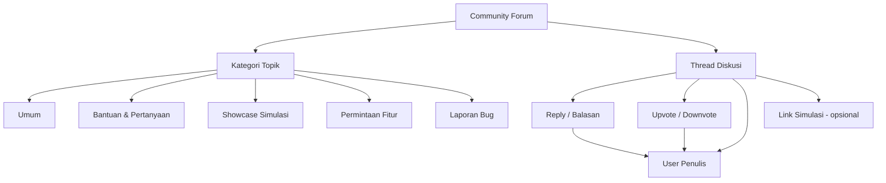
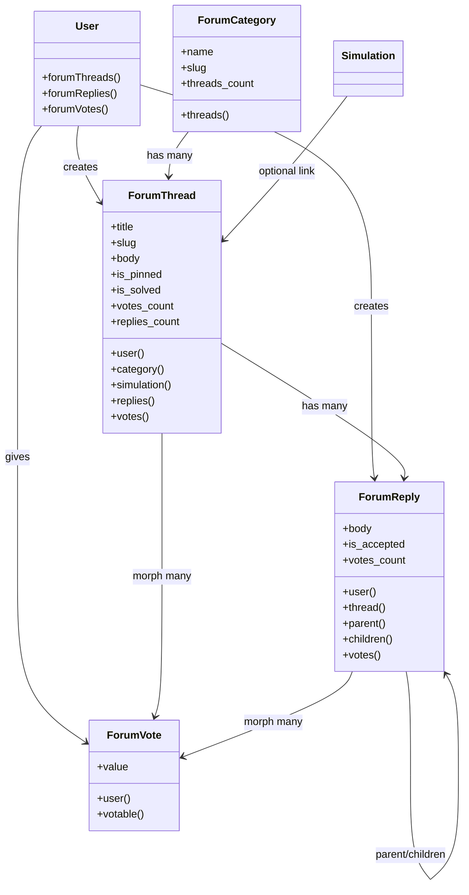
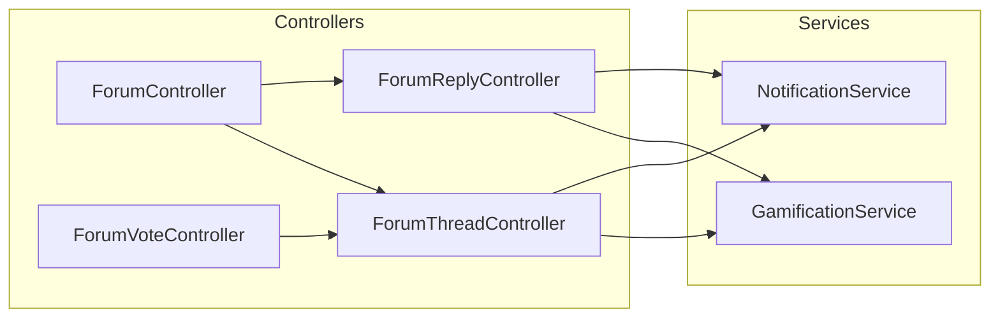

# Desain Fitur Community Forum / Diskusi Board

> **Tujuan:** Menambahkan fitur komunitas berupa Forum/Diskusi Board agar semua user bisa berinteraksi satu sama lain, mirip Reddit/Discourse, dengan kategori topik, thread, reply, dan sistem upvote.

---

## Arsitektur Fitur

---

## 1. Database Schema

### Tabel `forum_categories`

| Kolom | Tipe | Keterangan |
|:---|:---|:---|
| `id` | `bigint` PK | Auto-increment |
| `name` | `string(100)` | Nama kategori |
| `slug` | `string(100)` UNIQUE | URL-friendly identifier |
| `description` | `text` nullable | Deskripsi kategori |
| `icon` | `string(50)` nullable | Icon identifier untuk UI |
| `color` | `string(7)` nullable | Warna hex untuk badge |
| `sort_order` | `int` default 0 | Urutan tampilan |
| `threads_count` | `bigint` default 0 | Counter cache jumlah thread |
| `created_at` | `timestamp` | Waktu pembuatan |
| `updated_at` | `timestamp` | Waktu update |

### Tabel `forum_threads`

| Kolom | Tipe | Keterangan |
|:---|:---|:---|
| `id` | `bigint` PK | Auto-increment |
| `user_id` | `bigint` FK -> users | Penulis thread |
| `forum_category_id` | `bigint` FK -> forum_categories | Kategori thread |
| `simulation_id` | `bigint` FK -> simulations nullable | Simulasi terkait (opsional) |
| `title` | `string(255)` | Judul thread |
| `slug` | `string(255)` UNIQUE | URL-friendly identifier |
| `body` | `text` | Isi konten thread (markdown) |
| `is_pinned` | `boolean` default false | Disematkan oleh admin |
| `is_locked` | `boolean` default false | Dikunci oleh admin |
| `is_solved` | `boolean` default false | Ditandai sebagai solved |
| `views_count` | `bigint` default 0 | Jumlah views |
| `replies_count` | `bigint` default 0 | Counter cache jumlah reply |
| `votes_count` | `int` default 0 | Net votes (up - down) |
| `last_reply_at` | `timestamp` nullable | Waktu reply terakhir |
| `last_reply_user_id` | `bigint` FK -> users nullable | User yang terakhir reply |
| `created_at` | `timestamp` | Waktu pembuatan |
| `updated_at` | `timestamp` | Waktu update |

### Tabel `forum_replies`

| Kolom | Tipe | Keterangan |
|:---|:---|:---|
| `id` | `bigint` PK | Auto-increment |
| `user_id` | `bigint` FK -> users | Penulis reply |
| `forum_thread_id` | `bigint` FK -> forum_threads | Thread induk |
| `parent_id` | `bigint` FK -> forum_replies nullable | Reply induk (untuk nested reply) |
| `body` | `text` | Isi reply (markdown) |
| `is_accepted` | `boolean` default false | Jawaban diterima oleh penulis thread |
| `votes_count` | `int` default 0 | Net votes |
| `created_at` | `timestamp` | Waktu pembuatan |
| `updated_at` | `timestamp` | Waktu update |

### Tabel `forum_votes`

| Kolom | Tipe | Keterangan |
|:---|:---|:---|
| `id` | `bigint` PK | Auto-increment |
| `user_id` | `bigint` FK -> users | Pemberi vote |
| `votable_type` | `string(255)` | Polymorphic: ForumThread atau ForumReply |
| `votable_id` | `bigint` | ID thread atau reply |
| `value` | `tinyint` | 1 = upvote, -1 = downvote |
| `created_at` | `timestamp` | Waktu vote |
| `updated_at` | `timestamp` | Waktu update |

> **Unique constraint:** (`user_id`, `votable_type`, `votable_id`) — satu user hanya bisa vote sekali per thread/reply.

---

## 2. Model Relationships

---

## 3. Routes

### Public Routes (tanpa auth)

| Method | URI | Name | Keterangan |
|:---|:---|:---|:---|
| GET | `/forum` | `forum.index` | Halaman utama forum |
| GET | `/forum/{category}` | `forum.category` | Thread dalam kategori |
| GET | `/forum/thread/{slug}` | `forum.show` | Detail thread + replies |

### Auth-Required Routes

| Method | URI | Name | Keterangan |
|:---|:---|:---|:---|
| GET | `/forum/create` | `forum.create` | Form buat thread baru |
| POST | `/forum` | `forum.store` | Simpan thread baru |
| GET | `/forum/thread/{slug}/edit` | `forum.edit` | Form edit thread |
| PUT | `/forum/thread/{slug}` | `forum.update` | Update thread |
| DELETE | `/forum/thread/{slug}` | `forum.destroy` | Hapus thread |
| POST | `/forum/thread/{slug}/reply` | `forum.reply` | Kirim reply |
| DELETE | `/forum/replies/{reply}` | `forum.reply.destroy` | Hapus reply |
| POST | `/forum/vote` | `forum.vote` | Toggle upvote/downvote |
| POST | `/forum/thread/{slug}/lock` | `forum.lock` | Lock/unlock thread (admin) |
| POST | `/forum/thread/{slug}/pin` | `forum.pin` | Pin/unpin thread (admin) |
| POST | `/forum/replies/{reply}/accept` | `forum.reply.accept` | Tandai sebagai jawaban diterima |

---

## 4. Controller Architecture

### ForumController
- `index()` — Tampilkan semua thread terbaru + statistik forum + kategori sidebar
- `category($slug)` — Filter thread berdasarkan kategori

### ForumThreadController
- `create()` — Form buat thread baru
- `store()` — Validasi & simpan thread baru + award poin
- `show($slug)` — Tampilkan thread + replies + increment view count
- `edit($slug)` — Form edit (hanya owner atau admin)
- `update($slug)` — Update thread
- `destroy($slug)` — Hapus thread (hanya owner atau admin)
- `lock($slug)` — Lock/unlock thread (admin only)
- `pin($slug)` — Pin/unpin thread (admin only)

### ForumReplyController
- `store($slug)` — Simpan reply baru + notifikasi ke penulis thread
- `destroy($reply)` — Hapus reply (hanya owner atau admin)
- `accept($reply)` — Tandai sebagai jawaban diterima (hanya penulis thread)

### ForumVoteController
- `toggle()` — Toggle upvote/downvote pada thread atau reply + update votes_count

---

## 5. Views / UI

### Halaman Utama Forum (`forum/index.blade.php`)
- Hero section: ringkasan jumlah thread, reply, user aktif
- Kategori cards dengan icon dan jumlah thread
- Thread list terbaru (dengan badge kategori, jumlah reply, votes, waktu)
- Sidebar: stat forum, thread terpopuler, user teraktif

### Halaman Kategori (`forum/category.blade.php`)
- Header kategori dengan deskripsi
- Thread list filtered by kategori
- Sort: Terbaru, Terpopuler, Belum ada jawaban

### Detail Thread (`forum/show.blade.php`)
- Header: judul, kategori badge, info penulis + waktu
- Body konten (rendered markdown)
- Link simulasi terkait (jika ada)
- Tombol upvote/downvote di samping
- Reply list dengan nested replies
- Form reply (jika user login)
- Tombol "Tandai sebagai solved" (hanya penulis thread)

### Form Buat Thread (`forum/create.blade.php`)
- Dropdown kategori
- Input judul
- Textarea konten (markdown support)
- Optional: select simulasi terkait
- Tombol submit

### Integrasi Navigation
- Tambah link "Komunitas" di `app-header.blade.php` (desktop + mobile)

---

## 6. Gamifikasi Integration

Tambahkan action baru di `GamificationService::POINTS`:

| Action | Poin | Keterangan |
|:---|:---:|:---|
| `forum_thread` | 10 | Membuat thread baru |
| `forum_reply` | 5 | Membalas thread |
| `forum_vote_given` | 1 | Memberikan vote |
| `forum_best_answer` | 15 | Jawaban diterima sebagai solusi |

---

## 7. Notifikasi

| Event | Penerima | Tipe |
|:---|:---|:---|
| Reply baru | Penulis thread | `forum_reply` |
| Reply diterima | Penulis reply | `forum_accepted` |
| Thread di-pin | Penulis thread | `forum_pinned` |
| Thread di-lock | Penulis thread | `forum_locked` |
| Mention (@nama) | User yang disebut | `forum_mention` |

---

## 8. Admin Integration

Di halaman Admin, tambahkan section Forum Management:
- Kelola kategori (CRUD)
- Kelola threads (pin, lock, delete)
- Statistik forum (thread baru per minggu, user aktif)

---

## 9. Integrasi dengan User Profile

Tambah tab "Forum" di halaman Profil Pengguna:
- Thread yang dibuat
- Reply yang ditulis
- Vote yang diberikan

---

## 10. File yang Perlu Dibuat/Dimodifikasi

### File Baru (Dibuat)
- `database/migrations/XXXX_create_forum_categories_table.php`
- `database/migrations/XXXX_create_forum_threads_table.php`
- `database/migrations/XXXX_create_forum_replies_table.php`
- `database/migrations/XXXX_create_forum_votes_table.php`
- `database/seeders/ForumCategorySeeder.php`
- `app/Models/ForumCategory.php`
- `app/Models/ForumThread.php`
- `app/Models/ForumReply.php`
- `app/Models/ForumVote.php`
- `app/Http/Controllers/ForumController.php`
- `app/Http/Controllers/ForumThreadController.php`
- `app/Http/Controllers/ForumReplyController.php`
- `app/Http/Controllers/ForumVoteController.php`
- `resources/views/forum/index.blade.php`
- `resources/views/forum/category.blade.php`
- `resources/views/forum/show.blade.php`
- `resources/views/forum/create.blade.php`
- `resources/views/forum/edit.blade.php`
- `resources/views/forum/_thread-card.blade.php`
- `resources/views/forum/_reply.blade.php`
- `resources/views/forum/_vote-buttons.blade.php`
- `tests/Feature/ForumTest.php`

### File yang Dimodifikasi
- `routes/web.php` — Tambah routes forum
- `app/Models/User.php` — Tambah relationships forum
- `app/Services/GamificationService.php` — Tambah points forum
- `resources/views/components/app-header.blade.php` — Tambah link Komunitas
- `resources/views/profile/index.blade.php` — Tambah tab Forum
- `resources/views/admin/dashboard.blade.php` — Tambah stat forum
- `FEATURES.md` — Update dokumentasi fitur

---

## 11. Seed Data Kategori

| Nama | Slug | Icon | Warna |
|:---|:---|:---|:---|
| Umum | `umum` | `chat-bubble-left` | `#6366F1` |
| Bantuan & Pertanyaan | `bantuan` | `question-mark-circle` | `#F59E0B` |
| Showcase Simulasi | `showcase` | `sparkles` | `#10B981` |
| Permintaan Fitur | `feature-request` | `light-bulb` | `#3B82F6` |
| Laporan Bug | `bug-report` | `bug-ant` | `#EF4444` |

---

## 12. Prioritas Implementasi

1. Database migrations + models + seeders
2. Controllers + routes
3. Views (index, category, show, create, edit)
4. Vote system (AJAX)
5. Gamifikasi integration
6. Notifikasi integration
7. Navigation update
8. Admin panel integration
9. User profile integration
10. Tests
