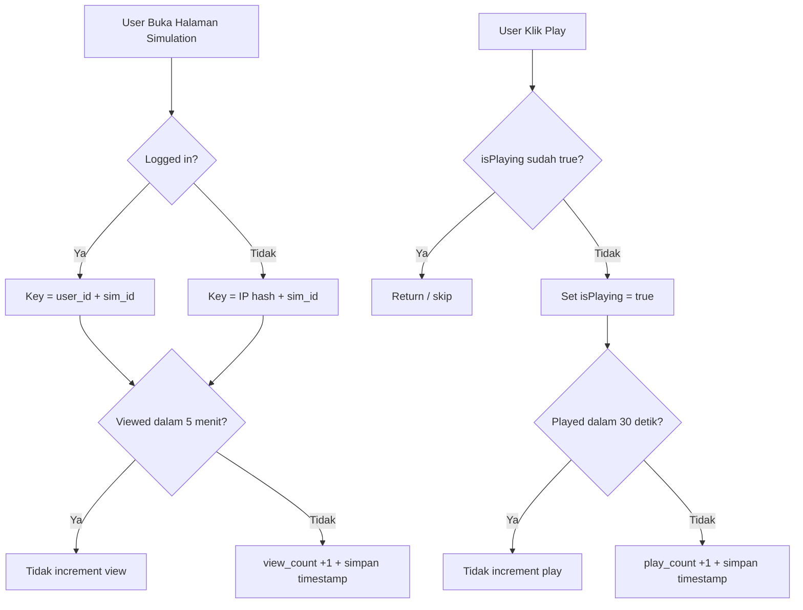

# Rencana Perbaikan Deduplikasi View & Play Tracking

## Masalah

Saat ini ada 4 lokasi di codebase yang memiliki masalah deduplikasi tracking:

1. **[`SimulationController::play()`](app/Http/Controllers/SimulationController.php:369)** — **KRITIS**: Tidak ada deduplikasi sama sekali. Setiap refresh/klik = play_count naik.
2. **[`SimulationController::show()`](app/Http/Controllers/SimulationController.php:286)** — Session-based tapi session bisa expire/clear.
3. **[`ForumThreadController::show()`](app/Http/Controllers/ForumThreadController.php:79)** — Tidak ada deduplikasi untuk `views_count`.
4. **[`CollectionController::show()`](app/Http/Controllers/CollectionController.php:39)** — Tidak ada deduplikasi untuk `view_count`.
5. **[`simulations/show.blade.php`](resources/views/simulations/show.blade.php:633)** — Frontend `playSimulation()` tidak ada guard `isPlaying`.

## Solusi

### Perubahan 1: [`SimulationController::play()`](app/Http/Controllers/SimulationController.php:369)

Tambahkan session-based deduplikasi dengan cooldown 30 detik:

```php
public function play(Request $request, string $slug)
{
    $simulation = Simulation::published()
        ->where('slug', $slug)
        ->firstOrFail();

    // Deduplikasi: hanya hitung 1 play per 30 detik per session
    $playKey = 'sim_played_'.$simulation->id;
    $lastPlayed = session($playKey);
    $cooldownSeconds = 30;

    if (! $lastPlayed || now()->diffInSeconds($lastPlayed) > $cooldownSeconds) {
        $simulation->increment('play_count');
        session()->put($playKey, now());
    }

    // ... sisa kode tetap sama
}
```

### Perubahan 2: [`SimulationController::show()`](app/Http/Controllers/SimulationController.php:286)

Perkuat deduplikasi — gunakan user ID untuk logged-in users, session untuk guest:

```php
// Increment view count with dedup
$viewKey = 'sim_viewed_'.$simulation->id;
if (Auth::check()) {
    // Logged-in: gunakan user_id + simulation_id combo via session timestamp
    $viewKey = 'sim_viewed_user_'.Auth::id().'_'.$simulation->id;
} else {
    // Guest: gunakan session + IP-based
    $viewKey = 'sim_viewed_ip_'.md5($request->ip()).'_'.$simulation->id;
}

$cooldownMinutes = 5; // View hanya dihitung sekali per 5 menit
$lastViewed = session($viewKey);

if (! $lastViewed || now()->diffInMinutes($lastViewed) > $cooldownMinutes) {
    $simulation->increment('view_count');
    session()->put($viewKey, now());

    $source = $this->detectTrafficSource($request);
    $this->trackTrafficSource($simulation->id, $source, 'view');
}
```

### Perubahan 3: [`ForumThreadController::show()`](app/Http/Controllers/ForumThreadController.php:79)

Tambahkan session-based deduplikasi:

```php
$viewKey = 'thread_viewed_'.$thread->id;
if (! session()->has($viewKey)) {
    $thread->increment('views_count');
    session()->put($viewKey, true);
}
```

### Perubahan 4: [`CollectionController::show()`](app/Http/Controllers/CollectionController.php:39)

Tambahkan session-based deduplikasi:

```php
$viewKey = 'collection_viewed_'.$collection->id;
if (! session()->has($viewKey)) {
    $collection->increment('view_count');
    session()->put($viewKey, true);
}
```

### Perubahan 5: [`simulations/show.blade.php`](resources/views/simulations/show.blade.php:633)

Tambahkan guard di frontend — pindahkan `isPlaying = true` ke SETELAH fetch berhasil, atau minimal cek sebelum fetch:

```javascript
function playSimulation() {
    if (isPlaying) return; // Guard: jangan fetch ulang jika sudah playing
    isPlaying = true;
    poster.classList.add('hidden');
    container.classList.remove('hidden');
    controls.classList.remove('hidden');
    var serveUrl = '{{ route("simulations.serve", ["slug" => $simulation->slug, "path" => $simulation->entry_point ?? "index.html"]) }}';
    iframe.src = serveUrl;
    updateStickyThreshold();
    fetch('{{ route("simulations.play", $simulation->slug) }}', {
        method: 'GET',
        headers: {
            'X-Requested-With': 'XMLHttpRequest',
            'Accept': 'application/json'
        }
    }).then(function(r) {
        if (!r.ok || !(r.headers.get('content-type') || '').includes('application/json')) {
            return null;
        }
        return r.json();
    }).catch(function() {});
}
```

## Diagram Alur Perbaikan



## File Yang Diubah

| File | Perubahan |
|------|-----------|
| [`app/Http/Controllers/SimulationController.php`](app/Http/Controllers/SimulationController.php) | Perkuat dedup view di `show()`, tambah dedup play di `play()` |
| [`app/Http/Controllers/ForumThreadController.php`](app/Http/Controllers/ForumThreadController.php) | Tambah session-based dedup view |
| [`app/Http/Controllers/CollectionController.php`](app/Http/Controllers/CollectionController.php) | Tambah session-based dedup view |
| [`resources/views/simulations/show.blade.php`](resources/views/simulations/show.blade.php) | Tambah guard `if (isPlaying) return` di `playSimulation()` |

## Catatan

- Cooldown 30 detik untuk play dipilih agar realistis — user yang refresh halaman tidak akan menambah play count, tapi user yang benar-benar memutar ulang setelah 30 detik tetap dihitung.
- Cooldown 5 menit untuk view dipilih agar lebih ketat dari session default (120 menit), namun tetap memungkinkan repeat view yang wajar.
- Forum thread dan collection menggunakan session-based sederhana (sama seperti simulation view yang sudah ada) karena tidak kritis seperti play count.
