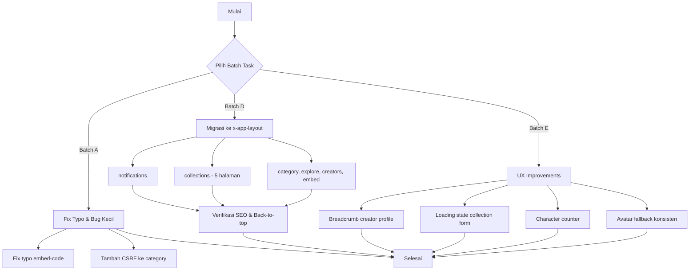

# Rencana Kerja Ringan V2 — NotEDS Simulation

## Status Proyek Saat Ini

- Semua 14 task dari V1 sudah terimplementasi ✅
- Ditemukan **14 task ringan baru** dari analisis gap antara spesifikasi FEATURES.md dan implementasi saat ini

## Temuan Analisis

### Masalah Utama: Inkonsistensi Layout

Beberapa halaman publik **tidak menggunakan** `<x-app-layout>` dan malah menggunakan standalone HTML dengan `@include('components.app-header')`. Akibatnya halaman-halaman ini kehilangan:

| Fitur | `<x-app-layout>` | Standalone HTML |
|-------|:-:|:-:|
| SEO Meta Tags (OG, Twitter, canonical) | ✅ | ❌ |
| Skip-to-content accessibility | ✅ | ❌ |
| Back-to-top button | ✅ | ❌ |
| Navigation konsisten | ✅ | Manual |
| Toast flash messages | ✅ | Kadang ada |

**Halaman yang bermasalah:**
- `notifications/index.blade.php`
- `collections/index.blade.php`
- `collections/show.blade.php`
- `collections/create.blade.php`
- `collections/edit.blade.php`
- `collections/saved-index.blade.php`
- `simulations/category.blade.php`
- `simulations/explore.blade.php`
- `simulations/embed.blade.php`
- `creators/show.blade.php`

### Bug Lain yang Ditemukan

1. **Typo** di `embed-code.blade.php` baris 54: "S simulasi" seharusnya "Simulasi"
2. **Missing CSRF meta tag** di `simulations/category.blade.php`
3. **Missing footer** di beberapa halaman

---

## Daftar Task Ringan Baru

### Batch A: Perbaikan Typo & Bug Kecil

#### Task A.1: Fix typo di embed-code.blade.php
- **File:** `resources/views/simulations/embed-code.blade.php:54`
- **Masalah:** "S simulasi" → "Simulasi" (ada spasi hilang/typo)
- **Fix:** Ganti teks dari "S simulasi akan ditampilkan" menjadi "Simulasi akan ditampilkan"

#### Task A.2: Tambahkan CSRF meta tag ke category.blade.php
- **File:** `resources/views/simulations/category.blade.php`
- **Masalah:** Tidak ada `<meta name="csrf-token">` yang bisa menyebabkan masalah AJAX
- **Fix:** Tambahkan `<meta name="csrf-token" content="{{ csrf_token() }}">` di bagian `<head>`

### Batch B: Migrasi Halaman ke `<x-app-layout>`

> **Catatan:** Migrasi ini harus dilakukanhati-hati karena halaman collections dan notifications menggunakan layout standalone yang sedikit berbeda dengan `<x-app-layout>`. Pendekatan terbaik adalah mengubah halaman-halaman ini agar menggunakan `<x-app-layout>` sehingga mendapatkan SEO, accessibility, dan back-to-top secara otomatis.

#### Task B.1: Migrasi notifications/index.blade.php ke `<x-app-layout>`
- **File:** `resources/views/notifications/index.blade.php`
- **Saat ini:** Standalone HTML dengan `@include('components.app-header')`
- **Target:** Gunakan `<x-app-layout>` dengan `$header` slot
- **Yang berubah:** Hapus HTML boilerplate, gunakan layout component, pindahkan konten ke slot default

#### Task B.2: Migrasi collections/index.blade.php ke `<x-app-layout>`
- **File:** `resources/views/collections/index.blade.php`
- **Saat ini:** Standalone HTML
- **Target:** Gunakan `<x-app-layout>`

#### Task B.3: Migrasi collections/show.blade.php ke `<x-app-layout>`
- **File:** `resources/views/collections/show.blade.php`
- **Saat ini:** Standalone HTML
- **Target:** Gunakan `<x-app-layout>`

#### Task B.4: Migrasi collections/create.blade.php ke `<x-app-layout>`
- **File:** `resources/views/collections/create.blade.php`
- **Saat ini:** Standalone HTML dengan back arrow navigation
- **Target:** Gunakan `<x-app-layout>` dengan breadcrumb

#### Task B.5: Migrasi collections/edit.blade.php ke `<x-app-layout>`
- **File:** `resources/views/collections/edit.blade.php`
- **Saat ini:** Standalone HTML
- **Target:** Gunakan `<x-app-layout>`

#### Task B.6: Migrasi collections/saved-index.blade.php ke `<x-app-layout>`
- **File:** `resources/views/collections/saved-index.blade.php`
- **Saat ini:** Standalone HTML
- **Target:** Gunakan `<x-app-layout>`

#### Task B.7: Migrasi simulations/category.blade.php ke `<x-app-layout>`
- **File:** `resources/views/simulations/category.blade.php`
- **Saat ini:** Standalone HTML tanpa CSRF, tanpa footer
- **Target:** Gunakan `<x-app-layout>`

#### Task B.8: Migrasi simulations/explore.blade.php ke `<x-app-layout>`
- **File:** `resources/views/simulations/explore.blade.php`
- **Saat ini:** Standalone HTML
- **Target:** Gunakan `<x-app-layout>`

#### Task B.9: Migrasi creators/show.blade.php ke `<x-app-layout>`
- **File:** `resources/views/creators/show.blade.php`
- **Saat ini:** Standalone HTML tanpa footer
- **Target:** Gunakan `<x-app-layout>`

#### Task B.10: Migrasi simulations/embed.blade.php ke `<x-app-layout>`
- **File:** `resources/views/simulations/embed.blade.php`
- **Saat ini:** Standalone HTML
- **Target:** Gunakan `<x-app-layout>`
- **Catatan:** Ini adalah halaman embed, mungkin perlu dipertimbangkan apakah harus menggunakan layout penuh. Alternatif: tambahkan CSRF meta tag saja.

### Batch C: UX Improvements

#### Task C.1: Tambahkan breadcrumb ke creator profile
- **File:** `resources/views/creators/show.blade.php`
- **Saat ini:** Tidak ada breadcrumb
- **Target:** Tambahkan `<x-breadcrumb :items="[...]">` dengan link ke Explore

#### Task C.2: Tambahkan loading state ke collection create form
- **File:** `resources/views/collections/create.blade.php`
- **Saat ini:** Tombol submit tanpa loading indicator
- **Target:** Tambahkan `x-data="{ saving: false }"` dan loading spinner seperti di studio/settings.blade.php

#### Task C.3: Tambahkan character counter ke collection create/edit description
- **File:** `resources/views/collections/create.blade.php`, `resources/views/collections/edit.blade.php`
- **Saat ini:** Hanya teks statis "Maks 1000 karakter"
- **Target:** Tambahkan live character counter menggunakan Alpine.js

#### Task C.4: Tambahkan avatar fallback yang konsisten di leaderboard
- **File:** `resources/views/leaderboard/index.blade.php`
- **Saat ini:** Menggunakan `Storage::url()` tanpa disk specification
- **Target:** Gunakan `Storage::disk('public')->url()` atau `asset('storage/...')` secara konsisten

---

## Diagram Alur Migrasi Layout

## Prioritas Rekomendasi

| Prioritas | Batch | Alasan |
|-----------|-------|--------|
| 1 🔴 | A (Task A.1-A.2) | Bug fix - cepat dan penting |
| 2 🟠 | B (Task B.1-B.10) | Konsistensi layout + SEO otomatis |
| 3 🟡 | C (Task C.1-C.4) | UX improvement |

## Estimasi Kompleksitas

- **Batch A:** 2 task, sangat ringan
- **Batch B:** 10 task, ringan-mengah (pattern yang sama diulang)
- **Batch C:** 4 task, ringan
- **Total:** 16 task baru
