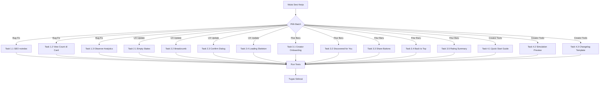

# Rencana Kerja Ringan — NotEDS Simulation

> **Tujuan:** Melanjutkan pengembangan proyek dengan fokus pada task-task ringan — bug fix, UX improvement, fitur kecil baru, dan konten creator.

---

## Status Proyek Saat Ini

Proyek sudah **sangat matang** (Fase 1-3 ~90% selesai). Semua fitur utama sudah terbangun:
- Landing page, Explore, Search, Simulation Detail, Embed
- Studio (Dashboard, CRUD, Versions, Analytics, Comments Moderation, Followers, Settings)
- Admin (Dashboard, Users, Simulations, Categories, Reports, Scans)
- Social (Comments, Bookmarks, Favorites, Reactions, Ratings, Shares, Follow, Notifications)
- Gamification (Points, Levels, Badges, Streak, Leaderboard)
- Collections (CRUD + Saved)
- Security (Auto-scan, Manual Review, User Reports, Creator Reputation)
- SEO (Meta tags, Sitemap, OG tags)

---

## Daftar Task Ringan

### 🔴 Batch 1: Bug Fix & Correctness

#### Task 1.1: Tambahkan SEO noindex untuk halaman profil pengguna
- **File:** `resources/views/user-profile/index.blade.php`
- **Masalah:** Halaman profil user menggunakan `$seo` global (generic default). Seharusnya halaman profil pribadi di-set `noindex` untuk privasi.
- **Aksi:** Ganti meta robots dari `index, follow` menjadi `noindex, nofollow` di view.

#### Task 1.2: Tambahkan view_count ke Simulation Card
- **File:** `resources/views/components/simulation-card.blade.php`
- **Masalah:** `FEATURES.md` spec menampilkan View Count (e.g., "35.000 dilihat"), tapi card hanya menampilkan play_count.
- **Aksi:** Tambahkan `$simulation->formatted_view_count` di bawah play count, atau gabungkan: "20.000 dimainkan · 35.000 dilihat".

#### Task 1.3: Pastikan Simulation Observer log analytics
- **File:** `app/Observers/SimulationObserver.php`
- **Masalah:** Pastikan setiap view/play tercatat ke `simulation_analytics` dan `simulation_daily_metrics` secara benar.
- **Aksi:** Review observer, pastikan increment view_count di `show()` method juga membuat/memperbarui analytics record.

---

### 🟡 Batch 2: UX Improvement (View Updates)

#### Task 2.1: Tambahkan Empty States
- **File:** Multiple views
- **Masalah:** Beberapa halaman tidak menangani kondisi kosong dengan baik.
- **Aksi tambahan di:**
  - `user-profile/index.blade.php` — Tab bookmarks, history, following, collections kosong
  - `studio/simulations.blade.php` — Belum ada simulasi
  - `studio/comments.blade.php` — Belum ada komentar
  - `studio/followers.blade.php` — Belum ada followers
  - `collections/show.blade.php` — Collection kosong (belum ada simulasi)
  - `simulations/explore.blade.php` — Tidak ada hasil pencarian/kategori
- **Template:** Gunakan ilustrasi SVG sederhana + pesan ramah + CTA button.

#### Task 2.2: Tambahkan Breadcrumb Navigation
- **File:** Multiple views
- **Masalah:** Navigasi hierarki tidak terlihat — user tidak tahu posisi mereka.
- **Aksi tambahan di:**
  - `simulations/explore.blade.php` — Beranda > Explore > [Kategori]
  - `simulations/category.blade.php` — Beranda > Explore > [Kategori]
  - `simulations/show.blade.php` — Beranda > [Kategori] > [Judul]
  - `collections/show.blade.php` — Beranda > Collections > [Judul]
  - `creators/show.blade.php` — Beranda > Creator > [Nama]
- **Implementasi:** Component `<x-breadcrumb>` atau inline dengan Tailwind.

#### Task 2.3: Tambahkan Confirmation Dialog untuk Destructive Actions
- **Files:**
  - `studio/simulations.blade.php` — Delete simulasi
  - `collections/edit.blade.php` — Delete collection
  - `admin/users/index.blade.php` — Deactivate/delete user
  - `admin/simulations/index.blade.php` — Delete simulasi
- **Aksi:** Tambahkan `onclick="return confirm('...')"` atau gunakan Alpine.js modal component yang sudah ada (`components/modal.blade.php`).

#### Task 2.4: Tambahkan Loading Skeleton di Homepage
- **File:** `resources/views/landing.blade.php`
- **Masalah:** Halaman utama langsung render tanpa loading state.
- **Aksi:** Tambahkan Alpine.js `x-data` dengan `x-show` untuk menampilkan skeleton placeholder saat halaman dimuat (opsional, low priority).

---

### 🟢 Batch 3: Fitur Ringan Baru

#### Task 3.1: Creator Onboarding di Dashboard User
- **Files:**
  - `resources/views/dashboard.blade.php` — Tambahkan section untuk user yang belum creator
  - `app/Http/Controllers/DashboardController.php` — Pass data role
- **Deskripsi:** Jika user login tapi belum punya role `creator`, tampilkan banner/section ajakan:
  - "Mulai Kreasi — Upload simulasi pertamamu!"
  - Penjelasan singkat benefit jadi creator
  - Tombol "Ajukan Dirimu sebagai Creator" → POST ke admin untuk approval
- **Implementasi:**
  1. Tambahkan route `POST /become-creator` yang mengirim notifikasi ke admin
  2. Tambahkan section di dashboard view dengan conditional `@if(auth()->user()->role === 'user')`
  3. Tambahkan badge/label "Creator" jika sudah approve

#### Task 3.2: "Discovered for You" Section di Homepage
- **File:** `app/Http/Controllers/SimulationController.php` (method `index`/`landing`)
- **Deskripsi:** Rekomendasi personal berdasarkan kategori yang paling sering dimainkan user.
- **Implementasi:**
  1. Query kategori top dari `play_history` user
  2. Ambil simulasi published dari kategori tersebut yang belum dimainkan
  3. Tampilkan section "Discovered for You" di homepage
  4. Fallback ke simulasi rating tertinggi jika user belum punya history

#### Task 3.3: Share to WhatsApp/Telegram with Pre-filled Text
- **File:** `resources/views/simulations/show.blade.php` (share buttons)
- **Masalah:** Tombol share mungkin belum terhubung ke URL share yang benar.
- **Aksi:** Pastikan tombol share terhubung ke:
  - WhatsApp: `https://wa.me/?text={title}+{url}`
  - Telegram: `https://t.me/share/url?url={url}&text={title}`
  - Twitter/X: `https://twitter.com/intent/tweet?text={title}&url={url}`
  - Facebook: `https://www.facebook.com/sharer/sharer.php?u={url}`
  - Copy Link: clipboard API

#### Task 3.4: Tambahkan "Back to Top" Button
- **Files:** `layouts/app.blade.php`, standalone pages
- **Aksi:** Tambahkan floating button "↑" di pojok kanan bawah yang muncul saat user scroll ke bawah. Implementasi sederhana dengan Alpine.js.

#### Task 3.5: Rating Summary di Studio Analytics
- **File:** `resources/views/studio/analytics.blade.php`
- **Deskripsi:** Tambahkan breakdown rating distribution (5★: 45%, 4★: 30%, 3★: 15%, 2★: 7%, 1★: 3%) sebagai bar chart horizontal.
- **Implementasi:** Query `Rating::where('simulation_id', ...)->groupBy('rating')->count()`, render sebagai horizontal bar chart.

---

### 🔵 Batch 4: Creator Content Tools

#### Task 4.1: Creator Quick Start Guide
- **File:** `resources/views/studio/create.blade.php`
- **Deskripsi:** Tambahkan collapsible guide di halaman upload yang menjelaskan:
  - Struktur ZIP package yang benar
  - Format `manifest.json`
  - Tips thumbnail yang menarik
  - Checklist sebelum publish
- **Implementasi:** Accordion/collapsible section di atas form upload.

#### Task 4.2: Simulation Preview sebelum Publish
- **File:** `app/Http/Controllers/StudioController.php`
- **Deskripsi:** Saat edit simulasi, tampilkan preview thumbnail yang sudah ada agar creator tahu apa yang sudah ter-upload.
- **Implementasi:** Tampilkan `` thumbnail saat edit form terbuka.

#### Task 4.3: Changelog Template untuk Versioning
- **File:** `resources/views/studio/versions.blade.php`
- **Deskripsi:** Saat upload versi baru, tampilkan diff ringkas:
  - Versi lama vs baru (version number)
  - Tanggal perubahan
  - Changelog text yang diisi creator
- **Implementasi:** Pastikan form upload versi baru memiliki field `changelog` (textarea).

---

## Diagram Alur Kerja

---

## Prioritas Rekomendasi

| Prioritas | Batch | Tasks | Estimasi |
|:---:|:---:|:---|:---:|
| ⭐⭐⭐ | 1 | Bug Fix (1.1, 1.2, 1.3) | Ringan |
| ⭐⭐⭐ | 3 | Creator Onboarding (3.1) | Ringan |
| ⭐⭐ | 2 | Empty States (2.1) | Sedang |
| ⭐⭐ | 3 | Discovered for You (3.2) | Sedang |
| ⭐⭐ | 3 | Share Buttons (3.3) | Ringan |
| ⭐⭐ | 4 | Quick Start Guide (4.1) | Ringan |
| ⭐ | 2 | Breadcrumb (2.2) | Sedang |
| ⭐ | 2 | Confirm Dialog (2.3) | Ringan |
| ⭐ | 2 | Loading Skeleton (2.4) | Ringan |
| ⭐ | 3 | Back to Top (3.4) | Ringan |
| ⭐ | 3 | Rating Summary (3.5) | Ringan |
| ⭐ | 4 | Preview (4.2) | Ringan |
| ⭐ | 4 | Changelog (4.3) | Ringan |

---

## Menjadi Kreator — Alur & Benefit

### Alur Jadi Kreator
1. Register akun via Google OAuth atau manual
2. Login → Dashboard user muncul
3. Klik "Ajukan Dirimu sebagai Creator" (Task 3.1)
4. Admin approve role ke `creator` via Admin Panel
5. Akses **Simulation Studio** di `/studio`
6. Upload simulasi pertama (ZIP package) dengan panduan Quick Start Guide (Task 4.1)
7. Simulasi melewati auto-scan keamanan
8. Publish → muncul di Explore & Feed

### Benefit Kreator
| Benefit | Penjelasan |
|:---|:---|
| 🌍 **Jangkauan Global** | Simulasi bisa diakses siapa saja, embeddable di website sekolah |
| 📊 **Analytics Detail** | Views, plays, rasio konversi, durasi bermain, traffic sources |
| 👥 **Build Audience** | Dapat followers, notifikasi otomatis saat upload baru |
| 💰 **Revenue Sharing** | (Fase 4) Bagi hasil iklan 55%-85% tergantung tier |
| 🏆 **Gamifikasi** | Badge, level, leaderboard — meningkatkan visibilitas |
| 🔒 **Keamanan** | Platform handle auto-scan + sandbox testing |
| 🎓 **Dampak Pendidikan** | Kontribusi nyata untuk pendidikan Indonesia |
| 🌐 **SEO Boost** | Konten terindex Google, ditemukan via search engine |
| 📱 **Embed & Share** | Simulasi bisa disematkan di LMS, blog, website sekolah |
| 🔄 **Version Control** | Upload versi baru tanpa kehilangan versi lama |
