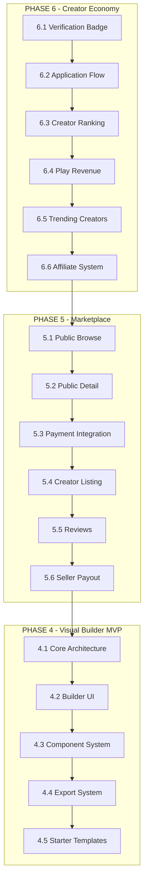

# Master Plan: PHASE 4 (Visual Builder), PHASE 5 (Marketplace), PHASE 6 (Creator Economy)

> **Tanggal:** 26 Juli 2026
> **Status:** Draft
> **Prioritas:** PHASE 6 → PHASE 5 → PHASE 4

---

## Ringkasan Eksekutif

Rencana ini mencakup tiga fase besar dari ROADMAP NotEDS:
- **PHASE 6** (Creator Economy) — Sudah ~80%, gap kecil
- **PHASE 5** (Marketplace) — Sudah ~10% (model + admin), perlu user-facing flow
- **PHASE 4** (Visual Builder) — ~0%, butuh pendekatan MVP

---

## PHASE 6 — Creator Economy (Target: 100%)

### State Saat Ini

| Komponen | Status |
|----------|--------|
| Creator Dashboard | ✅ Ada |
| Revenue Dashboard | ✅ Ada |
| Followers | ✅ Ada |
| Analytics | ✅ Ada |
| Creator Reputation (4 tiers) | ✅ Ada |
| Revenue Sharing (55%-85%) | ✅ Ada |
| Payout System | ✅ Ada |
| Creator Ads | ✅ Ada |
| Creator Onboarding | ✅ Ada |
| Admin Creator Management | ✅ Ada |
| Gamification | ✅ Ada |
| **Creator Verification Badge** | ❌ Belum |
| **Creator Application Flow (Approval)** | ⚠️ Auto-approve |
| **Sponsorship Flow Lengkap** | ⚠️ Admin only |
| **Creator Ranking Algorithms** | ❌ Belum |
| **Trending/Top Creator Pages** | ❌ Belum |
| **Play Revenue Calculation** | ❌ Belum |
| **Affiliate System** | ❌ Belum |

---

### Task 6.1: Creator Verification Badge

**Tujuan:** Admin bisa approve/decline creator, dan creator yang verified mendapat badge.

#### Database Changes
- Tambah kolom `verified_at` ke `users` table (nullable timestamp)
- Tambah kolom `verification_notes` ke `users` table (nullable text)

#### Backend
- **File:** `app/Http/Controllers/Admin/UserController.php`
  - Tambah method `verifyCreator(User $user)` — set `verified_at = now()`
  - Tambah method `revokeVerification(User $user)` — set `verified_at = null`
- **File:** `app/Models/User.php`
  - Tambah method `isVerifiedCreator(): bool`
  - Tambah accessor `verificationBadgeAttribute(): ?string`

#### Frontend
- **File:** `resources/views/admin/users/show.blade.php`
  - Tambah tombol "Verify Creator" / "Revoke Verification"
- **File:** `resources/views/components/verified-badge.blade.php`
  - Komponen badge SVG biru centang
- **File:** `resources/views/creators/show.blade.php`
  - Tampilkan badge di profil creator
- **File:** `resources/views/components/simulation-card.blade.php`
  - Tampilkan badge di card jika creator verified

#### Routes
```php
Route::post('/admin/users/{user}/verify', [AdminUserController::class, 'verifyCreator'])->name('users.verify');
Route::post('/admin/users/{user}/revoke-verification', [AdminUserController::class, 'revokeVerification'])->name('users.revoke-verification');
```

---

### Task 6.2: Creator Application Flow (Proper Approval)

**Tujuan:** User apply → admin review → approve/reject dengan notifikasi.

#### Perubahan
- **File:** `app/Http/Controllers/DashboardController.php`
  - Ubah `becomeCreator()` — jangan langsung update role, buat record `creator_applications`
  - Tambah `cancelApplication()` untuk batalkan aplikasi
- **File:** Migration baru — `creator_applications` table
  ```
  id, user_id, reason (text), status (enum: pending/approved/rejected), reviewed_by, reviewed_at, review_notes, timestamps
  ```
- **File:** `app/Models/CreatorApplication.php` — Model baru
- **File:** `app/Http/Controllers/Admin/CreatorController.php`
  - Tambah method `applications()` — list pending applications
  - Tambah method `approveApplication(CreatorApplication $app)` — approve + update role
  - Tambah method `rejectApplication(CreatorApplication $app)` — reject + notifikasi
- **File:** `resources/views/dashboard.blade.php`
  - Ubah banner "Mulai Kreasi" → form apply dengan reason textarea
  - Jika sudah apply, tampilkan status "Menunggu Review"
- **File:** `resources/views/admin/creators/applications.blade.php` — View baru
- **File:** `resources/views/admin/dashboard.blade.php`
  - Tambah widget "Pending Applications" count

---

### Task 6.3: Creator Ranking System

**Tujuan:** Hitung peringkat creator berdasarkan weighted scoring.

#### Backend
- **File:** `app/Services/CreatorRankingService.php` — Service baru
  - Method `calculateRank(User $creator): array`
  - Skor = (views × 0.1) + (plays × 0.2) + (avg_rating × 20) + (followers × 0.5) + (simulation_count × 2) + (badges × 5)
- **File:** Migration — tambah kolom `ranking_score` ke `creator_reputations`
- **File:** `app/Console/Commands/UpdateCreatorRankings.php` — Artisan command
  - Bisa dijadwalkan via scheduler (daily)

#### Frontend
- **File:** `resources/views/leaderboard/creators.blade.php` — View baru
  - Top 10 creators dengan avatar, stats, badge
  - Filter: weekly, monthly, all-time
- **File:** `resources/views/homepage/partials/trending-creators.blade.php`
  - Section "Top Creators" di homepage (3-5 card)

#### Routes
```php
Route::get('/leaderboard/creators', [LeaderboardController::class, 'creators'])->name('leaderboard.creators');
```

---

### Task 6.4: Play Revenue Calculation

**Tujuan:** Hitung revenue dari ad impressions per simulasi.

#### Backend
- **File:** `app/Services/PlayRevenueService.php` — Service baru
  - Method `calculateRevenue(Simulation $sim): float` — hitung dari ad_impressions
  - Method `getRevenueBreakdown(User $creator): array` — per simulasi
  - Method `getMonthlyRevenue(User $creator, Carbon $month): float`
- **File:** `app/Console/Commands/CalculatePlayRevenue.php` — Artisan command
  - Hitung daily revenue dari ad_impressions
  - Update `creator_ads.revenue` dan `creator_reputations.total_revenue`

#### Frontend
- **File:** `resources/views/studio/revenue-detail.blade.php` — View baru
  - Breakdown revenue per simulasi
  - Grafik revenue harian/bulanan
- **File:** Update `resources/views/studio/dashboard.blade.php`
  - Tambah section "Revenue Breakdown" dengan top earning simulations

---

### Task 6.5: Trending & Top Creator Pages

**Tujuan:** Halaman publik untuk menampilkan creator terbaik.

#### Backend
- **File:** `app/Http/Controllers/LeaderboardController.php`
  - Method `creators()` — query creators ordered by ranking_score
  - Support filter: weekly, monthly, all-time

#### Frontend
- **File:** `resources/views/leaderboard/creators.blade.php`
  - Grid of creator cards
  - Sort by: ranking, followers, simulations, rating
- **File:** Update `resources/views/creators/show.blade.php`
  - Tambah ranking badge "Top 10 Creator" jika applicable

---

### Task 6.6: Affiliate System (Nice-to-Have)

**Tujuan:** Referral tracking untuk creator.

#### Database
- Migration: `affiliate_links` table
  ```
  id, user_id (creator), simulation_id, code (unique), clicks, conversions, timestamps
  ```
- Migration: `affiliate_conversions` table
  ```
  id, affiliate_link_id, buyer_user_id, amount, commission, timestamps
  ```

#### Backend
- `app/Models/AffiliateLink.php`
- `app/Models/AffiliateConversion.php`
- `app/Services/AffiliateService.php`
  - `generateLink(User $creator, Simulation $sim): AffiliateLink`
  - `trackClick(string $code): void`
  - `trackConversion(string $code, User $buyer, float $amount): void`
  - `getCommissionRate(): float` — default 10%

#### Frontend
- `resources/views/studio/affiliate.blade.php` — Creator manage affiliate links
- Update simulation show page — "Share Affiliate Link" button

---

## PHASE 5 — Marketplace (Target: 100%)

### State Saat Ini

| Komponen | Status |
|----------|--------|
| Database tables | ✅ Ada |
| Models | ✅ Ada |
| Admin Controller | ✅ Ada |
| Admin Views | ✅ Ada |
| **Public Browse Page** | ❌ Belum |
| **Public Detail Page** | ❌ Belum |
| **Purchase Flow** | ❌ Belum |
| **Payment Integration** | ❌ Belum |
| **Creator Listing Flow** | ❌ Belum |
| **Purchase History** | ❌ Belum |
| **Search & Filter** | ❌ Belum |
| **Seller Payout** | ❌ Belum |

---

### Task 5.1: Public Marketplace Browse

**Tujuan:** Halaman publik untuk browse simulasi berbayar.

#### Backend
- **File:** `app/Http/Controllers/MarketplaceController.php` — Controller baru
  - Method `index(Request $request): View` — list active listings
  - Support: search, category filter, price range, sort (newest/popular/rating/price)
  - Pagination
- **File:** Routes
  ```php
  Route::get('/marketplace', [MarketplaceController::class, 'index'])->name('marketplace.index');
  Route::get('/marketplace/{slug}', [MarketplaceController::class, 'show'])->name('marketplace.show');
  ```

#### Frontend
- **File:** `resources/views/marketplace/index.blade.php` — View baru
  - Hero section "Marketplace — Beli Simulasi Premium"
  - Filter sidebar: kategori, harga, license type
  - Sort dropdown: newest, popular, rating, price low-high, price high-low
  - Grid of simulation cards dengan harga badge
  - Dark mode compatible
- **File:** `resources/views/components/marketplace-card.blade.php` — Component baru
  - Thumbnail, title, creator, price, rating, license type badge

---

### Task 5.2: Public Marketplace Detail

**Tujuan:** Halaman detail simulasi marketplace.

#### Frontend
- **File:** `resources/views/marketplace/show.blade.php` — View baru
  - Large thumbnail / preview
  - Title, description, creator info
  - Price + license type
  - "Beli Sekarang" CTA button
  - Demo preview (jika available)
  - Reviews / ratings
  - Related simulations
  - Breadcrumb navigation

---

### Task 5.3: Payment Integration (Midtrans)

**Tujuan:** Integrasi payment gateway untuk pembelian.

#### Setup
- **File:** `config/midtrans.php` — Config baru
- **File:** `composer.json` — Tambah dependency `midtrans/midtrans-php` atau gunakan HTTP API
- **File:** `.env` — Tambah variabel:
  ```
  MIDTRANS_SERVER_KEY=
  MIDTRANS_CLIENT_KEY=
  MIDTRANS_IS_PRODUCTION=false
  MIDTRANS_MERCHANT_ID=
  ```

#### Backend
- **File:** `app/Services/MarketplacePaymentService.php` — Service baru
  - `createTransaction(MarketplaceListing $listing, User $buyer): array`
    - Buat `marketplace_purchase` record (status: pending)
    - Hit Midtrans API untuk snap token
    - Return snap token + redirect URL
  - `handleCallback(array $payload): void`
    - Verify signature
    - Update `marketplace_purchase.status`
    - Update `marketplace_listings.total_sales` + `total_revenue`
    - Send notification ke buyer dan creator
  - `getSnapToken(int $purchaseId): ?string`

- **File:** `app/Http/Controllers/MarketplacePaymentController.php` — Controller baru
  - `checkout(Request $request, MarketplaceListing $listing)` — create transaction
  - `success(Request $request)` — success page
  - `callback(Request $request)` — Midtrans webhook
  - `history(Request $request)` — purchase history

#### Frontend
- **File:** `resources/views/marketplace/checkout.blade.php` — Checkout page
  - Ringkasan pembelian
  - Pilih payment method (BCA, BNI, Mandiri, GoPay, OVO, etc.)
  - Snap.js integration
- **File:** `resources/views/marketplace/success.blade.php` — Success page
  - "Pembayaran Berhasil!"
  - Link ke download / play simulation
- **File:** `resources/views/marketplace/history.blade.php` — Purchase history
  - List pembelian dengan status
  - Download link

#### Routes
```php
Route::middleware('auth')->group(function () {
    Route::post('/marketplace/{listing}/checkout', [MarketplacePaymentController::class, 'checkout'])->name('marketplace.checkout');
    Route::get('/marketplace/success', [MarketplacePaymentController::class, 'success'])->name('marketplace.success');
    Route::post('/marketplace/callback', [MarketplacePaymentController::class, 'callback'])->name('marketplace.callback');
    Route::get('/my-purchases', [MarketplacePaymentController::class, 'history'])->name('marketplace.history');
});
```

---

### Task 5.4: Creator Marketplace Listing Flow

**Tujuan:** Creator bisa list simulasi mereka di marketplace.

#### Backend
- **File:** `app/Http/Controllers/StudioController.php`
  - Tambah method `marketplaceSettings(string $slug)` — form listing
  - Tambah method `storeMarketplaceListing(Request $request, string $slug)` — save listing
  - Tambah method `updateMarketplaceListing(Request $request, string $slug)` — update listing
  - Tambah method `removeFromMarketplace(string $slug)` — remove listing

#### Frontend
- **File:** `resources/views/studio/marketplace-settings.blade.php` — View baru
  - Form: price, currency, license type, demo toggle, demo limit
  - Preview bagaimana listing akan tampil
  - Toggle active/inactive

#### Routes
```php
Route::get('/studio/simulations/{slug}/marketplace', [StudioController::class, 'marketplaceSettings'])->name('studio.simulations.marketplace');
Route::post('/studio/simulations/{slug}/marketplace', [StudioController::class, 'storeMarketplaceListing'])->name('studio.simulations.marketplace.store');
Route::put('/studio/simulations/{slug}/marketplace', [StudioController::class, 'updateMarketplaceListing'])->name('studio.simulations.marketplace.update');
Route::delete('/studio/simulations/{slug}/marketplace', [StudioController::class, 'removeFromMarketplace'])->name('studio.simulations.marketplace.remove');
```

---

### Task 5.5: Marketplace Reviews

**Tujuan:** Buyer bisa review simulasi yang sudah dibeli.

#### Database
- Migration: `marketplace_reviews` table
  ```
  id, user_id, listing_id, simulation_id, rating (1-5), review_text, timestamps
  unique: [user_id, listing_id]
  ```

#### Backend
- `app/Models/MarketplaceReview.php`
- `app/Http/Controllers/MarketplaceReviewController.php`
  - `store(Request $request)` — AJAX, hanya bisa review jika sudah beli
  - `update(Request $request, MarketplaceReview $review)`
  - `destroy(MarketplaceReview $review)`

#### Frontend
- Review section di marketplace detail page
- Star rating component
- Review form (hanya muncul jika sudah beli + belum review)

---

### Task 5.6: Seller Payout dari Marketplace

**Tujuan:** Creator bisa tarik uang dari penjualan marketplace.

#### Backend
- **File:** `app/Services/PayoutService.php` — Update
  - Tambah logic: pending balance = ad revenue + marketplace revenue - total paid
  - Marketplace revenue = `marketplace_listings.total_revenue × (1 - platform_fee)`
  - Platform fee default: 20%

- **File:** Migration — tambah kolom `platform_fee_percent` ke `marketplace_listings` (default: 20)

#### Frontend
- Update `resources/views/studio/payouts.blade.php`
  - Tampilkan breakdown: Ad Revenue + Marketplace Revenue

---

## PHASE 4 — Visual Builder MVP (Target: MVP 30%)

### Pendekatan

> **Penting:** Full Visual Builder (20+ komponen) adalah proyek 4-6 bulan.
> Untuk MVP, kita bangun **"Experience Template Builder"** — editor sederhana yang memungkinkan creator membuat simulasi dari template yang sudah ada, dengan kemampuan customize parameter.

### Scope MVP

```
┌─────────────────────────────────────────────┐
│  VISUAL BUILDER MVP                         │
├─────────────────────────────────────────────┤
│  ✅ Template-based builder                  │
│  ✅ 5 komponen inti:                        │
│     - Text (heading, paragraph)             │
│     - Slider (parameter control)            │
│     - Chart (line, bar)                     │
│     - Image (with hotspot)                  │
│     - Quiz (multiple choice)                │
│  ✅ Live preview panel                      │
│  ✅ Export to ZIP (manifest.json + HTML)     │
│  ✅ Save as draft                           │
│  ✅ 3 starter templates                     │
│                                             │
│  ❌ Full drag & drop (Phase 4 selanjutnya)  │
│  ❌ 3D Viewer, Canvas, SVG (Phase 4 v2)     │
│  ❌ Code Block, Animation (Phase 4 v3)      │
│  ❌ Undo/Redo (Phase 4 v4)                  │
└─────────────────────────────────────────────┘
```

---

### Task 4.1: Template Builder Core Architecture

**Tujuan:** Bangun foundation untuk visual builder.

#### Database
- Migration: `experience_templates` table
  ```
  id, name, slug, description, category, thumbnail_path, 
  schema (json — komponen structure), 
  default_config (json), is_active, timestamps
  ```
- Migration: `experience_projects` table
  ```
  id, user_id, template_id, title, description, 
  config (json — user customization), 
  status (enum: draft/published/archived),
  version, published_at, timestamps
  ```

#### Backend
- `app/Models/ExperienceTemplate.php`
- `app/Models/ExperienceProject.php`
- `app/Services/ExperienceBuilderService.php`
  - `getTemplates(): Collection`
  - `getTemplate(string $slug): ExperienceTemplate`
  - `createProject(User $user, ExperienceTemplate $template, array $config): ExperienceProject`
  - `updateProject(ExperienceProject $project, array $config): ExperienceProject`
  - `exportToZip(ExperienceProject $project): string` — return path to ZIP
  - `renderPreview(ExperienceProject $project): string` — return HTML

#### Routes
```php
Route::middleware(['auth', 'verified'])->prefix('studio/builder')->name('builder.')->group(function () {
    Route::get('/', [ExperienceBuilderController::class, 'index'])->name('index');
    Route::get('/templates', [ExperienceBuilderController::class, 'templates'])->name('templates');
    Route::post('/projects', [ExperienceBuilderController::class, 'createProject'])->name('projects.create');
    Route::get('/projects/{project}/edit', [ExperienceBuilderController::class, 'edit'])->name('projects.edit');
    Route::put('/projects/{project}', [ExperienceBuilderController::class, 'update'])->name('projects.update');
    Route::post('/projects/{project}/preview', [ExperienceBuilderController::class, 'preview'])->name('projects.preview');
    Route::post('/projects/{project}/export', [ExperienceBuilderController::class, 'export'])->name('projects.export');
    Route::post('/projects/{project}/publish', [ExperienceBuilderController::class, 'publish'])->name('projects.publish');
});
```

---

### Task 4.2: Builder UI — Editor Panel

**Tujuan:** UI editor dengan component tree + property inspector.

#### Frontend
- **File:** `resources/views/studio/builder/index.blade.php` — Main layout
  - 3-panel layout: Component Tree (left) | Canvas/Preview (center) | Property Inspector (right)
  - Alpine.js state management
  - Responsive (panel collapse on mobile)

- **File:** `resources/views/studio/builder/partials/component-tree.blade.php`
  - List komponen dalam project
  - Drag to reorder (Alpine.js sortable)
  - Add/remove component

- **File:** `resources/views/studio/builder/partials/property-inspector.blade.php`
  - Dynamic form berdasarkan komponen yang dipilih
  - Text: content, font size, color, alignment
  - Slider: min, max, step, default value, label
  - Chart: data source, type (line/bar), colors
  - Image: upload, hotspot positions
  - Quiz: questions, options, correct answer

- **File:** `resources/views/studio/builder/partials/preview-panel.blade.php`
  - Live preview iframe
  - Auto-update saat config berubah (debounce)

- **File:** `resources/js/builder.js` — Alpine.js component
  - State: selectedComponent, components[], config{}
  - Methods: addComponent, removeComponent, updateProperty, preview, save

---

### Task 4.3: Component System (5 Komponen Inti)

**Tujuan:** Implementasi 5 komponen dasar.

#### Backend — Component Schema
- **File:** `app/Services/Builder/ComponentRegistry.php`
  - Registry semua komponen yang tersedia
  - Method `getComponent(string $type): array` — return schema
  - Method `getAvailableComponents(): array`

- **File:** `app/Services/Builder/Components/TextComponent.php`
  - Schema: content, tag (h1-h6/p), fontSize, color, align
  - Render: generate HTML

- **File:** `app/Services/Builder/Components/SliderComponent.php`
  - Schema: label, min, max, step, defaultValue, unit
  - Render: `<input type="range">` + Alpine.js binding

- **File:** `app/Services/Builder/Components/ChartComponent.php`
  - Schema: type (line/bar), data (labels[], values[]), colors, title
  - Render: Canvas.js or Chart.js

- **File:** `app/Services/Builder/Components/ImageComponent.php`
  - Schema: imageUrl, alt, hotspots[{x,y,label,popup}]
  - Render: `` + clickable hotspots

- **File:** `app/Services/Builder/Components/QuizComponent.php`
  - Schema: question, options[], correctIndex, explanation, multiple
  - Render: form + feedback

---

### Task 4.4: Export System

**Tujuan:** Export project ke ZIP yang bisa di-upload ke platform.

#### Backend
- **File:** `app/Services/Builder/ExportService.php`
  - `export(ExperienceProject $project): string`
    - Generate `index.html` dari komponen
    - Generate `manifest.json`
    - Generate `thumbnail.webp` (dari screenshot)
    - Bundle ke ZIP
    - Return path

- **File:** `app/Services/Builder/HtmlRenderer.php`
  - Render komponen ke HTML string
  - Include Tailwind CSS inline
  - Include Alpine.js for interactivity

#### Manifest Format
```json
{
  "name": "Newton's Law Simulator",
  "version": "1.0.0",
  "description": "...",
  "author": "creator_username",
  "thumbnail": "thumbnail.webp",
  "category": "physics",
  "renderer": "html",
  "components": ["text", "slider", "chart"],
  "min_platform_version": "1.0"
}
```

---

### Task 4.5: Starter Templates (3 Templates)

**Tujuan:** 3 template siap pakai untuk creator.

#### Templates
1. **Fisika Dasar** — Slider untuk massa/gaya, Chart untuk grafik gerak
   - Komponen: Text (penjelasan), Slider (massa, gaya, gesekan), Chart (velocity-time)
   
2. **Kuis Interaktif** — Multiple choice questions dengan feedback
   - Komponen: Text (pertanyaan), Quiz (options), Text (penjelasan)
   
3. **Eksplorasi Visual** — Image dengan hotspot info
   - Komponen: Image (diagram), Text (caption), Slider (parameter)

#### Seeder
- **File:** `database/seeders/ExperienceTemplateSeeder.php`
  - Seed 3 templates dengan default config

---

## Diagram Alur Eksekusi



---

## File yang Perlu Dibuat (Total: ~40 file baru)

### PHASE 6 (~15 file)
| File | Tipe |
|------|------|
| `database/migrations/xxxx_add_verification_to_users_table.php` | Migration |
| `database/migrations/xxxx_create_creator_applications_table.php` | Migration |
| `database/migrations/xxxx_add_ranking_score_to_creator_reputations.php` | Migration |
| `database/migrations/xxxx_create_affiliate_links_table.php` | Migration |
| `database/migrations/xxxx_create_affiliate_conversions_table.php` | Migration |
| `app/Models/CreatorApplication.php` | Model |
| `app/Models/AffiliateLink.php` | Model |
| `app/Models/AffiliateConversion.php` | Model |
| `app/Services/CreatorRankingService.php` | Service |
| `app/Services/PlayRevenueService.php` | Service |
| `app/Services/AffiliateService.php` | Service |
| `app/Console/Commands/UpdateCreatorRankings.php` | Command |
| `app/Console/Commands/CalculatePlayRevenue.php` | Command |
| `resources/views/components/verified-badge.blade.php` | Component |
| `resources/views/admin/creators/applications.blade.php` | View |
| `resources/views/leaderboard/creators.blade.php` | View |
| `resources/views/studio/revenue-detail.blade.php` | View |
| `resources/views/studio/affiliate.blade.php` | View |

### PHASE 5 (~15 file)
| File | Tipe |
|------|------|
| `database/migrations/xxxx_create_marketplace_reviews_table.php` | Migration |
| `database/migrations/xxxx_add_platform_fee_to_marketplace_listings.php` | Migration |
| `config/midtrans.php` | Config |
| `app/Models/MarketplaceReview.php` | Model |
| `app/Services/MarketplacePaymentService.php` | Service |
| `app/Http/Controllers/MarketplaceController.php` | Controller |
| `app/Http/Controllers/MarketplacePaymentController.php` | Controller |
| `app/Http/Controllers/MarketplaceReviewController.php` | Controller |
| `resources/views/marketplace/index.blade.php` | View |
| `resources/views/marketplace/show.blade.php` | View |
| `resources/views/marketplace/checkout.blade.php` | View |
| `resources/views/marketplace/success.blade.php` | View |
| `resources/views/marketplace/history.blade.php` | View |
| `resources/views/components/marketplace-card.blade.php` | Component |
| `resources/views/studio/marketplace-settings.blade.php` | View |

### PHASE 4 (~12 file)
| File | Tipe |
|------|------|
| `database/migrations/xxxx_create_experience_templates_table.php` | Migration |
| `database/migrations/xxxx_create_experience_projects_table.php` | Migration |
| `app/Models/ExperienceTemplate.php` | Model |
| `app/Models/ExperienceProject.php` | Model |
| `app/Services/ExperienceBuilderService.php` | Service |
| `app/Services/Builder/ComponentRegistry.php` | Service |
| `app/Services/Builder/HtmlRenderer.php` | Service |
| `app/Services/Builder/ExportService.php` | Service |
| `app/Services/Builder/Components/*.php` | 5 Component files |
| `app/Http/Controllers/ExperienceBuilderController.php` | Controller |
| `resources/views/studio/builder/index.blade.php` | View |
| `resources/views/studio/builder/partials/*.blade.php` | 4 Partials |
| `resources/js/builder.js` | JavaScript |
| `database/seeders/ExperienceTemplateSeeder.php` | Seeder |

### File yang Perlu Diupdate (~10 file)
| File | Perubahan |
|------|-----------|
| `app/Models/User.php` | Tambah verified_at, methods |
| `app/Http/Controllers/Admin/UserController.php` | Tambah verify/revoke |
| `app/Http/Controllers/DashboardController.php` | Ubah becomeCreator flow |
| `app/Http/Controllers/StudioController.php` | Tambah marketplace settings |
| `app/Http/Controllers/LeaderboardController.php` | Tambah creators page |
| `app/Services/PayoutService.php` | Tambah marketplace revenue |
| `routes/web.php` | Tambah semua routes baru |
| `resources/views/dashboard.blade.php` | Update onboarding banner |
| `resources/views/studio/dashboard.blade.php` | Tambah revenue detail |
| `resources/views/studio/payouts.blade.php` | Tambah revenue breakdown |

---

## Prioritas Eksekusi

| Urutan | Task | Estimasi Scope |
|--------|------|----------------|
| 1 | 6.1 Verification Badge | Ringan |
| 2 | 6.2 Application Flow | Sedang |
| 3 | 6.3 Creator Ranking | Ringan |
| 4 | 6.4 Play Revenue | Sedang |
| 5 | 6.5 Trending Creators | Ringan |
| 6 | 5.1 Public Browse | Sedang |
| 7 | 5.2 Public Detail | Ringan |
| 8 | 5.3 Payment Integration | Besar |
| 9 | 5.4 Creator Listing | Sedang |
| 10 | 5.5 Reviews | Ringan |
| 11 | 5.6 Seller Payout | Sedang |
| 12 | 6.6 Affiliate System | Sedang |
| 13 | 4.1 Core Architecture | Besar |
| 14 | 4.2 Builder UI | Besar |
| 15 | 4.3 Component System | Besar |
| 16 | 4.4 Export System | Sedang |
| 17 | 4.5 Starter Templates | Sedang |

---

## Catatan Penting

1. **Midtrans Config:** Perlu daftar akun Midtrans sandbox dulu sebelum task 5.3
2. **Payment Testing:** Gunakan Midtrans sandbox untuk testing
3. **Visual Builder Scope:** MVP hanya 5 komponen. Full 20+ komponen di iterasi berikutnya
4. **Dark Mode:** Semua view baru harus compatible dengan dark mode
5. **Mobile Responsive:** Semua view baru harus responsive
6. **Testing:** Setiap task harus ada test (Pest)
