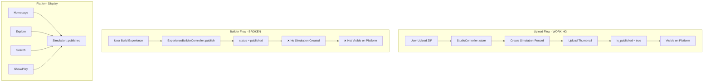
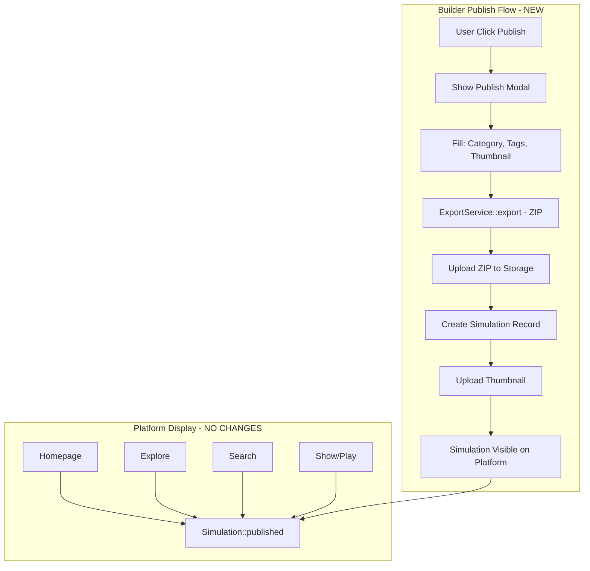
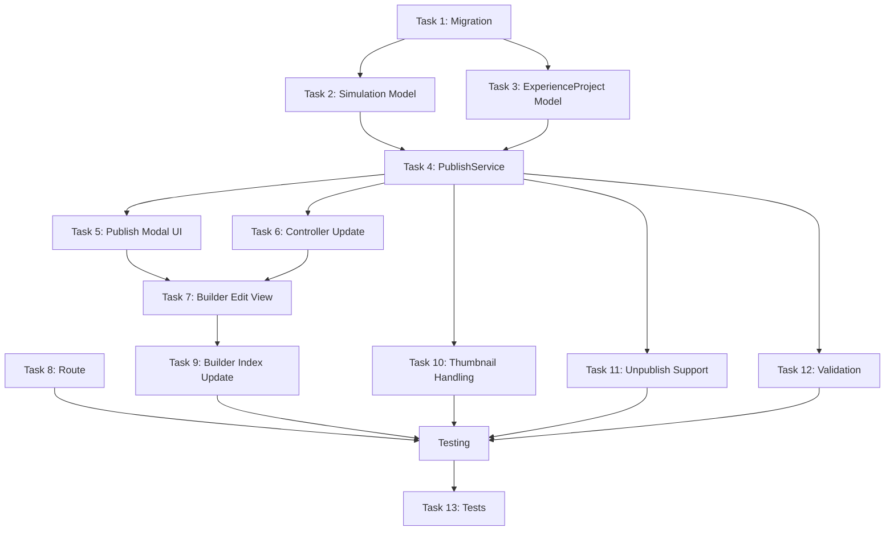

# Plan V10: Builder → Simulation Integration

## Latar Belakang

### Masalah
Experience Builder dan Simulation System adalah dua sistem konten terpisah yang tidak terhubung:

- **Experience Builder** membuat `ExperienceProject` (JSON config, 5 komponen: text, slider, chart, image, quiz)
- **Simulation System** menggunakan model `Simulation` (ZIP file, thumbnail, metadata lengkap)
- Saat user publish dari Builder, hanya `status='published'` di ExperienceProject yang diupdate
- TIDAK ada: pembuatan Simulation record, upload thumbnail, public view route, atau integrasi platform

### dampak
- Konten Builder tidak muncul di Homepage, Explore, Search, atau halaman publik mana pun
- Tidak ada cara untuk user lain memainkan experience yang dibuat di Builder
- Tidak ada thumbnail, category, tags untuk konten Builder

### Arsitektur Saat Ini



## Solusi: Bridge Builder → Simulation

### Konsep
Setiap kali user publish dari Builder:
1. Export project ke ZIP (sudah ada via ExportService)
2. Upload ZIP ke storage (sudah ada infrastrukturnya)
3. Buat Simulation record (bridge ke sistem yang sudah ada)
4. Upload thumbnail (opsional, bisa auto-generate)
5. Simulation langsung visible di seluruh platform

### Arsitektur Setelah Integrasi



## Task List

### Task 1: Migration - Add experience_project_id to simulations ⚡ RINGAN

Tambahkan kolom `experience_project_id` sebagai nullable FK ke tabel `simulations` untuk melacak asal Builder.

**File:** `database/migrations/YYYY_MM_DD_add_experience_project_id_to_simulations.php`

**Schema:**
```
- experience_project_id: foreignId, nullable, constrained, cascadeOnDelete
- Index: index on experience_project_id
```

**Catatan:** Kolom nullable karena simulasi yang di-upload manual (bukan dari Builder) tidak punya experience_project_id.

---

### Task 2: Update Simulation Model - Add relationship ⚡ RINGAN

Tambahkan relationship `experienceProject()` ke model `Simulation`.

**File:** `app/Models/Simulation.php`

**Perubahan:**
- Tambah `experience_project_id` ke `$fillable`
- Tambah `BelongsTo` relationship ke ExperienceProject
- Tambah scope `scopeBuilderExperiences($query)` untuk filter simulasi dari Builder

---

### Task 3: Update ExperienceProject Model - Add relationship ⚡ RINGAN

Tambahkan relationship `simulation()` ke model ExperienceProject.

**File:** `app/Models/ExperienceProject.php`

**Perubahan:**
- Tambah `HasOne` relationship ke Simulation
- Tambah method `hasSimulation(): bool` untuk cek apakah sudah bridge
- Tambah method `getSimulationUrl(): ?string` untuk dapat URL publik

---

### Task 4: Create PublishService for Builder → Simulation Bridge 🔶 SEDANG

Buat service baru yang menghandle seluruh flow publish dari Builder ke Simulation.

**File:** `app/Services/Builder/PublishService.php`

**Responsibilitas:**
```php
class PublishService
{
    public function publish(ExperienceProject $project, array $metadata): Simulation
    {
        // 1. Export project ke ZIP
        // 2. Upload ZIP ke storage
        // 3. Upload thumbnail (jika ada)
        // 4. Buat Simulation record
        // 5. Generate thumbnail variants
        // 6. Return Simulation
    }
}
```

**Input $metadata:**
```
- category: string (required)
- subcategory: ?string
- tags: ?string (comma-separated)
- description: ?string
- thumbnail: ?UploadedFile
```

---

### Task 5: Create Publish Modal Component 🔶 SEDANG

Buat Blade component untuk modal publish yang muncul saat user klik "Publish" di Builder.

**File:** `resources/views/components/publish-modal.blade.php`

**UI:**
```
┌─────────────────────────────────────────┐
│  Publish Experience                      │
├─────────────────────────────────────────┤
│  [Preview Thumbnail]                    │
│  [Upload/Change Thumbnail]              │
│                                         │
│  Category: [Dropdown - required]        │
│  Subcategory: [Input - optional]        │
│  Tags: [Input - comma separated]        │
│  Description: [Textarea - optional]     │
│                                         │
│  [Cancel]  [Publish →]                  │
└─────────────────────────────────────────┘
```

**Tech:** Alpine.js untuk modal toggle, form submission via POST

---

### Task 6: Update ExperienceBuilderController::publish() 🔶 SEDANG

Update method publish untuk menggunakan PublishService dan return ke publish modal.

**File:** `app/Http/Controllers/ExperienceBuilderController.php`

**Perubahan:**
- `publish()` → render view dengan publish modal
- `publishConfirm(ExperienceProject $project, Request $request)` → new method, handle form submission

---

### Task 7: Update Builder Edit View - Add Publish Button ⚡ RINGAN

Tambahkan tombol "Publish" di toolbar Builder yang membuka publish modal.

**File:** `resources/views/studio/builder/edit.blade.php`

**Perubahan:**
- Tambah tombol "Publish" di toolbar (hanya jika status != published)
- Tambah `<x-publish-modal>` component
- Handle form submission

---

### Task 8: Add Public View Route for Builder Experiences ⚡ RINGAN

Tambahkan route untuk melihat experience Builder secara publik.

**File:** `routes/web.php`

**Perubahan:**
- Tambah route `GET /experience/{slug}` → `ExperienceBuilderController::showPublic`
- Atau gunakan route existing `GET /sim/{slug}` (karena Simulation sudah dibuat)

**Rekomendasi:** Gunakan route existing `/sim/{slug}` karena Simulation record sudah dibuat. Tidak perlu route baru.

---

### Task 9: Update Builder Index View - Show Published Status ⚡ RINGAN

Tampilkan status "Published to Platform" di halaman index Builder.

**File:** `resources/views/studio/builder/index.blade.php`

**Perubahan:**
- Tampilkan badge "Published" jika project sudah punya Simulation
- Tampilkan link ke halaman publik (`/sim/{slug}`)

---

### Task 10: Handle Thumbnail Upload in PublishService 🔶 SEDANG

Implementasi upload dan generate thumbnail variants.

**File:** `app/Services/Builder/PublishService.php`

**Logic:**
```php
private function handleThumbnail(ExperienceProject $project, ?UploadedFile $file): string
{
    if ($file) {
        // Upload uploaded file
        $path = $file->store('simulations/thumbnails', 'public');
    } else {
        // Auto-generate: use first image component or default
        $path = $this->autoGenerateThumbnail($project);
    }

    // Generate variants (small, medium, large)
    $this->thumbnailService->generateVariants($path);

    return $path;
}
```

---

### Task 11: Add Unpublish/Re-publish Support 🔶 SEDANG

Handle unpublish dan re-publish dengan update Simulation record.

**File:** `app/Services/Builder/PublishService.php`

**Methods:**
```php
public function unpublish(ExperienceProject $project): void
{
    // Update Simulation: is_published = false
    // Atau delete Simulation record
}

public function republish(ExperienceProject $project, array $metadata): Simulation
{
    // Update existing Simulation record
    // Re-upload ZIP jika config berubah
}
```

---

### Task 12: Add Validation & Error Handling ⚡ RINGAN

Validasi input publish dan handle error cases.

**File:** `app/Services/Builder/PublishService.php`

**Validasi:**
- Category wajib diisi
- Project harus punya minimal 1 komponen
- Thumbnail optional (auto-generate jika tidak ada)

**Error Handling:**
- ZIP export gagal → return error
- Upload gagal → return error
- Simulation creation gagal → rollback ZIP

---

### Task 13: Add Tests for Builder → Simulation Flow 🔶 SEDANG

Buat Pest test untuk flow publish.

**File:** `tests/Feature/BuilderPublishTest.php`

**Test Cases:**
```php
- test_publish_creates_simulation_record
- test_publish_uploads_zip_file
- test_publish_sets_correct_category
- test_publish_generates_thumbnail_variants
- test_publish_makes_simulation_visible_on_platform
- test_unpublish_hides_simulation
- test_republish_updates_simulation
```

---

## Diagram Alur Eksekusi



## File yang Dibuat

1. `database/migrations/YYYY_MM_DD_add_experience_project_id_to_simulations.php`
2. `app/Services/Builder/PublishService.php`
3. `resources/views/components/publish-modal.blade.php`
4. `tests/Feature/BuilderPublishTest.php`

## File yang Diubah

1. `app/Models/Simulation.php` - Tambah relationship + fillable
2. `app/Models/ExperienceProject.php` - Tambah relationship + helper methods
3. `app/Http/Controllers/ExperienceBuilderController.php` - Update publish method
4. `resources/views/studio/builder/edit.blade.php` - Tambah publish button
5. `resources/views/studio/builder/index.blade.php` - Tambah status badge
6. `routes/web.php` - Tambah route (opsional)

## Verifikasi

### Functional Testing
1. [ ] User bisa publish dari Builder
2. [ ] Publish modal muncul dengan form lengkap
3. [ ] Simulation record terbuat setelah publish
4. [ ] ZIP file ter-upload ke storage
5. [ ] Thumbnail ter-upload (atau auto-generate)
6. [ ] Simulation muncul di Homepage
7. [ ] Simulation muncul di Explore
8. [ ] Simulation bisa di-search
9. [ ] Simulation bisa di-view di `/sim/{slug}`
10. [ ] Simulation bisa di-play
11. [ ] User bisa unpublish
12. [ ] User bisa re-publish dengan perubahan

### Edge Cases
1. [ ] Publish tanpa thumbnail → auto-generate
2. [ ] Publish project kosong (0 komponen) → tolak
3. [ ] Re-publish setelah edit config → update ZIP
4. [ ] Delete project → delete Simulation (cascade)

## Risiko & Mitigasi

| Risiko | Mitigasi |
|--------|----------|
| ZIP export lambat | Gunakan queue job untuk export async |
| Thumbnail generation lambat | Gunakan queue job untuk generate variants |
| Storage penuh | Validasi ukuran ZIP sebelum upload |
| Slug conflict | Gunakan unique slug generation (sudah ada di Model) |
| Publish tanpa category | Validasi category wajib diisi di modal |

## Estimasi

- **Total Tasks:** 13
- **Ringan (⚡):** 6 tasks
- **Sedang (🔶):** 7 tasks
- **Complexity:** Medium - Menggunakan existing infrastructure sebanyak mungkin
- **Dependencies:** ExportService, ThumbnailService (sudah ada)
