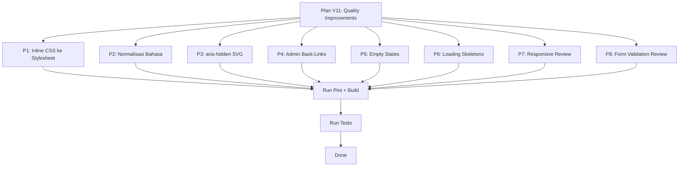

# Plan V11: Quality Improvements & Bug Fixes (Revisi)

## Ringkasan Eksplorasi

Setelah eksplorasi menyeluruh terhadap seluruh kode (routing, controllers, views, models, migrations, JS, CSS), berikut temuan utama:

### ✅ Sudah Baik (Tidak Perlu Diubah)
- **Layout konsisten**: Semua view publik pakai `<x-app-layout>`, studio pakai `<x-studio-layout>`, admin pakai `<x-app-layout>` + header slot
- **CSRF protection**: Semua form sudah ada `@csrf`
- **Dark mode**: Diterapkan konsisten di semua halaman
- **Responsive grid**: Pola `grid-cols-1 sm:grid-cols-2 lg:grid-cols-3 xl:grid-cols-4` konsisten
- **Breadcrumbs**: Sudah ada di semua halaman publik utama (via `<x-breadcrumb>` component)
- **SEO Global**: `SeoComposer` + `app.blade.php` sudah handle meta tags, OG, Twitter cards, canonical URL untuk semua halaman. Admin bisa manage via SEO panel.
- **Accessibility**: Skip-to-content, aria-label pada tombol utama, min touch targets 44px
- **Toast & Confirm Modal**: Sistem global via `app.js` sudah solid
- **Performance**: Plan-v8 (thumbnail variants, async jobs, DB indexes) sudah diimplementasi
- **Builder Integration**: Plan-v10 (experience_project_id, PublishService) sudah diimplementasi
- **Studio nav**: Sidebar navigation sudah cukup (breadcrumb tidak diperlukan)
- **Admin nav**: Header slot dengan back-link sudah cukup untuk admin detail pages
- **Landing page**: Standalone HTML dengan SEO, dark mode, aksesibilitas

### 🔧 Perlu Diperbaiki / Ditingkatkan

---

## Prioritas 1: Pindahkan Inline CSS ke Stylesheet ⚡ RINGAN

**Masalah**: [`landing.blade.php`](resources/views/landing.blade.php:32) memiliki blok `<style>` inline dengan 4 rule CSS yang seharusnya ada di stylesheet global.

**CSS yang perlu dipindahkan**:
```css
.simulation-card:hover .thumbnail-overlay { opacity: 1; }
.simulation-card:hover img { transform: scale(1.05); }
.category-pill:hover { background-color: #2563eb; color: white; }
.hero-gradient { background: linear-gradient(135deg, #1e3a5f 0%, #0f172a 50%, #1e293b 100%); }
```

**File yang diubah**:
- [`resources/views/landing.blade.php`](resources/views/landing.blade.php:32) — hapus blok `<style>` (baris 32-39)
- [`resources/css/app.css`](resources/css/app.css:129) — tambahkan 4 rule CSS di akhir file

**Catatan**: `.simulation-card` juga digunakan di component [`simulation-card.blade.php`](resources/views/components/simulation-card.blade.php:1), jadi styling di app.css akan berlaku global (benar).

---

## Prioritas 2: Normalisasi Bahasa Builder Publish ⚡ RINGAN

**Masalah**: [`studio/builder/publish.blade.php`](resources/views/studio/builder/publish.blade.php:18) menggunakan bahasa English ("Publish Experience", "Make your experience available..."), sementara seluruh studio pages lainnya menggunakan bahasa Indonesia.

**File yang diubah**:
- [`resources/views/studio/builder/publish.blade.php`](resources/views/studio/builder/publish.blade.php:1) — terjemahkan semua teks English ke Indonesia

**Teks yang perlu diterjemahkan** (contoh):
| English (Saat Ini) | Indonesia (Target) |
|---|---|
| Publish Experience | Publikasikan Experience |
| Make your experience available on the platform... | Jadikan experience Anda tersedia di platform... |
| This experience is published on the platform. | Experience ini sudah dipublikasikan di platform. |
| View on platform → | Lihat di platform → |
| (dan teks English lainnya di file yang sama) | |

---

## Prioritas 3: Tambahkan aria-hidden pada Decorative SVG Icons ⚡ RINGAN

**Masalah**: Search `aria-hidden` di seluruh views menghasilkan 0 results. Decorative SVG icons (chevron, arrow, search icon) seharusnya memiliki `aria-hidden="true"` agar screen readers mengabaikannya.

**File yang diubah**:
- [`resources/views/components/app-header.blade.php`](resources/views/components/app-header.blade.php:1) — tambahkan `aria-hidden="true"` pada decorative SVG (chevron, search, menu icons)
- [`resources/views/components/app-footer.blade.php`](resources/views/components/app-footer.blade.php:1) — tambahkan `aria-hidden="true"` pada decorative SVG
- [`resources/views/layouts/app.blade.php`](resources/views/layouts/app.blade.php:1) — tambahkan `aria-hidden="true"` pada decorative SVG jika ada

**Approach**: Hanya tambahkan `aria-hidden="true"` pada SVG yang murni dekoratif. SVG yang memiliki `aria-label` atau berfungsi sebagai ikon tombol TIDAK perlu diubah.

---

## Prioritas 4: Konsistensi Back-Link pada Admin Detail Pages ⚡ RINGAN

**Masalah**: Beberapa admin detail pages sudah memiliki back-link di header, tapi beberapa belum. Pola yang sudah ada:
- [`admin/users/show.blade.php`](resources/views/admin/users/show.blade.php:8) — punya `? Kembali` link
- [`admin/creators/show.blade.php`](resources/views/admin/creators/show.blade.php:8) — punya `← Kembali` link
- [`admin/challenges/show.blade.php`](resources/views/admin/challenges/show.blade.php:4) — punya back arrow

**File yang perlu dicek & diperbaiki**:
- `resources/views/admin/creator-ads/show.blade.php`
- `resources/views/admin/payouts/show.blade.php`
- `resources/views/admin/reports/show.blade.php`
- `resources/views/admin/scans/show.blade.php`
- `resources/views/admin/logs/show.blade.php`
- `resources/views/admin/marketplace/show.blade.php`
- `resources/views/admin/sponsors/show.blade.php`
- `resources/views/admin/sponsorships/show.blade.php`

**Approach**: Pastikan semua admin show pages memiliki back-link yang konsisten ke parent index page. Pola: `← Kembali` atau arrow icon + link ke index.

---

## Prioritas 5: Tambahkan Empty State pada Studio Pages 🔶 SEDANG

**Masalah**: Beberapa studio pages mungkin tidak memiliki empty state yang informatif ketika tidak ada data.

**File yang perlu dicek & diperbaiki**:
- `resources/views/studio/simulations.blade.php` — cek apakah ada empty state untuk 0 simulasi
- `resources/views/studio/comments.blade.php` — cek apakah ada empty state untuk 0 komentar
- `resources/views/studio/followers.blade.php` — cek apakah ada empty state untuk 0 followers
- `resources/views/studio/ads.blade.php` — cek apakah ada empty state untuk 0 iklan

**Approach**: Tambahkan empty state yang konsisten dengan icon, pesan informatif, dan CTA (misal: "Upload simulasi pertama Anda" atau "Belum ada komentar").

---

## Prioritas 6: Tambahkan Loading Skeleton pada Halaman Publik 🔶 SEDANG

**Masalah**: Beberapa halaman publik belum memiliki loading skeleton untuk UX yang lebih baik saat data masih dimuat.

**File yang perlu dicek & diperbaiki**:
- `resources/views/collections/index.blade.php` — cek apakah sudah ada skeleton
- `resources/views/collections/show.blade.php` — cek apakah sudah ada skeleton
- `resources/views/leaderboard/index.blade.php` — cek apakah sudah ada skeleton
- `resources/views/leaderboard/creators.blade.php` — cek apakah sudah ada skeleton
- `resources/views/forum/index.blade.php` — cek apakah sudah ada skeleton

**Approach**: Gunakan pola skeleton loading yang sudah ada di [`user-profile/index.blade.php`](resources/views/user-profile/index.blade.php:1) sebagai referensi.

---

## Prioritas 7: Review Responsive Mobile Simulation Show 🔶 SEDANG

**Masalah**: Review sticky player pada layar kecil di [`simulations/show.blade.php`](resources/views/simulations/show.blade.php:1) (894 baris).

**File yang diubah**:
- `resources/views/simulations/show.blade.php`

**Approach**: Review sticky player behavior pada mobile (screen width < 640px). Pastikan:
- Player tidak terlalu besar di mobile
- Sticky behavior tidak menghalangi konten
- Touch targets cukup besar (min 44px)
- Fullscreen button accessible di mobile

---

## Prioritas 8: Review Form Validation Feedback 🔶 SEDANG

**Masalah**: Review konsistensi error messages dan success states di seluruh form.

**Approach**: 
- Cek apakah semua form menggunakan validasi server-side yang konsisten
- Pastikan error messages ditampilkan dengan pola yang sama
- Cek apakah success states (setelah submit) konsisten

---

## Flow Eksekusi



## File yang Diubah (Estimasi)

### Prioritas 1: CSS (2 files)
- `resources/views/landing.blade.php`
- `resources/css/app.css`

### Prioritas 2: Language (1 file)
- `resources/views/studio/builder/publish.blade.php`

### Prioritas 3: Accessibility (3 files)
- `resources/views/components/app-header.blade.php`
- `resources/views/components/app-footer.blade.php`
- `resources/views/layouts/app.blade.php`

### Prioritas 4: Admin Back-Links (up to 8 files)
- `resources/views/admin/creator-ads/show.blade.php`
- `resources/views/admin/payouts/show.blade.php`
- `resources/views/admin/reports/show.blade.php`
- `resources/views/admin/scans/show.blade.php`
- `resources/views/admin/logs/show.blade.php`
- `resources/views/admin/marketplace/show.blade.php`
- `resources/views/admin/sponsors/show.blade.php`
- `resources/views/admin/sponsorships/show.blade.php`

### Prioritas 5: Empty States (up to 4 files)
- `resources/views/studio/simulations.blade.php`
- `resources/views/studio/comments.blade.php`
- `resources/views/studio/followers.blade.php`
- `resources/views/studio/ads.blade.php`

### Prioritas 6: Skeletons (up to 5 files)
- `resources/views/collections/index.blade.php`
- `resources/views/collections/show.blade.php`
- `resources/views/leaderboard/index.blade.php`
- `resources/views/leaderboard/creators.blade.php`
- `resources/views/forum/index.blade.php`

### Prioritas 7: Responsive (1 file)
- `resources/views/simulations/show.blade.php`

**Total: ~24 files (beberapa file diakses oleh beberapa prioritas)**

## Catatan Penting
- **Production database TIDAK boleh diubah** — semua perubahan hanya pada views, CSS, JS
- Semua perubahan adalah **frontend only** (views, CSS, JS)
- Tidak ada perubahan controller, model, atau migration
- **SEO sudah ditangani global** oleh SeoComposer — tidak perlu tambah meta tags manual per view
- **Admin breadcrumb tidak diperlukan** — back-link pattern sudah cukup untuk admin panel
- Run `vendor/bin/pint --dirty --format agent` setelah perubahan PHP
- Run `npm run build` setelah perubahan CSS/JS
