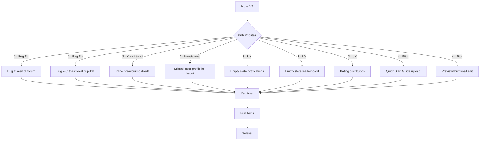

# Rencana Kerja V3 — Audit & Perbaikan NotEDS Simulation

> **Tanggal:** 24 Juli 2026
> **Berdasarkan:** Audit menyeluruh terhadap seluruh codebase setelah V1 (14 task) & V2 (16 task) selesai

---

## Status Sebelumnya

- V1 Plan (14 task): ✅ Semua selesai
- V2 Plan (16 task): ✅ Semua selesai
- View/Play Tracking Dedup: ✅ Sudah diimplementasi dengan benar
- Toast Notification System: ✅ Sudah terintegrasi
- Sponsorship System: ✅ Sudah ada di admin

---

## Temuan Audit V3

### 🔴 Bug (Harus Diperbaiki)

#### Bug 1: `alert()` di forum vote handler
- **File:** [`resources/views/forum/show.blade.php`](resources/views/forum/show.blade.php:216)
- **Masalah:** Baris 216 & 219 masih menggunakan `alert()` untuk error handling
- **Impact:** UX buruk — browser native alert sangat mengganggu
- **Fix:** Ganti `alert()` dengan `window.showToast(data.message, 'error')`

#### Bug 2: Toast lokal di admin logs (duplikat fungsi)
- **File:** [`resources/views/admin/logs/index.blade.php`](resources/views/admin/logs/index.blade.php:302)
- **Masalah:** Baris 302 mendefinisikan fungsi `showToast()` lokal sendiri, padahal sudah ada global `window.showToast()`
- **Impact:** Kode duplikat, perilaku bisa tidak konsisten
- **Fix:** Hapus fungsi lokal `showToast()`, gunakan `window.showToast()`

#### Bug 3: Toast lokal di admin logs show (duplikat fungsi)
- **File:** [`resources/views/admin/logs/show.blade.php`](resources/views/admin/logs/show.blade.php:203)
- **Masalah:** Baris 203 mendefinisikan fungsi `showToast()` lokal sendiri via custom event
- **Impact:** Kode duplikat, perilaku bisa tidak konsisten
- **Fix:** Hapus fungsi lokal, gunakan `window.showToast()`

### 🟠 Inkonsistensi View

#### Inkonsistensi 1: Breadcrumb inline di collections/edit
- **File:** [`resources/views/collections/edit.blade.php`](resources/views/collections/edit.blade.php:13)
- **Masalah:** Menggunakan inline `<nav>` breadcrumb (baris 13-17) bukan komponen `<x-breadcrumb>`
- **Impact:** Tampilan breadcrumb tidak konsisten dengan halaman lain
- **Fix:** Ganti dengan `<x-breadcrumb :items="[...]" />`

#### Inkonsistensi 2: `user-profile/index.blade.php` masih standalone HTML
- **File:** [`resources/views/user-profile/index.blade.php`](resources/views/user-profile/index.blade.php:1)
- **Masalah:** Masih menggunakan standalone HTML dengan `@include('components.app-header')` dan footer manual
- **Impact:** Kehilangan fitur dari `<x-app-layout>` seperti back-to-top button, toast flash messages
- **Catatan:** SEO sudah benar (`noindex, nofollow`), tapi layout perlu dimigrasi
- **Fix:** Migrasi ke `<x-app-layout>` dengan custom head untuk SEO override

### 🟡 UX Improvements (Ringan)

#### UX 1: Empty state untuk notifications kosong
- **File:** [`resources/views/notifications/index.blade.php`](resources/views/notifications/index.blade.php:24)
- **Masalah:** Ketika `$notifications->count() == 0`, tidak ada empty state yang ditampilkan
- **Fix:** Tambahkan empty state dengan ilustrasi SVG + pesan "Belum ada notifikasi"

#### UX 2: Empty state untuk leaderboard kosong
- **File:** [`resources/views/leaderboard/index.blade.php`](resources/views/leaderboard/index.blade.php:57)
- **Masalah:** Ketika `$leaderboard->count() == 0`, tidak ada empty state
- **Fix:** Tambahkan empty state dengan pesan yang sesuai

#### UX 3: Rating summary distribution di studio analytics
- **File:** [`resources/views/studio/analytics.blade.php`](resources/views/studio/analytics.blade.php:1)
- **Masalah:** Belum ada rating distribution breakdown (5★, 4★, 3★, 2★, 1★)
- **Impact:** Creator tidak bisa melihat distribusi rating simulasi mereka
- **Fix:** Tambahkan horizontal bar chart rating distribution

### 🔵 Fitur Ringan Baru

#### Fitur 1: Quick Start Guide di halaman upload studio
- **File:** [`resources/views/studio/create.blade.php`](resources/views/studio/create.blade.php)
- **Deskripsi:** Tambahkan collapsible/accordion guide yang menjelaskan struktur ZIP package, format manifest.json, tips thumbnail, dan checklist sebelum publish
- **Implementasi:** Alpine.js accordion di atas form upload

#### Fitur 2: Preview thumbnail saat edit simulasi
- **File:** [`resources/views/studio/edit.blade.php`](resources/views/studio/edit.blade.php)
- **Deskripsi:** Tampilkan preview thumbnail yang sudah ada saat creator membuka form edit
- **Implementasi:** Tambahkan `` thumbnail di atas form edit

---

## Diagram Alur Prioritas



## Daftar Task (Urutan Eksekusi)

| # | Prioritas | Task | File | Kompleksitas |
|---|-----------|------|------|:---:|
| 1 | 🔴 | Fix `alert()` di forum vote | `forum/show.blade.php` | Sangat Ringan |
| 2 | 🔴 | Hapus toast lokal di admin logs index | `admin/logs/index.blade.php` | Ringan |
| 3 | 🔴 | Hapus toast lokal di admin logs show | `admin/logs/show.blade.php` | Ringan |
| 4 | 🟠 | Ganti inline breadcrumb ke `<x-breadcrumb>` di collections/edit | `collections/edit.blade.php` | Ringan |
| 5 | 🟠 | Migrasi user-profile ke `<x-app-layout>` | `user-profile/index.blade.php` | Sedang |
| 6 | 🟡 | Tambah empty state notifications kosong | `notifications/index.blade.php` | Ringan |
| 7 | 🟡 | Tambah empty state leaderboard kosong | `leaderboard/index.blade.php` | Ringan |
| 8 | 🟡 | Tambah rating distribution di studio analytics | `studio/analytics.blade.php` | Sedang |
| 9 | 🔵 | Quick Start Guide di halaman upload | `studio/create.blade.php` | Ringan |
| 10 | 🔵 | Preview thumbnail saat edit simulasi | `studio/edit.blade.php` | Ringan |

## Rincian Perubahan Per File

### 1. [`resources/views/forum/show.blade.php`](resources/views/forum/show.blade.php:216)

**Sebelum:**
```javascript
} else {
    alert(data.message || 'Gagal memberikan vote.');
}
})
.catch(() => alert('Terjadi kesalahan.'));
```

**Sesudah:**
```javascript
} else {
    window.showToast(data.message || 'Gagal memberikan vote.', 'error');
}
})
.catch(() => window.showToast('Terjadi kesalahan.', 'error'));
```

### 2. [`resources/views/admin/logs/index.blade.php`](resources/views/admin/logs/index.blade.php:302)

**Hapus** fungsi `showToast()` lokal (baris 302-310), gunakan `window.showToast()` yang sudah global.

### 3. [`resources/views/admin/logs/show.blade.php`](resources/views/admin/logs/show.blade.php:203)

**Hapus** fungsi `showToast()` lokal (baris 203-205), gunakan `window.showToast()` yang sudah global.

### 4. [`resources/views/collections/edit.blade.php`](resources/views/collections/edit.blade.php:13)

**Sebelum:**
```html
<nav class="flex items-center gap-2 text-sm text-gray-500 mb-6" aria-label="Breadcrumb">
    <a href="{{ route('collections.index') }}" class="hover:text-blue-600 transition">Collection</a>
    <span>/</span>
    <span class="text-gray-900 font-medium">{{ Str::limit($collection->title, 40) }}</span>
</nav>
```

**Sesudah:**
```html
<x-breadcrumb :items="[['label' => 'Collection', 'url' => route('collections.index')], ['label' => Str::limit($collection->title, 40)]]" />
```

### 5. [`resources/views/user-profile/index.blade.php`](resources/views/user-profile/index.blade.php:1)

Migrasi dari standalone HTML ke `<x-app-layout>` dengan custom SEO meta tags via slot.

### 6. [`resources/views/notifications/index.blade.php`](resources/views/notifications/index.blade.php:24)

Tambahkan `@else` block dengan empty state setelah `@if($notifications->count() > 0)`.

### 7. [`resources/views/leaderboard/index.blade.php`](resources/views/leaderboard/index.blade.php:57)

Tambahkan `@else` block dengan empty state setelah `@if($leaderboard->count() > 0)`.

### 8. [`resources/views/studio/analytics.blade.php`](resources/views/studio/analytics.blade.php:1)

Tambahkan section Rating Distribution dengan horizontal bar chart di bawah summary cards.

### 9. [`resources/views/studio/create.blade.php`](resources/views/studio/create.blade.php)

Tambahkan collapsible Quick Start Guide di atas form upload.

### 10. [`resources/views/studio/edit.blade.php`](resources/views/studio/edit.blade.php)

Tambahkan preview thumbnail di atas form edit.

---

## Catatan

- Task 1-3 adalah bug fix yang sangat ringan (ganti 1-2 baris kode)
- Task 4-5 adalah konsistensi layout (pattern yang sudah ada)
- Task 6-7 adalah empty state (pattern yang sudah ada di halaman lain)
- Task 8-10 adalah fitur ringan yang meningkatkan UX
- Semua task mengikuti konvensi kode yang sudah ada di proyek
