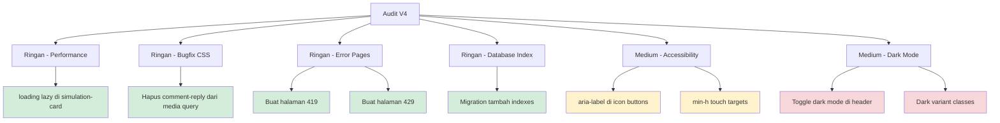

# Rencana Kerja V4 — Performance, UX & Accessibility Audit

## Status Sebelumnya

- ✅ V1: 14 task ringan — SELESAI
- ✅ V2: 16 task (2 bug, 10 layout migration, 4 UX) — SELESAI
- ✅ V3: 10 task (3 bug, 2 inkonsistensi, 3 UX, 2 fitur) — SELESAI

## Temuan Audit V4

Dari audit menyeluruh terhadap FEATURES.md dan seluruh codebase, ditemukan task-task baru yang belum terselesaikan.

---

## Diagram Alur Prioritas

---

## Daftar Task (Urutan Eksekusi)

### Task 1: Tambahkan `loading="lazy"` di simulation-card thumbnail ⚡ RINGAN

**File:** [`resources/views/components/simulation-card.blade.php`](resources/views/components/simulation-card.blade.php:9)

**Masalah:** Thumbnail `` di simulation-card tidak memiliki `loading="lazy"`. Padahal komponen ini digunakan di 18+ lokasi (landing, explore, category, user-profile, creators/show). Ini adalah Core Web Vital optimization yang disebutkan di FEATURES.md section 20.

**Perubahan:**
- Tambahkan `loading="lazy"` pada `` thumbnail (line 12)
- Tambahkan `loading="lazy"` pada `` creator avatar (line 42)

**Impact:** Mengurangi initial page load di halaman dengan banyak simulation cards.

---

### Task 2: Hapus CSS `.comment-reply` dari `prefers-reduced-motion` media query ⚡ RINGAN

**File:** [`resources/css/app.css`](resources/css/app.css:98)

**Masalah:** Rules `.comment-reply { display: none; }` dan `.comment-reply.show { display: block; }` secara salah ditempatkan di dalam `@media (prefers-reduced-motion: reduce)` block. Rules ini sudah benar di [`resources/views/simulations/show.blade.php`](resources/views/simulations/show.blade.php:108) (di dalam `<style>` tag). Rules di `app.css` seharusnya ada di luar media query, atau dihapus karena sudah ada di view.

**Perubahan:**
- Hapus baris 98-105 dari `app.css` (rules `.comment-reply` di dalam media query)

**Impact:** Memperbaiki bug di mana comment reply toggle bisa tidak berfungsi jika CSS dari app.css di-load sebelum inline style di show.blade.php.

---

### Task 3: Buat halaman error 419 Page Expired ⚡ RINGAN

**File baru:** `resources/views/errors/419.blade.php`

**Masalah:** FEATURES.md section 18 (line 2454) menspesifikasikan halaman 419 kustom dengan pesan session expired dan redirect ke halaman sebelumnya. Saat ini hanya ada 403, 404, 500.

**Perubahan:**
- Buat `419.blade.php` mengikuti pola desain error page yang ada
- Pesan: "Session kamu sudah habis. Silakan muat ulang halaman."
- Tombol: "Muat Ulang" (`history.back()`) + "Kembali ke Beranda"

---

### Task 4: Buat halaman error 429 Too Many Requests ⚡ RINGAN

**File baru:** `resources/views/errors/429.blade.php`

**Masalah:** FEATURES.md section 18 (line 2455) menspesifikasikan halaman 429 kustom dengan pesan rate limit.

**Perubahan:**
- Buat `429.blade.php` mengikuti pola desain error page yang ada
- Pesan: "Terlalu banyak permintaan. Silakan tunggu beberapa saat sebelum mencoba lagi."
- Tombol: "Coba Lagi" (`location.reload()`) + "Kembali ke Beranda"

---

### Task 5: Tambahkan missing database indexes via migration ⚡ RINGAN

**File baru:** `database/migrations/2026_07_24_XXXXXX_add_missing_indexes_to_simulations_table.php`

**Masalah:** FEATURES.md section 20 (lines 2684-2696) menspesifikasikan indexes yang dibutuhkan. Saat ini simulations table hanya punya index di: `slug` (unique), `category`, `is_published`, `is_featured`, `play_count`, `created_at`. Missing indexes:
- `user_id` — untuk query by creator
- `subcategory` — untuk filter subkategori
- `published_at` — untuk sort by publish date
- `view_count` — untuk sort by popularity
- `average_rating` — untuk sort by rating

**Perubahan:**
- Buat migration baru dengan `Schema::table('simulations', ...)` untuk menambahkan indexes yang missing

**Impact:** Meningkatkan performa query di halaman explore, search, dan creator profile.

---

### Task 6: Tambahkan `aria-label` pada icon-only buttons di app-header ⚡ RINGAN-MEDIUM

**File:** [`resources/views/components/app-header.blade.php`](resources/views/components/app-header.blade.php:64)

**Masalah:** FEATURES.md section 17B.E (lines 2342-2343) mensyaratkan `aria-label` pada ikon interaktif. Saat ini `aria-label` hanya ada di breadcrumb dan ad-banner. Icon buttons di header tidak punya `aria-label`:
- Search submit button (line 64)
- User dropdown button (line 116)
- Hamburger menu button (line 164)

**Perubahan:**
- Tambahkan `aria-label="Cari"` pada search button
- Tambahkan `aria-label="Menu pengguna"` pada user dropdown
- Tambahkan `aria-label="Menu navigasi"` pada hamburger button

---

### Task 7: Tambahkan `min-h-[44px]` touch targets di app-header ⚡ RINGAN

**File:** [`resources/views/components/app-header.blade.php`](resources/views/components/app-header.blade.php:6)

**Masalah:** FEATURES.md section 17B.D.3 (line 2248) mensyaratkan minimum touch target 44px untuk mobile accessibility. Beberapa elemen di header mungkin lebih kecil dari 44px.

**Perubahan:**
- Tambahkan `min-h-[44px]` pada nav links, buttons, dan interactive elements di header

---

### Task 8: Tambahkan dark mode toggle di app-header 🔶 MEDIUM

**File:** [`resources/views/components/app-header.blade.php`](resources/views/components/app-header.blade.php:110)

**Masalah:** FEATURES.md section 17B.H (lines 2389-2407) menspesifikasikan dark mode dengan toggle di navigasi, preferensi di localStorage, dan respect `prefers-color-scheme`. Saat ini tidak ada dark mode toggle di aplikasi.

**Perubahan:**
- Tambahkan tombol toggle dark/light mode di antara search bar dan user menu
- Gunakan Alpine.js `x-data` untuk state management
- Simpan preferensi di `localStorage`
- Respect `prefers-color-scheme` sebagai default
- Tambahkan class `dark` ke `<html>` element via JS

**Note:** Ini hanya toggle mechanism. Task terpisah untuk menambahkan `dark:` classes ke semua komponen UI.

---

### Task 9: Tambahkan `dark:` variant classes ke komponen utama 🔶 MEDIUM

**Files:**
- [`resources/views/components/app-header.blade.php`](resources/views/components/app-header.blade.php:4)
- [`resources/views/components/simulation-card.blade.php`](resources/views/components/simulation-card.blade.php:4)
- [`resources/views/layouts/app.blade.php`](resources/views/layouts/app.blade.php:1)

**Masalah:** Dark mode toggle (Task 8) tidak akan berfungsi tanpa `dark:` classes di komponen UI. FEATURES.md section 17B.H memberikan mapping lengkap light/dark tokens.

**Perubahan:**
- Tambahkan `dark:` classes sesuai spesifikasi di FEATURES.md ke:
  - Navigation bar (bg, border, text colors)
  - Simulation card (bg, shadow, text colors)
  - App layout (background)

---

### Task 10: Tambahkan keyboard shortcuts (/ untuk search, Esc untuk close) 🔶 MEDIUM

**File:** [`resources/views/components/app-header.blade.php`](resources/views/components/app-header.blade.php:4)

**Masalah:** FEATURES.md section 22.C (lines 2782-2787) merekomendasikan keyboard shortcuts:
- `/` — Focus search bar
- `Esc` — Close modal/overlay

**Perubahan:**
- Tambahkan `@keydown.window` handler di Alpine.js `x-data`
- `/` key → focus search input
- `Esc` key → close search dropdown, close mobile menu

---

## Ringkasan

| # | Task | Kategori | Kompleksitas |
|:--|:-----|:---------|:-------------|
| 1 | `loading="lazy"` di simulation-card | Performance | ⚡ Ringan |
| 2 | Hapus CSS `.comment-reply` dari media query | Bugfix | ⚡ Ringan |
| 3 | Halaman error 419 | Error Pages | ⚡ Ringan |
| 4 | Halaman error 429 | Error Pages | ⚡ Ringan |
| 5 | Missing database indexes | Performance | ⚡ Ringan |
| 6 | `aria-label` di icon buttons | Accessibility | ⚡ Ringan |
| 7 | `min-h-[44px]` touch targets | Accessibility | ⚡ Ringan |
| 8 | Dark mode toggle | Dark Mode | 🔶 Medium |
| 9 | Dark variant classes | Dark Mode | 🔶 Medium |
| 10 | Keyboard shortcuts | UX | 🔶 Medium |

## Catatan

- Task 1-7 adalah ringan dan bisa dilakukan dalam satu sesi
- Task 8-10 adalah medium — dark mode memerlukan perubahan di banyak file
- Dark mode (Task 9) sebaiknya dilakukan SETELAH Task 8 (toggle mechanism)
- Semua perubahan harus diuji dengan `php artisan test --compact` dan `vendor/bin/pint --dirty --format agent`
