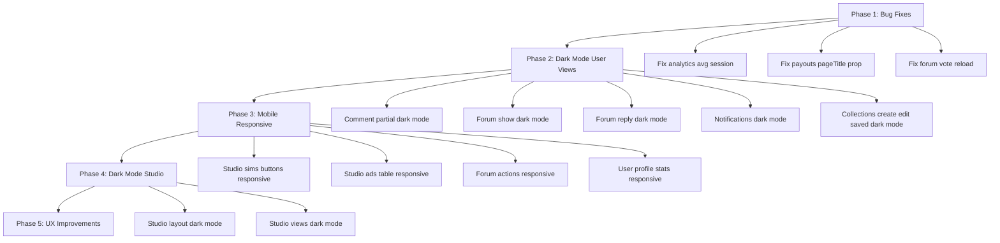

# Plan V5: Bug Fixes, Dark Mode, & Improvements

## Ringkasan Review

Telah dilakukan review menyeluruh terhadap seluruh view, controller, component, dan layout di proyek noteds-simulation. Ditemukan beberapa bug, inkonsistensi dark mode, dan area perbaikan.

---

## Temuan & Rencana Perbaikan

### Kategori 1: Bug Fixes (Ringan)

| # | Temuan | File | Prioritas |
|---|--------|------|-----------|
| 1 | Studio analytics "Avg. Session" menampilkan `Xd` (hari) yang tidak wajar — seharusnya format waktu yang benar | `studio/analytics.blade.php:26` | Tinggi |
| 2 | `studio/payouts.blade.php` menggunakan prop `title` hardcoded bukan `:pageTitle` seperti studio layout lainnya | `studio/payouts.blade.php:1` | Sedang |
| 3 | `forum/show.blade.php` — vote function dispatches event tapi langsung `location.reload()` tanpa menunggu Alpine update | `forum/show.blade.php:214` | Sedang |

### Kategori 2: Dark Mode Inconsistency (Ringan-Sedang)

Banyak view sudah support dark mode, tapi beberapa view/component belum konsisten:

| # | Temuan | File | Status Dark Mode |
|---|--------|------|------------------|
| 4 | Comment partial — semua hardcoded light mode | `simulations/_comment.blade.php` | Belum ada dark mode |
| 5 | Forum show page — thread content, reply form, vote area | `forum/show.blade.php` | Belum ada dark mode |
| 6 | Forum reply component — reply cards, actions | `forum/_reply.blade.php` | Belum ada dark mode |
| 7 | Notifications page — notification items, icons | `notifications/index.blade.php` | Belum ada dark mode |
| 8 | Collections create — form container, labels, inputs | `collections/create.blade.php` | Belum ada dark mode |
| 9 | Collections edit — form containers, labels, inputs | `collections/edit.blade.php` | Belum ada dark mode |
| 10 | Collections saved-index — cards, empty state | `collections/saved-index.blade.php` | Belum ada dark mode |
| 11 | Collections index — header h2 text color | `collections/index.blade.php` | Partial dark mode |
| 12 | Studio layout sidebar — seluruh sidebar belum dark mode | `studio/layouts/app.blade.php` | Belum ada dark mode |
| 13 | Studio views — create, edit, simulations, analytics, comments, followers, settings, ads, payouts, revenue, versions | Semua `studio/*.blade.php` | Belum ada dark mode |

### Kategori 3: Mobile Responsive (Ringan)

| # | Temuan | File | Detail |
|---|--------|------|--------|
| 14 | Studio simulations grid — action buttons row bisa overflow di mobile | `studio/simulations.blade.php:89-105` | Buttons perlu wrap/scroll di mobile |
| 15 | Studio ads table — bisa overflow di mobile kecil | `studio/ads.blade.php:137-181` | Table perlu horizontal scroll |
| 16 | Forum show — admin actions dan thread owner actions bisa overlap di mobile | `forum/show.blade.php:92-134` | Perlu flex-wrap |
| 17 | User profile stats — 5 stats bisa overflow di mobile kecil | `user-profile/index.blade.php:28-49` | Perlu responsive grid |
| 18 | Collection edit — search results bisa overflow di mobile | `collections/edit.blade.php:80-111` | Perlu responsive layout |

### Kategori 4: UX Improvements (Sedang)

| # | Temuan | File | Detail |
|---|--------|------|--------|
| 19 | Forum vote — setelah vote langsung `location.reload()`, tidak smooth | `forum/show.blade.php:214` | Seharusnya update state Alpine tanpa reload |
| 20 | Comment reply form — tidak ada loading state saat submit | `simulations/_comment.blade.php` | Perlu loading indicator |
| 21 | Collections create/edit — tidak ada auto-slug dari title | `collections/create.blade.php` | Nice-to-have |
| 22 | Notification mark as read — redirect ke URL tapi bisa gagal | `notifications/index.blade.php:105-115` | Perlu error handling |

### Kategori 5: Larger Features (Besar)

| # | Temuan | Detail |
|---|--------|--------|
| 23 | Dark mode untuk seluruh Studio section | Perlu update studio layout + semua studio views dengan dark mode classes |
| 24 | Studio simulations — bulk actions (delete, publish, unpublish) | Fitur baru untuk manajemen massal |
| 25 | Forum thread — edit inline / AJAX | Untuk UX yang lebih smooth |

---

## Rencana Eksekusi

### Phase 1: Bug Fixes Ringan (Prioritas Tinggi)
1. Fix studio analytics "Avg. Session" display
2. Fix studio payouts `title` prop ke `:pageTitle`
3. Fix forum vote reload behavior

### Phase 2: Dark Mode — User-Facing Views (Prioritas Tinggi)
4. Add dark mode ke `simulations/_comment.blade.php`
5. Add dark mode ke `forum/show.blade.php`
6. Add dark mode ke `forum/_reply.blade.php`
7. Add dark mode ke `notifications/index.blade.php`
8. Add dark mode ke `collections/create.blade.php`
9. Add dark mode ke `collections/edit.blade.php`
10. Add dark mode ke `collections/saved-index.blade.php`
11. Fix partial dark mode di `collections/index.blade.php`

### Phase 3: Mobile Responsive Fixes (Prioritas Sedang)
12. Fix studio simulations action buttons responsive
13. Fix studio ads table responsive
14. Fix forum show admin/owner actions responsive
15. Fix user profile stats responsive
16. Fix collection edit search responsive

### Phase 4: Dark Mode — Studio Section (Prioritas Sedang)
17. Add dark mode ke `studio/layouts/app.blade.php` (sidebar + header)
18. Add dark mode ke studio views (create, edit, simulations, analytics, comments, followers, settings, ads, payouts, revenue, versions, payment-settings)

### Phase 5: UX Improvements (Prioritas Rendah)
19. Smooth forum vote tanpa page reload
20. Loading state untuk comment reply
21. Error handling untuk notification mark as read

---

## Diagram Alur Eksekusi

---

## Estimasi Scope

- **Phase 1**: 3 files — bug fixes kecil
- **Phase 2**: 7 files — tambah `dark:` Tailwind classes
- **Phase 3**: 5 files — tambah responsive classes
- **Phase 4**: 12+ files — dark mode untuk seluruh studio section
- **Phase 5**: 3 files — UX improvements
