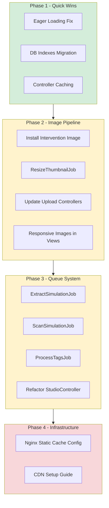
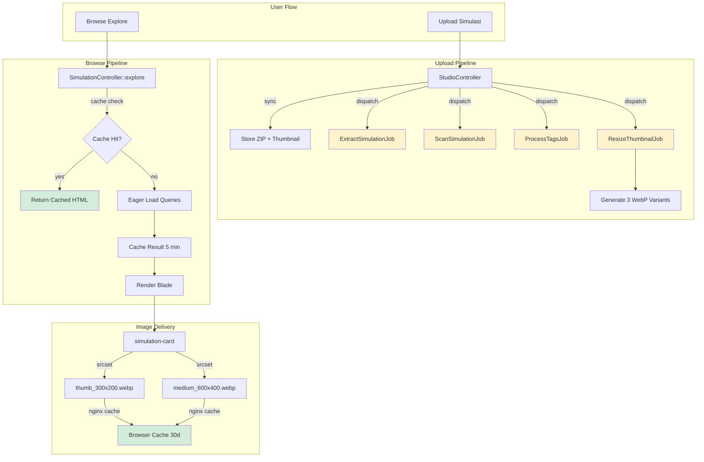
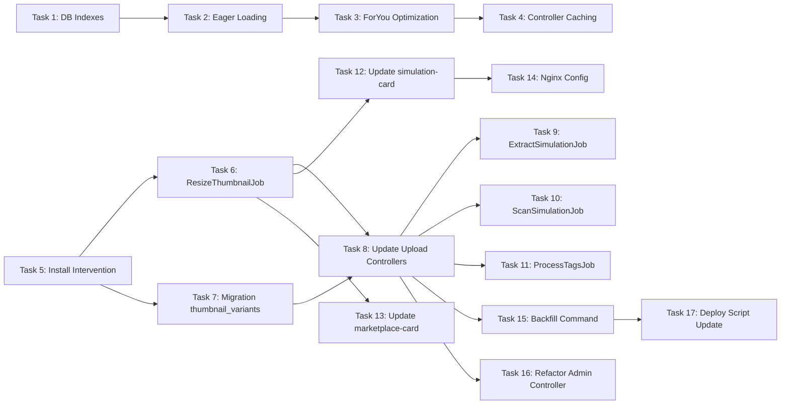

# Plan V8: Performance Optimization — Thumbnail Loading & Upload

> **Tanggal:** 30 Juli 2026
> **Status:** Draft — Menunggu approval user

---

## Background

Noteds.com mengalami masalah performa pada:
1. **Thumbnail loading lambat** — halaman Explore/Landing load 54+ gambar original tanpa kompresi
2. **Upload simulasi lambat** — ZIP extraction + security scan + tag processing semuanya synchronous
3. **Semakin banyak data, semakin lambat** — missing indexes, N+1 queries, tidak ada caching

---

## Temuan Audit

### Kategori 1: Thumbnail / Image Performance

| # | Temuan | File | Severity |
|---|--------|------|----------|
| 1 | Thumbnail diupload tanpa resizing/compression | [`StudioController::store()`](app/Http/Controllers/StudioController.php:194) | 🔴 Tinggi |
| 2 | Tidak ada image processing library (Intervention Image) | `composer.json` | 🔴 Tinggi |
| 3 | Tidak ada responsive images / srcset | [`simulation-card.blade.php`](resources/views/components/simulation-card.blade.php:9) | 🟡 Sedang |
| 4 | Explore page load 54+ gambar original sekaligus | [`SimulationController::explore()`](app/Http/Controllers/SimulationController.php:26) | 🔴 Tinggi |
| 5 | Tidak ada HTTP cache headers untuk thumbnails | Nginx/storage config | 🟡 Sedang |
| 6 | Tidak ada CDN untuk static assets | `.env.production` | 🟡 Sedang |

### Kategori 2: Upload Performance

| # | Temuan | File | Severity |
|---|--------|------|----------|
| 7 | ZIP extraction synchronous dalam HTTP request | [`StudioController::store()`](app/Http/Controllers/StudioController.php:174) | 🔴 Tinggi |
| 8 | Security scan synchronous | [`StudioController::store()`](app/Http/Controllers/StudioController.php:237) | 🔴 Tinggi |
| 9 | Tag processing synchronous (loop DB inserts) | [`StudioController::store()`](app/Http/Controllers/StudioController.php:216) | 🟡 Sedang |
| 10 | Tidak ada `app/Jobs` directory — zero queue jobs | `app/Jobs/` | 🔴 Tinggi |

### Kategori 3: Database Query Performance

| # | Temuan | File | Severity |
|---|--------|------|----------|
| 11 | N+1 queries — `user` tidak di-eager-load di trending/featured/recent | [`SimulationController::explore()`](app/Http/Controllers/SimulationController.php:70) | 🔴 Tinggi |
| 12 | ForYou load SEMUA play history ke memory | [`SimulationController::explore()`](app/Http/Controllers/SimulationController.php:101) | 🔴 Tinggi |
| 13 | 5 query terpisah tanpa caching | [`SimulationController::explore()`](app/Http/Controllers/SimulationController.php:26) | 🔴 Tinggi |
| 14 | Missing index `published_at` | [migration](database/migrations/2026_07_19_034248_create_simulations_table.php:18) | 🔴 Tinggi |
| 15 | Missing composite indexes | [migration](database/migrations/2026_07_19_034248_create_simulations_table.php:18) | 🟡 Sedang |

---

## Diagram Alur Solusi



---

## Daftar Task (Urutan Eksekusi)

---

### Task 1: Migration — Tambah Database Indexes ⚡ QUICK WIN

**File baru:** `database/migrations/2026_07_30_000001_add_performance_indexes_to_simulations_table.php`

**Perubahan:**
```php
Schema::table('simulations', function (Blueprint $table) {
    $table->index('published_at');
    $table->index(['is_published', 'published_at']);
    $table->index(['is_published', 'play_count']);
    $table->index(['is_published', 'average_rating']);
    $table->index(['is_published', 'category', 'play_count']);
});
```

**Impact:** Query trending/featured/topRated akan menggunakan index instead of full table scan. Dampak langsung terhadap response time.

---

### Task 2: Eager Loading Fix di Explore & Landing ⚡ QUICK WIN

**File:** [`app/Http/Controllers/SimulationController.php`](app/Http/Controllers/SimulationController.php:26)

**Masalah:** `simulation-card.blade.php` mengakses `$simulation->user->name`, `->avatar`, `->username`, `->isVerifiedCreator()` tapi `user` relationship tidak di-eager-load di query trending, featured, recent. Ini menyebabkan N+1 queries.

**Perubahan:**
- Tambahkan `->with('user')` di query trending (baris 70)
- Tambahkan `->with('user')` di query featured (baris 76)
- Tambahkan `->with('user')` di query recent (baris 83)
- Tambahkan `->with('user')` di query topRated (baris 90)
- Sama untuk method `index()` (landing page)

**Impact:** Mengurangi 50+ queries menjadi 5-6 queries per halaman.

---

### Task 3: Optimasi ForYou Query ⚡ QUICK WIN

**File:** [`app/Http/Controllers/SimulationController.php`](app/Http/Controllers/SimulationController.php:101)

**Masalah:** `PlayHistory::where('user_id', $user->id)->with('simulation')->get()` memuat SEMUA play history records ke PHP memory lalu diproses di collection.

**Perubahan:**
Ganti dengan query langsung di database:
```php
$topCategories = PlayHistory::where('user_id', $user->id)
    ->join('simulations', 'play_history.simulation_id', '=', 'simulations.id')
    ->selectRaw('simulations.category, count(*) as cnt')
    ->groupBy('simulations.category')
    ->orderByDesc('cnt')
    ->take(3)
    ->pluck('simulations.category');
```

**Impact:** Mengurangi memory usage dan query time. Tidak perlu load semua records ke PHP.

---

### Task 4: Controller Caching untuk Explore & Landing ⚡ MEDIUM

**File:** [`app/Http/Controllers/SimulationController.php`](app/Http/Controllers/SimulationController.php:26)

**Perubahan:**
- Cache query `categories` selama 1 jam (kategori jarang berubah)
- Cache `trending` per period selama 5 menit
- Cache `featured` selama 30 menit
- Cache `recent` selama 10 menit
- Cache `topRated` selama 30 menit
- Gunakan `Cache::remember()` atau `Cache::tags()` untuk invalidation

**Impact:** 90% request tidak perlu query database. Response time turun drastis.

---

### Task 5: Install Intervention Image & Buat ThumbnailService 🔧 MEDIUM

**File baru:**
- `app/Services/ThumbnailService.php`
- Update `composer.json` — tambah `spatie/laravel-image` atau `intervention/image`

**Perubahan:**
- Install `intervention/image` (sudah ada `gd` extension di deploy.sh)
- Buat `ThumbnailService` dengan method:
  - `generateVariants(string $originalPath): array` — generate 3 variant
  - `getVariantPath(string $original, string $variant): string`
- Variant yang dihasilkan:
  - `thumb_300x200.webp` — untuk kartu di grid (explore, landing)
  - `medium_600x400.webp` — untuk detail view / OG image
  - `large_1200x800.webp` — untuk hero display

**Impact:** Thumbnail original 200KB-2MB → thumb variant 10-30KB. Penghemat bandwidth 80-95%.

---

### Task 6: Buat ResizeThumbnailJob 🔧 MEDIUM

**File baru:** `app/Jobs/ResizeThumbnailJob.php`

**Perubahan:**
- Buat Queue Job yang menerima `simulation_id`
- Load simulation, ambil thumbnail path
- Panggil `ThumbnailService::generateVariants()`
- Simpan path variant ke kolom baru `thumbnail_variants` (JSON) di simulation
- Retry 3x, timeout 60 detik

**Impact:** Image processing tidak memblokir HTTP request. User tidak menunggu.

---

### Task 7: Migration — Tambah Kolom thumbnail_variants 🔧 MEDIUM

**File baru:** `database/migrations/2026_07_30_000002_add_thumbnail_variants_to_simulations_table.php`

**Perubahan:**
```php
Schema::table('simulations', function (Blueprint $table) {
    $table->json('thumbnail_variants')->nullable()->after('thumbnail');
});
```

**Impact:** Menyimpan path variant (thumb, medium, large) untuk setiap simulation.

---

### Task 8: Update Upload Controllers — Dispatch Jobs 🔧 MEDIUM

**File:** [`app/Http/Controllers/StudioController.php`](app/Http/Controllers/StudioController.php:146)

**Perubahan:**
- Setelah upload thumbnail, dispatch `ResizeThumbnailJob`
- Setelah create simulation, dispatch:
  - `ExtractSimulationJob` — async ZIP extraction
  - `ScanSimulationJob` — async security scan
  - `ProcessTagsJob` — async tag attachment
- Return redirect segera ke user (tidak menunggu)

**Impact:** Upload experience dari 30-60 detik → 3-5 detik. User langsung dapat feedback.

---

### Task 9: Buat ExtractSimulationJob 🔧 MEDIUM

**File baru:** `app/Jobs/ExtractSimulationJob.php`

**Perubahan:**
- Menerima `simulation_id`
- Load simulation, ambil `zip_path`
- Extract ZIP ke path yang benar
- Retry 3x, timeout 300 detik (ZIP besar)
- Log hasil extraction

**Impact:** ZIP extraction tidak memblokir HTTP request.

---

### Task 10: Buat ScanSimulationJob 🔧 MEDIUM

**File baru:** `app/Jobs/ScanSimulationJob.php`

**Perubahan:**
- Menerima `simulation_id`
- Load simulation, jalankan security scan
- Update status berdasarkan hasil scan
- Retry 2x, timeout 120 detik

**Impact:** Security scan tidak memblokir HTTP request.

---

### Task 11: Buat ProcessTagsJob 🔧 MEDIUM

**File baru:** `app/Jobs/ProcessTagsJob.php`

**Perubahan:**
- Menerima `simulation_id` dan `tagString`
- Parse comma-separated tags
- `firstOrCreate` untuk setiap tag
- Attach ke simulation
- Retry 2x, timeout 30 detik

**Impact:** Tag processing tidak memblokir HTTP request.

---

### Task 12: Update simulation-card Component — Responsive Images 🔧 MEDIUM

**File:** [`resources/views/components/simulation-card.blade.php`](resources/views/components/simulation-card.blade.php:9)

**Perubahan:**
- Cek apakah `thumbnail_variants` ada
- Jika ada, gunakan `srcset` dengan variant thumb (300w) dan medium (600w)
- Jika tidak ada (legacy), fallback ke original
- Tambahkan `width` dan `height` attribute untuk CLS prevention
- Tambahkan `fetchpriority="low"` untuk below-fold images

**Impact:** Browser hanya download gambar sesuai kebutuhan. CLS score membaik.

---

### Task 13: Update marketplace-card Component 🔧 MEDIUM

**File:** [`resources/views/components/marketplace-card.blade.php`](resources/views/components/marketplace-card.blade.php:12)

**Perubahan:** Sama seperti Task 12 — gunakan responsive images.

---

### Task 14: Nginx Static Cache Config 📋 INFRASTRUCTURE

**File baru:** `deploy/nginx-static-cache.conf`

**Perubahan:**
```nginx
# Cache thumbnails selama 30 hari
location ~* /storage/thumbnails/ {
    expires 30d;
    add_header Cache-Control "public, immutable";
    add_header Vary "Accept-Encoding";
}

# Cache simulation assets selama 7 hari  
location ~* /storage/simulations/ {
    expires 7d;
    add_header Cache-Control "public";
    add_header Vary "Accept-Encoding";
}

# Gzip compression
gzip on;
gzip_types text/plain text/css application/json application/javascript text/xml image/svg+xml;
gzip_min_length 1024;
```

**Impact:** Browser cache thumbnails. Repeat visits tidak perlu download ulang.

---

### Task 15: Backfill Thumbnail Variants untuk Data Existing 🔧 MEDIUM

**File baru:** `app/Console/Commands/BackfillThumbnailVariants.php`

**Perubahan:**
- Buat artisan command untuk generate variants untuk semua simulation yang sudah ada
- Gunakan `dispatch` untuk setiap simulation (queue)
- Progress bar di console

**Impact:** Semua data existing mendapat variants.

---

### Task 16: Refactor Admin/SimulationController — Sama seperti StudioController 🔧 MEDIUM

**File:** [`app/Http/Controllers/Admin/SimulationController.php`](app/Http/Controllers/Admin/SimulationController.php:41)

**Perubahan:**
- Dispatch `ResizeThumbnailJob` setelah upload thumbnail
- Dispatch `ExtractSimulationJob` setelah upload ZIP
- Konsisten dengan StudioController

---

### Task 17: Update Deploy Script — Queue Worker & Permissions 🔧 LOW

**File:** [`deploy.sh`](deploy.sh:401)

**Perubahan:**
- Tambahkan step untuk restart queue worker setelah deploy
- Pastikan `storage/app/public/thumbnails/` writable
- Tambahkan health check untuk queue worker

---

## Diagram Arsitektur Akhir



---

## File yang Diubah/Dibuat

### File Baru (11)

| File | Deskripsi |
|------|-----------|
| `database/migrations/2026_07_30_000001_add_performance_indexes_to_simulations_table.php` | Database indexes |
| `database/migrations/2026_07_30_000002_add_thumbnail_variants_to_simulations_table.php` | Kolom thumbnail_variants |
| `app/Services/ThumbnailService.php` | Image processing service |
| `app/Jobs/ResizeThumbnailJob.php` | Async image resize |
| `app/Jobs/ExtractSimulationJob.php` | Async ZIP extraction |
| `app/Jobs/ScanSimulationJob.php` | Async security scan |
| `app/Jobs/ProcessTagsJob.php` | Async tag processing |
| `app/Console/Commands/BackfillThumbnailVariants.php` | Backfill command |
| `deploy/nginx-static-cache.conf` | Nginx config template |
| `plans/plan-v8-performance-optimization.md` | Plan ini |

### File Yang Diubah (6)

| File | Perubahan |
|------|-----------|
| `app/Http/Controllers/SimulationController.php` | Eager loading + caching + ForYou optimization |
| `app/Http/Controllers/StudioController.php` | Dispatch jobs, tidak synchronous |
| `app/Http/Controllers/Admin/SimulationController.php` | Dispatch jobs |
| `resources/views/components/simulation-card.blade.php` | Responsive images + srcset |
| `resources/views/components/marketplace-card.blade.php` | Responsive images + srcset |
| `composer.json` | Tambah intervention/image |

---

## Dependency Graph



---

## Execution Order (Optimal)

### Phase 1: Quick Wins (Task 1-4)
Semua bisa dikerjakan secara paralel karena tidak saling dependent.

### Phase 2: Image Pipeline (Task 5-7)
Task 5 → Task 6 & 7 bisa paralel.

### Phase 3: Queue System (Task 8-11)
Task 8 depends on Task 6 & 7. Task 9-11 bisa paralel.

### Phase 4: View Updates (Task 12-13)
Task 12 & 13 depends on Task 6.

### Phase 5: Infrastructure (Task 14-17)
Task 14 independent. Task 15 depends on Task 6. Task 16 depends on Task 8. Task 17 depends on Task 15.

---

## Verifikasi

Setelah implementasi:
1. `php artisan test --compact` — semua test harus pass
2. `vendor/bin/pint --dirty --format agent` — code style pass
3. Manual testing:
   - Upload simulasi → harus redirect langsung tanpa menunggu
   - Buka Explore → harus load cepat dengan thumbnail kecil
   - Cek browser DevTools → images harus served dari cache
   - Cek queue worker → jobs harus ter-execute
4. `php artisan backfill-thumbnail-variants --dry-run` — cek data existing
5. Benchmark: compare response time sebelum vs sesudah

---

## Risiko & Mitigasi

| Risiko | Mitigasi |
|--------|----------|
| Queue worker mati → jobs stuck | Deploy script sudah restart queue worker. Tambah health check. |
| Image processing gagal → thumbnail hilang | Job retry 3x. Fallback ke original thumbnail. |
| Cache stale → data lama ditampilkan | TTL pendek (5-30 menit). Cache invalidation saat update. |
| Disk space penuh → variants tidak bisa disimpan | Monitor disk usage. Cleanup variants lama. |
| Migration gagal → site down | Backup database sebelum migrate. Test di staging dulu. |

---

## Estimasi

- **17 task** (11 file baru + 6 file diubah)
- **Risiko:** Rendah — perubahan incremental, bisa di-rollback per task
- **Backward compatible:** Ya — fallback ke original thumbnail jika variants belum ada
