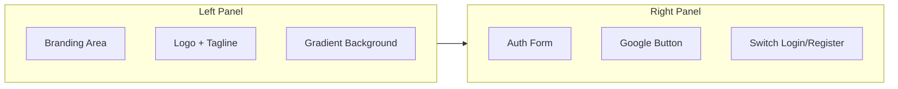
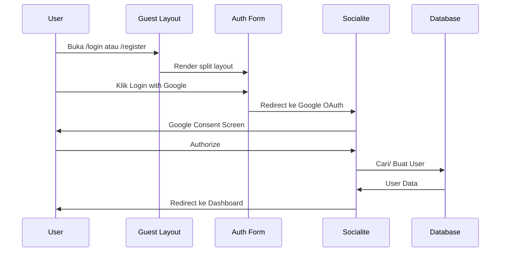

# Redesign Auth Views + Google OAuth Login

## Overview
Redesign tampilan auth (login & register) menjadi split layout, serta menambahkan fitur login/register dengan Google (Socialite).

## Arsitektur

## Todo List

### Phase 1: Install & Konfigurasi Laravel Socialite

1. **Install laravel/socialite**
   - Jalankan `composer require laravel/socialite --no-interaction`
   - Package ini menyediakan OAuth authentication dengan Google

2. **Tambahkan config Google di `config/services.php`**
   - Tambahkan array `google` dengan env keys:
     - `client_id` → `env('GOOGLE_CLIENT_ID')`
     - `client_secret` → `env('GOOGLE_CLIENT_SECRET')`
     - `redirect` → `env('GOOGLE_REDIRECT_URI')`

3. **Update `.env` dan `.env.example`**
   - Tambahkan variabel:
     - `GOOGLE_CLIENT_ID=`
     - `GOOGLE_CLIENT_SECRET=`
     - `GOOGLE_REDIRECT_URI="${APP_URL}/auth/google/callback"`

### Phase 2: Buat Socialite Controller & Routes

4. **Buat `SocialiteController`**
   - File: `app/Http/Controllers/Auth/SocialiteController.php`
   - Method `redirect()`: Redirect ke Google OAuth
   - Method `callback()`: Handle callback, buat/cari user, login
   - Logic:
     - Cari user by `google_id` atau `email`
     - Jika user baru: buat dengan `role='user'`, `email_verified_at=now()`
     - Jika user existing tanpa `google_id`: update `google_id`
     - Login user dan redirect ke dashboard

5. **Tambahkan migration untuk kolom `google_id`**
   - Buat migration: `add_google_id_to_users_table`
   - Kolom `google_id` nullable string, unique

6. **Update `User` model**
   - Tambahkan `google_id` kefillable
   - (password harus nullable untuk Google-only users)

7. **Tambahkan routes Google OAuth di `routes/auth.php`**
   - `GET /auth/google` → redirect ke Google
   - `GET /auth/google/callback` → handle callback
   - Di dalam group `guest` middleware

### Phase 3: Redesign Auth Views

8. **Redesign `guest.blade.php` layout**
   - Ubah dari centered card menjadi **split layout** (2 kolom)
   - Kiri: Area branding dengan gradient background (match landing page colors), logo, tagline
   - Kanan: Form auth area (slot)
   - Responsive: mobile = full-width form only, desktop = split
   - Hapus card wrapper lama, ganti dengan flex layout

9. **Redesign `login.blade.php`**
   - Form fields: Email, Password, Remember Me
   - Tombol "Login with Google" di atas form (dengan SVG Google icon)
   - Divider "atau" antara Google button dan form
   - Link "Forgot password?" dan "Register"
   - Match branding colors

10. **Redesign `register.blade.php`**
    - Form fields: Name, Email, Password, Confirm Password
    - Tombol "Register with Google" di atas form
    - Divider "atau"
    - Link "Already have account? Login"
    - Match branding colors

### Phase 4: Update User Model & Verification

11. **Pastikan password nullable untuk Google users**
    - Update `User` model casts atau validation
    - Update `RegisteredUserController` jika diperlukan
    - Pastikan password bisa null untuk users yang daftar via Google

12. **Jalankan migration**
    - `php artisan migrate`

13. **Jalankan Pint**
    - `vendor/bin/pint --dirty --format agent`

## File yang Perlu Diubah

| File | Action |
|------|--------|
| `composer.json` | Tambah socialite dependency |
| `config/services.php` | Tambah google config |
| `.env` | Tambah GOOGLE_CLIENT_* vars |
| `.env.example` | Tambah GOOGLE_CLIENT_* vars |
| `app/Models/User.php` | Tambah google_id, update password nullable |
| `app/Http/Controllers/Auth/SocialiteController.php` | **BARU** |
| `routes/auth.php` | Tambah google routes |
| `resources/views/layouts/guest.blade.php` | Redesign split layout |
| `resources/views/auth/login.blade.php` | Redesign + Google button |
| `resources/views/auth/register.blade.php` | Redesign + Google button |
| Migration file | **BARU** - add google_id to users |
