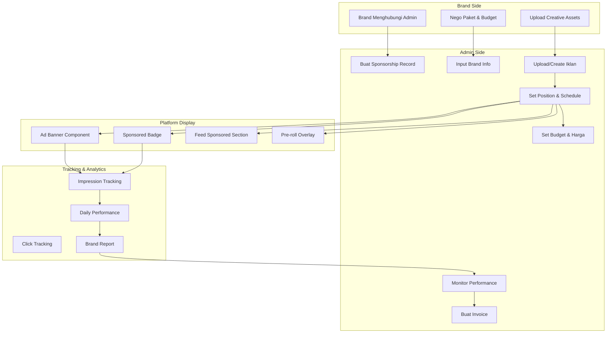
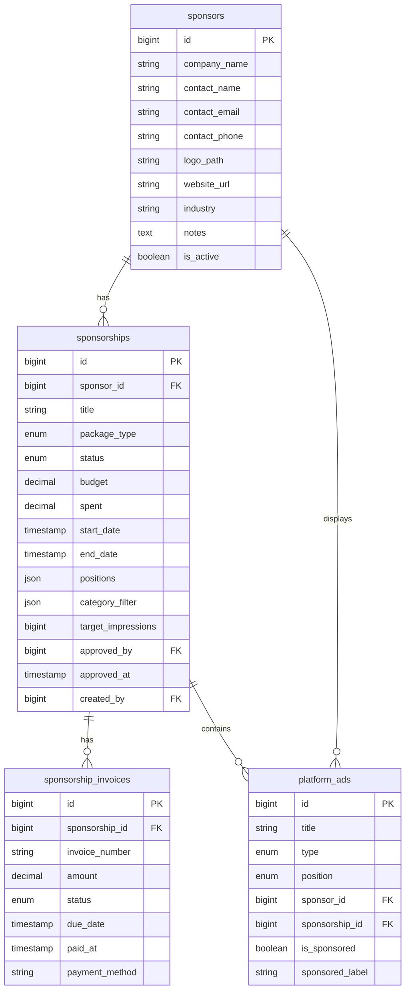

# Desain Sistem Sponsorship — NotEDS Simulation

## Ringkasan Eksekutif

Sistem sponsorship memungkinkan brand/perusahaan menghubungi platform langsung untuk menampilkan konten bersponsor (iklan direct) di berbagai posisi situs. Ini terpisah dari Google AdSense dan sistem iklan creator.

```
┌─────────────────────────────────────────────────────┐
│                  SPONSORSHIP FLOW                    │
│                                                      │
│  Brand ──> Hubungi Admin ──> Admin Buat Sponsorship  │
│                                      │               │
│                                      v               │
│                              Upload Creative         │
│                              Set Position & Schedule  │
│                              Set Budget               │
│                                      │               │
│                                      v               │
│                          Iklan Tayang di Platform     │
│                          + Badge "Sponsored"          │
│                                      │               │
│                                      v               │
│                          Tracking Impressions/Clicks  │
│                          + Laporan Per Brand          │
│                                      │               │
│                                      v               │
│                          Admin Buat Invoice           │
│                          + Export PDF                  │
└─────────────────────────────────────────────────────┘
```

---

## 1. Analisis Sistem Yang Sudah Ada

### Tabel `platform_ads` (Sudah Ada)
| Kolom | Status | Catatan |
|:---|:---|:---|
| `title` | ✅ Ada | Judul iklan |
| `type` | ✅ Ada | banner, interstitial, video, native, adsense |
| `position` | ✅ Ada | header, sidebar, pre_roll, dll |
| `content` | ✅ Ada | HTML konten |
| `image_path` | ✅ Ada | Gambar iklan |
| `video_path` | ✅ Ada | Video iklan |
| `target_url` | ✅ Ada | URL tujuan |
| `weight` | ✅ Ada | Bobot prioritas |
| `is_active` | ✅ Ada | Toggle aktif |
| `start_date` / `end_date` | ✅ Ada | Jadwal tayang |
| `impressions` / `clicks` | ✅ Ada | Tracking counters |
| `revenue` | ✅ Ada | Pendapatan estimasi |
| `created_by` | ✅ Ada | Admin pembuat |

### Yang Belum Ada (Gap)
| Fitur | Status | Prioritas |
|:---|:---|:---|
| Identitas Brand/Advertiser | ❌ Tidak ada | 🔴 Tinggi |
| Tipe Sponsorship | ❌ Tidak ada | 🔴 Tinggi |
| Budget & Billing | ❌ Tidak ada | 🔴 Tinggi |
| Badge "Sponsored" | ❌ Tidak ada | 🔴 Tinggi |
| Laporan Per Brand | ❌ Tidak ada | 🟡 Sedang |
| Invoice System | ❌ Tidak ada | 🟡 Sedang |
| Kontrak Sponsorship | ❌ Tidak ada | 🔵 Rendah |

---

## 2. Arsitektur Sistem Sponsorship



---

## 3. Struktur Database Baru

### 3A. Tabel Baru: `sponsors`

Tabel untuk menyimpan data brand/advertiser yang menjadi sponsor.

```sql
CREATE TABLE sponsors (
    id              BIGINT UNSIGNED AUTO_INCREMENT PRIMARY KEY,
    company_name    VARCHAR(255) NOT NULL,
    contact_name    VARCHAR(255) NOT NULL,
    contact_email   VARCHAR(255) NOT NULL,
    contact_phone   VARCHAR(50) NULL,
    logo_path       VARCHAR(500) NULL,
    website_url     VARCHAR(500) NULL,
    industry        VARCHAR(100) NULL,
    notes           TEXT NULL,
    is_active       BOOLEAN DEFAULT TRUE,
    created_at      TIMESTAMP NULL,
    updated_at      TIMESTAMP NULL
);
```

**Kolom:**
| Kolom | Tipe | Keterangan |
|:---|:---|:---|
| `id` | `bigint` PK | Auto-increment |
| `company_name` | `string(255)` | Nama brand/perusahaan |
| `contact_name` | `string(255)` | Nama kontak person |
| `contact_email` | `string(255)` | Email kontak |
| `contact_phone` | `string(50)` | Telepon kontak |
| `logo_path` | `string(500)` | Logo brand |
| `website_url` | `string(500)` | Website brand |
| `industry` | `string(100)` | Industri (Pendidikan, Tech, dll) |
| `notes` | `text` | Catatan admin |
| `is_active` | `boolean` | Status aktif |

### 3B. Tabel Baru: `sponsorships`

Tabel utama untuk mengelola kesepakatan sponsorship.

```sql
CREATE TABLE sponsorships (
    id              BIGINT UNSIGNED AUTO_INCREMENT PRIMARY KEY,
    sponsor_id      BIGINT UNSIGNED NOT NULL,
    title           VARCHAR(255) NOT NULL,
    package_type    ENUM('basic','standard','premium','custom') DEFAULT 'basic',
    status          ENUM('draft','pending_review','active','paused','completed','cancelled') DEFAULT 'draft',
    budget          DECIMAL(12,2) NOT NULL DEFAULT 0,
    spent           DECIMAL(12,2) NOT NULL DEFAULT 0,
    start_date      TIMESTAMP NOT NULL,
    end_date        TIMESTAMP NOT NULL,
    positions       JSON NOT NULL,
    category_filter JSON NULL,
    target_impressions BIGINT UNSIGNED NULL,
    notes           TEXT NULL,
    approved_by     BIGINT UNSIGNED NULL,
    approved_at     TIMESTAMP NULL,
    created_by      BIGINT UNSIGNED NOT NULL,
    created_at      TIMESTAMP NULL,
    updated_at      TIMESTAMP NULL,
    
    FOREIGN KEY (sponsor_id) REFERENCES sponsors(id) ON DELETE CASCADE,
    FOREIGN KEY (approved_by) REFERENCES users(id) ON DELETE SET NULL,
    FOREIGN KEY (created_by) REFERENCES users(id) ON DELETE CASCADE
);
```

**Kolom:**
| Kolom | Tipe | Keterangan |
|:---|:---|:---|
| `id` | `bigint` PK | Auto-increment |
| `sponsor_id` | `bigint` FK | Brand/sponsor terkait |
| `title` | `string(255)` | Judul kesepakatan (misal: "Promo Q3 2026") |
| `package_type` | `enum` | basic/standard/premium/custom |
| `status` | `enum` | draft/pending_review/active/paused/completed/cancelled |
| `budget` | `decimal(12,2)` | Total budget kesepakatan |
| `spent` | `decimal(12,2)` | Sudah terpakai |
| `start_date` | `timestamp` | Mulai berlaku |
| `end_date` | `timestamp` | Berakhir |
| `positions` | `json` | Array posisi: ["header","sidebar","feed_sponsored"] |
| `category_filter` | `json` | Filter kategori target |
| `target_impressions` | `bigint` | Target tayangan (opsional) |
| `notes` | `text` | Catatan |
| `approved_by` | `bigint` FK | Admin yang approve |
| `approved_at` | `timestamp` | Waktu approve |
| `created_by` | `bigint` FK | Admin pembuat |

### 3C. Tabel Baru: `sponsorship_invoices`

Tabel untuk pelacakan invoice.

```sql
CREATE TABLE sponsorship_invoices (
    id              BIGINT UNSIGNED AUTO_INCREMENT PRIMARY KEY,
    sponsorship_id  BIGINT UNSIGNED NOT NULL,
    invoice_number  VARCHAR(50) NOT NULL UNIQUE,
    amount          DECIMAL(12,2) NOT NULL,
    status          ENUM('draft','sent','paid','overdue','cancelled') DEFAULT 'draft',
    due_date        TIMESTAMP NOT NULL,
    paid_at         TIMESTAMP NULL,
    payment_method  VARCHAR(100) NULL,
    notes           TEXT NULL,
    created_at      TIMESTAMP NULL,
    updated_at      TIMESTAMP NULL,
    
    FOREIGN KEY (sponsorship_id) REFERENCES sponsorships(id) ON DELETE CASCADE
);
```

**Kolom:**
| Kolom | Tipe | Keterangan |
|:---|:---|:---|
| `id` | `bigint` PK | Auto-increment |
| `sponsorship_id` | `bigint` FK | Sponsorship terkait |
| `invoice_number` | `string(50)` | Nomor invoice unik |
| `amount` | `decimal(12,2)` | Jumlah tagihan |
| `status` | `enum` | draft/sent/paid/overdue/cancelled |
| `due_date` | `timestamp` | Jatuh tempo |
| `paid_at` | `timestamp` | Waktu bayar |
| `payment_method` | `string(100)` | Metode pembayaran |
| `notes` | `text` | Catatan |

### 3D. Modifikasi Tabel `platform_ads`

Tambah kolom untuk menghubungkan iklan dengan sponsorship:

```sql
ALTER TABLE platform_ads
    ADD COLUMN sponsor_id     BIGINT UNSIGNED NULL AFTER created_by,
    ADD COLUMN sponsorship_id BIGINT UNSIGNED NULL AFTER sponsor_id,
    ADD COLUMN is_sponsored    BOOLEAN DEFAULT FALSE AFTER sponsorship_id,
    ADD COLUMN sponsored_label VARCHAR(100) NULL AFTER is_sponsored,
    
    ADD FOREIGN KEY (sponsor_id) REFERENCES sponsors(id) ON DELETE SET NULL,
    ADD FOREIGN KEY (sponsorship_id) REFERENCES sponsorships(id) ON DELETE SET NULL;
```

**Kolom Baru:**
| Kolom | Tipe | Keterangan |
|:---|:---|:---|
| `sponsor_id` | `bigint` FK | Brand sponsor |
| `sponsorship_id` | `bigint` FK | Kesepakatan sponsorship |
| `is_sponsored` | `boolean` | Tampilkan badge "Sponsored" |
| `sponsored_label` | `string(100)` | Label custom (misal: "Dipersembahkan oleh", "Sponsored") |

---

## 4. Package Types

### Paket Standar

| Package | Posisi | Durasi | Estimasi Budget |
|:---|:---|:---|:---|
| **Basic** | 1 posisi (header/sidebar) | 1 bulan | Rp 500.000 - 2.000.000 |
| **Standard** | 2-3 posisi | 1 bulan | Rp 2.000.000 - 5.000.000 |
| **Premium** | Semua posisi + pre-roll | 1 bulan | Rp 5.000.000 - 15.000.000 |
| **Custom** | Sesuai kesepakatan | Flexible | Sesuai nego |

### Posisi yang Tersedia

| Posisi | Lokasi | Spesifikasi |
|:---|:---|:---|
| `header` | Di bawah navigasi utama | Banner 728x90 atau 1200x200 |
| `sidebar` | Samping player simulasi | Banner 300x250 |
| `pre_roll` | Sebelum simulasi dimuat | Video/Image 5-15 detik |
| `mid_roll` | Di tengah simulasi | Banner interstitial |
| `post_simulation` | Setelah simulasi selesai | Banner rekomendasi |
| `feed_sponsored` | Di antara simulasi di beranda | Card "Sponsored" |
| `search_sponsored` | Di atas hasil pencarian | Banner kecil |

---

## 5. Model & Service Layer

### 5A. Model Baru

```
app/Models/
├── Sponsor.php           # Brand/advertiser entity
├── Sponsorship.php       # Sponsorship agreement
├── SponsorshipInvoice.php # Invoice tracking
```

### 5B. Service Baru

```
app/Services/
├── SponsorshipService.php    # Core sponsorship logic
├── InvoiceService.php        # Invoice generation & management
└── SponsorReportService.php  # Per-brand analytics
```

### 5C. SponsorshipService Methods

```php
class SponsorshipService
{
    // Sponsorship CRUD
    public function create(Sponsor $sponsor, array $data): Sponsorship
    public function update(Sponsorship $sponsorship, array $data): Sponsorship
    public function approve(Sponsorship $sponsorship, User $admin): Sponsorship
    public function pause(Sponsorship $sponsorship): Sponsorship
    public function resume(Sponsorship $sponsorship): Sponsorship
    public function complete(Sponsorship $sponsorship): Sponsorship
    public function cancel(Sponsorship $sponsorship): Sponsorship
    
    // Ad management within sponsorship
    public function createAd(Sponsorship $sponsorship, array $data): PlatformAd
    public function linkAdToSponsorship(PlatformAd $ad, Sponsorship $sponsorship): PlatformAd
    
    // Performance tracking
    public function getSponsorshipStats(Sponsorship $sponsorship): array
    public function getBrandStats(Sponsor $sponsor): array
    public function getDailyPerformance(Sponsorship $sponsorship, int $days = 30): Collection
    
    // Budget management
    public function deductBudget(Sponsorship $sponsorship, float $amount): void
    public function checkBudgetRemaining(Sponsorship $sponsorship): float
    public function isBudgetExceeded(Sponsorship $sponsorship): bool
    
    // Auto-management
    public function pauseExpiredSponsorships(): int
    public function getActiveSponsorshipsForPosition(string $position): Collection
}
```

### 5D. InvoiceService Methods

```php
class InvoiceService
{
    public function create(Sponsorship $sponsorship, float $amount, Carbon $dueDate): SponsorshipInvoice
    public function markSent(SponsorshipInvoice $invoice): SponsorshipInvoice
    public function markPaid(SponsorshipInvoice $invoice, string $paymentMethod): SponsorshipInvoice
    public function markOverdue(SponsorshipInvoice $invoice): SponsorshipInvoice
    public function generateInvoiceNumber(): string
    public function exportPdf(SponsorshipInvoice $invoice): string  // Returns file path
    public function getOverdueInvoices(): Collection
}
```

---

## 6. Controller & Route

### 6A. Admin Sponsor Routes

```php
// routes/web.php - Admin Sponsorship Management
Route::middleware(['auth', CheckRole::class.':superadmin,admin'])->prefix('admin')->name('admin.')->group(function () {
    // Sponsor Management
    Route::get('/sponsors', [AdminSponsorController::class, 'index'])->name('sponsors.index');
    Route::get('/sponsors/create', [AdminSponsorController::class, 'create'])->name('sponsors.create');
    Route::post('/sponsors', [AdminSponsorController::class, 'store'])->name('sponsors.store');
    Route::get('/sponsors/{sponsor}', [AdminSponsorController::class, 'show'])->name('sponsors.show');
    Route::get('/sponsors/{sponsor}/edit', [AdminSponsorController::class, 'edit'])->name('sponsors.edit');
    Route::put('/sponsors/{sponsor}', [AdminSponsorController::class, 'update'])->name('sponsors.update');
    
    // Sponsorship Management
    Route::get('/sponsorships', [AdminSponsorshipController::class, 'index'])->name('sponsorships.index');
    Route::get('/sponsorships/create', [AdminSponsorshipController::class, 'create'])->name('sponsorships.create');
    Route::post('/sponsorships', [AdminSponsorshipController::class, 'store'])->name('sponsorships.store');
    Route::get('/sponsorships/{sponsorship}', [AdminSponsorshipController::class, 'show'])->name('sponsorships.show');
    Route::get('/sponsorships/{sponsorship}/edit', [AdminSponsorshipController::class, 'edit'])->name('sponsorships.edit');
    Route::put('/sponsorships/{sponsorship}', [AdminSponsorshipController::class, 'update'])->name('sponsorships.update');
    Route::post('/sponsorships/{sponsorship}/approve', [AdminSponsorshipController::class, 'approve'])->name('sponsorships.approve');
    Route::post('/sponsorships/{sponsorship}/pause', [AdminSponsorshipController::class, 'pause'])->name('sponsorships.pause');
    Route::post('/sponsorships/{sponsorship}/resume', [AdminSponsorshipController::class, 'resume'])->name('sponsorships.resume');
    Route::post('/sponsorships/{sponsorship}/complete', [AdminSponsorshipController::class, 'complete'])->name('sponsorships.complete');
    
    // Invoice Management
    Route::get('/sponsorships/{sponsorship}/invoices', [AdminSponsorshipController::class, 'invoices'])->name('sponsorships.invoices');
    Route::post('/sponsorships/{sponsorship}/invoices', [AdminSponsorshipController::class, 'createInvoice'])->name('sponsorships.invoices.create');
    Route::patch('/invoices/{invoice}/send', [AdminSponsorshipController::class, 'sendInvoice'])->name('invoices.send');
    Route::patch('/invoices/{invoice}/mark-paid', [AdminSponsorshipController::class, 'markInvoicePaid'])->name('invoices.mark-paid');
    Route::get('/invoices/{invoice}/export', [AdminSponsorshipController::class, 'exportInvoice'])->name('invoices.export');
    
    // Sponsor Reports
    Route::get('/sponsors/{sponsor}/report', [AdminSponsorController::class, 'report'])->name('sponsors.report');
});
```

### 6B. Controller Structure

```
app/Http/Controllers/Admin/
├── SponsorController.php       # CRUD sponsor + reports
└── SponsorshipController.php   # CRUD sponsorship + invoices
```

---

## 7. View / UI Design

### 7A. Admin Pages Baru

| Halaman | Route | Deskripsi |
|:---|:---|:---|
| Sponsor Index | `/admin/sponsors` | Daftar semua brand sponsor |
| Sponsor Create | `/admin/sponsors/create` | Form tambah sponsor baru |
| Sponsor Show | `/admin/sponsors/{id}` | Detail sponsor + daftar sponsorship |
| Sponsor Edit | `/admin/sponsors/{id}/edit` | Edit data sponsor |
| Sponsor Report | `/admin/sponsors/{id}/report` | Laporan performa per brand |
| Sponsorship Index | `/admin/sponsorships` | Daftar semua kesepakatan |
| Sponsorship Create | `/admin/sponsorships/create` | Form buat kesepakatan baru |
| Sponsorship Show | `/admin/sponsorships/{id}` | Detail kesepakatan + analytics |
| Invoice List | `/admin/sponsorships/{id}/invoices` | Daftar invoice |
| Invoice Export | `/admin/invoices/{id}/export` | Export PDF invoice |

### 7B. UI Components Baru

| Component | Lokasi | Deskripsi |
|:---|:---|:---|
| `<x-sponsored-badge>` | Feed, Sidebar | Badge "Sponsored" / "Dipersembahkan oleh" |
| `<x-sponsor-logo>` | Near ad creative | Logo brand di samping iklan |
| `<x-ad-banner-sponsor>` | Header, Sidebar | Banner dengan label sponsor |

### 7C. Sponsored Badge Design

```
┌──────────────────────────────────────────┐
│  📢 Sponsored                            │
│  ┌────────────────────────────────────┐  │
│  │                                    │  │
│  │         AD CREATIVE                │  │
│  │         (Image/HTML/Video)         │  │
│  │                                    │  │
│  └────────────────────────────────────┘  │
│  Dipersembahkan oleh: Brand Name         │
│  ─────────────────────────────────────   │
└──────────────────────────────────────────┘
```

---

## 8. Dashboard Admin: Sponsorship Overview

### 8A. Sponsor Dashboard Widget

```
┌─────────────────────────────────────────────────┐
│  📊 Sponsorship Overview                        │
│                                                  │
│  Total Sponsors: 12    Active Sponsorships: 8    │
│  Monthly Revenue: Rp 45.000.000                 │
│  Pending Invoices: 3                             │
│                                                  │
│  ┌──────────────────────────────────────────┐   │
│  │ Top Sponsors This Month                   │   │
│  │ 1. PT EduTech   - Rp 15.000.000 (3 ads) │   │
│  │ 2. Bank ABC     - Rp 12.000.000 (2 ads) │   │
│  │ 3. Startup XYZ  - Rp 8.000.000  (4 ads) │   │
│  └──────────────────────────────────────────┘   │
└─────────────────────────────────────────────────┘
```

### 8B. Sponsorship Report (Per Brand)

```
┌─────────────────────────────────────────────────┐
│  📈 Laporan: PT EduTech                         │
│                                                  │
│  Periode: 1 Jul - 31 Jul 2026                   │
│  Budget: Rp 15.000.000 | Terpakai: Rp 8.500.000 │
│                                                  │
│  Impressions: 125.000    Clicks: 3.750           │
│  CTR: 3.00%             RPM: Rp 68.00           │
│                                                  │
│  Performance by Position:                        │
│  ├─ Header Banner:    50.000 imp / 1.500 clicks │
│  ├─ Sidebar:          45.000 imp / 1.200 clicks │
│  └─ Feed Sponsored:   30.000 imp / 1.050 clicks │
│                                                  │
│  [Export PDF] [View Details]                     │
└─────────────────────────────────────────────────┘
```

---

## 9. Invoice Export (PDF)

### Template Invoice

```
┌─────────────────────────────────────────────────┐
│  NOTEDS SIMULATION                               │
│  ═══════════════════════════════════════════     │
│                                                  │
│  INVOICED TO:                  INVOICE DETAILS:  │
│  PT EduTech Indonesia          No: INV-2026-001 │
│  Jl. Sudirman No. 123          Date: 1 Aug 2026  │
│  Jakarta Selatan               Due: 15 Aug 2026  │
│  📧 info@edutech.co.id                           │
│  📞 +62 21 1234 5678                             │
│                                                  │
│  ─────────────────────────────────────────────   │
│  Description              | Amount              │
│  ─────────────────────────────────────────────   │
│  Header Banner (1 Jul-31 Jul) | Rp 5.000.000   │
│  Sidebar Ad (1 Jul-31 Jul)    | Rp 3.500.000   │
│  ─────────────────────────────────────────────   │
│  SUBTOTAL                       Rp 8.500.000    │
│  ─────────────────────────────────────────────   │
│  TOTAL                          Rp 8.500.000    │
│  ═══════════════════════════════════════════     │
│                                                  │
│  Payment: Bank Transfer                          │
│  Bank: Bank Mandiri                              │
│  No. Rek: 1234 5678 9012                        │
│  Atas Nama: PT NotEDS Indonesia                  │
└─────────────────────────────────────────────────┘
```

---

## 10. Implementation Plan

### Phase 1: Database & Models
1. Buat migration `sponsors` table
2. Buat migration `sponsorships` table
3. Buat migration `sponsorship_invoices` table
4. Buat migration alter `platform_ads` (add sponsor_id, sponsorship_id, is_sponsored, sponsored_label)
5. Buat model `Sponsor`, `Sponsorship`, `SponsorshipInvoice`
6. Update model `PlatformAd` (tambah relationships)

### Phase 2: Service Layer
1. Buat `SponsorshipService`
2. Buat `InvoiceService`
3. Buat `SponsorReportService`

### Phase 3: Admin CRUD
1. Buat `AdminSponsorController` (index, create, store, show, edit, update)
2. Buat `AdminSponsorshipController` (index, create, store, show, approve, pause, resume, complete)
3. Buat view index, create, show untuk sponsors
4. Buat view index, create, show untuk sponsorships
5. Update admin navigation menu

### Phase 4: Invoice System
1. Implement `InvoiceService::create()`
2. Implement `InvoiceService::exportPdf()` (pakai DOMPDF atau similar)
3. Buat invoice view/template
4. Integrasikan ke sponsorship show page

### Phase 5: UI Components
1. Buat `<x-sponsored-badge>` component
2. Buat `<x-sponsor-logo>` component
3. Update `<x-ad-banner>` untuk mendukung sponsor label
4. Update feed section untuk menampilkan "Sponsored" badge

### Phase 6: Reports & Analytics
1. Implement `SponsorReportService`
2. Buat sponsor report page
3. Buat sponsorship analytics page
4. Export report ke PDF

### Phase 7: Auto-Management
1. Auto-pause sponsorship yang sudah expired
2. Auto-check budget exceeded
3. Notification untuk admin (invoice overdue, sponsorship expiring)

---

## 11. Dependencies

| Package | Versi | Kegunaan |
|:---|:---|:---|
| `barryvdh/laravel-dompdf` | ^3.0 | Export invoice PDF |
| `spatie/laravel-medialibrary` | (opsional) | Upload creative assets |

---

## 12. Diagram Relasi ER



---

## 13. Estimasi File yang Perlu Dibuat/Diupdate

### File Baru (17 file)
```
database/migrations/xxxx_create_sponsors_table.php
database/migrations/xxxx_create_sponsorships_table.php
database/migrations/xxxx_create_sponsorship_invoices_table.php
database/migrations/xxxx_add_sponsor_columns_to_platform_ads_table.php
app/Models/Sponsor.php
app/Models/Sponsorship.php
app/Models/SponsorshipInvoice.php
app/Services/SponsorshipService.php
app/Services/InvoiceService.php
app/Services/SponsorReportService.php
app/Http/Controllers/Admin/SponsorController.php
app/Http/Controllers/Admin/SponsorshipController.php
resources/views/admin/sponsors/index.blade.php
resources/views/admin/sponsors/create.blade.php
resources/views/admin/sponsors/show.blade.php
resources/views/admin/sponsors/edit.blade.php
resources/views/admin/sponsorships/index.blade.php
resources/views/admin/sponsorships/create.blade.php
resources/views/admin/sponsorships/show.blade.php
resources/views/components/sponsored-badge.blade.php
resources/views/invoices/show.blade.php
```

### File yang Perlu Diupdate (8 file)
```
app/Models/PlatformAd.php         - tambah relationships
app/Services/AdService.php        - tambah sponsor-aware logic
routes/web.php                    - tambah routes
resources/views/layouts/navigation.blade.php - tambah menu sponsor
resources/views/components/ad-banner.blade.php - tambah sponsor label
resources/views/simulations/explore.blade.php - sponsored badge di feed
resources/views/admin/ads/create.blade.php - tambah dropdown sponsor
resources/views/admin/ads/edit.blade.php - tambah dropdown sponsor
```
