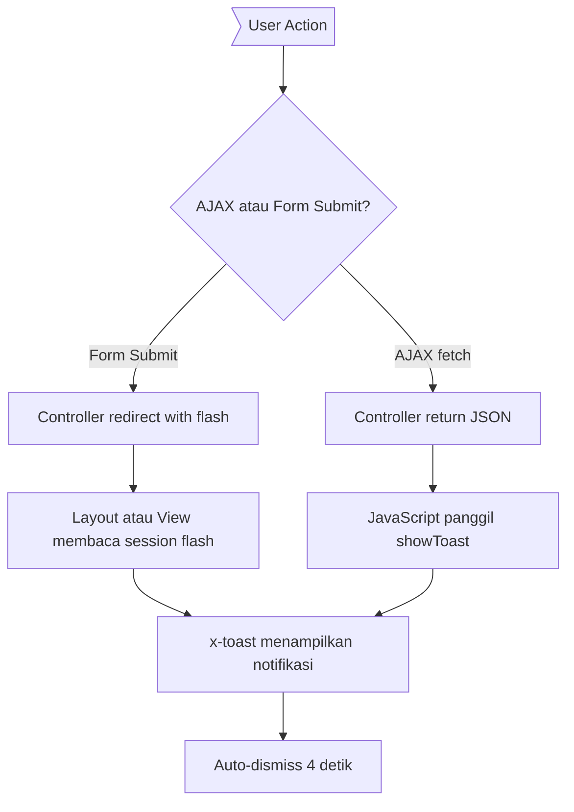

# Rencana: Toast Notification Global untuk Semua Action

## Ringkasan Masalah

Saat ini feedback kepada user tidak konsisten di seluruh aplikasi Noteds:

| Masalah | Lokasi | Contoh |
|---------|--------|--------|
| Menggunakan `alert()` | `collections/edit.blade.php` | Gagal tambah/hapus simulasi dari collection |
| Inline banner hijau | `admin/simulations/index.blade.php`, `admin/simulations/show.blade.php`, `studio/layouts/app.blade.php` | Pesan sukses setelah CRUD |
| Inline text "Saved." | Profile forms | Update profil, update password |
| `showToast()` lokal/duplikat | `simulations/show.blade.php`, `collections/show.blade.php`, `creators/show.blade.php` | Bookmark, follow, dll |
| Tidak ada feedback sama sekali | Reactions toggle, notification mark-read | AJAX actions tanpa pesan |

## Arsitektur Solusi

### Komponen Inti

```
resources/js/app.js                    → fungsi showToast() global + ajaxPost() global
resources/css/app.css                  → animasi & styling toast
resources/views/components/toast.blade.php → komponen Blade untuk flash messages server-side
```

### Diagram Alur



### Tipe Toast

| Tipe | Warna | Penggunaan |
|------|-------|------------|
| `success` | Hijau | CRUD berhasil, toggle on |
| `error` | Merah | Gagal, validasi error |
| `warning` | Kuning | Peringatan |
| `info` | Biru | Informasi umum |

## Daftar File yang Perlu Diubah

### Fase 1: Core Infrastructure (3 file baru/diubah)

1. **`resources/views/components/toast.blade.php`** — BUAT BARU
   - Membaca session flash: `success`, `error`, `warning`, `info`
   - Render div toast dengan Alpine.js untuk animasi show/hide
   - Auto-dismiss setelah 4 detik

2. **`resources/js/app.js`** — TAMBAHKAN
   - `window.showToast(message, type)` — buat elemen toast, animate in, auto-dismiss
   - `window.ajaxPost(url, options)` — fetch wrapper yang otomatis panggil `showToast()` dari response JSON

3. **`resources/css/app.css`** — TAMBAHKAN
   - Toast animation keyframes (slide in from bottom, fade out)
   - Toast color variants (success, error, warning, info)

### Fase 2: Layout Integration (2 file)

4. **`resources/views/layouts/app.blade.php`** — TAMBAH `<x-toast />`
   - Sertakan komponen toast di dalam `<body>` sebelum `</div>` penutup

5. **`resources/views/studio/layouts/app.blade.php`** — GANTI
   - Hapus inline flash message banner (baris 112-133)
   - Tambahkan `<x-toast />` di posisi yang sama

### Fase 3: Hapus Inline Banners (2 file)

6. **`resources/views/admin/simulations/index.blade.php`** — HAPUS banner `session('success')`
   - Sudah menggunakan `<x-app-layout>`, otomatis dapat toast

7. **`resources/views/admin/simulations/show.blade.php`** — HAPUS banner `session('success')` (baris 18-20)
   - Sudah menggunakan `<x-app-layout>`, otomatis dapat toast

### Fase 4: Standalone Views — Tambah `<x-toast />` (7 file)

8. **`resources/views/collections/index.blade.php`** — HAPUS inline status banner + TAMBAH `<x-toast />`
9. **`resources/views/collections/create.blade.php`** — TAMBAH `<x-toast />`
10. **`resources/views/collections/edit.blade.php`** — TAMBAH `<x-toast />` + GANTI `alert()` → `showToast()`
11. **`resources/views/collections/show.blade.php`** — TAMBAH `<x-toast />` + HAPUS local `showToast()` dan `ajaxPost()`
12. **`resources/views/notifications/index.blade.php`** — TAMBAH `<x-toast />` + TAMBAH toast feedback AJAX
13. **`resources/views/simulations/show.blade.php`** — TAMBAH `<x-toast />` + HAPUS local `showToast()` dan `ajaxPost()`
14. **`resources/views/creators/show.blade.php`** — TAMBAH `<x-toast />` + HAPUS local `showToast()`

### Fase 5: View Updates (3 file)

15. **`resources/views/studio/simulations.blade.php`** — Sudah menggunakan `<x-studio-layout>`, otomatis dapat toast. PERIKSA apakah ada action yang butuh feedback tambahan.

16. **`resources/views/studio/comments.blade.php`** — KONVERSI form-based actions ke AJAX + toast
    - Reply comment → AJAX POST + toast
    - Pin/unpin comment → AJAX POST + toast
    - Delete comment → AJAX DELETE + toast

17. **`resources/views/studio/settings.blade.php`** — TAMBAH toast feedback setelah form submit berhasil

### Fase 6: Controller Updates (2 file)

18. **`app/Http/Controllers/CommentController.php`** — TAMBAH flash message di `destroy()` untuk non-AJAX redirect path

19. **`app/Http/Controllers/ReactionController.php`** — TAMBAH `message` field di JSON response `toggle()`

### Fase 7: Cleanup & Verification

20. Verifikasi semua alur: form submit → redirect → toast tampil
21. Jalankan `vendor/bin/pint --dirty --format agent` untuk formatting PHP

## Views yang SUDAH mendapat toast dari layout (tidak perlu perubahan tambahan)

- Semua views yang menggunakan `<x-app-layout>` → dapat toast dari `layouts/app.blade.php`
- Semua views yang menggunakan `<x-studio-layout>` → dapat toast dari `studio/layouts/app.blade.php`
- `admin/scans/index.blade.php` → `<x-app-layout>` ✓
- `admin/reports/index.blade.php` → `<x-app-layout>` ✓
- `admin/scans/show.blade.php` → `<x-app-layout>` ✓
- `admin/reports/show.blade.php` → `<x-app-layout>` ✓

## Views yang TIDAK membutuhkan toast (read-only pages)

- `simulations/category.blade.php`
- `simulations/explore.blade.php`
- `simulations/embed.blade.php`
- `simulations/embed-code.blade.php`
- `leaderboard/index.blade.php`
- `user-profile/index.blade.php`
- `studio/analytics.blade.php`
- `studio/dashboard.blade.php`
- `studio/followers.blade.php`
- `studio/versions.blade.php`
- `collections/saved-index.blade.php`
- `collections/show.blade.php` (read-only page, tapi punya AJAX actions → butuh toast)

## Controllers yang sudah memiliki flash messages (tidak perlu diubah)

- `CollectionController` — store/update/destroy → `->with('status', ...)`
- `StudioController` — store/update/destroy/replyComment/togglePinComment/destroyComment/updateSettings → `->with('success', ...)`
- `ProfileController` — update → `->with('status', 'profile-updated')`
- `Admin\SimulationController` — store/update/destroy/togglePublish → `->with('success', ...)`
- `Admin\ReportController` — review/bulkAction → `->with('success', ...)`
- `Admin\ScanController` — autoScan/manualReview → `->with('success', ...)`
- `UserReportController` — store → JSON + flash message
- `SavedCollectionController` — toggle → JSON response

## Rincian Implementasi `showToast()` Global

```javascript
// resources/js/app.js — ditambahkan SETELAH Alpine.start()
window.showToast = function(message, type = 'success') {
    const container = document.getElementById('toast-container');
    if (!container) return;

    const toast = document.createElement('div');
    toast.className = `toast toast-${type}`;
    toast.innerHTML = `
        <div class="flex items-center gap-3">
            <span>${message}</span>
            <button onclick="this.parentElement.parentElement.remove()" class="ml-auto opacity-70 hover:opacity-100">&times;</button>
        </div>
    `;
    container.appendChild(toast);

    // Trigger animation
    requestAnimationFrame(() => toast.classList.add('toast-show'));

    // Auto-dismiss
    setTimeout(() => {
        toast.classList.remove('toast-show');
        setTimeout(() => toast.remove(), 300);
    }, 4000);
};

// Global ajaxPost helper
window.ajaxPost = async function(url, options = {}) {
    const defaults = {
        method: 'POST',
        headers: {
            'Content-Type': 'application/json',
            'X-CSRF-TOKEN': document.querySelector('meta[name="csrf-token"]')?.content,
            'X-Requested-With': 'XMLHttpRequest',
        },
    };
    const response = await fetch(url, { ...defaults, ...options });
    const data = await response.json();
    if (data.message) {
        showToast(data.message, data.success ? 'success' : 'error');
    }
    return data;
};
```

## Rincian Komponen `<x-toast>`

```blade
{{-- resources/views/components/toast.blade.php --}}
<div id="toast-container" class="fixed bottom-4 right-4 z-[9999] flex flex-col gap-2"></div>

@foreach(['success', 'error', 'warning', 'info'] as $type)
    @if(session($type))
        <script>
            document.addEventListener('DOMContentLoaded', function() {
                showToast('{{ session($type) }}', '{{ $type }}');
            });
        </script>
    @endif
@endforeach

@if(session('status'))
    <script>
        document.addEventListener('DOMContentLoaded', function() {
            showToast('{{ session('status') }}', 'success');
        });
    </script>
@endif
